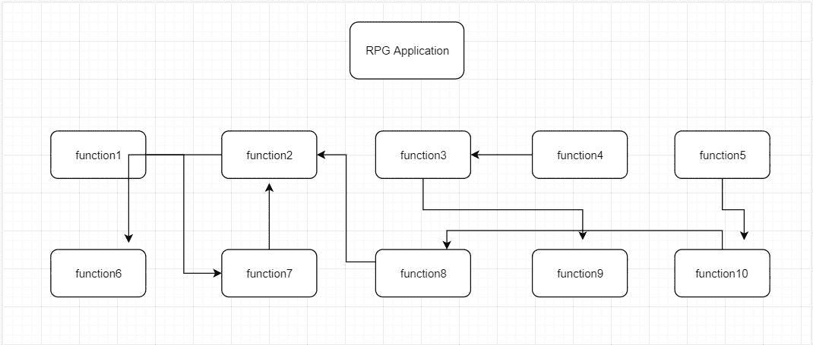
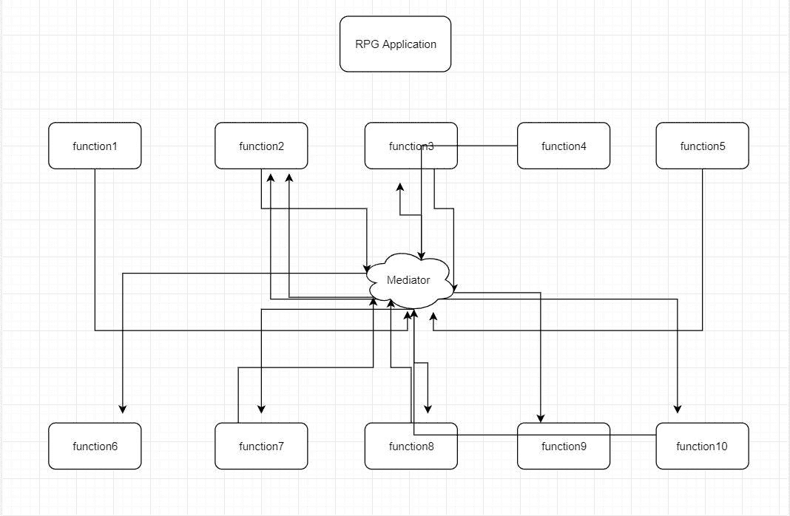

# JavaScript 中的中介模式

> 原文：<https://betterprogramming.pub/the-mediator-pattern-in-javascript-2bd2ff244447>

## 用中介模式解耦耦合的模块

*Florian Olivo 在 Unsplash 上拍摄的照片*

在本文中，我们将讨论*中介模式*并使用 JavaScript 实现它。JavaScript 中的中介允许我们公开一个中央接口，该接口封装了一组对象之间的所有交互。

因为这种模式改变了程序的运行行为，并负责协调交互，所以它被认为是一种行为模式。随着应用程序规模的增长，如果有多个对象直接相互交互，引入中介的需求会越来越大。

假设你正在开发一款 RPG 游戏，并且设计了一堆*没有*利用中介模式的类或函数。让我们来看看会是什么样子:

现在试着想象你自己试图阅读和维护隐藏在下面的代码。

你必须自己追踪一切，并且知道`function1`与什么通信，`function3`与`function9`通信，`function5`与`function10`通信，`function8`从`function10`接收数据并将其转发给`function2`，等等。

毫无疑问，这将很快成为开发人员最糟糕的噩梦！

当在代码中引入中介模式时，`mediator` 对象将被放置在两者之间，它的主要职责是封装它们之间的所有交互和行为，指定它自己负责处理所有这些。

这看起来会像这样:

正如你现在所看到的，`mediator` 对象位于两者之间，现在负责一组对象之间的交互。

现在，想象调试这个应用程序。如果这里的一个模块抛出错误，我们知道只有两个地方可以查看中介或模块本身。这使得维护更大的代码库变得更容易，因为我们能够更明显地分离逻辑。

此外，当我们需要更改代码中的某些内容时，我们可以确保它会变得比以前少得多，因为我们现在对对象之间的方向有了更清晰的了解。

# 如何知道何时引入中介模式

当代码中的某些部分与其他部分有太多的直接关系时，可能需要引入这一点。

此时，您的代码可能会不稳定。

它有助于促进它们之间的松散耦合，确保它们的所有交互都通过一个中心点(即中介)来协调，而不是显式地引用其他对象。这有助于我们提高组件的可用性。

# 现实世界的类比

这里有一个真实世界的类比，可能有助于您理解*调解人*如何帮助带来效率及其概念:

你和其他学生在一个教室里，老师拿着一叠试卷。他们想把这些分发出去，这样每个学生都能收到一份。

你的老师不是把一叠试卷发给一个学生，让他们拿一份，然后把这叠试卷传给后面的学生，直到最后一个学生拿到这叠试卷，而是决定把试卷传给每个学生。

由此，他们负责确保每个孩子都拿到一张纸，并从本质上承担起调解人的角色。最后，当叫到最后一个学生时，教室对面的另一个学生举手说:“我没有拿到一张纸”。

现在你试着“调试”一下这种情况。你可以立即得出结论，调解员应对丢失的纸负责，因为他们的角色是给每个学生提供一张纸。

此外，您还可以清楚地预测此时纸叠的位置。

现在，如果老师决定把这叠试卷传给学生，学生负责确保他们都拿到一张纸，如果一个学生举手说他们没有拿到纸，“调试”这种情况会相当困难。

第一，你不知道*此时*那堆纸在哪里。第二，你几乎不知道是谁搞砸了这个过程。你必须问每一个学生，问他们把他们的试卷交给了谁，才能弄清楚为什么有人没有拿到试卷。

如果您一直在用 JavaScript 为 web 开发，那么您已经在围绕中介进行开发了。

在 DOM 中，中介的一个例子是`document`对象本身，因为它可以协调 DOM 元素之间的逻辑和行为。带有`type="radio"`的`input`元素也可以作为中介，因为它可以决定检查哪个单选按钮，因为它可以保存当前值。

# 优势

当你有多个相互直接通信的对象时，你实际上是在围绕一个*多对多关系*工作，这在调试时会变成一场噩梦。

通过在对象之间引入一个*一对多*流，引入中介将有助于减少这个问题。

其他值得注意的好处包括减少对象之间的依赖性(松散耦合)，更少的错误，更易于代码维护和可读性。

# 不足之处

就像生活中所有美好的事物一样，并非一切都是完美的。中介模式也是如此。

例如，用一个单一的对象点来协调对象之间的所有交互本质上意味着，如果有任何错误，它将影响被它封装的所有东西。

其中一个例子是，因为中介是多个对象之间交互的中心点，所以当应用程序变大时，它可能会成为一个性能问题，因为它们总是间接通信。

然而，在让一个中介管理交互和让对象直接管理交互之间进行选择，几乎总是更好的选择。

如果我们改变了一个对象中的某个东西，而某个东西最终抛出了一个异常，这很容易在应用程序的其余部分产生多米诺骨牌效应，你甚至会很难知道从哪里开始。

就像我们在前面的例子中的真实世界类比一样，调试这种情况将成为一个真正的噩梦，因为您必须检查代码中的每个通信点。

# 代码示例

让我们假设我们正在创建一个 RPG 游戏，我们想要实现的第一个特性是一个`Novice`类，并实现一个 party API。

如果你从未听说过聚会这个概念，那就是当你将一组或多组用户联系在一起，创建一个联合团队，共同完成一个特定的目标。

我们将定义一个`Novice`构造函数，以及`Game`和`Party`。

`Novice`用于创建新玩家，`Party`为*方*功能提供 API，`Game`将成为使用`Party`创建`Novice`实例(用户)之间关联的中介。

下面是一个实际应用的代码示例:

正如我们从示例中看到的，指定`Game`实例来协调多个用户之间的当事人关联使得代码更容易阅读和维护，并且它解耦了`Party`和`Novice`实例之间的逻辑。

否则，我们将不得不直接将逻辑实现为`Novice`或`Party`接口的一部分，如果是这样的话，将它们合并是没有意义的。

而且，当事情没有意义时，如果出现问题，调试会变得更加困难！

# 结论

这一点到此为止！我希望你发现这是有价值的，并期待在未来更多。

想保持联系吗？订阅我的[简讯](https://app.getresponse.com/site2/javascript-newsletter?u=zpBtw&webforms_id=SM2hz)。