# 如何在 Flutter 应用中使用 Google Drive API

> 原文：<https://betterprogramming.pub/the-minimum-guide-for-using-google-drive-api-with-flutter-9207e4cb05ba>

## 挖掘 Google Drive 的强大功能


斯蒂芬·弗兰克在 [Unsplash](https://unsplash.com?utm_source=medium&utm_medium=referral) 上的照片

Google APIs 是一把巨大的保护伞。查看来自 [Google API explorer](https://developers.google.com/apis-explorer) 的近 200 个条目。在所有这些 API 中，一些流行的 API 包括:Google Drive、Gmail、Cloud Datastore、Google Cloud Storage 等。今天，让我们来看看如何将 Google Drive API 集成到一个 [Flutter](https://flutter.dev/) 应用中。

Google Drive API 有许多有趣的方面。但我发现的最有趣的一点是，它为您的用户数据提供云存储，而无需实际构建、维护和支付云存储。假设您要构建一个简单的待办事项应用程序，您可以使用 Google Drive 来备份和恢复用户的待办事项。

按照这篇文章，建议你有一些关于省道和扑动的基本知识。如果没有，请先浏览[这里](https://flutter.dev/docs/get-started/install)的入门文档。另外，这篇博文的编码部分相对来说比较简单，希望不会太难理解。

让我们开始吧。

# 属国

我们将依赖于两个包:

*   [**Google APIs**](https://pub.dev/packages/googleapis)**包含用于访问 Google Drive 的库。Google Drive 和 Google 的其他开放 API 一样，有 RESTful 端点。但是使用 SDK 稍微容易一些，也不容易出错。**
*   **[**google _ sign _ in**](https://pub.dev/packages/google_sign_in)**允许用户登录自己的 Google 账户。我们还将使用它来请求访问 Google Drive 的权限。****

# ****准备新的颤振应用****

****我们可以从 Android studio 创建一个 app:`File`>`New`>`New Flutter Project …`。我们称这个应用为`google_drive_demo_app`，并给它一个包名`com.demo.googledrivedemoapp`。****

****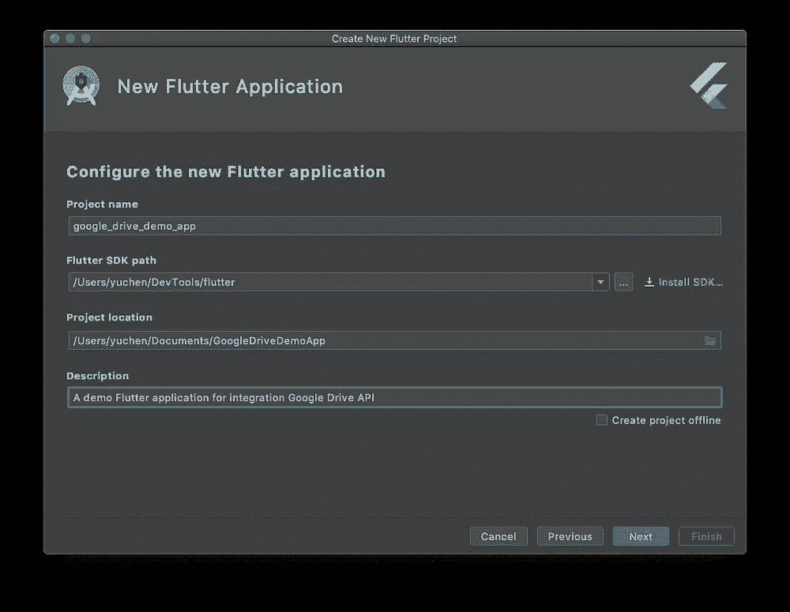********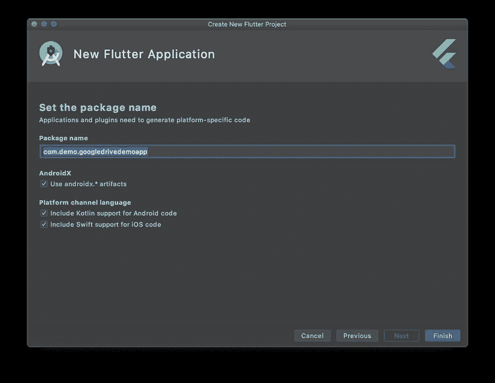****

****或者，您也可以使用以下命令来初始化新的应用程序:****

```
**flutter create google_drive_demo_app**
```

****默认的应用程序是这样的。它的右下角有一个浮动按钮，中间有一个标签。我们从现在开始将浮动按钮称为**加按钮**。用户每按一次加号按钮，中间的数字就加 1。****

****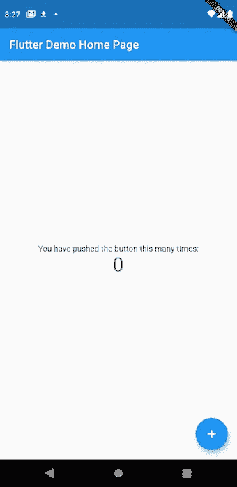****

****我们将对其进行更改，以便每次单击按钮时，它都会将 hello_world.txt 文件上传到 Google Drive **。******

# ****添加依赖关系****

****打开`pubspec.yaml`文件，添加以下依赖项:****

```
**dependencies:
  googleapis: any
  google_sign_in: any**
```

****我们在这里为演示应用程序放置了`any`,但是您应该为您的实际应用程序指定版本。****

# ****谷歌登录****

****打开`main.dart`，定位`_incrementCounter()`功能，当用户点击加号按钮时调用。这个函数看起来是这样的:****

```
**void _incrementCounter() {
  setState(() {
    _counter++;
  });
}**
```

****让我们把它改成也要求用户登录到他们的 google 帐户，并授予 Google Drive 权限(又名`scope`):****

```
**Future<void> _incrementCounter() async {
  setState(() {
    _counter++;
  });

  final googleSignIn = signIn.GoogleSignIn.standard(scopes: [drive.DriveApi.*DriveScope*]);
  final signIn.GoogleSignInAccount account = await googleSignIn.signIn();
  print("User account $account");
}**
```

****将这些导入添加到`main.dart`文件的顶部:****

```
**import 'package:googleapis/drive/v3.dart' as drive;
import 'package:google_sign_in/google_sign_in.dart' as signIn;**
```

****Google Drive API v3 是最近发布的，我们这里用的就是这个。****

# ****创建一个新的 Firebase 项目****

****打开 [Firebase 控制台](https://console.firebase.google.com/)，新建一个项目。我们将这个项目命名为 **Google Drive 演示应用。它还会问你是否想启用谷歌分析。这是一个有用的工具，但是我们的演示应用程序不需要它。******

****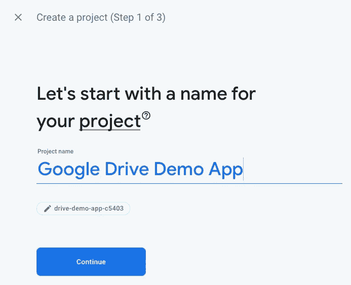************

****创建完成后，寻找“添加 firebase 到你的应用程序”按钮。我们从安卓开始。****

****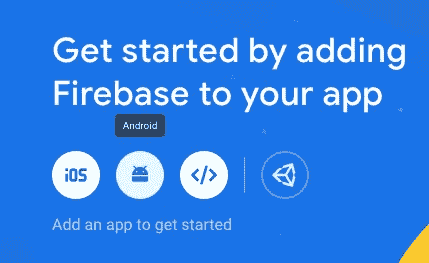****

****`package name`和`SHA-1`字段都很重要。****

****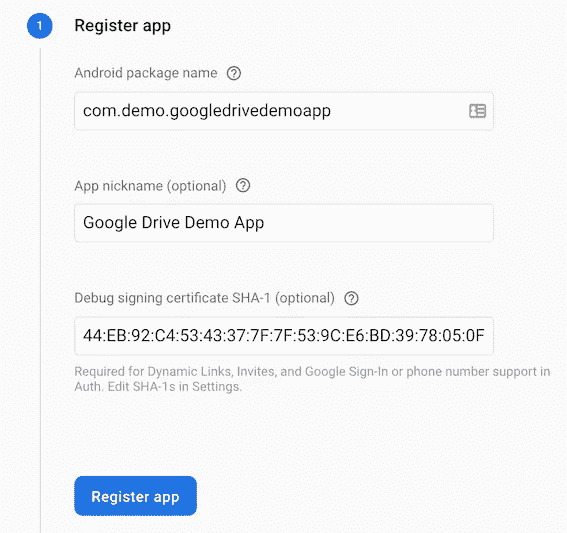****

****我们需要确保`package name`与`android/app/build.gradle`下的`applicationId`匹配:****

```
**android {
    ...
    defaultConfig **{
**applicationId **"com.demo.googledrivedemoapp"**
    ...
    }
    ...
}**
```

****尽管`SHA-1`在控制台中标记为可选，但[实际上是必需的](https://stackoverflow.com/q/54557479/1035008)。应用程序签名是一个复杂的话题。不需要太深入，我们可以通过运行`android`文件夹下的`./gradlew signingReport`来获得`SHA-1`。****

****之后我们可以从控制台下载`google-services.json`文件，放在 **android/app** 文件夹下。****

****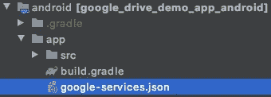****

****回到 Firebase 控制台。默认情况下，所有登录提供程序都被禁用。让我们启用 Google 登录。****

****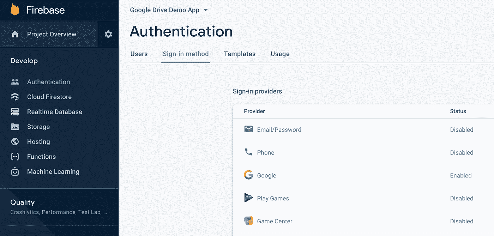****

# ****验证用户登录****

****我们应该拥有用户登录所需的一切。如果我们现在运行应用程序并单击加号按钮，它应该会提示用户登录，请求访问 Google Drive 的权限。****

****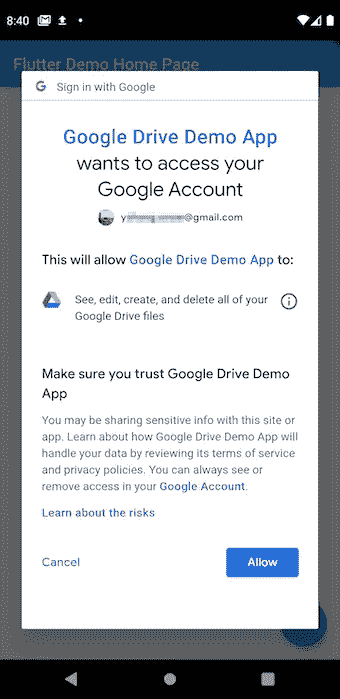****

****如果我们检查日志输出，预计会看到以下内容:****

```
**I/flutter ( 2935): User account GoogleSignInAccount:{displayName: Yuchen, email: y********@gmail.com, id: 103110639438********, photoUrl: https://lh3.googleusercontent.com/a-/AOh14GhKsixVhDGiNcEFkGFn_********37CiHqAF783}**
```

# ****启用 Google Drive API****

****当我们创建上面的 Firebase 项目时，我们实际上是在幕后创建一个 Google Cloud 项目。Firebase 控制台可以被认为是一个更简单的配置门户，可以更容易地构建移动应用程序。然而，有些东西是 Firebase 控制台无法提供的，包括启用 Google Drive API。这就是为什么我们需要在这里切换到[谷歌云控制台](https://console.cloud.google.com/)的原因。****

****在 Google Cloud Console 中，应该已经创建了 **Google Drive 演示应用**项目。找搜索栏，搜索“Google Drive API”。这将打开下一页。点击“启用”。****

****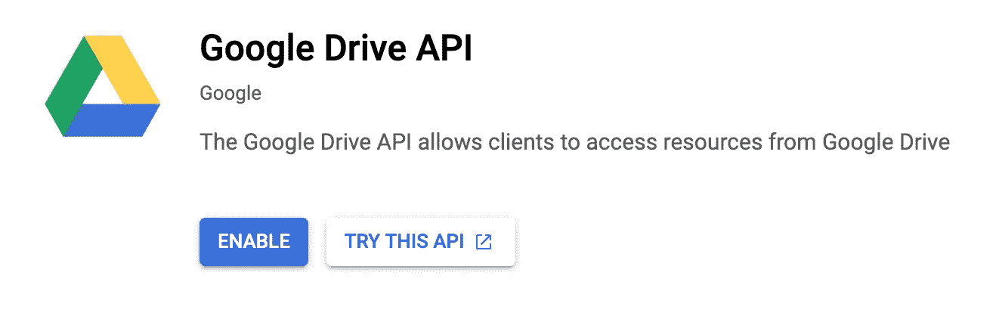****

# ****将文件上传到 Google Drive****

****最后，是时候把所有东西放在一起，上传一些文件到 Google Drive。****

****使用 [http](https://pub.dev/packages/http) 包创建一个新文件`GoogleAuthClient.dart`。`GoogleAuthClient`类基于`[BaseCleint](https://pub.dev/documentation/http/latest/http/BaseClient-class.html)`，它已经支持所有标准的 HTTP 请求:`POST`、`GET`等。我们在内部封装了另一个`[Client](https://pub.dev/documentation/http/latest/http/Client-class.html)`并实现了`send`函数，稍后我们将在其中注入认证头。****

```
**import 'package:http/http.dart' as http;

class GoogleAuthClient extends http.BaseClient {
  final Map<String, String> _headers;

  final http.Client _client = new http.Client();

  GoogleAuthClient(this._headers);

  Future<http.StreamedResponse> send(http.BaseRequest request) {
    return _client.send(request..headers.addAll(_headers));
  }
}**
```

****现在我们用来自上面用户`account`的 auth 头创建一个`GoogleAuthClient`，然后用它创建一个 Google Drive API 对象`DriveApi`。****

```
**final authHeaders = await account.authHeaders;
final authenticateClient = GoogleAuthClient(authHeaders);
final driveApi = drive.DriveApi(authenticateClient);**
```

****最后，我们来上传一个文件。****

```
**final Stream<List<int>> mediaStream =
    Future.value([104, 105]).asStream().asBroadcastStream();
var media = new drive.Media(mediaStream, 2);
var driveFile = new drive.File();
driveFile.name = "hello_world.txt";
final result = await driveApi.files.create(driveFile, uploadMedia: media);
print("Upload result: $result");**
```

****我们有一点作弊。****

****通常，我们会打开一个文件作为`mediaStream`，并上传到 Google Drive。但是为了保持这个演示的简单，我们将跳过它。相反，我们直接从`"hi"`创建一个输入流，并作为文件`"hello_world.txt"`上传到 Google Drive。神奇的数字`104`、`105`，如果你在 [ascii 表](http://www.asciitable.com/)中查找它们，对应于`"h"`和`"i"`的 ascii 码。****

****运行应用程序并再次点击加号按钮。预计控制台会显示以下日志:****

```
**I/flutter (12091): Upload result: 'Instance of 'File'**
```

****如果你打开你的 Google Drive，你应该会看到一个里面有`hi`的`hello_word.txt`文件。我们做到了！****

****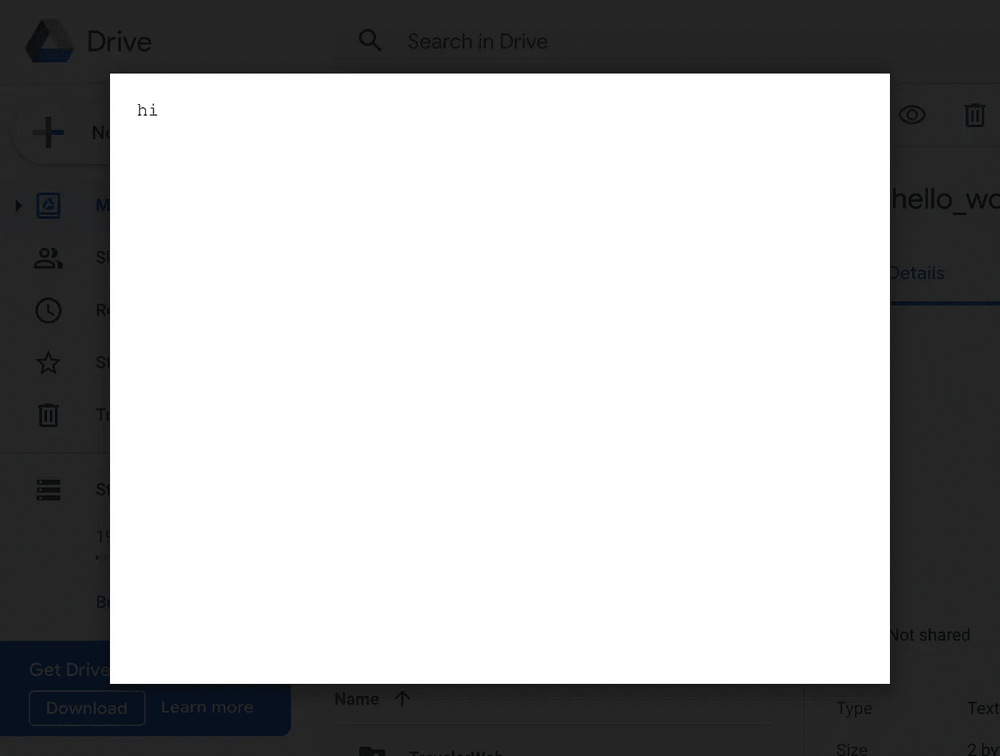****

# ******结尾******

****当然，远不止这些。您可以下载文件、列出文件、搜索文件等。但希望这能给你一个好的起点。****

****今天到此为止。感谢阅读！快乐编码，照顾一个又一个，最重要的是，保持安全！****

****像往常一样，演示代码可以在 [GitHub](https://github.com/yzhong52/GoogleDriveDemoApp) 上获得。****