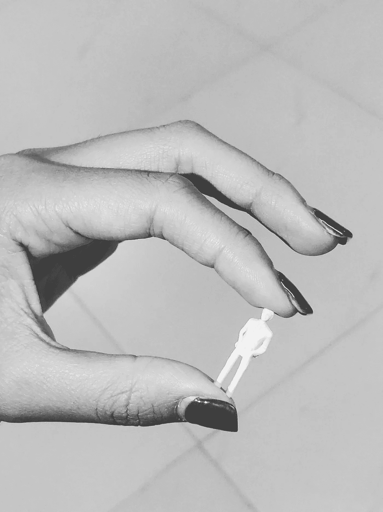

# 微小的 Docker 图像可以

> 原文：<https://betterprogramming.pub/the-minuscule-docker-images-that-could-22bac9ed950b>

## 根据您的需求自动创建微型 docker 图像

照片由 [Kirill Sharkovski](https://unsplash.com/@ksharkovski?utm_source=unsplash&utm_medium=referral&utm_content=creditCopyText) 在 [Unsplash](https://unsplash.com/search/photos/different-sizes?utm_source=unsplash&utm_medium=referral&utm_content=creditCopyText) 上拍摄

# 一种奇怪的痴迷

在过去的几个月里，我发现自己被一个简单的问题困扰着。在运行我们的应用程序的同时，我们可以把 Docker 映像做得多小？

我知道，这是一件很奇怪的事情。

在我们深入讨论细节和技术问题之前，我想解释一下为什么我对这个问题感兴趣，以及它与你有什么关系。

# 为什么尺寸很重要

通过减少我们放在 Docker 映像中的东西的数量，我们正在减少 Docker 容器中可能存在的安全漏洞的数量。此外，它使图像更加清晰，只包含应用程序运行所需的内容。

还有一个小优点是图片下载速度更快，但在我看来，这并不太重要。

注意:阿尔卑斯山的图像已经很小了，如果你在意大小的话，可能就足够了。

# 分布式图像

[Distroless 项目](https://github.com/GoogleContainerTools/distroless)提供了一个“Distroless”基础映像的集合，其中不包含任何包管理器、shells 或其他您通常会在命令行中看到的实用程序。因此，我们不能使用像`pip` 和`apt`这样的包管理器:

使用 Python 3 发行版映像的 Dockerfile 文件

图像中不存在画中画

通常，这个问题可以通过多阶段构建来解决:

使用多阶段构建

结果图像的大小为 130MB。不算太差！作为比较，默认的 Python 图像是 929MB，精简后的版本`3.7-slim`是 179MB，alpine 图像`3.7-alpine`是 98.6MB，最后，示例中使用的 distroless 基本图像是 50.9MB

现在，人们可能会正确地指出，在前面的例子中，我们复制了整个`/usr/local/lib/python3.7/site-packages`目录，其中可能包含我们不需要的依赖项。但是，很明显，所有现有 Python 基础图像的大小差异是不同的。

写这篇文章的时候，Google distroless 还不支持很多图像:Java 和 Python 是实验性的，Python 只支持 2.7 和 3.5。

# 微小的图像

回到我对创造小图像的痴迷。

最初，我想看看这些发行版映像是如何构建的。distroless 项目利用了谷歌的`bazel`构建工具。然而，设置 Bazel 和编写我自己的图像需要一些工作(老实说，重新发明轮子非常有趣，也很有教育意义)。我希望能够更容易地创建更小的图像，创建图像的行为应该非常简单，应该是微不足道的。没有配置文件，终端里只有一行:`just build an image for <application>`。

现在，如果你想建立自己的形象，你应该知道一个独特的码头工人形象:`scratch`。Scratch 是一个“空”映像，它不包含任何文件(尽管默认情况下它有 77 个字节)。

刮痕图像

临时映像的想法是，我们可以从我们的主机复制任何依赖项，并在 Docker 文件中使用这些依赖项(比如在`apt`中复制并从头开始安装依赖项),或者在 Docker 映像具体化后使用。这给了我们*完全*控制我们在 Docker 容器中放入的内容，因此，也完全控制了图像的大小。

现在，我们需要一些方法来收集这些依赖关系。像`apt`这样的现有工具允许你下载软件包，但它们只限于你当前的机器，毕竟不支持 Windows 或 MacOS。

因此，我开始构建自己的工具，它能够自动构建最小的基础映像来运行任何应用程序。我会使用 Ubuntu/Debian 包，获取它们(直接访问包服务器)，并递归地找到它们的依赖项。该工具应该总是下载软件包的最新版本稳定版本，尽可能减少安全风险。

我把这个工具叫做`fetchy`，因为…它获取…东西…这个工具通过命令行界面工作，尽管它也提供了一个 API。

为了用`fetchy`(这里就拿 Python 来说吧)构建一个镜像，你要做的就是如下使用 CLI:`fetchy dockerize python`。你可能会被提示目标操作系统和代码名称，因为`fetchy`目前只能使用基于 Debian 和 Ubuntu 的包。

现在，可选地，一些依赖项可能根本不使用(在我们的上下文中)，我们也可以排除它们。例如:Python 依赖于 perl，但是，Python 在没有安装 Perl 的情况下也能运行良好。

# 结果

运行`fetchy dockerize python3.5`时产生的 Python 映像只有 35MB(我相信它可以进一步精简，也许是为了未来？)，看起来我们已经设法从 distroless 映像中删除了 15MB。

你可以在这里查看到目前为止制作的所有图像:[https://hub.docker.com/r/fetchy/](https://hub.docker.com/r/fetchy/python)

项目可以在这里找到:[https://github.com/ThomasKluiters/fetchy](https://github.com/ThomasKluiters/fetchy)

如果您缺少功能，只需创建一个问题，我很乐意帮助您:)。此外——我目前正致力于将其他包管理器集成到 fetchy 中——这样就不再需要多阶段构建了。