# 机器学习工程师的典型工作流程

> 原文：<https://betterprogramming.pub/the-ml-engineer-a-very-simple-machine-learning-project-to-show-the-workflow-of-a-typical-machine-ec1e348bfcba>

## 看看 ML 工程师的一天是怎样的


安德里亚·德·森蒂斯峰在 Unsplash[拍摄的照片](https://unsplash.com/s/photos/machine-learning?utm_source=unsplash&utm_medium=referral&utm_content=creditCopyText)

在这篇文章中，我试图浏览并简化一个典型的机器学习工程师或数据科学家的工作流程。这就像是对数据科学家日常生活的简化。

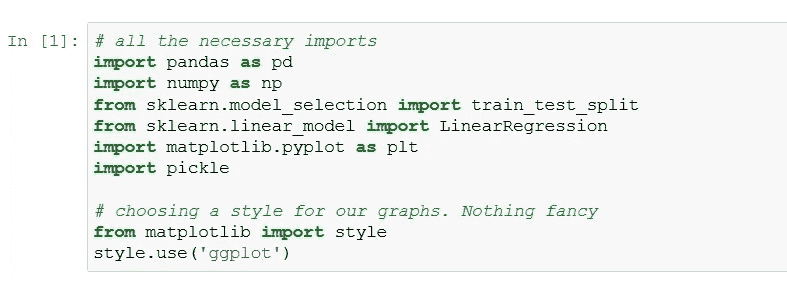

# 数据分析

机器学习是指机器从数据中学习，并因此变得“聪明”。

让我们加载数据并尝试理解它

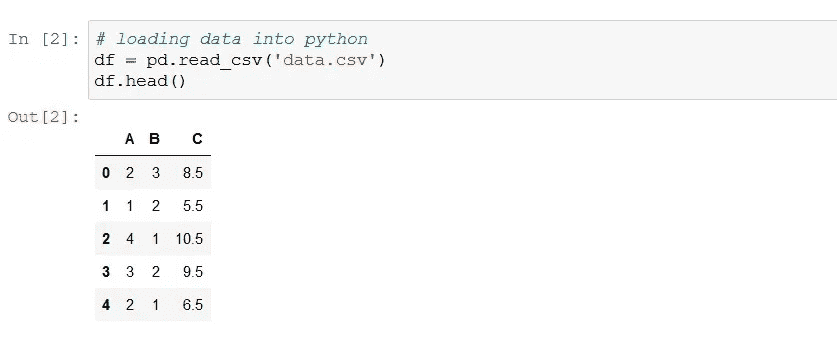

## 标签？

这是一个监督学习问题。因此，我们必须定义我们的标签。更像是:我们想要预测未来的什么？

## 还有特点？

特征也必须被定义。在这种情况下，一个特征是我们用来预测标签的。

基本上，将在特征和标签之间找到一种关系，使得将来当给定特征时，机器可以基于当前数据预测标签。(那毕竟是机器学习吧？)

在这个项目中，我们将把我们的标签定义为标有“C”的列，我们的特征将是“A”和“B”列


## 标签和功能有什么关系？

在这里，我们试图找到特征和标签之间的相关性。这是为了深入了解什么样的模型最适合这个问题；使得选择要使用的模型变得容易。

## “A”和“C”的关系

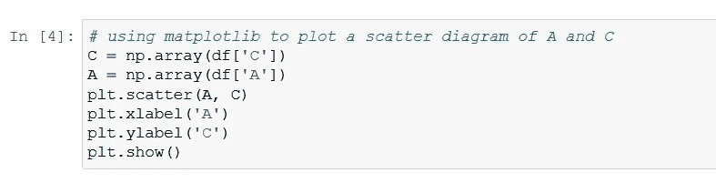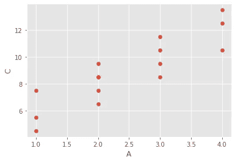

从上图中，我们可以很容易地猜测出‘A’和‘C’之间存在线性关系。

## “B”和“C”的关系

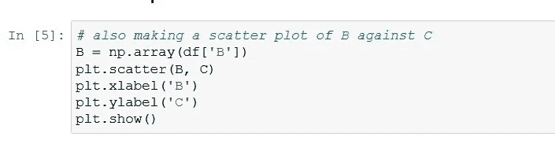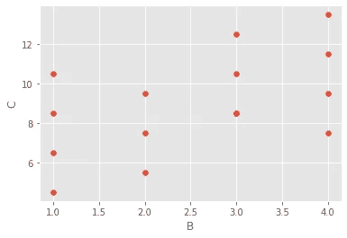

这张图没有前面的图清晰，但是我们仍然可以认为上面的图也表明了 B 和 C 之间的线性关系

## ML 本身

既然我们已经从数据中获得了一些洞察力，我们现在可以对这个项目使用的模型/算法进行有根据的猜测。

由于所有观察到的特征和标签之间的线性关系，毫不奇怪我们最好的选择是决定使用线性回归模型。在顶部导入的原因。

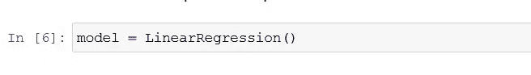

# 培训与测试

没那么快..

我们不能只是训练一个模型，然后就这样不管它，或者只是在训练后才开始使用它。嗯，我们可以，但这是一件非常糟糕的事情。

训练完一个模型后，下一步就是测试模型。为此，我们需要将现有数据分成两部分:一部分用于训练，另一部分用于测试模型。为此，我们使用前面导入的`sklearn`包中的一个函数。(更多原因大部分 ML 工程师用 Python。)

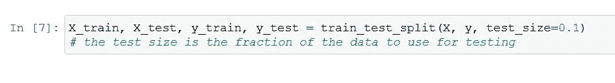

## 培养

实际上，训练很简单。既然我们已经分割了数据，现在我们可以用训练集来训练我们的模型

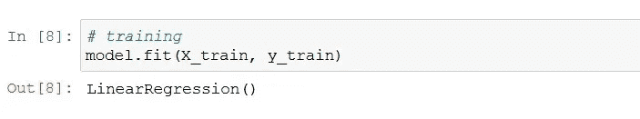

## 测试

训练之后，我们测试我们的模型，看看它的表现如何。


现在，我们的模型是一个理想的模型，我们得到了满分 1 分。更像是模型有多精确。

我不得不说，我们在这里使用的数据与真实世界相差甚远。这是一个非常简单的问题，是我自己用一个数学关系为这个项目创建的。它是如此完美和干净，算法做了最好的工作。不幸的是，真实世界的数据没有这么干净。

## 让我们保存我们的模型

我们绝对不希望每次使用模型进行预测时都要对其进行训练。实际上，训练过程需要时间和大量的计算数据。为此，我们必须保存训练好的模型，以便将来使用。

Python 包`pickle`允许我们这样做。我们已经在顶部导入了它。让我们使用它

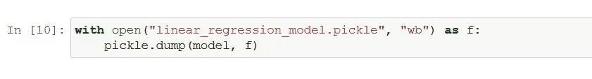

## 加载模型

我们现在可以加载我们保存的模型，并将其用于预测:

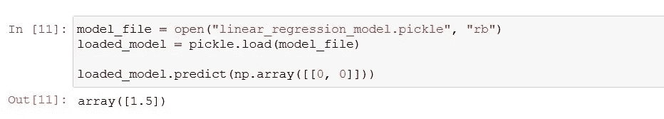

## 我们怎么知道这个预测值是对的？

事实上，我们没有。有可能是错的(我们的模型骗人？).但是基于我们模型的准确性，我们有信心。

注意:对于我们的项目，由于我们使用的数据集，我们的精度是 1.0，这是 100%，但这与真实数据相差甚远。

在实际的 ML 工作中不可能得到 1.0 的精度。

## 我使用的数据

```
C = 1.5 + 2A + B
```

我自己使用上述关系为这个特定项目创建了这个数据集

哦，看，我们的模型终究是对的:当 A 和 B 都是 0 时，C 确实是 1.5

# 结论

上面的代码是我决定接手的第一批 ML 项目之一，帮助我学习和理解事情是如何完成的。

我不得不指出，这篇文章让事情看起来非常简单，但成为一名机器学习工程师还有很多事情要做。

完整的 Jupyter 笔记本在我的 GitHub 库[这里](https://github.com/trevenue44/ml101/blob/main/Linear%20Regression/01%20First%20Linear%20Regression/app.ipynb)。

感谢您的阅读。我希望这篇文章在任何可能的方面都有所帮助。请随时在 [Twitter](https://www.twitter.com/trevenue44) 上与我联系，并查看我的 YouTube 频道: [trevenue44](https://www.youtube.com/channel/UCA1b9DoZ1cWIAzaOdNe9yZQ) 。