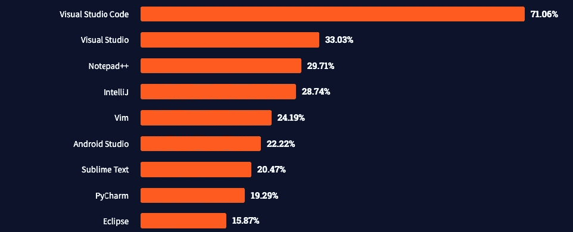
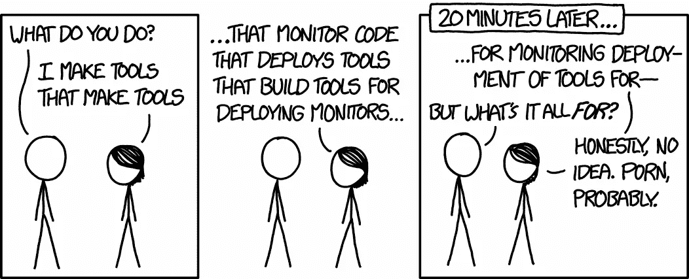
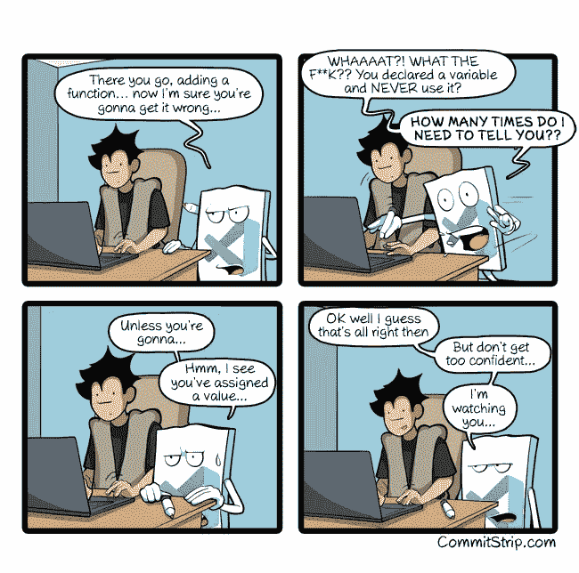

# 现代开发人员堆栈— 2022 版

> 原文：<https://betterprogramming.pub/the-modern-developer-stack-2022-edition-b5f515635c54>

## 开发堆栈正在发展。我询问了 Scott Hanselman、Juraci Paix 和 Ilai Fallach 他们的开发人员工具箱有什么新内容。这是我发现的


作者图片

# 什么是现代开发人员堆栈？

二十多年来，我一直从事某种形式的开发工作。冒着听起来像个老头的风险，那是一种非常不同的经历…👴我没有丝毫的怀旧之情。

我记得在一年的 Enterprise Java Beans 之后，我被逼到了近乎疯狂的地步，使用笨重、挑剔的 ide 工作，让我花费数小时来处理每一个小的方法更改或重构尝试。

由于没有 IntelliSense，不断摆弄 XML 文件，没有类似于现代 CLI 开发体验的东西，推出更改需要很长时间。使问题复杂化的是，测试似乎总是揭示不会在本地重现的问题，有状态的配置管理服务器设置过程使“在我的机器上工作”成为肮脏的现实。

由于开发人员堆栈和底层技术这些年来发生了如此大的变化，我想借此机会研究一下开发人员工具箱的当前状态。

具体来说，我们今天利用的哪些工具和实践在三到四年前可能是不可用的？大约在 2022 年，现代的开发堆栈会是什么样子？

为了完善我自己的经验和想法，我向一些我认识的最有才华的人寻求他们的观点，并问了他们四个关键问题:

1.  哪些有趣的新开发人员生产力工具已经成为您日常工作不可或缺的一部分？
2.  如果过去的你，一个 2019 年的开发人员，在 2022 年查看你的开发人员工具堆栈时，会首先注意到什么(也许会留下深刻印象)？
3.  你对哪些即将到来的开发技术最感兴趣？
4.  在过去的几年里，你觉得在开发实践和责任方面有什么变化吗？

他们的回答已被编入本文。


# 团队

斯科特·汉瑟曼无需介绍。他是开发人员和微软社区的重要代表。特别是，我多年来一直热衷于关注他的博客和播客。他的参与是一种荣誉；我是你的超级粉丝。

Ilai Fallach 是 [Velocity](https://velocity.tech/) 的工程总监，也是我有机会见到的最具创新精神的工程师之一。他的优势不仅在于识别对开发过程产生影响的关键技术，还在于他如何在实践中适应和实现它们。如果你碰巧会说希伯来语，我真心推荐他在 Reversim 大会上的[演讲](https://www.youtube.com/watch?v=tLc0OGrNRbI&list=PLqXy0aX6TzQryGoAdbyPevKocQxMJzg8_&index=27&ab_channel=Reversim)；在网上可以买到。

最后，上个月我有幸见到了 Jura ci paix o krhling。我们讨论了可观测性和开放式遥测技术等话题。他的发展愿景和可观察性在让我们所有人的生活变得更美好中的作用，立刻给我留下了深刻的印象。Juraci 在 Grafana 工作，是 OTEL 项目的维护者之一。

至于我自己，我叫 Roni Dover，白天的工作是开发 [Digma](https://github.com/digma-ai/digma) ，一个开源的持续反馈平台。我开始这个特殊的冒险是因为我对开发过程着迷，如果你读了我的其他帖子，你可能会有所收获。

# TL；速度三角形定位法(dead reckoning)

帖子中提到的 Devtools:

[**VS 代码**](https://code.visualstudio.com/)

*   [让 VS 代码牛逼](https://makevscodeawesome.com/)， [GitHub PR 插件](https://marketplace.visualstudio.com/items?itemName=GitHub.vscode-pull-request-github)， [Rest 客户端](https://marketplace.visualstudio.com/items?itemName=humao.rest-client)， [VS 代码 GitHub 扩展](https://marketplace.visualstudio.com/items?itemName=ms-azuretools.vscode-docker)

## 集装箱化

*   [VS DevContainers](https://code.visualstudio.com/docs/remote/containers) ，[代码空间](https://github.com/features/codespaces)

## GitHub 和 SCM 集成工具

*   [GitHub 动作](https://github.com/features/actions)、 [GitHub CLI](https://cli.github.com/) / [GitHub 桌面](https://desktop.github.com/)、[精制 GitHub](https://chrome.google.com/webstore/detail/refined-github/hlepfoohegkhhmjieoechaddaejaokhf?hl=en)

## 可观察性和分析

*   [Semgrep](https://semgrep.dev/) ， [OpenTelemetry](https://opentelemetry.io/) ， [Jaeger](https://www.jaegertracing.io/) ， [Prometheus](https://prometheus.io/) ， [Digma](https:github.com/digma-ai/digma)

## 最激动的是

*   [GitHub 副驾驶](https://copilot.github.com/)， [eBPF](https://ebpf.io/) ，[开放应用模型(OAM)](https://oam.dev/)

## 其他工具

*   斯科特: [OhMyPosh](https://ohmyposh.dev/) ， [Windows 终端](https://docs.microsoft.com/en-us/windows/terminal/install)， [WSL](https://docs.microsoft.com/en-us/windows/wsl/install)
*   尤拉契:[阿果德](https://argo-cd.readthedocs.io/en/stable/)
*   Ilai: [ksniff](https://github.com/eldadru/ksniff) ， [k9s](https://k9scli.io/) ，[速度](https://velocity.tech/)
*   Roni: [步长](https://www.stepsize.com/)

# 2022 年的开发者:更小的团队，更大的所有权

我很好奇在过去的几年中，开发人员的需求是否发生了变化。毕竟，开发工具的作用是让开发人员在工作中更有效率。如果他们需要拥有的不仅仅是代码或者遵循不同的实践，那么合适的工具的出现将会使他们有能力这样做。

我从团队收到的回复都是一致的。开发组织正在演变成更小的团队，在多个层面上承担更多的责任，比如 DevOps、技术责任、K8S 运营、Docker 和云架构。

这些变化允许更小的、以功能为中心的所有权，包括将代码与业务价值联系起来，以及拥有从前端到不同微服务技术的完整堆栈。

> “作为一名兼职开发人员，我拥有正式源代码控制的一切:测试、CI/CD、成熟的 DevOps 管道、开发/测试/试运行/生产——而我只是一个人。这在 10 年前是非常具有挑战性的。10 倍的开发人员不是通过原始技能获得的；它们是通过出色的 devops 流程实现的。”—斯科特·汉瑟曼

# IDE

我在论坛上问，哪些有趣的开发人员生产力工具已经成为他们日常工作不可或缺的一部分。对于 VS 代码出现在大多数列表中，我并不感到惊讶。


VS Code 已经走过了漫长的道路，从一个可以说更像是编辑器的工具，变成了一个精简但高度可定制的平台，拥有数百个生产力扩展，极大地提高了开发人员的满意度。它的轻量级特性和多语言支持使它成为一个理想的全能平台，可以轻松导航不同的堆栈和技术，HTML、JavaScript、Python、Go、CSS 或 Terraform。

2021 年，在堆栈溢出调查中，它无疑是最受欢迎的 IDE。



来源:[https://insights . stack overflow . com/survey/2021 # section-最流行技术-集成开发-环境](https://insights.stackoverflow.com/survey/2021#section-most-popular-technologies-integrated-development-environment)

有效地使用 VS 代码意味着选择正确的扩展。以下是该团队的一些建议:


*   Ilai: [让 VS 代码棒极了](https://makevscodeawesome.com/)“真的提高了我对 VS 代码的使用。不使用鼠标并从 IDE 中清除不必要的窗格。
*   Juraci: [GitHub PR 插件](https://marketplace.visualstudio.com/items?itemName=GitHub.vscode-pull-request-github)“用于 VS 代码的代码评审。”
*   roni:[Rest Client](https://marketplace.visualstudio.com/items?itemName=humao.rest-client)“扩展使得测试 API、调试、故障排除或者只是开发变得更加容易。”
*   roni:[VS Code GitHub Extension](https://marketplace.visualstudio.com/items?itemName=ms-azuretools.vscode-docker)“特别是启动/停止 docker——根据不同的环境排列组合文件，而无需更改终端。”


GitHub Copilot 在每个人的名单上都排在前列，因为它承诺并有能力为未来的开发人员节省无数的时间。这一次，我欢迎我们的代码片段生成霸主。

# 集装箱化的开发环境

如果应用程序可以以容器化的方式部署，以帮助处理依赖性冲突，更好地将其与底层操作系统分离，并使其更具可移植性——为什么其开发环境应该有所不同？在容器上开发完全消除了设置虚拟环境或在不同机器上处理编译资产的麻烦。

Scott 和 Juraci 提出了两种技术，它们采用了稍微不同的方法来使开发环境可移植:

*   [VS DevContainers](https://code.visualstudio.com/docs/remote/containers) 允许 VS 代码开发者在容器内的挂载文件夹上进行开发。不再需要昂贵的虚拟环境设置。
*   [代码空间](https://github.com/features/codespaces)采取了不同的方法。不要在 IDE 中提供一个容器化的开发空间，而是要让整个开发环境，包括 IDE，成为一个不可变的资产，可以随意启动。

# GitHub 和源代码管理集成工具

> “对我来说，最令人印象深刻的是 SDLC 的标准化，尤其是围绕今天的自动化 CI/CD 管道，这使开发人员能够更加专注于开发，而不是将代码投入生产的人工劳动。”— **Ilai** Fallach

## **在大型 CI 平台上的精简集成 SCM 操作**

在过去的几年中，GitHub 和其他源代码控制主机在拥有更多开发管道方面变得更加重要，而不仅仅是变更管理的存储库。

特别是， [GitHub Actions](https://github.com/features/actions) ，团队中的一个共识，使得创建工作管道和运行操作、测试和发布过程所需的必要步骤变得几乎微不足道。

最近，我有机会与 GitHub market place[合作来组装一个发布和 CI 流，我惊讶地发现，这种体验比与 Groovy 脚本或其他大量代码打交道要简单得多。我的预测是 GitHub Actions 和类似的轻量级将慢慢淘汰 CI/CD 框架。](https://github.com/marketplace?type=actions)

## 其他配置管理工具

*   大家:“ [GitHub CLI](https://cli.github.com/) / [GitHub 桌面](https://desktop.github.com/)”
*   ilai:[GitHub CLI](https://cli.github.com/)之上的一个简单的包装器使得用 GitHub 模板动作项自动打开 PRs 成为可能，这有助于标准化批准的拉/合并请求需求。
*   ilai:“[精制 GitHub](https://chrome.google.com/webstore/detail/refined-github/hlepfoohegkhhmjieoechaddaejaokhf?hl=en) 真正升级了 GitHub 网站的使用，具有很大的 QOL 特色。”

# 综合可观测性和分析



来源:https://xkcd.com/1629/

> “使用 [OpenTelemetry](https://opentelemetry.io/) 作为大多数日志和度量用例的替代，并应用一些有用的约定，帮助我们简化了 Velocity 的可观察性。”— **Ilai** Fallach

Roni ilai:“[open telemetry](/improving-code-design-with-opentelemetry-a-practical-guide-a08e6440c24d)已经成为可观测性的领先标准。拥有一个一致认可的规范的好处是，它鼓励一个更大的生态系统围绕它发展。最常见的平台和技术都支持 OTEL。”

Roni: " [Jaeger](https://www.jaegertracing.io/) 和 [Prometheus](https://prometheus.io/) 是与开发人员相关的跟踪和度量工具。我认为可观察性是对代码和开发过程的巨大改进。它为开发团队提供了一种拥有他们的代码直到交付的方法。我之前写过更多关于如何将 OTEL 的见解整合到开发过程中的文章。虽然还没有发布，Digma 将提供一种从这些数据中获得代码洞察力的方法。

Ilai: " [Semgrep](https://semgrep.dev/) 是一个很棒的静态分析工具，专注于寻找代码中的漏洞，但我们一直用它来非常容易地编写定制的林挺规则，它是我们工具的一个很好的补充。"



来源:[https://www.commitstrip.com/en/2020/06/11/im-watching-you/](https://www.commitstrip.com/en/2020/06/11/im-watching-you/)？

# 你最兴奋的是什么？

斯科特:“[副驾驶](https://copilot.github.com/)只会变得更好。”

尤拉奇:“ [eBPF](https://ebpf.io/) 似乎很有趣。”

Ilai:“大多数开发者不需要基础设施；他们需要一个工作平台。这是 Velocity 通过将服务和应用程序抽象成开发人员可以更好理解的模型而带来的价值的很大一部分。我最感兴趣的项目之一是[开放应用模型(OAM)](https://oam.dev/) ，它带来了一个简化的模型，可以回答我们迄今为止看到的大多数(如果不是全部)用例。”

# **其他工具**

## 斯科特

*   [OhMyPosh](https://ohmyposh.dev/) ， [Windows 终端](https://docs.microsoft.com/en-us/windows/terminal/install)，[WSL](https://docs.microsoft.com/en-us/windows/wsl/install)(Windows 上的 Linux)

## 尤拉奇

*   [逃离](https://argo-cd.readthedocs.io/en/stable/)

## 伊来

*   “当试图对 k8s 中的严重网络问题进行故障排除时，[ksniff](https://github.com/eldadru/ksniff)by[torq . io](http://torq.io/)的 Eldad Rudich 非常有用且优雅。"
*   “用 [k9s](https://k9scli.io/) 不会错的。”
*   “当然，我们使用 [Velocity](https://velocity.tech/) 来创建类似生产的环境供我们自己使用。我们建立了一个类似生产的环境，其中包含每个新 PR 上的新代码，并在合并之前自动在该环境上运行 E2E 测试。”

## 罗尼

*   “我相信与开发流程集成的工具，而不是在外部平台上提供信息。 [Stepsize](https://www.stepsize.com/) 是一个非常有趣的工具，用于管理 IDE 中代码上下文中的问题。”

# 那么，什么是适合您的现代开发堆栈呢？

我们只是四个衣衫褴褛的开发者。让我们知道你认为什么是现代开发堆栈的一部分。同样，这是我问团队的问题。请随时给我发送您的回复，我将很乐意张贴任何有趣的东西！

1.  哪些有趣的新开发人员生产力工具已经成为您日常工作不可或缺的一部分？
2.  如果你过去的自己，一个 2019 年的开发人员，在 2022 年查看你的开发人员工具堆栈，他会首先注意到什么(也许会留下深刻印象)？
3.  你对哪些即将到来的开发技术最感兴趣？
4.  在过去的几年里，你觉得在开发实践和责任方面有什么变化吗？开发人员需要知道更多/更少或拥有他们以前没有参与的产品开发和发布的方面吗？

```
**Want to Connect?**You can reach me, Roni Dover, on Twitter at @doppleware.
Follow my open source project for continuous feedback at [https://github.com/digma-ai/digma](https://github.com/digma-ai/digma).
```