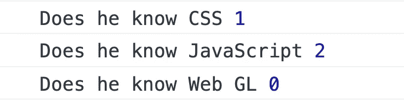
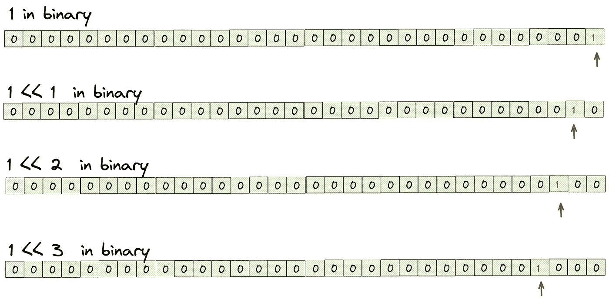
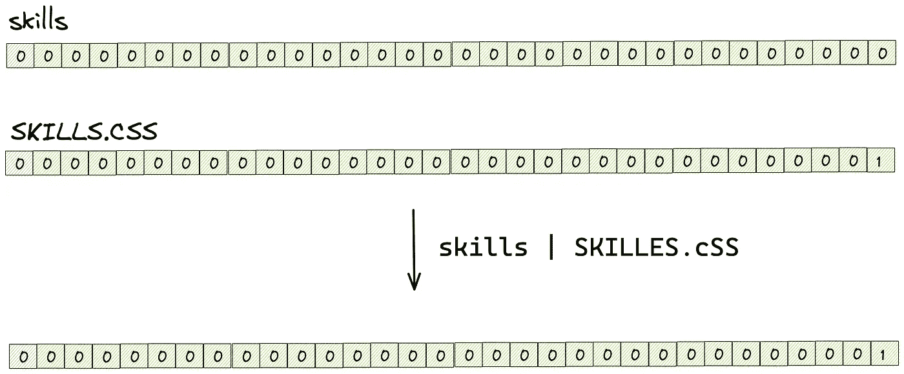
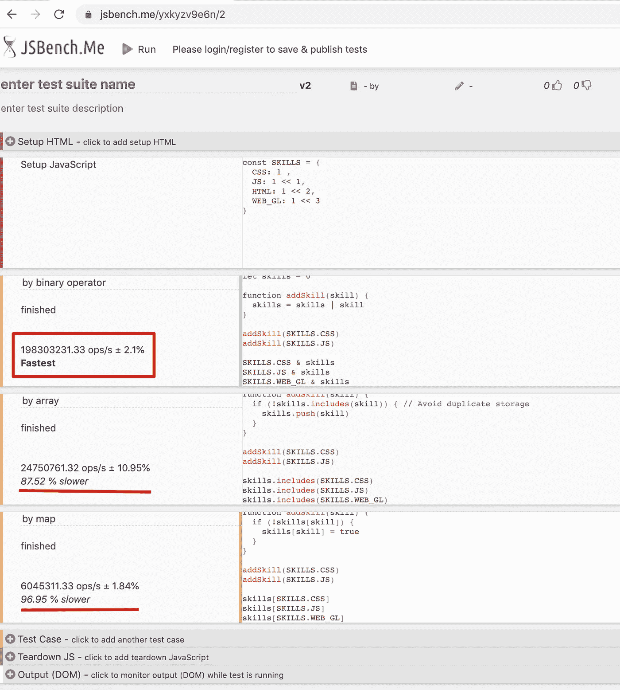

# 用 JavaScript 编写枚举的最有效方式

> 原文：<https://betterprogramming.pub/the-most-efficient-way-to-write-enumerations-in-javascript-a1b9f41ea651>

## 我从 Vue 源代码中学到的一个技巧


[乔·凯恩](https://unsplash.com/@joeyc?utm_source=medium&utm_medium=referral)在 [Unsplash](https://unsplash.com?utm_source=medium&utm_medium=referral) 上的照片

JavaScript 语言本身不支持枚举。如果我们想模拟枚举，我们可以使用一个对象。

假设有这样一个场景，我们需要统计员工的技术栈，目前需要标注的技术有 CSS、JavaScript、HTML、WebGL。

那么我可以这样写枚举:

```
const SKILLS = {
  CSS: 1 ,
  JS: 2,
  HTML: 3,
  WEB_GL: 4
}
```

之前是这样写的，但是最近看 Vue 源代码的时候发现了一个高效使用枚举的窍门，在这里分享给大家。

# 定义枚举

我们可以这样写上面的枚举:

```
const SKILLS = {
  CSS: 1 ,
  JS: 1 << 1,
  HTML: 1 << 2,
  WEB_GL: 1 << 3
}
```

## 什么是<< ?

The **左移运算符(** `**<<**` **)** 将第一个操作数左移指定的位数。向左移位的多余比特被丢弃。零比特从右边移入。

例如:

*   二进制的`1`是`0000 0001`，左移一位是`0000 0010`，十进制是 2。
*   如果我们将它移动两位，它将变成`0000 0100`，十进制的 4。
*   如果我们把它移位三位，就会变成`0000 1000`，十进制是 8。
*   如果我们把它移位 N 位，它将变成十进制的`2^N`。

# 使用

按照上述方法定义枚举后，我们可以这样使用它:



提示:`|`是按位 OR 运算符，它在每个位位置返回一个`1`，其中一个或两个操作数的对应位是`1`

```
const a = 5;        // 00000000000000000000000000000101
const b = 3;        // 00000000000000000000000000000011console.log(a | b); // 00000000000000000000000000000111
// expected output: 7
```

# 这个代码怎么理解？

在 JavaScript 中，整数存储在 4 个字节中，也就是 32 位。第一个代表正负，后面 31 个代表数字。

当我们用二进制表示`1`、`1 << 2`时，它们看起来是这样的:



我们定义的 enum 变量只有一个二进制格式的`1`，并且占据不同的位置。

当我们给技能添加枚举选项时，我们使用`skills | skill`。假设现在我们需要添加的技能是`SKILLS.CSS`，那么在执行过程中，它是:



我们可以发现在`skills`中，`SKILLS.CSS`对应的位置会变成 1。

反之，那么我们就可以通过检查`skills & SKILLS.CSS`的结果是否为 0 来判断`skills`中是否存在`SKILLS.CSS`。

*对了，在这里我们还可以发现这一招有一个缺点，就是枚举项不能超过 31。*

# 为什么要用这一招？

答案很简单，这样的代码运行起来更高效。CPU 里有直接对应位操作的指令，所以效率更高。

我们也可以做一个性能测试。

如果我们不使用位运算，而是使用传统方法(数组或映射)来实现，那么代码如下。

按阵列:

通过地图:

下面是`[jsbench.me](https://jsbench.me/)`的性能测试:



使用按位枚举，性能会显著提高。

# 从 Vue 源代码中学习

我是从 Vue 源码里学的。

```
export const enum ShapeFlags {
  ELEMENT = 1,
  FUNCTIONAL_COMPONENT = 1 << 1,
  STATEFUL_COMPONENT = 1 << 2,
  TEXT_CHILDREN = 1 << 3,
  ARRAY_CHILDREN = 1 << 4,
  SLOTS_CHILDREN = 1 << 5,
  TELEPORT = 1 << 6,
  SUSPENSE = 1 << 7,
  COMPONENT_SHOULD_KEEP_ALIVE = 1 << 8,
  COMPONENT_KEPT_ALIVE = 1 << 9,
  COMPONENT = ShapeFlags.STATEFUL_COMPONENT | ShapeFlags.FUNCTIONAL_COMPONENT
}
```

[https://github 1s . com/vuejs/core/blob/HEAD/packages/shared/src/shape flags . ts](https://github1s.com/vuejs/core/blob/HEAD/packages/shared/src/shapeFlags.ts)

第一次看这段代码的时候，我有点疑惑，但最后还是想通了。

希望这一招对你有帮助。感谢阅读。