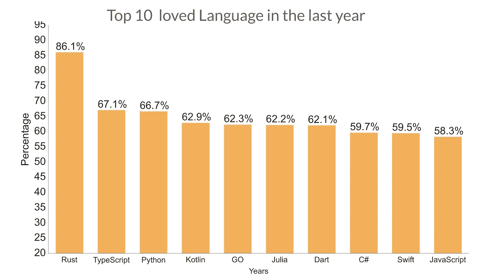
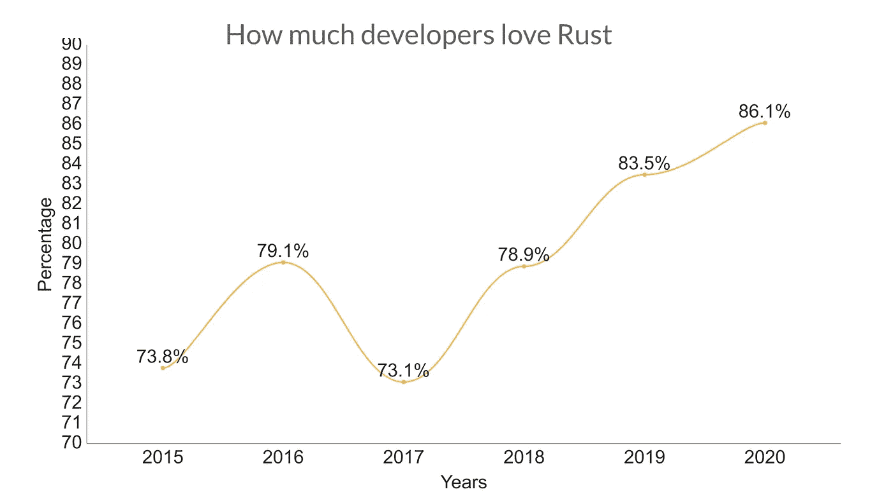
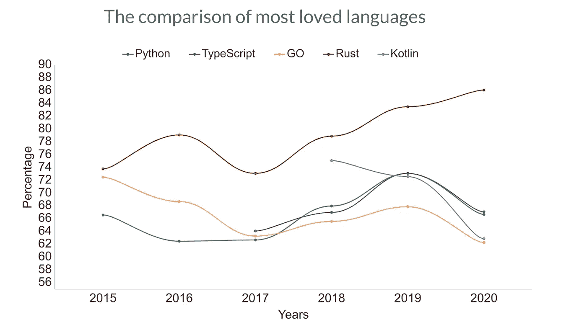
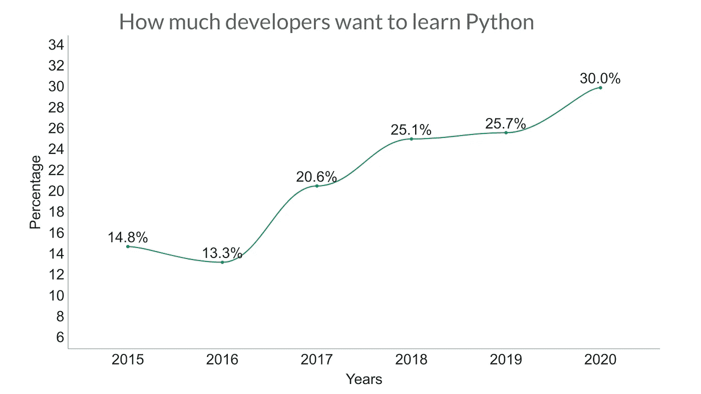
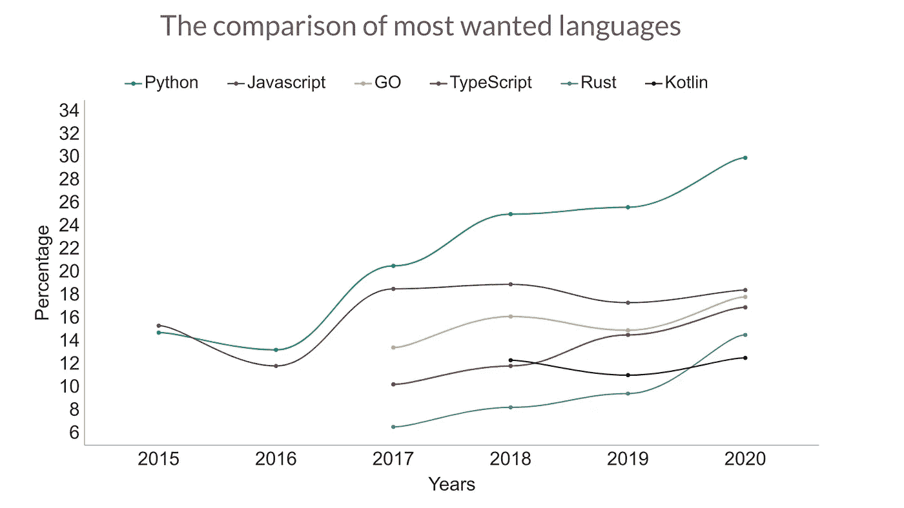
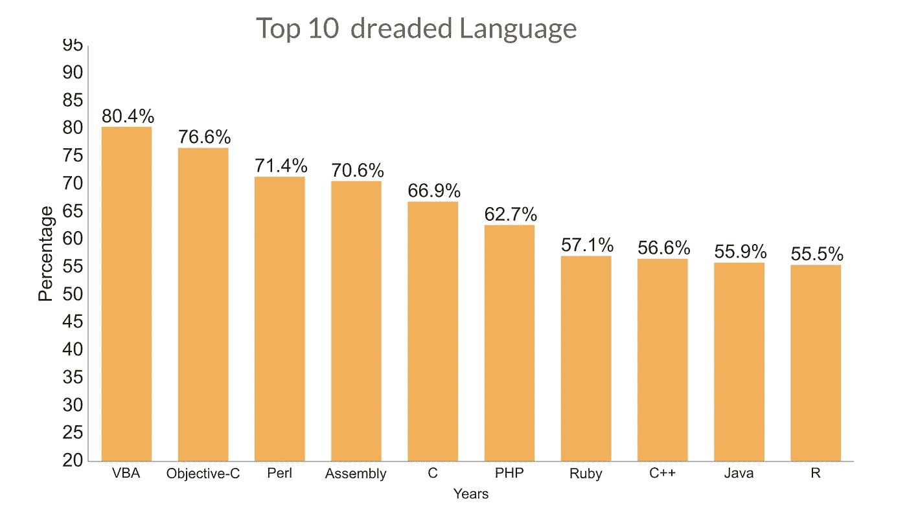

# 最喜欢、最讨厌和最想要的编程语言

> 原文：<https://betterprogramming.pub/the-most-loved-hated-and-wanted-programming-languages-a04d676d155d>

## Rust 是最受喜爱的，VBA 是最不喜欢的编程语言

十大受欢迎语言图表——作者制作

作为开发人员，在我们的一生中，我们学习并使用几种编程语言。但是我们并不需要学习多种语言。一个程序员不会因为懂十种编程语言而得到一份工作。

一个程序员只需要学会一门语言就能找到工作，成为一门语言的专家会让他更容易被雇佣。但最好能知道世界各地发生了什么。

事实是编程正以令人难以置信的速度发展。所以，不管我们愿不愿意，我们都会在旅程中学到不止一种语言和框架。而且我相信程序员在哪些语言会被广泛接受，哪些不会被广泛接受的问题上扮演着主要的角色。

我们来谈谈程序员最喜欢、最讨厌、最想要的编程语言和框架是什么？

# Rust 是最受喜爱的语言

根据[栈溢出](https://insights.stackoverflow.com/survey/2020#technology)的开发者调查，Rust 是去年最受欢迎的编程语言。不仅如此，Rust 已经连续五年成为最受欢迎的编程语言。

去年，86.1%使用 Rust 编程的开发人员表示他们喜欢它。

有多少开发人员喜欢 Rust 的图表——作者制作

以下是一些其他受欢迎的编程语言。Python 的受欢迎程度在过去几年里也有了很大的提高。66.7%的开发者表示热爱 Python。

TypeScript 是去年第二受欢迎的语言，受欢迎程度为 67.1%。

在过去的六年里，围棋的受欢迎程度也从 72.5%下降到了 62.3%。Koltin 的受欢迎程度也下降了。尽管如此，科特林语仍然是第四大最受欢迎的语言。

虽然 Rust 是最受欢迎的语言，但 Python 或 Typescript 的用户数量比 Rust 的用户多得多。

对比最受欢迎语言的图表—作者制作

## 为什么铁锈如此受人喜爱？

据 [Mozilla](https://research.mozilla.org/rust) 报道，开发者正在使用 Rust 创建一系列新的软件应用，如游戏引擎、操作系统、文件系统、浏览器组件和虚拟现实的模拟引擎。

Rust 在栈溢出方面的顶级贡献者在一篇博客中说，“简单的答案是 Rust 解决了许多其他语言中存在的痛点，提供了一个坚实的前进步伐，同时带来了有限的负面影响。”

尽管一些开发人员抱怨学习 Rust 比其他人更难。

# Python 是最受欢迎的编程语言

从那个调查中我们也可以发现，Python 是开发者最想学习的语言。

30%没有使用 Python 开发的开发人员对使用 Python 进行开发表现出兴趣。在过去的六年里，它已经从 14.8%上升到 30%！

图表显示有多少开发人员想要学习 Python 由作者制作

JavaScript 排在第二位。18.5%的开发者表示有兴趣学习和开发 it。Go、Typescript 和 Rust 分别以 17.9%、17%和 14.6%的开发者兴趣排名第三、第四和第五。

作者制作的最受欢迎语言对比图

## 为什么 Python 是这么火的语言？

Python 是一种非常丰富的语言，有数百个库和框架。我发现 Python 是最容易学的语言之一。其实我觉得还是从 Python 开始编程比较好。

Python 已经创建了一个非常成熟和支持性的社区，它是数据科学和分析领域最流行的语言。

# Visual Basic 是最讨厌的编程语言

人们都说不好的代码在程序员身上，而不是语言。我觉得语言也有点责任。如果一门语言很无聊，那是谁的错？哈哈。

图表对比了十大令人恐惧的语言——作者制作

Visual Basic 是去年最令人讨厌的编程语言。接受调查的 80.4%的 VBA 开发者表示，他们不想用这种语言进行开发。

Java、Perl、C 和 PHP 也在名单上！

实际上，每种语言都有一些优点和缺点。我没有使用过所有这些语言，但我可以从使用的六到七种语言中看出，可用性、速度、库、错误处理和其他一些因素让我喜欢或讨厌一种语言。

# 最后几句话

一个好的程序员在必要的时候可以很容易地学习一门新的语言。但是有什么语言可以被认为是完美的吗？大概不会。

开发者是一个庞大的社区，对吧？我相信当开发人员喜欢并使用一种语言时，这种语言在行业中更容易被接受。情况可能并不总是这样，但是如果你观察过去 6-10 年的数据，你可能会发现受欢迎程度和潜力之间有联系。

然而，根据工作要求或公司要求，你可能需要学习一门以上的语言。但是在开始职业生涯之前，一个人应该花一些时间在他们应该首先学习哪种编程语言上。

哪一种是你的第一语言？

来源:Stack Overflow 2015 年至 2020 年的开发者调查