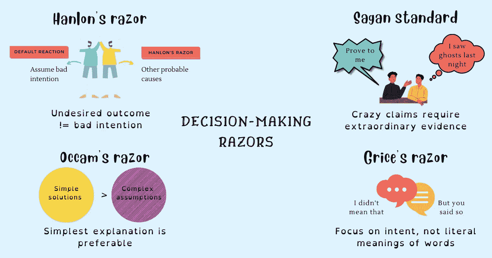

# 最强大的决策剃刀

> 原文：<https://betterprogramming.pub/the-most-powerful-decision-making-razors-bc4ed1ec7e58>

## 排除不太可能的解释，避免不必要的行动，做出更好的决策



鸣谢:作者

在哲学中，剃刀是一种原则或经验法则，它允许一个人排除对一种现象不太可能的解释或避免不必要的行动。

日常生活中的哲学剃刀作为批判性思维工具，消除噪音，剥离不必要的部分，更好地理解手头的问题，从而使你能够做出更好的决定。

就像[认知偏差](https://www.techtello.com/cognitive-distortions/)一样，认知偏差会导致思维错误，并由于我们的大脑应用捷径的能力而产生，剃刀是一种能够做出更好判断的精神把戏，但并非 100%的时间都是正确的。不过，如果使用得当，使用剃刀会非常有价值。

在这篇文章中，我将介绍四种最强大的剃须刀来帮助你做出更好的决定:

1.  汉隆剃刀
2.  奥卡姆剃刀
3.  萨根标准
4.  格莱斯剃刀

让我们逐一探索。

# 汉隆剃刀

汉隆剃刀原则是罗伯特·j·汉隆创造的，他说，“永远不要把可以用愚蠢来充分解释的事情归因于恶意。”

随着时间的推移，我开发了自己的[汉隆剃刀](https://www.techtello.com/hanlons-razor/)版本，我发现它与工作和生活更相关，“永远不要把那些可以用无知、无能、疏忽、误解、懒惰或其他可能的原因充分解释的不良意图归因于他人。”

当事情没有按预期发展时，我们的大脑会假设最坏的可能性，而不是好奇并试图从这种情况中学习。我们看到事件以某种方式展开，得到一种解释，并在我们的脑海中创造符合我们信念的故事。

作为一个物种，我们独一无二地将两个完全不相关的故事联系起来，并在不存在的事件中寻找模式。我们倾向于解释与我们相关的每一个事件，这造成了对现实的扭曲。当事情不顺利时，它让我们假设负面的意图，即使结果可能与我们完全无关。

## **汉隆剃刀的例子**

同事拒绝帮助你可以归因于不良意图(他们不想分享知识)，或者另一种可能的解释是他们忙于工作，无法承担更多的责任。

你的经理取消一对一会议会被认为是不关心和粗鲁的，或者更合理的解释是他们在最后一刻被召集参加紧急会议。

## **不使用汉伦剃刀的影响**

另一个人出于恶意的潜在假设破坏了沟通，限制了你们共同取得的成就——你可能会疏远他人，拒绝合作，甚至可能会忽视对你有利的机会。

由于人类天生承受负面体验的情绪负担的时间要比正面体验长得多，不使用汉伦剃刀甚至会导致[过度思考](https://www.techtello.com/stop-overthinking/)，这会影响你的心理健康和个人福祉。

> “一个叫做汉伦剃刀的智慧建议我们‘永远不要把可以用愚蠢来充分解释的事情归因于恶意’对此，我要补充一个更笨拙但更准确的推论:“永远不要把在复杂的互动系统中遵循激励的适度理性的个人所能解释的事情归因于恶意或愚蠢。”
> 
> 人们在没有中央协调的情况下，按照自己的最大利益行事，仍然可以创造出在某些人看来是阴谋或无知瘟疫的明显证据。”—道格拉斯·W·哈伯德

## **如何应用汉龙剃刀**

1.  超越你的个人叙述。
2.  从另一个人的角度想象这种情况。
3.  不要在每一个行为中占据中心位置。
4.  不要责怪别人做错了，停下来，反思一下情况，想想其他的可能性。

总之，不希望的结果！=居心不良。

# 奥卡姆剃刀

[奥卡姆剃刀](https://www.techtello.com/occams-razor/)(也称为吝啬法则)是解决问题最有用的心理模型之一。它指出“用更少的资源做更多的事情是徒劳的。”换句话说，最简单的解释比更复杂的解释更可取。

简单并不意味着为了降低复杂性而忽略重要的事实。相反，它需要开放的思想来寻求更好的解决方案，减少复杂性和假设，以找到更好的做事方式。简单的解释可能有更高的机会是正确的，但这并不意味着你盲目地应用这种心理模型而不考虑逻辑、数据和其他矛盾的证据。

## **奥卡姆剃刀的例子**

开发人员可以编写简单和复杂的代码来实现相同的结果。然而，简单的代码总是脱颖而出，因为它更容易阅读，更容易修改，出错的机会更少，并且易于审查。想想你的代码部署和审查过程——它能被简化吗？

这同样适用于架构和设计选择。具有更多假设的复杂设计不仅难以实现和测试，而且失败的几率更大，更难维护。实现相同结果的简单设计总是比更复杂的版本更受青睐，因为它做出的假设更少。

当选择使用特定的技术时，开发人员可能会尝试以前没有经验的新技术，但是使用具有内部专业知识的技术更合理，因此使用和应用起来也更简单。

## **不应用奥卡姆剃刀的影响**

在解决问题时，我们会受到脑海中容易出现的想法的影响。如果不应用奥卡姆剃刀，我们可能会有选择地选择证实我们的偏见的数据，并挑选与这些想法一致的解决方案，即使它们可能需要太多的脚手架来支持。

在产品中，不应用奥卡姆剃刀会导致许多功能无法向客户交付实际价值。相反，它们可能会分散注意力，导致客户流失。为了留住客户，公司需要通过去除不必要的功能，从产品的简单性中创造出与众不同的因素。

想想谷歌是怎么提供搜索的，或者苹果是怎么设计产品的。他们剔除了对用户没有价值的复杂和无用的信息。

## **如何应用奥卡姆剃刀**

1.  运用[第一原理思维](https://www.techtello.com/first-principles-thinking/)将问题分解成最基本的要素，然后从头开始构建解决方案。
2.  用[二阶思维](https://www.techtello.com/second-order-thinking/)分析你的决定对未来的影响。以短期痛苦为代价优化长期收益。
3.  关注问题的关键要素。
4.  排除不可能的选项。
5.  选择假设较少的解决方案。

> “未能考虑二阶和三阶后果是许多令人痛苦的糟糕决定的原因，当第一个次等选择证实了你自己的偏见时，这尤其致命。在你提出问题和探索之前，永远不要抓住第一个可行的选择，不管它看起来有多好。”—雷伊·达里奥

总之，简单的解决方案>复杂的假设。

# 萨根标准

已故天文学家卡尔·萨根(Carl Sagan)创造了一句格言来应对宏大的计划:“非凡的主张需要非凡的证据。”简言之，ECREE。

萨根在他 20 世纪 80 年代的“宇宙”节目中使这个想法流行起来，同时讨论外星人是否曾经访问过地球，“重要的不是听起来似乎可信的东西。不是我们愿意相信的。不是一两个证人所声称的，而是有确凿证据支持的，经过严格和怀疑的检验的；非同寻常的主张需要非同寻常的证据。”

作为一把剃刀，萨根标准确立了证据本身不足以建立信念——证据的质量和数量必须能够承受被争论的主张的重量。换句话说，索赔越多，证明索赔所需的证据就越多。

ECREE 是一个有用的工具，下次你遇到疯狂和令人愤慨的说法时要记住——不要假设你看到和听到的都是事实，并以此为基础做出决定，而是要求证据。

## **萨根标准示例**

假设你的同事在一次会议上告诉你，他们昨晚晚餐吃了非常棒的寿司。这是一个普通的要求，很少或不需要验证的证据。你很可能会相信他们的话，或者打听一下寿司屋的情况，但仅此而已。你不会反驳或争辩这个想法。

然而，如果他们转发给你一段视频，解释未来人类将如何被机器人取代，并强烈支持这一想法，仅仅一段视频或他们的话不足以满足这一说法。你需要强有力的证据来支持这个古怪的想法。

在另一个例子中，你的朋友声称他们昨晚在公寓里看到了一个鬼。如果没有有力的证据，你会相信吗？

## **不应用 Sagan 标准的影响**

不应用萨根的标准，你就屈服于人们头脑中的想法和信念，而不是植根于实验和测试的解释。在产品开发中，不应用萨根的标准可能会导致错误的选择，当有重大主张的想法被优先考虑时，即使支持它们的数据较少。

无论是人还是企业，在做决策时都需要小心——理论上听起来不错的东西，在现实中可能行不通。

## **如何应用萨根的标准**

1.  不要认为非凡的主张是理所当然的。与其偏向任何一方，不如寻找证据。
2.  提问以了解情况或声称某件事的人。
3.  用实验来验证假设、理论或信念。

综上所述，不要把编造好故事的疯狂主张误认为是现实可行的。

# 格莱斯剃刀

Grice 的剃刀理论指出，当谈话的一部分，而不是集中在某人所说的话的字面意思，试图确定他们真正的意思或打算说什么。英国语言哲学家保罗·格莱斯提出了语言和意义如何相互作用的理论,“格莱斯剃刀”要求我们考虑所说内容的上下文，而不是孤立地关注他们话语的字面意义。

根据 Grice 的观点，说话者在话语中的意思可以分为说话者所说的和说话者所暗示的。大多数人都难以用语言表达，或者难以表达自己——[文化](https://www.techtello.com/high-context-culture-vs-low-context-culture/)也发挥了重要作用。他们可能有一个伟大的想法，但不知道如何表达出来。在这种情况下，使用 Grice 剃刀可以帮助你从谈话中获得意义，进行富有成效的讨论，而不是浪费时间在他们说了什么或没说什么的无谓争论上。

> "对于语言解释来说，会话含义比语义语境更重要."—保罗·格莱斯

## **格赖斯剃刀的例子**

假设你和你的经理进行了一次反馈讨论，你问他们下个月你是否会被提升。但是他们不会回答是或不是，而是回答“你做得很好。”如果你把他们的回答理解为“是”,即使他们没有直接传达，那你就是在运用格莱斯剃刀。

在另一个例子中:假设你在去开会的路上，看到另一个也参加了会议的人朝相反的方向走去。所以，你问，“你要参加会议吗？”他们回答说，“让我喝杯咖啡。”即使他们没有答应，你也可以把他们的反应理解为他们会在喝完一杯咖啡后马上加入。

在像这样的日常互动中，我们大多数人会对某人的意图做出假设，并使用格莱斯剃刀。然而，当遇到困难的对话或涉及复杂问题的对话时，我们会忘记这样做。

## **不使用 Grice 剃刀的影响**

当你不使用格莱斯剃刀时，你可能会把时间和精力浪费在无关紧要的细节上，而不是集中在重点上。停留在某人所说的话上也会影响关系——其他人感觉受到了攻击，没有被听到，这使得他们在精神上退出了对话，而不是投入到对话中。

依赖文字而不是意图会给有意义的讨论制造障碍——没有用完美的词语说出一些东西并不会降低一个想法的价值或值得批评的程度。如果你不试着去听对方想说什么，就不可能做出好的决定。

## **如何使用格莱斯剃刀**

1.  不要追求单词的字面意思。透过语言观察意图。
2.  不要在语义或者无关紧要的细节上浪费时间。相反，把注意力集中在信息上。
3.  [专心倾听](https://www.techtello.com/effective-listening-makes-better-leaders/)并提出澄清性问题。

总之，接受不完美的沟通，关注意图。

# **总结**

1.  剃刀是做出更好决定的强大思维工具。
2.  汉隆剃刀使你能够通过假设恶意意图，暂停，反思情况和思考其他可能性，停止指责他人的错误行为。
3.  奥卡姆剃刀通过选择简单而不是复杂来获得更好的解决方案——去掉不必要的元素，做出更少的假设，选择简单的解释。
4.  萨根的标准建议你在一个想法看起来疯狂或离谱时寻找有力的证据，而不是想当然或假设它是真的。
5.  Grice 的剃刀通过关注意图而不是使用的词语来增加谈话的价值。

```
**Want to Connect?**Follow me on [Twitter](https://twitter.com/techtello) for more stories. This story was originally published at [https://www.techtello.com](https://www.techtello.com/powerful-decision-making-razors/).
```