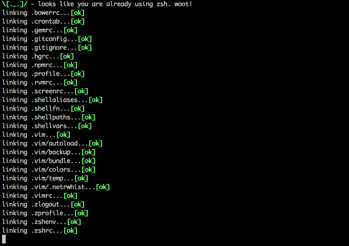

# 10 个最有效的 Shell 命令和命令行技巧

> 原文：<https://betterprogramming.pub/the-most-productive-shell-commands-and-command-line-tricks-ec1415283259>

## Shell 历史，编辑当前行，等等

出免费故事？在 https://aiko.dev/shell-commands/免费获得这篇文章。



当开发软件时，无论你使用什么技术，如果你想成为一个高效的开发人员，没有办法使用命令行。

这是我多年来学到的最喜欢和最常用的 shell 命令和技巧的列表。我相信你已经知道其中的一些，所以请随意跳过这些，但其他的可能会给你带来生产力的提升，让你在你的 n00b 同事面前炫耀你的 1337 h4x0r $killz。

*免责声明:我在 Iterm2 中使用 Z Shell 的 macOS 上使用这些命令。只要您在类似 Unix 的操作系统上运行类似 bash 的 shell，这些命令也应该适用。如果您有一个更奇特的设置，您可能知道如何在 shell 中让这些自己工作。如果你在 Windows 上运行 Powershell，祝你好运！*

# cd -

你大概知道可以用`cd`换到某个目录。
但是你知道你可以使用破折号(`-`)作为一个参数来返回到上一个目录吗？

```
$ cd /home
~> home$ cd /my_dir
~> /my_dir$ cd -
~> /home
```

**额外提示**:破折号参数也适用于`git checkout`，所以你可以用它在主分支和工作分支之间快速切换。

对于更大的目录历史，请查看`[pushd](https://unix.stackexchange.com/questions/77077/how-do-i-use-pushd-and-popd-commands)` [和](https://unix.stackexchange.com/questions/77077/how-do-i-use-pushd-and-popd-commands) `[popd](https://unix.stackexchange.com/questions/77077/how-do-i-use-pushd-and-popd-commands)`。

# 外壳历史

这可能是我最常用的 shell 技巧:按向上箭头(连续)选择我的 shell 历史中最后的命令。

您也可以按`ctrl + r` (连续)通过关键字以 LRU 顺序反向搜索您的 shell 历史。

或者直接输入`history`在您的终端中查看整个 shell 历史。然后你可以写`![number]`来选择历史中位置`number`的命令。

您甚至可以使用一个负数作为索引来选择第`k`个命令，就像这样:

```
$ echo second
$ echo last$ !-2
-> echo second
```

## !!

如果您只需要最后一个命令，您可以在当前命令中包含`!!`，它将被最后一个执行的命令所替代:

```
$ apt-get install unicorn-factory
> [...] Permission denied$ sudo !!
-> sudo apt-get install unicorn-factory
```

## ！:[索引]

或者你可以通过在你的命令中包含`!:[index]`来选择你想要的命令的一部分，并且插入前一个命令的索引`[index]`处的参数。

```
$ echo hello world 
> hello world $ echo !:1
> hello
```

您甚至可以使用`[index]-[index]`选择范围:

```
$ echo live long and prosper
> live long and prosper$ echo !:3-4
> and prosper
```

## !^ !$

上一条命令的第一个(`!^`)和最后一个(`!$`)*参数也有快捷键:*

```
*$ echo live long and prosper
> live long and prosper$ echo !^ !$
> live prosper*
```

# *编辑当前行*

*当您刚刚从历史记录中选择了一个需要稍加修改的命令时，这可能特别有用。*

*你可以按下`ctrl + a`将光标移动到行首，按下`ctrl + e`将光标移动到行尾(记住:e 代表 *e 代表* nd，a 代表……呃……字母表的开头？).*

*此外:*

*   *`ctrl + w`剪切光标左侧的单词。*
*   *`alt+ d`剪切光标右侧的单词。*
*   *`ctrl + k`剪切光标右侧的所有内容。*
*   *`ctrl + u`剪切光标左侧的所有内容。*
*   *`ctrl + y`粘贴刚刚剪切的内容。*

## *ctrl + x + e*

*如果您意识到您实际上需要进行更大的编辑或编写更长的命令，您也可以切换到您的编辑器并随身携带当前行:*

```
*$ you are typing this really long command, maybe with some loop or some complex parsing logic and then realize you need more editing power so you press ctrl + e + x
BOOOM!
VIM(or Nano or VI etc.) opens with your command you had typed so far already in the buffer*
```

## *从历史中粘贴修改的命令*

*您也可以一步完成，而不是检索最后一个命令，然后分两步修改它。*

*`^x^y`给出先前的命令，其中 *x* 被 *y* 替换:*

```
*$ gti status
> Command 'gti' not found,$ ^gti^git
> git status*
```

# *用一个命令处理多个文件*

*您可能以前使用过类似于`cp`或`mv`的命令来处理文件。*

*我最喜欢的快捷键之一是`{}`参数扩展。*

*通过使用`{}`，您可以指示您的 shell 扩展花括号中的每个值:*

```
*$ mv hello_world.{js,html} static*
```

*该命令移动`hello_world.js`文件和`hello_world.html`文件，而不需要键入`hello_world.`两次。*

*您也可以使用范围…*

*以下命令将五个文件(`file1.png`、`file2.png`、`file3.png`、`file4.png`和`file5.png`)移动到`backup/`目录:*

```
*$ mv file{1..5}.png backup/*
```

# *结论*

*因为有更多的命令可以帮助你提高效率，所以当我遇到新的珠宝时，我会不断更新这个列表。你可能想把这篇文章收藏起来以备将来参考。*

*同时，请在评论中分享你最喜欢的命令。*