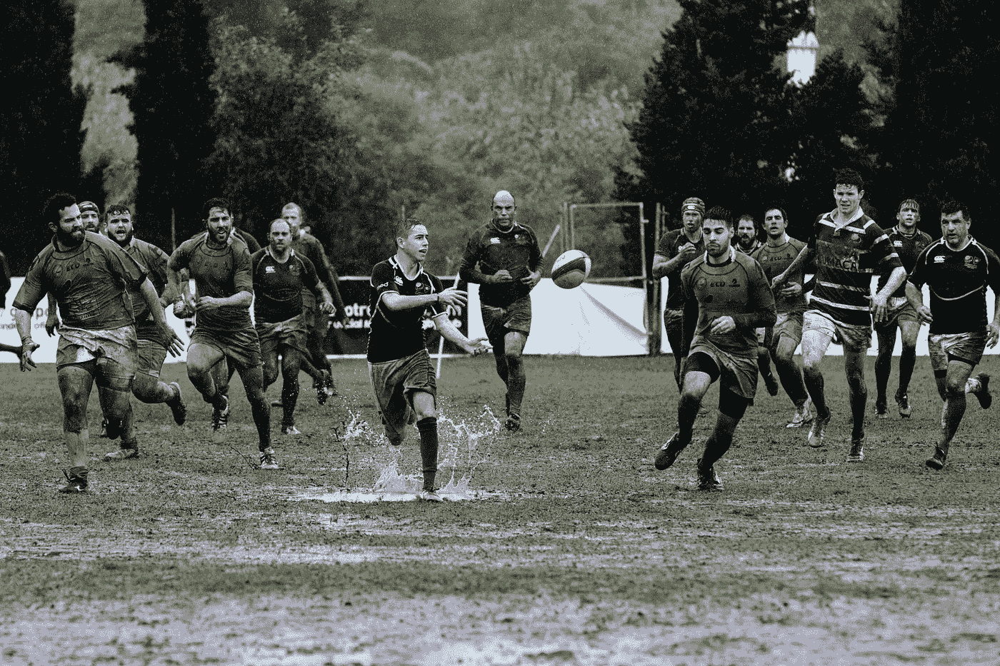

# 领导力的多面性

> 原文：<https://betterprogramming.pub/the-multiple-facets-of-leadership-b8430c473b69>

## 如何平衡多重领导角色以有效利用它们，并使我们成为更成功的领导者

照片由[奎诺·阿尔](https://unsplash.com/@quinoal?utm_source=unsplash&utm_medium=referral&utm_content=creditCopyText)在 [Unsplash](https://unsplash.com/s/photos/roles?utm_source=unsplash&utm_medium=referral&utm_content=creditCopyText) 上拍摄

领导力是一项复杂的工作。

要成为高效的领导者，我们需要具备多种技能，并能够将它们结合起来，使我们成为高效、多产的领导者。

在这篇文章中，我想总结一些“角色”，这些角色是我从[萨拉·坎戴伊](https://medium.com/u/430ac621d32a?source=post_page-----b8430c473b69--------------------------------):[平衡作为领导者的多重角色](https://www.linkedin.com/learning-login/share?account=98689434&forceAccount=false&redirect=https%3A%2F%2Fwww.linkedin.com%2Flearning%2Fbalancing-multiple-roles-as-a-leader%3Ftrk%3Dshare_ent_url%26shareId%3Dwb9w0jcKQUWS5w8PneQB5A%253D%253D)的 LinkedIn 课程中提炼出来的。

# 领导的角色

在我们进入领导角色之前，我想让我们思考一下。作为领导者，我们的角色是什么？

粗略地说，我将它们分为三个基本活动:

1.  提供指导
2.  建立高绩效团队
3.  取得成果

它们中的每一个都可以归因于人员或结果维度。

成功的关键因素是能够在某种程度上平衡我们的活动，我们能够在这两个方面投入适量的时间。
我们希望我们的团队感受到授权、创新、激励、专注、自我组织，并最终*实现业务目标和结果*。

听起来像是一个要实现的雄心勃勃的目标，对吗？这就是多重领导“帽子”发挥作用的地方，让我们来回顾一下。

领导的多重角色

# 作为管理者的领导者

我们在组织中可能遇到的一个常见问题是缺乏明确的方向。

我们可以鼓舞人心，鼓舞人心，但在阐明未来的短期愿景方面仍然做得不够。这可能会造成一个问题，因为如果没有一个明确的计划，我们的团队将很难达到他们的目标。

这就是为什么“领导者作为管理者”的角色很重要。

经理的主要目的是提供一种系统的方法来组织、执行商业计划和实现价值。

这可能包括设置议程、制定路线图、清除路障、提供背景、设置 KPI、监控流程等活动，最重要的是，让团队对实现目标负责。

## 作为主题专家的领导者

正如在组织中经常发生的那样，在技术领域积累了丰富专业知识的人会被提升到领导岗位。这是一个显而易见的选择，因为这些人可能已经在这个或那个议程中扮演了领导者的角色。

人们就复杂的问题寻求他们的建议，他们解决问题的技巧让他们能够帮助解决问题。我们还联系他们，培训其他团队成员，传授与其专业相关的流程和程序知识。

如果运用得当，作为主题专家(SME)的领导者是一个重要的角色。

我们不需要落入让自己呆在舒适区的陷阱，限制我们扮演这个角色的时间。

随着我们责任的扩大，我们不可能无处不在，也不可能了解工作的方方面面，这一点将变得越来越清楚。这就是我们应该学会信任我们的团队去做他们擅长的事情，同时把我们的注意力放在更大的画面上。

我们应该放弃我们的专家形象，提高我们与他人一起或通过他人有效工作的能力。

## 领导当教练

在我看来，这是最重要的角色之一，我们作为领导者被召唤去扮演教练的角色。作为过去 15 年的工程经理，我认为这是最重要和最有成就感的部分。

那么，成为一名教练需要什么？

与更专注于交付结果的经理相反，教练专注于帮助产生更好的结果。这种心态需要一种鼓励和帮助人们成功的真诚愿望。这是一个深思熟虑的决定，采取支持的心态，寻找机会发挥他人的长处。

这是对员工成长和福利的关注。

## 作为变革推动者的领导者

因为我们生活在一个极其动态的世界，变化是不可避免的。作为领导者，我们必须能够领导和支持变革。

你可能会问什么样的变化？

事实上，任何改变都需要领导的支持。从小的变化开始，如改变人员办公桌或办公室与远程工作日分配，到大的变化，如团队重组、运营模式的改变、采用新方法、引入新技术或愿景声明的调整。

在这些情况下，我们需要意识到变化，有勇气说出来，并影响团队支持它。

从这个意义上来说，变革推动者领导人站在第一线，向将要实施新想法或方法的人“推销”新想法或方法，让他们参与进来，并让他们参与到变革中来。

> "对人类来说，没有什么比巨大而突然的变化更令人痛苦的了."
> 
> —玛莉·渥斯顿克雷福特·雪莱，《弗兰肯斯坦》

作为领导者，我们可以通过以下实践来更好地扮演变革推动者的角色:

1.  解释为什么会发生变化。投入我们的精力为变革提供动力是至关重要的，因为如果人们理解变革的目的，他们就更有可能接受变革。
2.  站在人民的角度思考。他们想知道什么，或者什么会让他们沮丧？你怎样才能让这种转变不那么有压力？
3.  让人们参与到变革过程中。努力就变革达成一致。我们可以通过鼓励人们参与这一过程来培养真正的承诺。希望我们能够让他们接受我们的转变。
4.  最后，激发对过程的热情。我们应该能够强调变革的积极方面，并以一种为过渡创造真正热情的方式进行沟通。

我邀请你在这里阅读 Kotter 的 8 步改变模型[。](https://www.mindtools.com/pages/article/newPPM_82.htm)

## 领导者作为激励者

我希望我们讨论的另一个角色是我们作为激励者的角色。

通常，我们被紧迫的可交付成果和紧迫的截止日期压得喘不过气来，以至于我们过于关注它们以及影响它们执行的最主要因素。

这种细致入微的关注使我们无法转移到一个最有影响力，但却被忽视的角色，激励者，通常被视为催化剂和激励者。

成为激励者是指与我们的团队成员建立联系，并能够以某种方式鼓励他们，促进积极的态度和积极进取的方法。

如果我们想激励我们的团队，这里有一些我们可以应用的技巧:

1.  首先，建立积极的环境。一种方法是向员工展示我们有多关心他们。问他们关于他们的目标和担忧的问题，然后倾听并采取纠正措施。
2.  第二，设定明确的目标，并付诸实施。在我们的对话中，不要告知和指导他们，而是参与和激励他们。我们如何帮助他们实现更大的目标，并增加新的视角？
3.  第三，调整我们的沟通方式，以更有效地激励每个人。
4.  最后，尽管面临挑战，也要保持进步。即使在困难的情况下，我们也需要准备好继续激励我们的团队成员。

## 作为大使的领导人

有时，我们需要作为组织的代表在组织之外进行沟通和贡献。然而，我们经常凭直觉去做，却不清楚如何推广和提升公司的品牌。这就是我们如何作为大使扮演领导者的角色:

1.  首先，在组织之外建立我们的网络。我们想参加一些专业活动，参加行业会议，甚至志愿发言或参加小组讨论。
2.  其次，我们需要能够清晰地表达我们公司的品牌。我们可能会被问到一个最简单的问题:“你是做什么的？”或者“你的公司是做什么的”？有时候真的很难回答。作为形象大使，我们希望能够描述我们组织的宗旨、我们服务的客户、我们提供的好处以及我们解决的问题。
3.  最后，作为公司领导，我们支持选择我们的组织作为工作单位。因此，我们必须认识到并理解作为本组织形象代言人的责任。

## 有远见的领导者

一些世界上最伟大的领导人被认为是有远见的。虽然这是对领导者的期望品质，但在很多方面，这也是最困难的。

> 史蒂芬·柯维在他的名著《第八个习惯》中描述了一项对来自许多公司和行业的 23000 名员工的调查。他报告了这些令人震惊的发现:
> 
> 只有 37%的人说他们清楚地了解他们的组织想要达到的目标和原因
> 
> 只有五分之一的人对他们团队和组织的目标充满热情
> 
> 只有五分之一的人说他们在自己的任务与团队和组织的目标之间有一条清晰的“视线”
> 
> 只有 15%的人认为他们的组织完全能够帮助他们实现关键目标
> 
> 只有 20%的人完全信任他们工作的组织

这里有一些策略可以帮助我们拓展自己的能力，扮演一个有远见的领导者的角色:

1.  首先，我们需要把获取知识作为我们的首要任务。阅读广泛的主题，探索其他观点。随着我们知识面的扩大，我们会开始发现看似不相关的学科和领域之间的联系。然后，我们可以利用这一点来发展一个独特的观点，增加价值和创造力。最终，我们希望将自己树立为人们尊重并寻求建议的思想领袖。
2.  第二，腾出时间考虑大局和长远。很难从日常工作中走出来思考未来，但我们必须有纪律来实现这一点。
3.  第三，将愿景转化为未来的战略目标。理想情况下，目标应该是 [SMART](https://www.mindtools.com/pages/article/smart-goals.htm) ，包括每个领域、时间表、里程碑或所需资源的可衡量结果。
4.  最后，我们需要有效地传达这一愿景。我们需要能够带着激情和热情清晰简明地描述它，让其他人对未来的旅程感到兴奋。

# 摘要

正如我们所见，要成为成功的领导者，我们必须平衡各种不同的角色。这是一个挑战，但有了坚实的战略和实践，我们可以实现这个目标。

这门伟大的[课程](https://www.linkedin.com/learning-login/share?account=98689434&forceAccount=false&redirect=https%3A%2F%2Fwww.linkedin.com%2Flearning%2Fbalancing-multiple-roles-as-a-leader%3Ftrk%3Dshare_ent_url%26shareId%3DbrN1jQ8fRAeEcMrYXtN1fQ%253D%253D)教给我们的一件事是，平衡领导角色并不涉及一个严格的公式。不是让他们平等。
由于挑战或新的机遇，一些角色将拥有更高的优先级。我们只需要确保我们适合手头的情况，并让我们的团队从我们多样化的领导技能的每个方面受益。