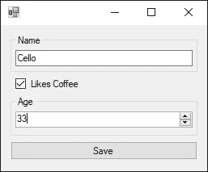

# MVPEC(模型-视图-演示者-等于-克隆)模式的实现

> 原文：<https://betterprogramming.pub/the-mvpec-pattern-keeping-track-of-changes-in-the-gui-64ffc1926f6b>

## 跟踪 GUI 中的变化

[西格蒙德](https://unsplash.com/@sigmund?utm_source=medium&utm_medium=referral)在 [Unsplash](https://unsplash.com?utm_source=medium&utm_medium=referral) 上拍照

考虑以下简单的 GUI:

*   您可以输入一个名称。
*   你可以检查你是否喜欢咖啡。
*   你可以输入你的年龄。
*   你可以点击保存按钮。

你可能会说这是一个微不足道的例子。但这是你在这个行业工作时会面临的一个常见问题。如果做得好，这样的工作可以启动你的职业生涯。

*   从数据库中载入一些数据。
*   在某种 GUI 中显示数据。
*   允许用户编辑该信息。
*   将更改保存回数据库。

在本文中，我将向您展示一个针对此类任务的久经考验的解决方案，我在几十个应用程序中实现了该解决方案。我称之为 MVPEC 模式。

# m 代表型号

再看一下 GUI。数据代表某种实体。我们需要将该实体提取到一个类中。

我们称包装 GUI 数据的类为模型。

所以，你可能会得到这样一个类:

同样，该类包装了我们的 GUI 可以编辑的所有数据。这个班级是我们的榜样。

# v 代表观点

下一步是定义我们的 GUI 实际能做什么。我们以界面的形式写下来。

因此，让我们再看一眼 GUI，并通过以下方式提取其用途:

*   GUI 应该能够显示我们的模型`Person`的数据。
*   GUI 应该让我们知道用户是否点击了 save 按钮。

仅此而已。我们不希望 GUI 做更多的事情。

GUI 代码很难编写，也很难测试。让 GUI 尽可能的简单。

我们称这个接口为视图，它本质上是我们的 GUI 所能做的事情的契约。

对于这个例子，我用良好的旧 Windows 窗体实现了视图。但这只是实现细节——这个概念适用于您喜欢和使用的任何前端堆栈。

# p 代表演示者

现在我们有了一个模型和一个视图，但是他们彼此不了解。这就是第三类介入的地方。第三个类负责模型和视图之间的同步。我们称这个类为演示者。

演示者将包含使我们的 GUI 工作所需的所有逻辑。作为第一步，我们需要演示者简单地将模型转发给视图。

我们[将](/how-i-explained-ioc-and-di-to-our-senior-software-engineer-1561d200b9a5)我们的视图作为[依赖关系](/how-i-explained-ioc-and-di-to-our-senior-software-engineer-1561d200b9a5)注入到我们的演示者中。模型被提供给方法`Present(...)`。这个方法所做的就是告诉视图使用哪个模型。

在我们将 MVPEC 魔法应用到这个演示者之前，让我们看看其他神秘的字母:

# e 代表平等

为了让这个模式工作，我们需要能够通过内容比较模型的多个实例。我们通过覆盖`Equals(...)`方法来做到这一点。

> 当所有属性都相等时，我们的模型是相等的。

# c 代表克隆

我们需要采取的最后一步是在我们的模型中实现`ICloneable`。我们的模型的克隆应该是一个新的实例，具有与原始模型相同的内容。

这是我们的 MVPEC 模型的样子:

# 将这一切结合在一起

准备工作的重点是。让我们回到我们的主持人。我们将为视图提供一个克隆，而不是直接为视图设置模型。

我们的演示者执行以下操作:

*   知道原始模型
*   克隆模型
*   将克隆指定给视图

当用户在我们的视图中更改一些数据时，这些更改只在我们模型的克隆实例中生效。这是很大的好处！

由于我们的演示者也知道原始模型，他们能够比较两者并检查待定的更改。

了解模型的原始状态和当前状态的能力非常重要，因为它允许我们实现许多方便的特性，例如:

*   退出时警告用户挂起的更改
*   允许用户重置他的更改
*   根据是否有待定的更改来启用/禁用保存按钮

# 结论

*   MVPEC-Pattern 允许我们跟踪用户在 GUI 中所做的更改。
*   它这样做不需要复杂的同步逻辑。
*   它还允许我们实现一些重要的特性，比如在可能出现更改丢失之前警告用户。
*   它可以用任何类型的 UI 栈来实现。
*   它让用户界面保持沉默和可测试。
*   以我的经验，值得打字！

不要害怕无聊的代码——下一个阅读你的代码的开发者会感谢你的！