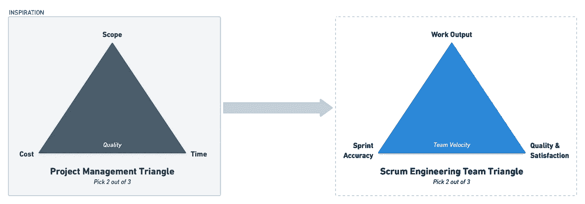
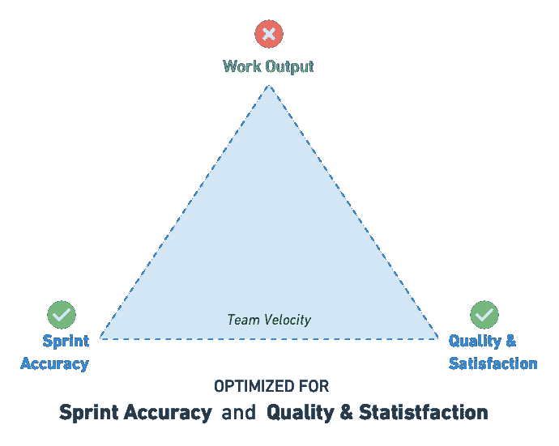
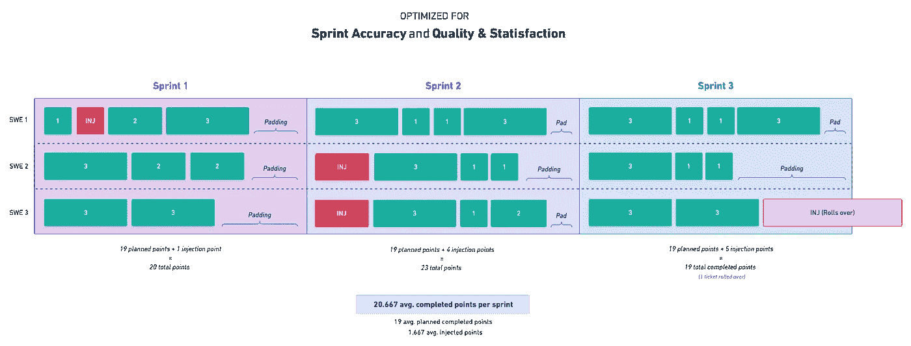
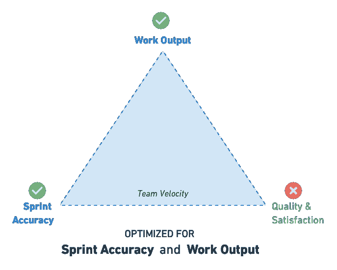
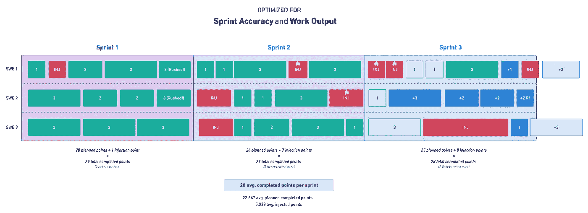
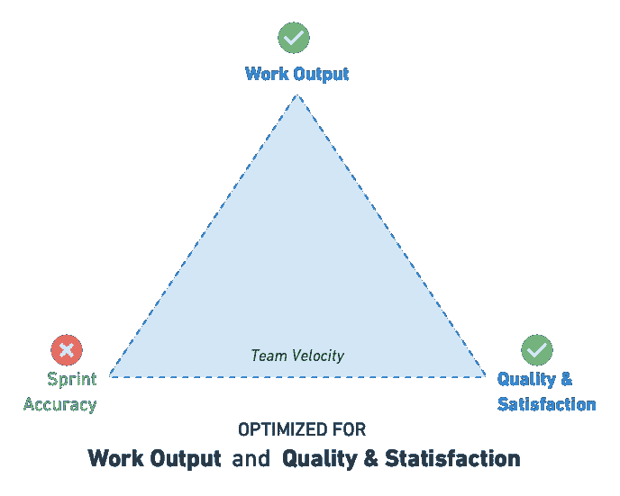
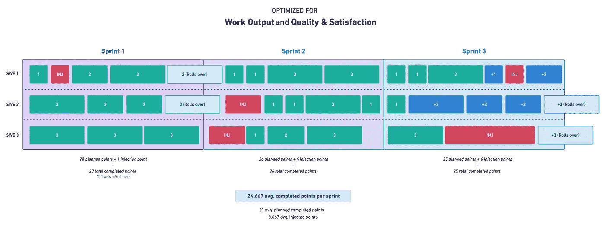

# 完美计划的冲刺的神话以及如何积极地提高团队速度

> 原文：<https://betterprogramming.pub/the-myth-of-a-perfectly-planned-sprint-and-how-to-positively-increase-team-velocity-illustrated-5f0244cbea9d>

## 带插图

[Slidebean](https://unsplash.com/@slidebean?utm_source=medium&utm_medium=referral) 在 [Unsplash](https://unsplash.com?utm_source=medium&utm_medium=referral) 上拍照

在参加了无数个团队的回顾会议之后，冲刺完成率是一个值得关注的话题，现在是时候让*打破完美计划冲刺*的神话了。

为了给这个论证提供合理性，让我们创建一个框架，可以用来客观地论证这个假设。

从由范围、时间和成本组成的标准项目管理三角形中获得灵感——让我们创建一个 Scrum 工程团队三角形。

在 Scrum 工程团队三角中，我们来取三点:*工作产出*、*质量&满意度*、*冲刺准确率*。

*   工作产出强调团队在单次冲刺中完成的工作量。
*   质量和满意度会强调工程师的满意度和所产生代码的质量。(快乐和积极的工程师更倾向于继续构建质量特性。)
*   Sprint 的准确性强调团队在评估 sprint 的工作方面做得有多好。完美冲刺分数的目标是 100%(或尽可能接近)冲刺完成率。

# 设置

为了测试我们的假设，即我们不应该为了*准确性*而优化 sprints，让我们把我们新定义的 scrum 工程团队三角应用到一个假设的有三(3)名软件工程师的 Scrum 工程团队中。

我们可以为每个场景应用几乎相同的任务积压，优化三角形中三分之二(2/3)的点。每个场景运行都将从计划好的工作开始冲刺(在下面的图表中用绿色块表示*)。注入的工作是在 sprint 计划中没有计划的任何事情；*例子*:急问和秀塞 bug。(*在下面的图表中，每个注入的任务将由一个红色块表示。*)*

在 sprint 中未完成的任何票据将被滚动到下一个 sprint。(*在下面的图表中，这些票的色调较浅，带有实线边框。*

# 场景#1:如果我们针对**冲刺准确性**和**质量和满意度**进行优化会怎么样？

在这个场景中，我们强调**冲刺准确性**目标。我们还想确保质量和满意度。

为了实现这一目标，我们需要 19 个冲刺点。由于我们也希望优化质量保证和工程幸福，我们避免设定过高的期望。

如果团队完成了 100%的工作，我们将下一次冲刺的速度提高 1-2 个点，再次确保完美的计划和冲刺的准确性。如果待办事项列表中的下一张罚单超过 1-2 分，我们不会将其纳入冲刺阶段。

总的计划是稍微低估并转向谨慎。

## **结果**

在这个场景运行中，我们完成了 3 次冲刺中的 2 次。Sprint 3 是一个例外，它包含了一个非常大的注入/显示停止错误。我们招致了很多“填充”场景#2 和#3 运行将让我们更清楚地了解这些结果是如何比较的。

# 场景#2:如果我们优化 Sprint 准确性和工作产出会怎么样？

在这个场景中，我们强调 Sprint 准确性目标。我们也要保证工作产出。为了实现这一点，我们采取了 28 个冲刺点，以真正强调工作产出。如果团队正在努力满足 sprint 承诺，我们就会牺牲质量。有些票可能会被抢购一空。(*这些票上都标着“加急！”或者“R！”*)

如果在一次冲刺中有任何票被匆忙处理，我们会从团队速度中扣除 1-2 分，以确保在下一次冲刺中有更好的准确性。

总的计划是激励团队以牺牲一些质量和满意度为代价完成尽可能多的工作。

## **结果**

在这个场景运行中，我们在 3 次冲刺中实现了 1 次冲刺目标。由于工作仓促，我们不得不接受注射/紧急治疗。(*这些由带有火焰图标的红色块表示。*)

我们极大地提高了团队的速度，但是每一次冲刺都有下降的趋势。我们能够从后台输出更多的工作。(*这由蓝色块表示。*)

# 场景#3:如果我们优化**工作产出、质量和满意度**会怎么样？

在这个场景中，我们强调工作产出目标。我们还想确保质量和满意度。为了实现这一目标，我们需要 28 个冲刺点。由于我们也想优化质量和满意度，我们自由地允许任何翻转。

如果在 sprint 中有任何票证被延期，我们会从团队速度中扣除 1-2 分，以确保在下一次 sprint 中有更好的准确性，但我们不强调这是首要目标。相反，强烈反对“填充”！

总体计划是随着时间的推移保持一个健康的冲刺点平均值(团队速度)，同时注意保持对全局的关注(2-3 次冲刺)。

## **结果**

在这个场景运行中，我们在 3 次冲刺中实现了 1 次冲刺目标。我们产生了最小的“填充”，比场景#1 有明显更好的速度，并且有更少的紧急 bug 注入。(质量和满意是目标！)

# 一锤定音

没有完美的冲刺。针对 Sprint 准确性的优化会降低更重要的东西，并交付客户价值——工作产出(新特性)、质量和满意度(减少 bug 的体验)。