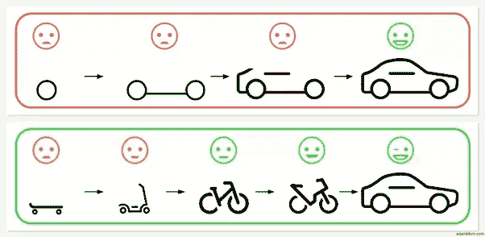

# 小增量改进的神话

> 原文：<https://betterprogramming.pub/the-myth-of-small-incremental-improvements-fd0bfd5e1977>

## 增量变更不会为失败的系统提供紧急出口。这是为了识别什么时候工具是无用的

凯利·西克玛在 [Unsplash](https://unsplash.com?utm_source=medium&utm_medium=referral) 上的照片

你想要直击要害的介绍吗？这里有一个:敏捷方法对小的增量改进的推崇是胡扯。

我不是来崇拜瀑布或赞美看板的，我也不是说所有的敏捷哲学都是不好的——我甚至可以说小的增量改进并不是其哲学的固有部分。

尽管如此，鉴于这种共同的联系，我觉得有必要写这篇文章来帮助其他人认识到他们可能骑错了[的马](https://fireproofsocks.medium.com/coding-is-easy-communication-is-hard-418bac759986)，或者他们可能无意中参与了现状死亡崇拜，因为他们只能想象他们的世界以痛苦缓慢的方式前进。

这是一篇引人注目的敏捷宣传文章，从表面上看似乎很有意义。

通常是产品、软件或业务经理对代码变更的规模或性质提出异议:如果您的工作与他们对“小”或“增量”的评估相冲突，那么这就是您辛勤工作的丧钟。

那么这到底是为什么扯淡呢？因为把关通常是非特定测量的主观评估的结果，不一致地执行。让我们看几个例子，这样你就能理解我所说的 scrum 是什么了。

# 新应用没有增量变化

当一个应用程序首次上线时，所有对违规拉取请求的反对意见通常都是完全不存在的。在许多组织中，新的应用程序可以免费通过，几乎不会受到那些看门人的审查，他们会对变化不够小或增量不够大感到愤怒。什么都没有，然后噗！

突然，有一个*完整的库*包含数百个文件、函数和有待发现的 bug。电子表格、第三方解决方案或其他中间步骤在哪里？那块滑板到底是哪里来的？所有这些都表明这种“小增量改进”有一些实际的限制。

另一个盲点是很少对应用程序的结构质量进行任何严肃的评估——它只是一大堆“LGTM！”来自开发者自己的回音室。失败的种子很早就埋下了:关于应用程序边界或数据建模的糟糕决策实际上是不可能解决的，所以如果你真的想玩“小增量改进”游戏，那么你*真的*需要在新应用程序上线之前非常仔细地评估它们*。业余开发人员做出有用的东西，资深开发人员做出有规模的东西……而大多数管理人员看不出区别。*

# *反馈回路不足*

*对我们的软件所做的改变是由反馈引导的，所以我们的代码实际上只和它的反馈循环一样好。维基百科运作得非常好，因为它有一个开放的反馈过程。然而，我们的软件项目经常不这样做。阻碍代码变更的守门人通常控制着讨论中允许什么样的反馈。业务和产品人员关注的是功能和财务，但如果反馈仅限于这些话题，你的应用就会受到影响。*

**

*你真的能听到和看到你的应用程序所发生的一切吗？*

*开发人员比组织中的任何人都更能识别软件的低效之处，并纠正它们。你愿意你的产品赚两倍的钱吗？还是运营成本减半？作为一名顾问和雇员，我看到许多组织竭尽全力增加利润，却忽视了降低成本的努力。这可能是因为提高效率并不那么有趣，而且可能需要对代码进行*实质性的*修改。目光短浅的“解决方案”通常是让 CPU 或开发人员来解决问题。*

# *效率取胜*

**

*两足行走进化是因为它比四足关节行走消耗更少的能量*

*在全球创意和解决方案市场中，我们应该牢记*效率胜*。软件开发的词汇与生物进化的词汇重叠并不是偶然的:进行小的增量变化是推动成功的一种基本且极其强大的方式。然而，如果认为你的发展战略是合理的，因为它在自然世界中有相似之处，那就太简单了。请记住，在生物学中，变化不一定是渐进的:它们可能是巨大的，而且速度极快。*

*让我们考虑一下一个被移植到外国环境中的入侵物种，那里的居民对入侵者的武器没有天然的防御能力。就像一个毫无戒心的本地人，你的代码代表了一个特殊的解决方案，适应了一组特殊的问题。在遇到入侵的竞争对手之前，一切都很好，它可能代表一个更好的解决方案，小的增量变化不会赢得那种战斗。*

**

*大沼泽地里冲突的顶级掠食者…这张鳄鱼对蟒蛇的照片比蟒蛇爆炸的那张更有味道。*

*当软件解决方案发生冲突时(就像蟒蛇和短吻鳄)，谁将是赢家并不总是很清楚的，但在硬件或维护者方面要求最少的最高效的软件将具有明显的优势。因此，当开发人员试图提高代码的效率时，即使在成千上万的文件发生变化或者对客户来说没有任何变化的情况下，您公司的看门人也应该认真倾听。你永远不知道你的鳄鱼什么时候会和缅甸蟒蛇正面交锋。*

# *你不能打开青蛙的壳*

*“小增量”崇拜中最大的危险是，喝下它的苦艾酒对你的代码、你的业务甚至对地球来说都是自杀。例如，[最新的政府间气候变化专门委员会(IPCC)报告](https://scientistrebellion.com/we-leaked-the-upcoming-ipcc-report/)明确指出，如果我们要避免饥荒、冲突和疾病带来的灾难性剧变，“渐进式变化不是一个可行的选择”。那份报告出现在你上一次 sprint 回顾会上了吗？如果增量变化是你管理软件的唯一策略，更不用说跨越全球的问题了，那么我们将需要准备好迎接前所未有的灾难，这种灾难是按照危险的不可持续的现状预测的。*

*这种情况经常发生:一家拥有“大部分功能性”软件的公司试图从杂乱无章的初创企业过渡到可观的盈利能力。无止境的工时花费在给遗留代码输血上，而增量变化的引入却非常缓慢。因为现有的实现离它们应该在的地方太远了，这将花费*年*的勤奋开发来逃离荒野并到达应许之地。但是泰坦尼克号不会转弯，它会撞上冰山，因为*我们没有足够的时间*。新的变化非但不能拯救项目，反而会带来越来越多的债务，因为没有一种渐进的方式来打破项目赖以建立的有缺陷的范例。在这种疯狂的情况下，船长规定绝对没有工时来重写系统，以避免冰山和沉船。*

**

*当你的船的转弯半径不够时，你最好有另一艘船*

*实际上，你不能拆青蛙的壳:你必须做一个新的。*

*对于任何康复项目来说，重建一个新系统比在旧系统上执行 CPR 要简单得多。但是几乎没有人冒险改变现状。我担心这种情绪会真的杀死我们所有人，因为全球危险的激进分子继续增加化石燃料的生产。如果软件开发方法为人类的未来提供了一扇窗户，那么我充满了恐惧。*

*有时我们的系统需要突然的、根本性的改变，这些改变应该是明智的、安全的、正确的*。*我希望这个简短的讨论能让你更好地理解增量变化为什么不能为一个失败的系统提供紧急出口，以及认识到一个工具什么时候没用是多么重要。在我们的努力中，有时当世界害怕改变时，我们必须有勇气迅速采取行动。不要把自己锁在一个增量的盒子里。*

*我希望这篇文章只是关于软件的。*