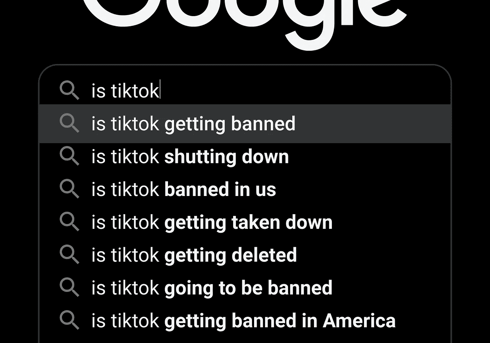
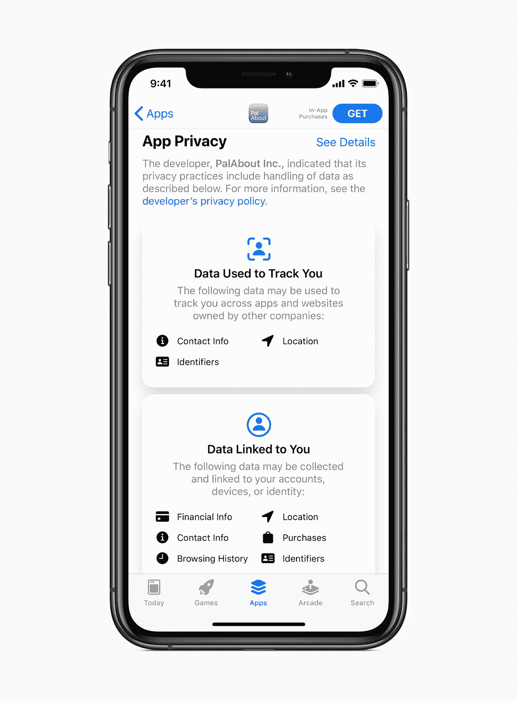
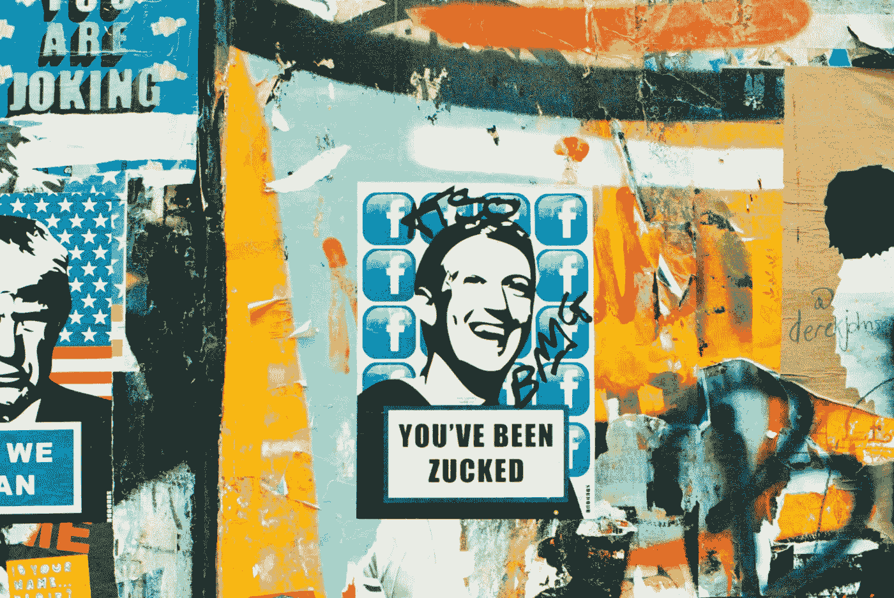

# 新的 iOS 14 已经暴露了严重的隐私问题

> 原文：<https://betterprogramming.pub/the-new-ios-14-is-already-unmasking-serious-privacy-concerns-8601dacdf53b>

## 安卓，你记笔记了吗？

图片来源:苹果公司

苹果的新 iOS 14 尚未正式上市。但其新的安全更新已经暴露出一些严重的隐私问题。操作系统更新目前处于测试阶段，因此，开发人员和测试人员已经开始围绕 iOS 14 工作。

其中一项新功能是在第三方应用程序每次使用剪贴板数据时通知用户。在 iOS14 的开发者测试阶段，用户发现抖音访问设备剪贴板数据。该应用程序一直在监控每几个按键，即使它在后台运行。消息传出后，抖音已经更新了应用程序。但是伤害已经造成了。事实上，从那以后，抖音的事情变得如此麻烦，以至于这款应用现在在其最大的市场印度被禁。

[Unsplash](https://unsplash.com/s/photos/tiktok?utm_source=unsplash&utm_medium=referral&utm_content=creditCopyText) 上[视觉](https://unsplash.com/@visuals?utm_source=unsplash&utm_medium=referral&utm_content=creditCopyText)的照片

另一个类似的事件以 LinkedIn 的形式出现。微软旗下的社交媒体巨头被发现在 iOS 上复制剪贴板数据。领英[消费产品工程副总裁 Erran Berger 表示](https://twitter.com/eberger45/status/1278843576638570496?ref_src=twsrc%5Etfw%7Ctwcamp%5Etweetembed%7Ctwterm%5E1278843576638570496%7Ctwgr%5E&ref_url=https%3A%2F%2Fwww.businessinsider.com%2Fapple-ios-14-catches-reddit-linkedin-copying-iphone-clipboard-data-2020-7)这可以追溯到“代码路径只对剪贴板内容和文本框中当前输入的内容进行相等性检查”他还提到，LinkedIn 不存储或传输剪贴板数据。

除了抖音和 LinkedIn，Reddit 也被发现偷窥剪贴板数据。据 Reddit 发言人称，这是为了在开始新帖子时检查剪贴板上的 URL。该发言人进一步补充说，该公司不存储或发送剪贴板数据。

受到批评后，微软和 Reddit 都在对应用程序进行修改，删除功能。

但这些都不是一次性事件。在 iOS 14 开发者测试阶段，[有 53 个应用程序被报告](https://arstechnica.com/gadgets/2020/06/tiktok-and-53-other-ios-apps-still-snoop-your-sensitive-clipboard-data/)在没有明确原因的情况下访问剪贴板数据。其中包括众所周知的名字，如半岛电视台英语频道、NPR、路透社、PUBG Mobile、Viber、Accuweather。报告发布后，一些应用程序已经限制了这种做法。

# 新的 iOS 14 将焦点放在了隐私上

公司监控你的剪贴板数据的主要问题是整个过程的模糊性。在 iOS 14 测试版中发现之前，没有明确的迹象表明为什么应用程序会访问用户的剪贴板数据。从本质上说，这是公司明显缺乏透明度，这是苹果在新的更新中关注的一个问题。

剪贴板数据通知只是 iOS 14 中为数不多的隐私功能之一。其中一个关键的补充是其应用商店，苹果将要求开发者指定应用程序将收集什么类型的数据。用户可以在 App Store 的产品页面上看到这些信息。

图片来源:苹果公司

在设备层面，苹果还宣布，iOS 设备将在用户每次使用麦克风或视频时通知用户。这立即将安全性提升了一个等级，并可能被证明是至关重要的一个等级——特别是在像脸书这样的公司被指控通过你的电话秘密监听你的情况下。

多年来，许多人将矛头指向脸书，声称它一直在监视人们的谈话以提供广告服务。脸书几次强烈否认这些指控。然而，该公司[后来承认](https://www.vice.com/en_us/article/wjw889/facebook-said-it-wasnt-listening-to-your-conversations-it-was)第三方承包商在其 Messenger 应用程序上转录音频信息。

# 科技巨头和缺乏透明度

请注意，脸书并不是唯一一家以这样或那样的方式监听用户音频的科技公司。去年，有报道称亚马逊[雇佣了数千人](https://edition.cnn.com/2019/04/11/tech/amazon-alexa-listening/index.html)来监听 Alexa 的对话。这个想法是为了帮助 Alexa 更好地理解人类的语言。

安妮·斯普拉特在 [Unsplash](https://unsplash.com/s/photos/facebook?utm_source=unsplash&utm_medium=referral&utm_content=creditCopyText) 上的照片

在这份报告之后，亚马逊表示，“员工不能直接访问可以识别该工作流程中的个人或账户的信息。”此外，用户可以选择退出帮助改进软件的隐私设置。

亚马逊并不是唯一一个记录用户数据以改善数字助理和智能扬声器的公司。一项调查报告称[谷歌捕获了超过 1000 段录音](https://www.vrt.be/vrtnws/en/2019/07/10/google-employees-are-eavesdropping-even-in-flemish-living-rooms/)。另一位透露，微软[也在为其数字助手 Cortana 做类似的事情。讽刺的是，](https://www.vice.com/en_us/article/xweqbq/microsoft-contractors-listen-to-skype-calls)[甚至苹果](https://www.theguardian.com/technology/2019/jul/26/apple-contractors-regularly-hear-confidential-details-on-siri-recordings)在这方面也有罪。

这里的根本问题不一定是收集用户数据的动机(尽管这仍然会引发问题)。而是缺乏透明度。如果这些故事有什么启示的话，那就是公司需要更好地告诉用户他们的数据发生了什么。

# 该你了，谷歌

从更广泛的意义上来说，苹果即将推出的隐私功能可能会呼吁大多数公司加强安全游戏。这包括它的竞争对手谷歌。

谷歌 Play 商店因恶意软件和其他安全缺陷而臭名昭著。就在几周前，[谷歌从 Play Store 下架了 25 款应用](https://www.zdnet.com/article/google-removes-25-android-apps-caught-stealing-facebook-credentials/)，原因是窃取了用户的脸书凭证。

然而，在过去几年中，谷歌已经采取措施逐步提高其生态系统的安全性。例如，Android 10 上的权限控制经历了重大升级。其专用的隐私部分允许您管理来自任何应用程序的权限请求。在 Android 11 中，更精细的权限让你可以选择应用程序访问这些信息的频率。它的地理定位控制也遵循类似的模式。

但即便如此，安全漏洞继续困扰谷歌的频率远高于 iOS。即将到来的 iOS 14 只会扩大安卓和苹果之间的差距。

# Android 上的软件更新一塌糊涂

这种安全级别的对比可以追溯到开放系统与封闭系统的争论。的确，Android 的吸引力很大程度上来自于选择。Android 用户可以选择他们喜欢的任何风格的操作系统。苹果不提供这种级别的定制。但苹果的封闭系统战略让该公司完全控制了其整个生态系统。

此外，该公司提供的设备数量有限。因此，提供安全性和操作系统更新相当简单，在采用方面问题较少。这也是为什么 iOS 14 会和 iPhone 11 Pro 同一天面向 iPhone 6S 发售的原因。

另一方面，安卓系统[更复杂](https://www.androidcentral.com/apple-once-again-crushes-android-makers-update-support)。市场上有数百万不同制造商生产的 Android 设备。在此之上，每个版本的 Android 都有很多迭代。随着数百万用户使用不同的 Android 版本，在整个生态系统中提供统一的软件更新变得很有挑战性。

从好的一面来看，谷歌表示，在所有安卓版本中，安卓 10 是 T2 采用速度最快的。该公司声称，它在五个月内达到了 1 亿台设备。300 天后，达到了 4 亿。尽管如此，谷歌的采用率仍远远落后于苹果。苹果自夸其最新操作系统在 iPhones 中的采用率为 92%。

# 安全应该继续受到关注

负责技术生态系统的公司努力为用户创造更好的隐私和安全意识是至关重要的。人们可能不够关心安全。但是更好的意识可以显著改变用户的行为。

例如，一位 iPhone 用户亚当·鲍尔(Adam Bauer)在剪贴板数据泄露后起诉了 LinkedIn。诉状称，他不知道 apps 在未经同意的情况下访问了他的剪贴板数据。鲍尔提到，如果他知道，他“就不会使用 LinkedIn 应用程序。”

毫无疑问，iOS 14 在隐私和安全方面展现了急需的光芒。科技公司的产品和用户之间明显缺乏沟通。当前 iOS 14 测试版的发现在这里是很恰当的说明。

但是焦点需要继续放在安全上。公司需要努力更好地保护我们的数据。这一点非常重要，尤其是在冠状病毒的背景下，数字工具的采用率不断上升。

因此，我们希望话题能超越苹果的 iOS 14 和 Android，延伸到全球科技行业。你对数据隐私和安全有多认真？