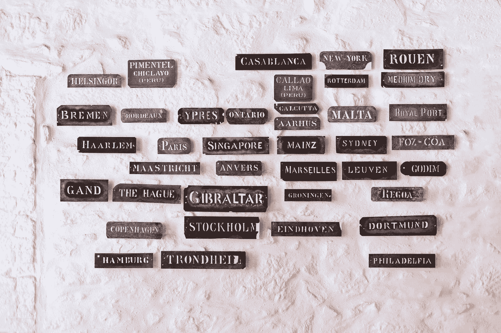
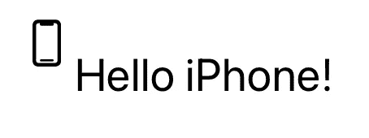
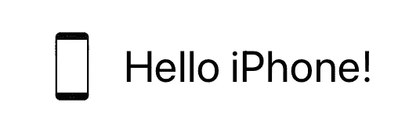
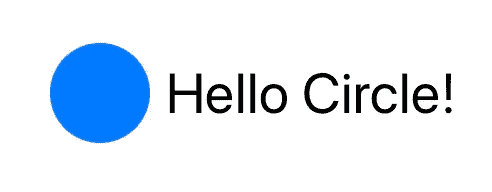

# SwiftUI 中的新标签

> 原文：<https://betterprogramming.pub/the-new-label-in-swiftui-e6958eba0b4>

## 创建不带 HStack 的图像和文本组合



布鲁诺·马丁斯在 [Unsplash](https://unsplash.com?utm_source=medium&utm_medium=referral) 上拍照。

`Label`在 2020 年 WWDC 奥运会上推出，允许你在文本旁边嵌入图像。传统上，你可以使用`HStack`将图片和文本放在一起。我觉得这是一个很好的补充。

*注意:这个只支持 iOS 14 及以上版本，只能在 Xcode 12+中使用。*

# 先决条件

要学习本教程，您需要了解以下方面的一些基本知识:

*   迅速发生的
*   至少 Xcode 12+

# 标签

`Label`获取资产的标题和名称(您自己的图像或系统中的图像)。在这里，您将使用系统的图像:

```
Label("Hello iPhone!", systemImage: "iphone")
```

然而，如果你想使用你自己的图像，这只是一个小小的调整:

```
Label("Hello iPhone!", image: "iphone")
```



老实说，我想知道这是不是一个错误，因为对齐似乎有点偏离。也许这就是它本来的样子。如果这是它应该有的样子，你应该选择使用`HStack`的传统方式。

或许苹果会发布一个 bug 补丁。谁知道呢？让我们拭目以待。

在等待苹果解决这个问题的时候，解决办法可能是创建自己的解决方案。`Label`为您提供进一步定制的可能性。接下来，您将使用图像作为图标:



我个人觉得这看起来更好的图像正确对齐。

你甚至可以选择`Shape`而不是图片:



这一次到此为止。感谢阅读！