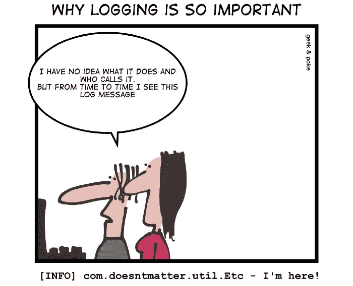
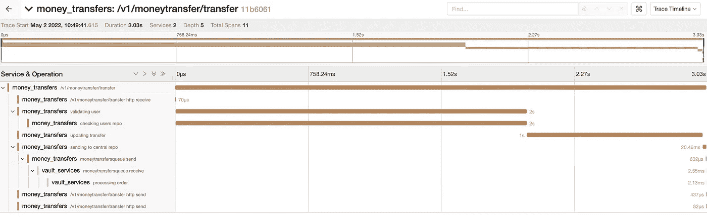

# 善于观察的开发人员—第 1 部分

> 原文：<https://betterprogramming.pub/the-observant-developer-part-1-1939d53fd5a4>

## 像测试一样，可观察性工具为开发人员提供了一种验证代码假设的方法，而不需要额外的水泥。


作者图片

> 这是由三部分组成的系列文章的第一部分，该系列文章将回顾开发人员目前可用的一些可观测性技术，以及它们可以提供哪些具体的见解。在这里阅读第 2 部分[。](/improving-code-design-with-opentelemetry-a-practical-guide-a08e6440c24d)

## 可观察性？那不是德沃普斯的事吗？

从历史上来看，可观察性在开发团队的担忧列表中从来都不是很重要。编写特性是开发人员的工作，而可观察性听起来一点也不像代码(我曾在[之前](/youre-never-done-by-definition-c04ac77c616b)写过关于‘新特性偏见’以及为什么反馈对开发团队至关重要)。事实上，在许多组织中，将可观测性视为 Ops 和 DevOps 组织的专有权限已成为惯例。

公平地说，“可观察性”是一个极其混乱的领域。它包含了奇怪地重叠的子类别，如*监控、跟踪、日志、剖析和 APMs。*令人困惑的是，可观察性工具将从部署的应用程序堆栈的不同层收集的数据混合在一起。网络和 IT 相关指标、服务级别数据、存储，当然还有应用程序级别的跟踪和日志。如果其中大部分听起来仍然像“基础设施”或“IT”，那只是因为从历史上看，它就是这样。

至于我自己，在过去，我同样乐于让其他团队从我的背上拿走这只特定的猴子，并专注于更有吸引力的特性构建任务。当事情变得糟糕时，我才意识到要理解代码在野外的行为。剖析工具是最后的手段，真的。工具箱中最后一把毫无吸引力的扳手，只有在无可奈何地面对莫名其妙的崩溃或无法重现的死机时才能使用。

## 像测试一样投资于代码的可观察性

为什么开发人员需要拥有他们的代码可观察性？因为编码的日子已经一去不复返了，编码就是把特性扔出栅栏，然后希望它们在用户和客户手中进展顺利。记录文本行，最广泛采用的跟踪代码运行时正在做什么的工具，可能是有用的，但是[不能满足需求](https://levelup.gitconnected.com/breaking-the-fourth-wall-in-coding-189055955c85)或者提供我们对于复杂软件系统所需要的洞察力。



来源:[https://geek-and-poke.com/](https://geek-and-poke.com/)

这让我想起了早期的测试。开发人员必须确信测试值得他们花费时间和精力(更不用说预先编写测试了)。更好的测试框架和 CI 工具，以及更完整的 Done 定义视图，有助于让行业适应额外的开销和时间投资，这些开销和时间投资涉及并行活动，如单元和集成测试。

作为一个怀疑论者，我在测试中看到的主要好处是能够验证代码中隐藏的假设。逻辑越复杂，抽象越浮夸，实际行为越有可能与预期行为不同。如果操作得当，可观察性是测试的补充，有助于实现这一目标。

在预生产和生产环境中测量和跟踪代码执行，提供了一种客观的、基于证据的方法来证明代码假设:我的更改真的提高了性能吗？平台是不是越来越稳定了？这些代码块能够处理我们假设的数据加载类型吗？缓存是这个特定领域的最佳方式吗？我在为正确的事情优化吗？

能够根据现成的数据来回答这些问题，而不需要每次都投入时间和精力来研究这些问题，可以加速和改变我们计划和执行代码和设计变更的方式。


来源:[https://commons . wikimedia . org/wiki/File:light bulb _ illustration . png](https://commons.wikimedia.org/wiki/File:Lightbulb_illustration.png)

## 包括电池

可观测性生态系统正在进化。新兴的工具和技术对开发人员来说更容易获得，并且提供了切实可行的好处。商业企业解决方案和你可能熟悉的老一代的重量级 APM 将慢慢让位于新一代的开源平台、包和库。

对我来说，这种情况下的分水岭技术是 [**OpenTelemetry**](https://opentelemetry.io/) ，这是一个开放的规范，最终将涵盖跟踪、日志记录和度量(此时只有跟踪规范达到了稳定版本)。OpenTelemetry 设法建立了一个几乎每个人都同意的单一开放标准，并因此积累了一个足够广泛的支持矩阵，以达到过去的关键采用点。


到目前为止，大多数编程语言、平台和框架都有检测库。一些编程语言，比如。NET 甚至将 OpenTelemetry 集成到他们的本地诊断组件中。为了利用它，你真正需要做的就是打开它。

您还会发现，常用框架已经可以使用工具，比如 Kafka、RabbitMQ、MongoDB、Spring Boot、Django、node.js 等等。事实上，检查一下您当前在堆栈中使用的包和库，您很可能会惊讶于它们中有多少已经通过官方或非官方的工具覆盖了。

## 理论说够了，让我们实际一点


来源:[https://www . IMDB . com/title/TT 0086567/media viewer/RM 542161664/](https://www.imdb.com/title/tt0086567/mediaviewer/rm542161664/)

我在考虑这些帖子应该包含哪种类型的例子。然而，我非常确定我做了**不想**写的事情——设置。有许多教程和博客文章很好地解释了如何设置可观测性工具，尤其是如何打开遥测。这不是一个非常有趣的话题，也不是一个我可以贡献很多的话题。我会确保包含现有指南和教程的链接。

然而，我想关注的是如何让可观察性**变得有用。**在建立了一个基本的堆栈之后，我们如何获得有用的见解和度量来用于日常的编码？我能从这样的痕迹可视化中收集到什么？



作者图片

在本系列的下一篇文章中，我们将这样做，并回顾如何从代码中获得有用的代码洞察力，无论是在开发时(理解执行和约束)，还是在研究生产前和生产数据时。我们将看一看一个示例应用程序，看看如何通过几个简单的步骤来极大地增强我们对代码的理解以及验证我们的更改的能力。

一如既往，我非常感谢任何反馈，并随时向我发送任何相关问题，以便我可以确保解决这些问题。

下次见！

继续第二部分，事情变得有趣了！

```
**Want to Connect?** You can reach me on Twitter at @doppleware or here.
Follow my open-source project for continuous feedback at [https://github.com/digma-ai/digma](https://github.com/digma-ai/digma)
```