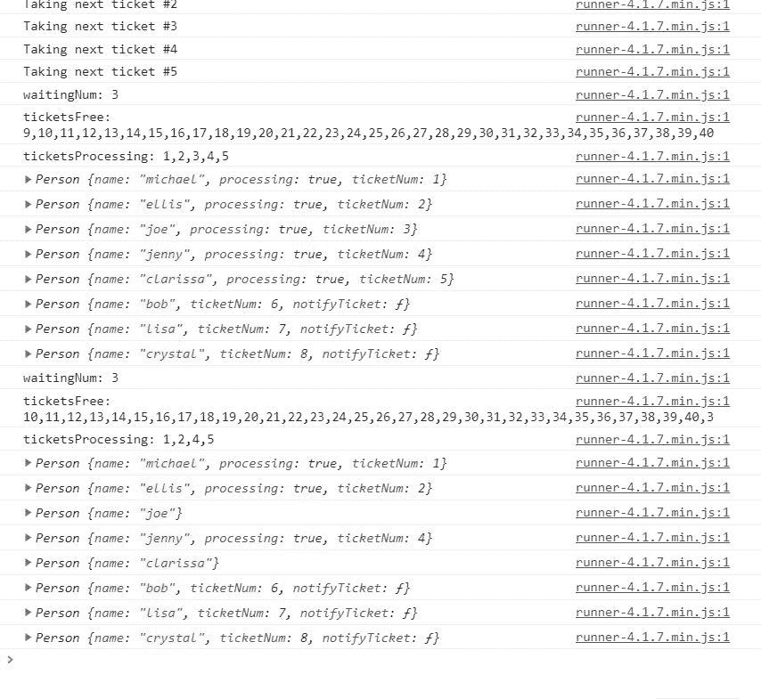

# JavaScript 中观察者模式的威力

> 原文：<https://betterprogramming.pub/the-observer-pattern-in-javascript-4f4e0b908d5e>

## 建立一个车管所售票系统


*照片由阿迪·戈尔茨坦在 Unsplash 上拍摄*

在本帖中，我们将回顾观察者模式，并用 JavaScript 实现它，这样，希望你能更好地理解它，尤其是如果你在理解这个概念上有困难的话。

观察者模式仍然是设计解耦系统的最佳实践之一，应该是任何 JavaScript 开发人员的重要工具。

观察者模式是一种设计模式，在这种模式中，主体(仅仅是带有方法的*对象*)维护一个观察者列表，这些观察者已经*注册*以获得即将到来的消息的通知。

当他们收到关于他们所关注主题的通知事件时，他们可以利用这些机会做一些有用的事情，这取决于从他们那里收到了什么。

当您需要多个对象在最近状态变化的同时得到通知时，该模式非常有用。因此，当您需要多个对象来维护整个应用程序的一致性时，这种模式的威力就显现出来了，而不是使用紧密耦合的类。

也就是说，甚至有可能让几个彼此不直接相关的对象同时保持一致。

观察器可以在被附加后移除自己，因此甚至可以灵活地选择一个观察器和下一个观察器的进出，反之亦然。

当您将所有这些功能组合在一起时，您就可以在主体和观察者之间建立动态关系，从而构成健壮的功能。

# 这个概念

当观察者关注对象的状态并希望选择加入观察即将到来的状态更新时，他们可以注册或连接到它们以接收即将到来的信息。

然后，当发生变化时，这些观察者将能够得到通知，包括之后的更新。这是在主体使用广播方法向其附属的观察者发送通知消息时完成的。

这些通知消息中的每一个都可以包含对接收它们的一个或多个观察者有用的数据。通知消息被发送的方式通常调用一个`notify`方法来遍历它的观察器列表，在每个循环中，它将调用一个观察器的`update`方法。

当观察者不再希望与主体相关联时，他们可以被分离。

下面是一个简短而精确的表格，其中列出了构成这种模式的所有常见参与者:

现在，让我们来看看这在代码中会是什么样子。

我们要做的第一件事是开始创建 subject，它将拥有一个管理其观察者的接口。为此，我们实际上要在一个名为`ObserversList`的独立函数上定义构造函数:

然后我们将这个接口直接附加到一个主题的属性上:

```
function Subject() {
  this.observers = new ObserversList()
}
```

我们可以直接在 subject 上定义原型方法，但我们没有这样做的原因是因为 subject 通常是真实用例中的任意实例，只需要继承 observer 接口，然后可能扩展其功能或围绕它们创建包装器。

现在，我们将继续定义`Observer`:

```
function Observer() {
  this.update = function() {}
}
```

当不同的对象继承了`Observer`时，通常会发生的是它们覆盖了对它们所寻找的数据感兴趣的`update`(或更新器)函数。

这是因为，当主体调用它的`notifyAll`方法时，观察者的更新函数会在每个循环中使用。

您可以在实践中看到这一点:

# 真实世界的例子

现在让我们来看一个真实世界的例子。

假设我们正在`Alhambra`位置操作 [DMV](https://www.dmv.ca.gov/) 。我们将使用观察者模式实现票务呼叫系统。

在车管所典型的售票系统中，当人们被放入等候名单时，通常会得到一个票号，他们会一直等到自己的号码被叫到。

就在他们拿到票号之前，车管所会检查是否已经有空位，然后再交给他们。如果没有空位，他们就会被安排到等候名单上，并有指定的票号。

当一个人完成了他们在展台的会议，让我们假装他们完成了一天的工作。这是指他们的机票号码不再使用，以后可以再次使用。

在我们的示例中，我们将把票号标记为立即可用，以分配给将被放入等待列表的其他人。

我们需要做的第一件事是定义`DMV`构造函数:

在我们的例子中，`DMV`是`subject`，因为它将管理一个人员和票号列表。

我们设置了一个`maxTicketsToProcess`参数，因为没有它，等待列表将总是空的，因为我们没有办法知道何时将一个人放入等待列表是合适的。

当到达`maxTicketsToProcess`时，如果在`this.ticketsFree`还有票，我们将开始把人们放入有票号的等候名单中。

现在，当我们看一下`DMV`构造函数时，它给`this.waitingList`分配了一个`WaitingList`实例。这个`WaitingList`基本上就是`ObserversList`，因为它提供了一个几乎相同的界面来管理它的人员列表:

`broadcastNext`相当于`ObserversList`示例中的`notifyAll`方法。然而，我们没有调用`.update`，而是调用了在`person`实例上定义的`.notifyTicket`(稍后我们会看到)。

我们提供了一个`accept`回调函数作为第二个参数，因为这将模拟现实生活中的场景，当一个人看着他们的票号，意识到分配给他们的号码正在被调用，并走向他们的摊位。

让我们定义一个`Person`构造函数来为每个人实例化:

```
function Person(name) {
  this.name = name
}
```

您可能已经意识到我们在这里使用的方法`notifyTicket`丢失了:

```
person.notifyTicket(ticketNum, function accept() {
```

这很好，因为我们不想把等待列表的界面和通用的`People`界面混在一起。

因此，我们将创建一个`WaitingListPerson`构造函数，它将包含自己的接口，专门用于等候名单上的人，因为我们知道，当这个人被带走后，这些功能将没有任何用处。所以，我们让事情变得有条理和简单。

我们将通过一个名为`extend`的实用程序来扩展`Person`的实例:

```
function extend(target, extensions) {
  for (let ext in extensions) {
    target[ext] = extensions[ext]
  }
}
```

下面是`WaitingListPerson`的定义:

太好了！我们要做的最后一件事是最终实现`DMV`的方法，这样它就可以添加/删除人员，管理票号等。

现在我们有一个足够的 DMV 售票系统，由观察者模式支持！

让我们看看它的使用情况:



现在我们已经看到了观察者模式能让你的应用走多远。我们已经利用它建立了一个功能性的车管所票务呼叫系统。给你们自己一点鼓励！

这个帖子到此结束！我希望你发现这是有价值的，并期待在未来更多。

想保持联系吗？订阅我的[简讯](https://app.getresponse.com/site2/javascript-newsletter?u=zpBtw&webforms_id=SM2hz)。