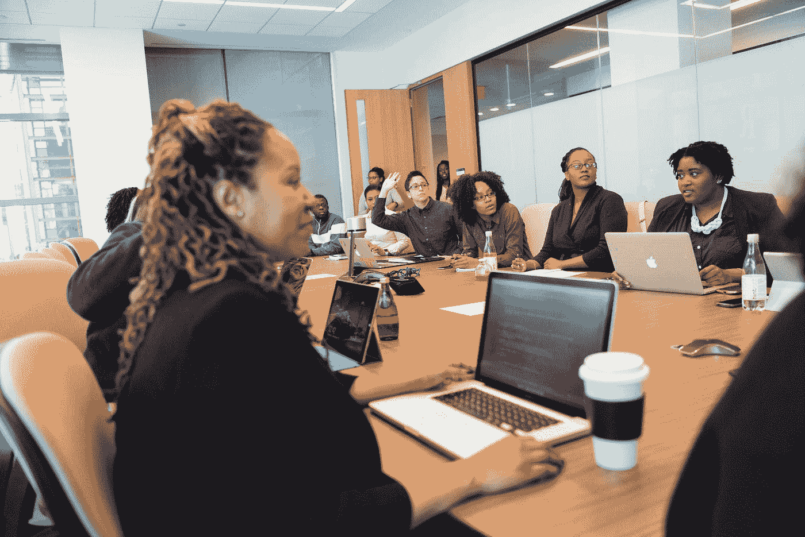

# 奇怪的女人出来了

> 原文：<https://betterprogramming.pub/the-odd-woman-out-working-in-tech-without-a-technical-background-7097d06cc157>

## 在没有技术背景的科技行业工作

克里斯蒂娜@ wocintechchat.com 在 [Unsplash](https://unsplash.com?utm_source=medium&utm_medium=referral) 上的照片[。](https://unsplash.com/@wocintechchat?utm_source=medium&utm_medium=referral)

如果我不会编程，但仍然在技术部门工作，我适合在哪里工作？我觉得自己就像那个被悄悄藏在会议室后面的人——那个最好不要说话的人。有些被容忍但不属于群体的人。

我是一名营销内容创建者，拥有通信学位，碰巧在技术部门工作。

当我们谈论科技领域的女性时，我们谈论的是女性工程师以及我们如何需要更多女性。我完全、绝对、毫无疑问地同意这一点。我们需要 STEM 和攻读 STEM 学位的人。然而，无论你在这个星球的哪个地方，多元化都会积极地影响团队的结果。与来自不同背景的人一起工作会影响你自己的思维，并使你的论点更加尖锐。

我给你举个例子。

# 太多的科技故事仍未被披露

虽然我知道创建新的令人兴奋的东西需要许多行代码，但需要像我这样的人向客户传达创新的信息。客户对 IO 模块的电压范围并不感兴趣。他们想知道如何加速他们的项目，如果 IO 模块能很好地满足他们的需求，他们就会购买它。我的工作是弄清楚电压范围如何影响客户购买特定产品的决定。

想想所有的可能性，新的代码行为其他人的写作、讨论和阅读打开了大门。一起工作为我们打开了一个全新的世界，有许多惊喜和对同一项目的不同看法。我喜欢把事情搞清楚，喜欢听那些对自己领域充满热情的人说话，并从中学习。我的学习塑造了我的思维方式，开阔了我的视野，这对我现在所做的事情是有益的。

以下是我在攻读通信学位时学到的一些东西，它们让我的科技生活变得更美好。

## **问正确的问题**

知道谁可以问什么，什么时候问，如何问对我的日常工作至关重要。我不仅从工程师那里得到了积极的回应，更重要的是，他们觉得有人真的想了解他们每天都在做什么。

## 听，读，然后重复

不仅仅是问问题，更是理解答案。我接受过培训，学习如何检查答案，理解答案，并让答案在故事中发挥作用。任何技术进步都不值得贴上这样的标签，除非它能被许多人分享和理解。

## **了解事物人性的一面**

我从正规教育中学到的很多东西是人类如何反应、回答和得出结论。了解身体语言以及工程师们对他们所创造的产品或服务的真实想法，是我乐于了解的事情。我用我的思维方式提取信息。正是这一点让故事变得有关联。

除了我在市场营销部门工作的经历，科技公司还需要各种非技术性工作，比如律师、出口员工、商业和战略人员、采购专员等等。那么，当我们谈论科技行业的女性时，为什么我们不包括那些不会编程但仍然在科技行业工作的女性呢？

# 为什么非技术背景不是技术领域的劣势

这一切都是为了改变叙事:在技术领域工作不应该与技能挂钩。让我们赋予科技领域的所有女性权利，这样就没有人会觉得自己与众不同。