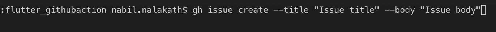
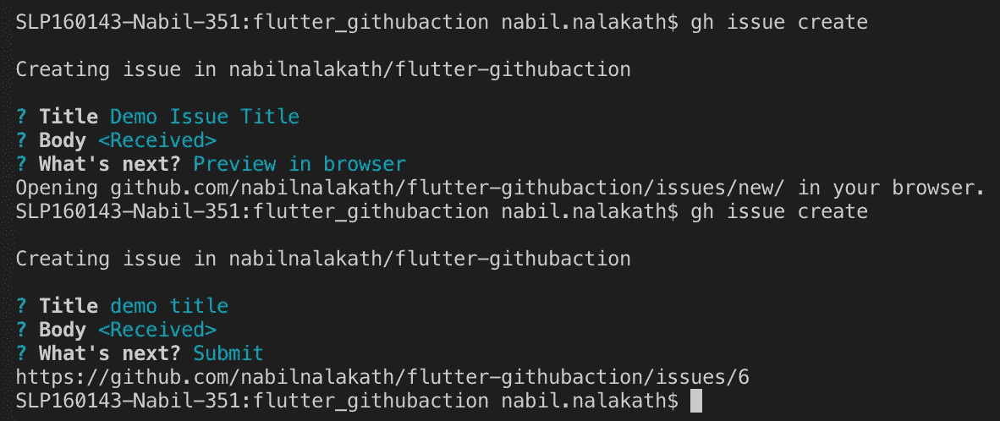
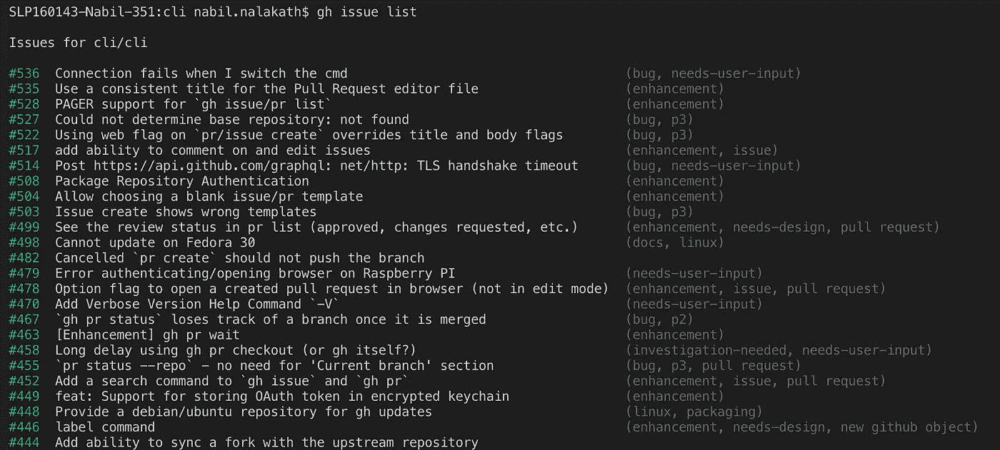
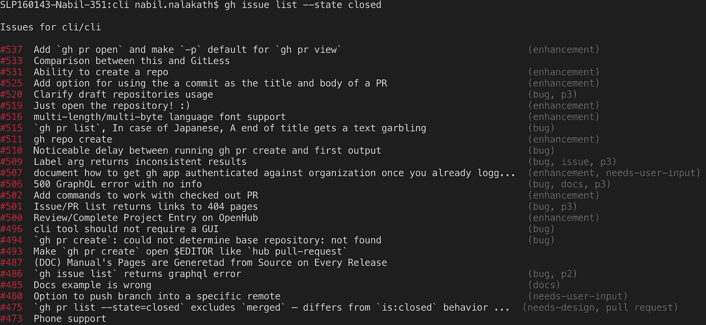
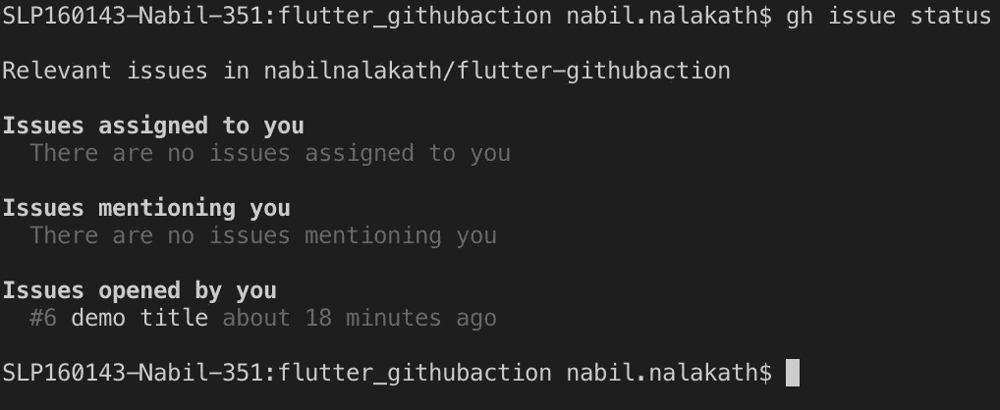
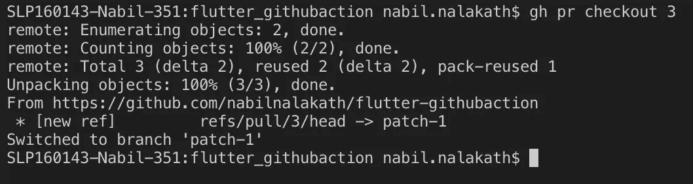
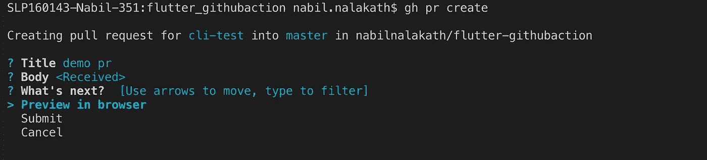
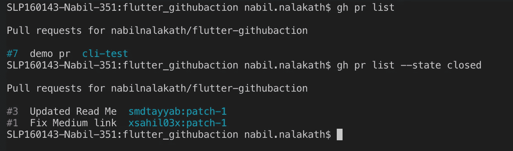
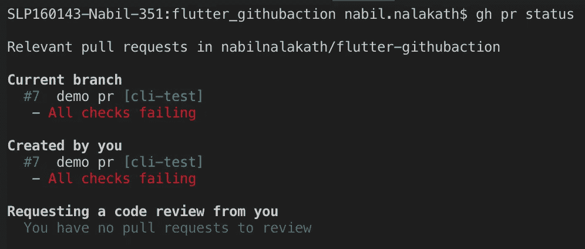
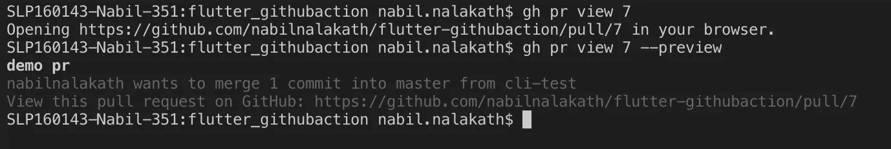

# GitHub 官方 CLI 在这里

> 原文：<https://betterprogramming.pub/the-official-github-cli-is-here-9fb7276e2e15>

## 在短短五分钟内了解最新的官方 GitHub CLI 以及如何使用它


由[布丽娜·布鲁姆](https://unsplash.com/@brina_blum?utm_source=unsplash&utm_medium=referral&utm_content=creditCopyText)在 [Unsplash](https://unsplash.com/s/photos/github?utm_source=unsplash&utm_medium=referral&utm_content=creditCopyText) 拍摄的 BG 图像

GitHub 是世界上最受欢迎的 Git 托管提供商，多年来一直没有官方的 CLI 工具。考虑到 GitHub 本身是开源项目最常用的平台，这是非常令人惊讶的。

但是，作为开源生态系统的一部分的一个优势是，无论有没有官方支持，社区都会在需要的时候建立东西，这正是 GitHub 迄今为止所发生的事情。

Hub 是最流行的非官方 GitHub CLI，被广泛使用。根据他们的官方网站:

> “Hub 是命令行 Git 的扩展，它可以帮助你在不离开终端的情况下完成日常 GitHub 任务。”

我必须说，到目前为止，它很好地完成了它的目的。但是最近，GitHub 一直在快速推出官方工具和产品，他们在这方面做得非常好，这要感谢通过收购微软带来的所有大笔资金和方向。

GitHub 已经有了一个带 GUI 的桌面应用，他们推出官方命令行工具只是时间问题。最后，它发生了，请看官方的 GitHub CLI。

# Github CLI

Github CLI 是该公司“将 Github 引入命令行”的官方尝试，目前处于测试阶段。

是的，它还没有完全准备好，但鉴于开发者和 GitHub 的高度兴趣，我想说它推出测试版只是时间问题。在我们得出更多的结论之前，让我们先来看看这个工具，以及它是如何用于日常任务的。

# 装置

安装非常简单明了。

在 macOS 上，`gh`可通过`brew`获得。

```
brew install github/gh/gh
```

对于 Windows，`gh`通过三种方法可用。一种选择是通过`[scoop](https://scoop.sh/)`使用命令:

```
scoop bucket add github-gh https://github.com/cli/scoop-gh.git
scoop install gh
```

也可以通过 [Chocolately](https://chocolatey.org/) 获得，只需运行:

```
choco install gh
```

最后，如果您需要 MSI 安装程序文件，您可以前往[发布页面](https://github.com/cli/cli/releases/tag/v0.5.7)下载所需的文件。

# 命令

目前，GitHub 已经发布了带有两个主要命令的 CLI 测试版，issues 和 pull requests，因为它们是开源社区中开发人员最常用的功能。

虽然 [hub](https://hub.github.com/) 已经支持更多的命令，但是 hub 表现为 Git 的代理，而`[gh](https://github.com/cli/cli)`是一个独立的工具。

不用说，这是官方的，所以我们可以期待更多的命令，但让我们先看看现有的命令。CLI 中的所有命令都以`gh`开头。

## 问题

`issue`命令用于处理 GitHub 上与问题相关的一切。它有四个子命令`create`、`list`、`status`和`view`。语法是`gh issue <subcommand>`。

让我们来看看这四个命令:

*   `create` —从命令行创建问题非常简单。您可以直接使用带有`title`和`body`标志的命令，如下所示:

```
gh issue create --title "Issue title" --body "Issue body"
```



输入标题和正文

或者在交互式 CLI 中输入详细信息。它还提供了直接提交问题或在浏览器中打开问题链接的选项，供您查看和提交。



从 CLI 提交问题并在浏览器中打开链接

*   `list`—list 命令用于列出存储库中当前存在的问题。命令是`gh issue list` *。*它还具有过滤器，您可以根据条件(如*受让人*、*标签*、*当前状态(打开、关闭))列出您需要的内容。你可以在下面看到这两个例子。*



不使用过滤器获取问题列表



使用状态(已关闭)筛选器获取问题列表

*   `status` —该命令仅显示与当前用户相关的问题的状态。用法就像命令一样简单:`gh issue status`。



获取相关问题的状态

*   `view` —该命令更像是在浏览器中快速打开问题的快捷方式。您只需输入命令，后跟问题编号，即可在浏览器中打开它，例如`gh issue view 6`。

## 一对

`pr`代表拉请求，是 CLI 中第二个可用的主要命令。

它帮助您直接从命令行处理 GitHub pull 请求。它还有四个子命令`create`、`list`、`status`、`view`，以及一个附加的子命令`checkout`、*。*语法是`gh pr <subcommand>`。

*   `checkout` —该命令用于检查来自 Git 的拉取请求。您可以使用拉取请求编号或 URL(如果有的话)进行检查。用法是`gh pr checkout { <number> | <url>}`。它将立即从拉请求中签出到一个新的分支。



公关结帐

*   `create` —顾名思义，它用于从 CLI 创建拉请求。用法是`gh pr create [flags]`。该命令有许多有用的标志，如`title`、`body`、`branch`等。在`pr`中添加细节，并选择想要合并的分支。它还允许使用以下标志输入信息:

```
gh pr create --title "Pull request title" --body "Pull request body" 
```

或者您可以使用交互式 CLI。它还提供了直接提交问题或在浏览器中打开问题链接的选项，供您查看和提交。



从 CLI 创建 pr

*   `list` —该命令列出当前存储库中的拉请求。该命令是`gh pr list` *。*它还具有过滤器，可以添加为标志，基于这些标志，您可以根据条件(如*受让人*、*基本分支、状态(打开、关闭)*等*列出您确切需要的内容。*你可以看到下面两个例子:



在回购中列出拉式请求

*   `status` —状态命令显示所有相关拉取请求的状态。用法是`gh pr status`。它在类别下显示这些信息，*当前分支*、由您创建的*以及向您请求代码审查的*。**

**

*拉式请求状态*

*   *`view` —该命令也是在浏览器中快速打开拉取请求的快捷方式。您只需输入命令，后跟问题编号，即可在浏览器中打开它，例如`gh pr view 6`。您也可以使用`--preview`标志在浏览器中查看快速预览。*

**

# *结论*

*好了，这就是要点，如果你需要更多信息或想阅读详细的文档，请访问[官方页面](https://cli.github.com/)。当它们发布时，我会在文章中添加更多的命令。*