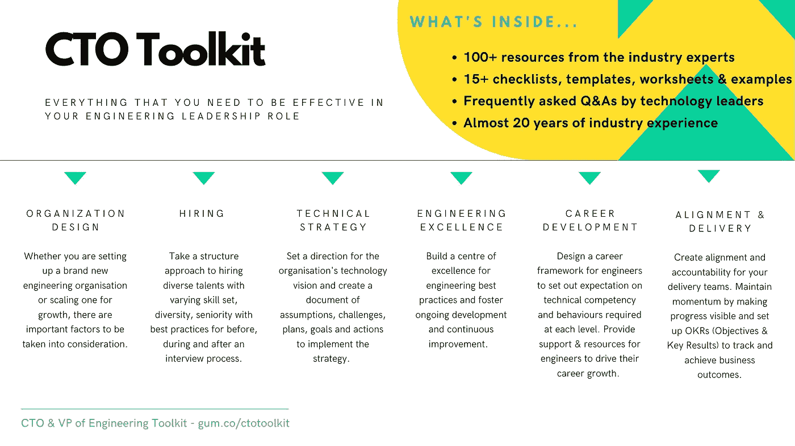

# 杰出工程经理的一项基本技能

> 原文：<https://betterprogramming.pub/the-one-essential-skill-of-an-exceptional-engineering-manager-127bdd1844bd>

## 像 CEO 一样思考和行动

兰迪·法特在 [Unsplash](https://unsplash.com?utm_source=medium&utm_medium=referral) 上的照片。

根据 Evans Data Corporation 进行的[全球开发人员人口统计研究](https://evansdata.com/reports/viewRelease.php?reportID=9)，全球有超过 2200 万开发人员。这一数字预计将在 2022 年升至 2600 万。

所以。很多。开发商。

随着软件变得越来越普遍，软件开发人员占科技公司员工的 70-80 %,越来越需要管理这些软件开发人员的经理。因此，近年来工程经理的数量有所增加。工程经理负责生产软件的交付团队——尤其是开发人员。现在你可能想知道，“成为一名工程经理与其他学科的经理有什么不同？此外，作为一名工程经理，你将如何让自己从其他经理中脱颖而出，成为一名高效的工程经理？”

今天，我想和你们分享一项对工程经理来说最重要但经常被忽视的基本技能。许多人不理解它的重要性。而且，不，这不是公开演讲的技巧。

我花了一段时间为这项技能想出一个合适的标签，但我最终想出了一个让我满意的标签。这项基本技能是像 CEO 一样思考和行动的能力。

由于我曾经经营过自己的软件开发机构，并与人合伙创办了一家科技创业公司，我一直身处软件行业的另一边，亲眼目睹了这一基本技能的重要性。作为一名高级工程经理，我试图将这种技能灌输给为我工作的工程经理。我还认识到，拥有这种技能的工程经理通常更受高管们的重视，他们在职业生涯中的进步速度也比同行快得多。

对于一名工程经理来说，基本的技术技能以及与开发人员交流和理解开发人员的能力是绝对重要的，但如果你拥有这种能够像 CEO 一样思考和行动的基本技能，你就有更好的机会让自己与众不同。

你可能在想，“哦，但我不认为我能发展出这样的技能。我从未担任过 CEO，或者说我个人并不了解 CEO。”你可能会惊讶地发现，成为一名工程经理意味着你已经具备了许多对首席执行官来说很重要的相似特征。所以更多的是对这个技能的理解和磨练。

让我与你分享五种方法，帮助你像 CEO 一样思考和行动——即使你从未做过 CEO。最好的消息是，无论你目前处于职业生涯的哪个阶段，这项技能都是可以转移和有用的。

# 1.了解在你目前的公司，商业成功是如何衡量的

威廉·艾文在 [Unsplash](https://unsplash.com?utm_source=medium&utm_medium=referral) 上拍摄的照片。

如果你认为每个首席执行官最关心的是底线——也就是公司赚多少钱——那你就大错特错了。处于不同成长阶段的公司有不同的关注点和衡量成功的标准。例如，处于起步阶段的初创公司可能会说，他们衡量成功的标准是参与客户的数量。另一方面，一个盈利的上市公司可能会说他们成功的标准是他们的股票价格。一些公司甚至会说他们的成功取决于他们的员工保留率。并非所有衡量公司成功的指标都是财务指标，它们会随着公司的发展和成熟而变化。

所以你需要问自己的问题是，“我知道我现在工作的公司的成功标准是什么吗？”这是你在像 CEO 一样思考和行动之前需要解决的首要问题。

作为一名工程经理，你会认为你通过一个开发团队交付高质量软件的能力对你的公司来说是最重要的，但事实是很可能不是。一个开发团队可能会忙于很多活动——敏捷仪式、结对编程、评估和计划会议、架构设计、编码、测试、重构，等等——团队的工程经理有责任确保这些活动有助于公司取得理想的结果。如果你了解大局，你将会受到高管们的重视。一旦你理解了大局，你就可以为你的团队建立一个 OKR 框架，这样每个人都在最终目标上保持一致。下面是这样的[产品团队系统](https://gum.co/productgoals)，你可以从中获得灵感。

# 2.有效利用数据

由[卢卡斯·布拉塞克](https://unsplash.com/@goumbik?utm_source=medium&utm_medium=referral)在 [Unsplash](https://unsplash.com?utm_source=medium&utm_medium=referral) 上拍摄。

有技术背景的人对数据非常熟悉。作为一名工程经理，你可能在前世是一名开发人员，善于分析，并且理解用数据点支持你的发现和解决方案的重要性。

例如，如果您正在整理一个关于为什么您的团队应该投资于改进应用程序的响应时间的建议，您用数字来思考，获得当前的基线，并在毫秒内提出改进。同样，首席执行官也需要利用数据和数字。无论是关于扩大客户群、赚取更多利润，还是其他任何事情，首席执行官都需要首先获得当前基线，然后决定他们需要实现什么样的改进。

作为一名工程经理，当您的团队交付新功能或从事任何项目时，请思考这与公司的成功指标有何关系，并清楚地传达这一点。我曾经和一位首席执行官聊天，他告诉我，他不明白为什么科技债务如此重要，因为他不明白如果公司不偿还，这对业务意味着什么。他的公司又不会破产，对吧？但如果首席执行官明白这将如何影响关键服务的可用性以及数据点的可移植性，那么他们的技术团队将有更好的机会偿还技术债务。

工程经理不仅需要能够与开发人员交流，还需要能够与业务主管交流。

# 3.学会授权

在 [Unsplash](https://unsplash.com?utm_source=medium&utm_medium=referral) 上由 [You X Ventures](https://unsplash.com/@youxventures?utm_source=medium&utm_medium=referral) 拍摄。

有一种说法是，首席执行官应该致力于他们的业务，而不是在 it 部门工作。这意味着有效地授权，这样首席执行官的时间就不会被其他人可以做的日常运营任务占用。然后，他们可以投入时间，通过计划、战略等为公司实现更好的结果。

在你认为我会建议你停止做工程经理而成为项目经理之前，让我向你保证我不是。如果授权开发人员构建东西是你所喜欢的，无论如何，你要坚持做下去。然而，总有一些事情你可以委托给或者与你团队的开发人员分享(例如，运行一个 sprint 仪式)。

想想看:不是每一个 bug 都要经过你的筛选，不是每一次规划会议都要经过你的主持，也不是每一个技术设计都要经过你的批准。通过学会放手一点，并与团队分享工作和知识，你将不再是瓶颈，你的开发人员将有机会获得额外的技能，从长远来看，一切都将进展得更快，公司的每个人——包括你自己——都将受益。

# 4.痴迷于持续改进

在 [Unsplash](https://unsplash.com?utm_source=medium&utm_medium=referral) 上由 [Franck V.](https://unsplash.com/@franckinjapan?utm_source=medium&utm_medium=referral) 拍摄的照片。

你见过对改善自己和周围人不感兴趣的 CEO 吗？你有没有听过一位首席执行官说，“我们今年已经赚了很多钱……我们不要再赚了”？我也是。首席执行官们不会满足于他们现在拥有的一切。他们有不断变得更好的愿望，并设定远大的目标来实现这些目标，无论是为了他们自己的个人发展还是为了公司的业绩。

虽然有些首席执行官在承担风险和积极实现目标方面比其他人做得更好，但他们都有一个共同的特点:渴望做得更好，不管他们对风险的偏好如何。

工程经理、开发人员和我们许多从事技术工作的人也有这种特征，这就是为什么技术总是在进步，让我们的生活越来越轻松和美好。从智能手机到人工智能和机器学习，过去十年科技行业发展了很多。这都是因为我们在不断改进。你可以把这个特点带到你的日常工作中。当你发现工作方式效率低下、对大局的误解或战略不清晰时，你有责任去改善它。

# 5.带来正能量

[梁杰森](https://unsplash.com/@ninjason?utm_source=medium&utm_medium=referral)在 [Unsplash](https://unsplash.com?utm_source=medium&utm_medium=referral) 上拍照。

每个优秀的 CEO 都知道，他们不仅要对公司负责，还要对员工负责。他们希望从每个人身上得到最好的东西，并希望带来这种积极的能量，为环境定下基调。

当企业经营良好并正在实现其目标时，培养积极的环境很容易，但当企业遇到挫折和失败时，拥有这一特征尤为重要。通过积极的态度和展望，首席执行官能够激励和影响他人追随他们的愿景，并尽最大努力实现宏伟目标。

我以前觉得正能量只有外向的人才能表现出来。然而，我明白了，拥有正能量和外向并不相互包容。有人可以是没有正能量的外向者，也可以是有正能量的内向者。这是要记住的一件重要的事情，因为大多数工程经理都是倾向于内向的开发人员——安静的人，宁愿保持低调。

这篇文章解释了正能量的真正含义，以及你如何将这种能量投射到他人身上。我鼓励你把你的积极能量带到每一个场合，比如单口相声、计划会议、会议、绩效评估、一对一会议，我保证你会开始注意到你产生的影响。

# 像 CEO 一样思考和行动

由 [Siora 摄影](https://unsplash.com/@siora18?utm_source=medium&utm_medium=referral)在 [Unsplash](https://unsplash.com?utm_source=medium&utm_medium=referral) 上拍摄。

我希望我不是第一个告诉你，在你的职业生涯中，只有技术技能是不够的。不要误解我的意思:正如我前面提到的，我相信对于一个负责开发人员的工程经理来说，拥有技术知识的基础是绝对重要的。

但如果你真的想在职业生涯中走得更远、走得更远，你就需要开始像 CEO 一样思考和行动。好消息是，就像生活中的任何技能一样，像 CEO 一样思考和行动的能力可以通过实践来学习。

## 首席技术官工具包——技术领导者的必备工具和资源

首席技术官工具包

如果你想从一个平庸的工程经理变成一个大师级的工程师，看看 [CTO 工具包](https://gum.co/ctotoolkit)。它是由技术领导者为技术领导者设计的，包含面向首席技术官等的基本工具&资源:

*   组织设计
*   雇用
*   技术战略
*   卓越工程
*   职业发展
*   校准和交付

📩[注册](https://eisabainyo.net/weblog/subscribe/)订阅作者的时事通讯，定期获得关于你科技职业的建议和资源。您还将立即收到一个链接和密码，为您的职业发展下载免费赠品。