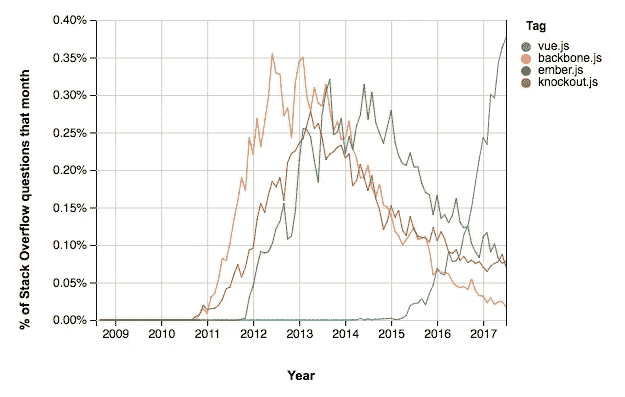

# 改变我生活并使我成为更好的开发者的人/书

> 原文：<https://betterprogramming.pub/the-one-person-book-that-changed-my-life-made-me-a-better-developer-1c34c01844cb>

## 帮助我学习编程基本原理的书

丹尼尔·麦金尼斯在 [Unsplash](https://unsplash.com/) 上的照片

**TL；医生:是艾迪·奥斯马尼。他写了一本名为《学习 JavaScript 设计模式》的书。他让我变得无限优秀，因为我学会了编程的基本原理。框架、API 和语言来来去去。编程原则和设计模式是永恒的。**

# 无限游戏

我最近在纽约看了西蒙·西内克的新书发布会，他的新书名为《无限游戏》。无限游戏的核心概念是为了长寿而玩——要有远见。赢得战争，而不是战斗。有限游戏有一套所有玩家都必须遵守的预先定义的固定规则。在一个无限的游戏中，规则不断变化；玩家来来去去。

成功参与这个无限游戏的五个实践之一是[拥有生存灵活性的能力](https://youtu.be/Xk7MpiP-sFI?t=51)。换句话说，用普遍知识武装自己，这样当规则改变时，当玩家来来去去时，你仍然是游戏中一个可行的玩家。这个概念如何应用于编程？

# 游戏正在改变

现在是 2011 年。我创办了一家流媒体视频公司。当时，我正在权衡使用哪种技术。请注意，库和框架的下一次进化正在这个时候酝酿。像 Backbone、Ember 和 Angular 这样的 JS 框架刚刚出现。jQuery 无处不在。ES6 不存在。Internet Explorer 仍然是一个需要解决的问题。CORS 的规则非常宽松。SASS 开始被更多地使用。Node.js 开始获得有意义的采用。

市场在变化，而且变化很快。很明显，人们对**速度**有着巨大的需求——上市、开发、生产和部署的速度。[最低生存产品(MVP)](https://en.wikipedia.org/wiki/Minimum_viable_product) 成了宗教。

作为一个初创公司的创始人，我也想了解速度，我认为就技术而言，前面提到的玩家是正确的选择。

# 允许发射

简单地说，我被**淹没了，困惑了**。这个行业似乎在分化，而不是融合。W3C 和 ECMA 提出了一些标准，但是这些流行的框架做的事情不同。新的想法不断被引入并突破极限——有时是好的，有时是坏的。

有一天，我偶然发现了这个不起眼的黑白网站。它看起来像这样:

【2011 年的截图。

我读到的第一句话是:

> “看待模式的另一种方式是作为你如何解决问题的模板——可以在相当多的不同情况下使用的模板。” *—艾迪·奥斯马尼*

**售出。**

正是我要找的。我如何构建一个足够可伸缩的应用程序，以便我的代码片段可以解决不同情况下的多个问题？我怎样才能变快？

随着我进一步阅读和了解模式、反模式、结构以及特定和可信的模式，如显示模块、装饰器、外观和观察者，我开始理解到**不存在一种抓到你的技术、库或框架。解决问题的方法不止一种。**

> “……重要的不是您实现的模式的数量，而是您选择如何实现它们。例如，不要仅仅为了使用“一个”而选择一个模式，而是要尝试理解特定模式所提供的优点和缺点，并根据它对您的应用程序的适用性做出判断。” *—阿迪·奥斯马尼*

根据手头的情况，我可以使用多种技术。哇——世界是我的。现在有了普遍的知识、更多的自信、对技术以及何时使用它们有了更好的理解， **Addy Osmani 允许我使用…JavaScript 启动我的创业公司。我感觉到了自由和力量。**

> “你可能不认为程序员是艺术家，但编程是一种极具创造性的职业。这是基于逻辑的创造力。” *—约翰·罗梅洛*

# 速度

我得到了我想要的。*速度*。通过能够重用代码来加快开发速度。通过减少重复的写作和查看我以前的解决方案来加快上市速度。因为现在我的代码更容易阅读，结构更有意义。我的 5000 行文件(！！)被分解成一口大小的碎片。

# 存在的灵活性和长寿

几年后的 2014 年。 [Angular 2 公布后引起轩然大波。](https://www.infoq.com/news/2014/10/angular-2-atscript/)JavaScript 的前景再次发生了变化。一些最常用的框架开始失去吸引力。玩家们都去了。新玩家开始出现了:

*来源:*[*JavaScript 框架的残酷生命周期*](https://stackoverflow.blog/2018/01/11/brutal-lifecycle-javascript-frameworks/)

我开始质疑我们的代码和架构。我们应该积极采用这些新框架吗？许多成功的大公司都在使用它们。这是否意味着我们也应该这样做？

## 更换球员

我意识到现在发生的事情似曾相识。三年前发生在框架和库的一代身上，发生在他们之前的框架和库身上，等等。考虑到 Addy Osmani，我意识到**开发人员只是发现模式和重复出现的问题，寻找做出更好的编程决策的方法，然后在一个叫做框架的东西中发布他们的发现**。不过这一次，它们被称为 React、Vue 等。很快就会出现 Next、Svelte、litHtml 等名字。SCSS，少了。姜戈，拉弗尔。他们都只是想帮助我们，因为他们曾经经历过自己的痛苦。

如果你深入研究这些框架的代码和原则，你会发现它们都在应用设计模式——有些比其他的更突出。[观察者](https://addyosmani.com/resources/essentialjsdesignpatterns/book/#observerpatternjavascript)是一个大的。你还会意识到它们本质上是某人的抽象、观点——用 JavaScript、Python 等“纯”语言编写的。“魔法”显现出来了，我意识到我和我的团队编写的代码原则上符合这样的框架。

## 寿命

我们继续改进应用程序，但由于许多因素，我们无法快速采用新的和新兴的标准，如 ES6。我们的客户大多在企业领域，这意味着他们使用的是旧的浏览器(IE ),采用新技术和设备的速度很慢。我们的代码库一直停留在 ES5 上，直到我在 2018 年末离职。然而，我们的产品仍然在工作。我们的顾客仍然很高兴。我们的开发仍然快速且可扩展。我们仍在开发新功能。

# 新标准，ES6

游戏规则又一次改变了。新的更好的建筑方法现在在那边。这就是人们去的地方。 ES6 于 2015 年问世，建立了新的标准。事实证明，这些新标准中的大部分都是受了之前的框架和库的启发或衍生而来的！

浏览器变了。移动设备变得越来越快。对现代语言特性的支持很快就到来了。然而，基本原则仍然存在。设计模式依然存在。ES6 引入了[类](https://developer.mozilla.org/en-US/docs/Web/JavaScript/Reference/Classes)，这只是原型继承的语法糖。[模块](https://exploringjs.com/es6/ch_modules.html)被引入，这只是对 Addy Osmani 在他的书中描述的模块模式的扩展支持。

# 新热点和无限游戏

现在热门的新事物是**函数式编程**，并且有一些这种范式的支持者将它视为一种信仰。突然之间，其他的都不重要了，所有的都错了。当[引入钩子](https://www.reddit.com/r/reactjs/comments/9suobg/why_the_hate_for_react_hooks/)时，我们看到了这一幕。突然之间，如果你还在使用类，你现在就是非法的了。这是用一个**有限的心态**在一个**无限的游戏**里面玩。

总会有新的热点。这是软件开发行业无限游戏的本质。

> **“没有赢家和输家，只有前面和后面。”西蒙·西内克。**

# 艾迪·奥斯马尼，许多人的导师

艾迪·奥斯马尼赋予我超越潮流、经得起时间考验的知识。由于我对所使用的原则和模式的理解，我可以更快更有效地学习新的语言和语法。他给了我构建应用程序的信心，而不会感到受到某些规则和条例的约束(也就是说，你必须总是这样做)。他给我灌输了一种无限的思维方式，这样当玩家来了又走，趋势来了又走，我能够保持活力，随时准备学习，能够以最小的影响进行重构，并构建经得起时间考验的应用程序。

# 关于导师和独立思考的最终想法

Addy Osmani 是我的导师，他甚至不知道。他和[他的书](https://addyosmani.com/resources/essentialjsdesignpatterns/book/)启发了我，给了我信心和工具。但最重要的是，他给了我独立思考的自由。自由决定如何最好地解决我和我的团队的问题。

独立思考和重新发明轮子有很大的区别。有时，市场上的车轮不符合你的要求，你必须做一个新的，这是绝对没问题的。