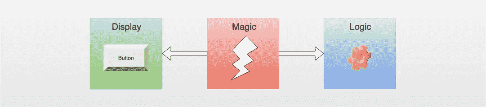
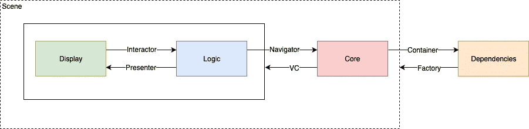
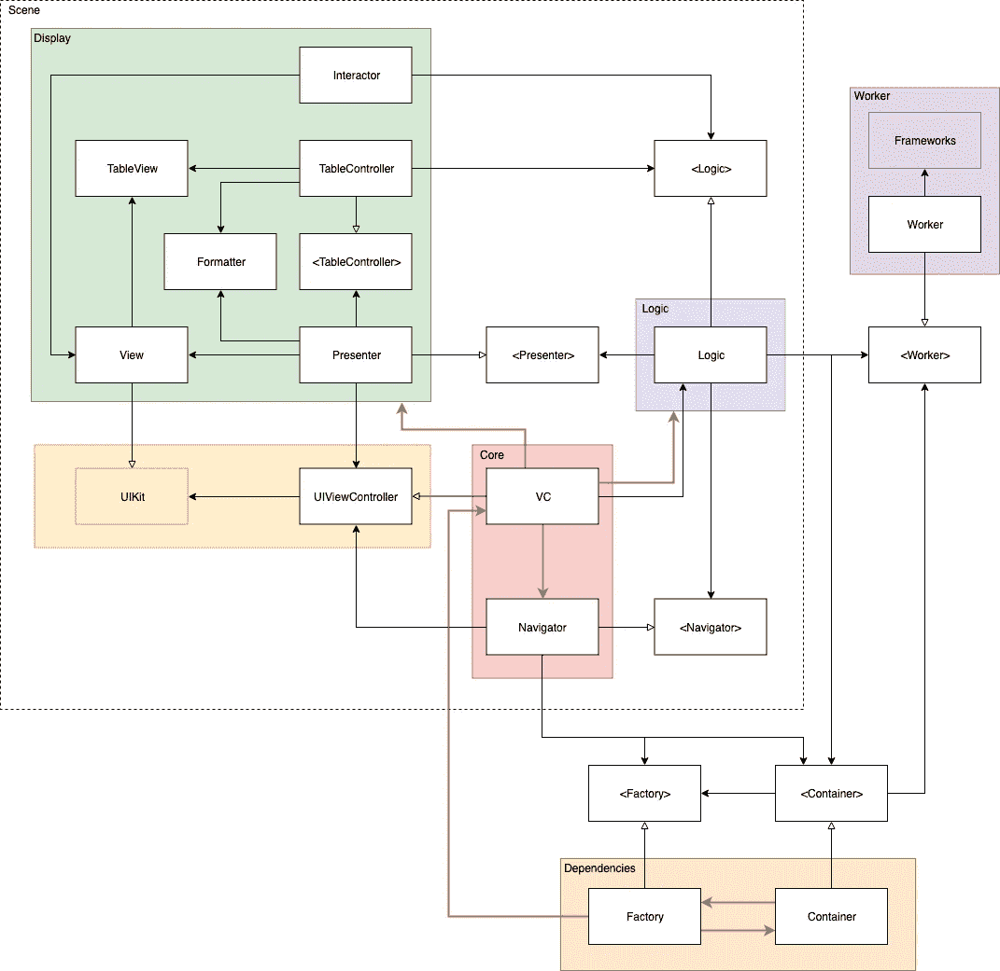

# 完美的 iOS 应用架构

> 原文：<https://betterprogramming.pub/the-perfect-ios-app-architecture-24259417843f>

## 可扩展 iOS 应用架构的组成部分

## MVVM，干净的雨燕，毒蛇？—自己发明就好！

任何已经实现了一些 iOS 应用的人都会偶然发现**大规模视图控制器** (MVC)问题，并且在某个时候肯定会问:

> iOS 应用的完美架构是什么？

警告:这是一个**陷阱**和一个非常深的洞！😜

当然，没有什么是“完美的”，当然也没有“完美的”架构，甚至没有“一个”完美的架构。见鬼，我们根本不是在谈论“建筑”！🤨

在他的 YouTube 视频“ [Clean iOS Architecture](https://youtu.be/qzTeyxIW_ow) ”、[卡伊奥·祖洛](https://medium.com/u/27b1c64c3b48?source=post_page-----24259417843f--------------------------------)非常清楚地解释了“软件架构”MVVM、VIPER、Clean Swift 等。并不是真正的架构，而是**设计模式**。

所以，即使不正确，我们还是坚持通常的术语“架构”。他们中哪一个现在是最好的？

当然，永远是自己的！😁

如果你自己开发一个单屏幕的业余爱好应用，你通常需要一个不同的架构，而不是一个分散的 10 人团队开发一个价值 100 万美元的应用。

> 架构必须适合团队和项目！

在他的讲座“[失落的系统设计艺术](https://youtu.be/ujOc3a7Hav0)”中， [John Sundell](https://medium.com/u/5486d7313999?source=post_page-----24259417843f--------------------------------) 鼓励你开发适合你自己的团队和项目的架构。

这正是我所做的，现在我想分享我在我的“[可扩展的 iOS 应用架构](https://medium.com/@sven.korset/pieces-of-a-scalable-ios-app-architecture-7c182f9dcd2c)”系列博文中所学到的东西。我希望有一些开发人员会发现这很有趣，并能为他们自己的项目带来一些灵感。

当然，我总是努力提高自己和我的架构，并期待适当的建设性批评。🤗

# 建筑的目标

架构通常应该:

*   修复大规模视图控制器问题
*   提高可测试性
*   提高可维护性
*   随团队规模扩展

解决方案其实很简单:**模块化😎**

> 模块化意味着将程序的功能分成独立的、可互换的单元，每个单元只负责程序的一个方面。

比如在 Swift 中，你可以把代码外包到框架中，比如一个服务器模块，它只负责和一个服务器通信。在应用程序中，不再执行服务器请求，而是仅通过服务器模块。这个服务器模块可以与应用程序的其余部分分开替换、重写和测试。

但是，您不必将所有事情都外包到框架中。如果您编写只负责一个方面并通过协议引用的专用类，这通常就足够了。同样，代码是捆绑在一起的，只做一件事，而且由于协议的原因，可以很容易地被替换。

通过划分成模块，通常可以快速解决大规模视图控制器的问题，因为实际上不属于视图控制器的代码被外包到模块中。然后 ViewController 会自动收缩。😉

互换性增加了可测试性，因为它使得模拟依赖性和分别测试模块变得容易。如果团队中的每个成员都只在他们独立的代码模块上工作，而这些模块也有一个高度标准化的接口，那么合并冲突应该是非常罕见的，所以它与团队的规模成比例。

所有常见的架构通常都是基于模块化的。特殊的类，如控制器、模型或工人，无论你怎么称呼它们，都是分开的代码，通过协议变得更易测试。具体如何分离由各自的设计模式决定。

已建立的体系结构已经解决了列出的问题。因此，使用一个已建立的架构并没有错。Bohdan Orlov 在他的文章“ [iOS 架构模式](https://medium.com/ios-os-x-development/ios-architecture-patterns-ecba4c38de52)”中提供了对现有架构的深刻见解。如果你喜欢更复杂的，你可以看看[优步的排骨](https://github.com/uber/RIBs/wiki)。🧐

就个人而言，我并不特别喜欢现有架构的某些方面。

MVVM 的结合非常有趣，但分离还不够。

使用 Clean Swift，我发现单向数据流很好，但大多数时候 presenter 会萎缩，因为它通常除了传递数据之外什么也不做。

VIPER 仍然是我的最爱之一，显然不仅仅是我，但所有事情真的都要经过演示者吗？

优步的排骨对我来说太复杂了。😑

# 我的方法

当然，我的方法深受流行架构的启发。目标是一个架构，在每个项目由两到五个 iOS 开发人员组成的分散团队中运行良好，并且易于理解。

可伸缩性、可维护性和可测试性是重要的方面。必须应用可靠的原则，尤其是视图和逻辑必须分离，视图控制器应该什么都不做，依赖关系应该通过依赖注入(DI)来解决。

以下是一个粗略的概述:

架构概述

在*显示*中的用户交互通过*交互器*传送到*逻辑*。*逻辑*然后通过其业务逻辑评估这些事件，可能改变内部状态并通过*呈现器*将数据传输回*显示器*。

如果*逻辑*决定切换到另一个*场景*，那么这通过*内核*中的*导航器*来完成。*核心*引用*容器*和*依赖*，包括一个*工厂*。然后*工厂*创建新的*依赖*，比如*场景*，其中*依赖*被注入。

新的*场景*然后有了自己的*核心*，因此有了*视图控制器* (VC)，这又创建了相关的*显示*和*逻辑*。

这个架构的核心概括起来就是 ***场景*** 由一个 ***显示器*** 、一个 ***逻辑*** 和一个 ***核心*** 组成。很简单，嗯？这并不比*模型-视图-控制器*架构更复杂。😉

# 大局

为了更好地了解情况，下面是依赖关系图:

依赖图

到处都是箭！当然，那很简单！🤪

红色箭头表示直接依赖，因为具体的类是实例化的。例如， *VC* 创建所有主要的*显示*类和*工厂*具体的*视图控制器*。

由于方法调用，带有实心箭头的黑色箭头是依赖项。通常，方法是通过接口调用的，接口由名称中的尖括号标识。例如，*逻辑*只知道*呈现者*的接口，而不知道具体的*呈现者*类，因此只调用*呈现者*的接口的方法。

带白色尖端的黑色箭头表示接口的继承或实现。例如，*显示*模块中的具体 *Presenter* 类实现了 *Presenter* 接口，而 *VC* 当然继承自 *UIViewController* 。

一个*场景*代表一个应用视图，即一个*视图*，包括 *ViewController* 以及与之相关的一切。一个*场景* =一个 app 屏幕。

在项目结构中，这通过将所有*场景*代码放入其自己的文件夹中来反映，以便相关联的代码不是分布式的而是彼此靠近的。如果两个开发者在不同的场景中工作，他们很少会互相妨碍。

如图所示，*核心*模块包含 *VC* 和*导航器。*导航员负责过渡到其他*场景*。

*显示*模块捆绑了*视图*以及*展示者*和*互动者*，因为它们都与*视图*交织在一起。任何格式器、 *TableViewController* 等也是*显示*的一部分。

*逻辑*包含整个业务逻辑，以及当前场景状态。此外，*逻辑*可以寻址任何*工作者*。*worker*是独立的外包逻辑单元，比如一个服务器请求框架。

*依赖*包括*依赖容器*。还有一个*工厂*，用于创建新的*依赖*，比如新的*场景*或者子依赖。

一切正常吗？🤓

# 各个演员的细节

参与者最好通过具体的实现来展示。所以我会建议平行看一下 [DemoApp 项目](https://github.com/indieSoftware/DemoArchitecture) (DAP)。

在 DAP 中，我们看下面一个具体的*场景*名为“场景 1”。*场景*可以在“DemoApp/Scenes/Act1/Scene1”下的项目中找到。

## **VC**

***场景 1VC*** 在*核心*中。它的任务是提供一个 *UIViewController* 的所有接口，例如在必要时实现`viewWillAppear` 。`loadView`在这里被覆盖以创建它自己的*场景 1 视图*。

一个 *ViewController* 代表一个*场景*的根对象，因此它也负责创建*场景*的其他组件，例如*呈现器*、*逻辑*、*导航器*、任何*表格控制器*等。这通常在`init`方法或`loadView`中完成。

不过一个 *VC* 应该不会做多。任何超出 UIKit 接口实现的东西都不再属于 *VC* 了。因此，如果你在没有`override`关键字的情况下在 *VC* 中编写方法，你可能是在错误的类中。因此没有场景转换，没有视图的数据输入，当然也没有业务逻辑。

对一个 *VC* 唯一有用的测试是端到端测试，这可以通过*单元测试*来完成。

## **导航仪**

*内核*中的 ***场景导航器*** 实现 ***场景导航器接口*** 协议。一个*导航器*负责过渡到其他*场景*，否则通常在*视图控制器*中完成。

*导航器*需要引用*场景*的 *UIViewController* 。它还需要知道一个 *UINavigationController* 是否正在被使用，下一个*场景*是否以模态方式呈现，或者如何定义结构设计。

*工厂*可以通过*act1d 接口*中的*依赖关系*访问。它创建了所需*场景*的 *UIViewController* 以便*导航器*不直接依赖于*场景*而只关心一个 *ViewController* 的呈现。

更多信息可以在我的文章《iOS 中场景过渡的[小导航仪](https://medium.com/@sven.korset/small-navigators-for-scene-transitions-in-ios-9645392e800a)》中找到。

## **逻辑**

***场景 1 逻辑*** 实现 ***场景 1 逻辑接口*** 协议。该界面列出了所有用例，可能是用户发起的动作，如`searchForText`，也可能是系统发起的动作，如`displayRotated`。*逻辑*最终实现相关的业务逻辑，其他的一切都外包给 workers 或子类。

为了保存*逻辑*的当前状态，使用 ***场景 1 逻辑状态*** 中的 ***逻辑状态*** 结构。初始状态通常在*逻辑*初始化时设置。这些值由一个*设置模型*参数提供。

*逻辑*需要访问*呈现器*以将任何状态变化传达给*视图*。它还需要访问*导航器*来改变*场景*。这些通过 DI 用*逻辑*自己的*log in dependencies*struct 赋值，并且只被它们的接口引用。

通过将所有专门的代码提取到 workers 中，*逻辑*应该相对较轻，只留下状态操作、比较和委托。更少的代码意味着更少的东西会被破坏。当然，*逻辑*实际上是在乞求单元和集成测试。😆

关于*逻辑*和其他*显示*部分的更多信息，请阅读我的文章《[在 iOS](https://medium.com/@sven.korset/decoupling-display-and-logic-in-ios-4de5a334ffbd) 中解耦显示和逻辑》。

## **视图**

*显示*中的 ***场景 1 视图*** 代表一个 *UIView* 的具体子类。它的任务是创建视图层次结构，也就是说放置子视图，提供约束并定义它们的默认样式。

*视图*没有进一步的逻辑，所以它不知道数据的格式或任何应用程序状态。*视图*的唯一逻辑是视图层次操作，例如添加和删除子视图，例如对于嵌入式子控制器，或者可能在激活和停用子视图时。

模仿一个视图是没有意义的，所以没有*视图*的接口协议。*视图*可以通过快照测试进行单元测试，或者通过*单元测试*进行测试。

## **交互器**

*显示*中的 ***场景 1 交互*** 也没有接口协议。它也不需要一个，因为只有 *VC* 知道它，并且只因为它创建了*交互器*，然后它将自己钩入*视图*和*逻辑*。

*交互器*的任务是在*视图*和*逻辑*之间创建一个绑定，就像 MVVM 架构一样。因此，任何用户输入都被映射到*逻辑*的用例方法。这里 Rx 似乎很合适，但这不是强制性的。

就像*视图*一样，这段代码将来也有可能被 *SwiftUI* 和*组合*所取代。🤗

## **主持人**

*显示屏*中的 ***场景 1 呈现者*** 实现相关的 ***场景 1 呈现者界面*** 协议。*演示器*是*交互器*的对应部分，因为*演示器*允许从*逻辑*到*视图*的流程，而不是从*视图*到*逻辑*的流程。*逻辑*和*视图*彼此完全分离，由于分成类似 Clean Swift 架构的*表示器*和*交互器*，数据流是单向的。

*展示者*的任务是操纵*视图*，以便显示传递的数据并应用任何样式。*演示者*可以使用格式化程序来准备数据。视图或子视图中的数据由*演示器*直接设置。*视图*不需要知道任何关于数据的事情，*逻辑*不知道任何关于*视图的事情。*那是*主持人*的地盘。

并非所有数据都要分配给*视图*。有些可能也是为*视图控制器*准备的，例如*导航栏*的标题。为此，*演示者*也需要引用*场景*的 *UIViewController* 。

*演示者*还必须能够访问任何*表格视图控制器*，以便能够更新子视图，例如*表格视图*或*集合视图*。

除了任何格式化之外，*呈现器*的唯一逻辑是将数据放在*视图*中的正确位置，并且可能根据状态变化来设计任何子视图的样式。然而，有时*演示者*也负责应用一些动画，这会变得相当复杂。

作为*显示*的一部分，并与*视图*紧密相连，测试*展示者*的最佳方式是通过*单元测试*或通过快照测试部分通过单元测试视图。

## 属国

将***act1 依赖*** 与***act1 依赖接口*** 放在一个父组中。不是单个*场景*的一部分，但更像是一个戏剧动作，*动作*代表一个应用程序状态的几个*场景*，例如在几个视图上的预登录或登录。

与 ***Act1DC*** 类似的*dependency container*(DC)的任务是捆绑并保存各个 *Act* 的所有依赖关系，以便可以通过 DI 轻松分配给*场景*的演员。

一个特殊的依赖是*工厂*像**工厂*act1*工厂**。一旦用户对象存在，它就负责创建新的依赖关系，例如 *Act2DC* 。*工厂*也为*导航器*创建了新的*视图控制器*和*场景*。

所有的*场景*都通过 *DC* 相互解耦，因此没有*场景*需要了解另一个场景的任何事情，至少不需要直接了解。一个*逻辑*当然必须很好地知道导航到哪里，而*导航器*必须确切地知道如何导航，但这是通过抽象来实现的，这要感谢 *DC* 。

*行为*本身不被测试，但是它们对于测试其他部分是必不可少的。通过准备特殊的测试动作，其他依赖项可以被模仿并注入测试目的。

## 工人

一旦你可以将功能从应用中分离出来，你就应该这样做，并为它编写你自己的 ***Worker*** 。*工作器*因此是从*逻辑*或*视图控制器*中提取出来的代码，这些代码至少在理论上可以用于其他*场景*。因此，工人不是特殊场景的一部分。

因此，不是直接绑定到特定*场景*的用例的每一个逻辑都应该放入自己的 *Worker* 类中。

应用程序应该执行服务器请求吗？那么只需要一个新的工作者来处理服务器请求！缓存？自己的工人！数据库？新工人！用户输入的复杂验证？工人！😊

*Workers* 是包含逻辑代码的专门助手，只负责一个方面。因此，每个*工作人员*都要经过大量的单元测试。

模块化的力量来自于将代码外包给*工人*。没有*的工人*，巨大的班级规模问题只会转移到其他部分，就像 MVVM 建筑中的*视图模型*。所以，这里的关键是将所有代码分成更小的模块，意味着*工人*。

## 结论

提出的方法应该作为通用架构的替代方案，或者作为自己架构的灵感。

我希望，通过这篇文章，我能够展示如何将代码模块化成 ***【显示】******逻辑*** 和 ***核心*** 导致一个具有*场景的简单结构。 ***工人*** 帮助分解大量代码。更详细的解释请阅读我的文章《[iOS 中的显示与逻辑](https://medium.com/@sven.korset/decoupling-display-and-logic-in-ios-4de5a334ffbd)解耦》。*

*关于项目结构的更多信息，请阅读我的文章“[一个可扩展的 iOS 项目的例子](https://medium.com/@sven.korset/an-example-of-a-scalable-ios-project-dce56a256106)”。在那篇文章中，我还提供了一些最佳实践来帮助进一步提高项目的可维护性。*

*对了，我还缺少一个合理的名字给这个**D**isplay-**L**logic-**C**ore-architecture。任何听起来不像 **D** 拥有 **L** 可装载 **C** 内容或 **L** 液体 **C** 晶体 **D** 显示的建议？😂*