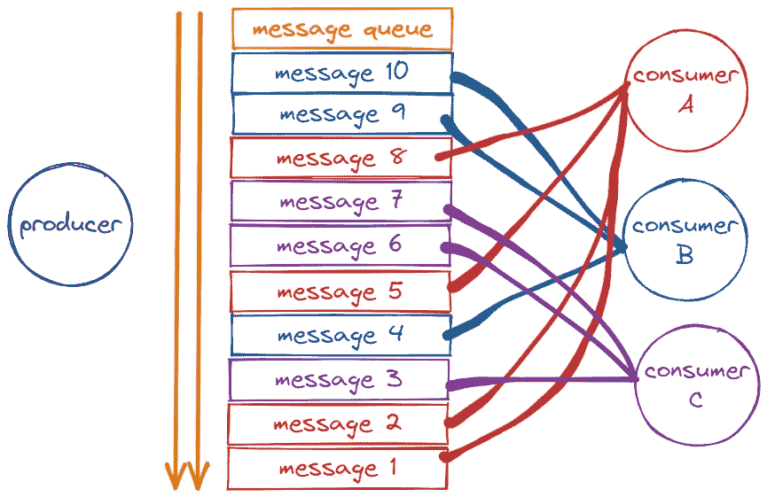

# 基于 Redis 流类型的完美消息队列解决方案

> 原文：<https://betterprogramming.pub/the-perfect-message-queue-solution-based-on-the-redis-stream-type-ccf273554178>

## 轻松构建自己的系统


弗雷迪·卡斯特罗在 [Unsplash](https://unsplash.com?utm_source=medium&utm_medium=referral) 上拍摄的照片

Redis 5.0 带来了流类型。从字面上看，它是一个流类型，但实际上，从功能的角度来看，它应该是 Redis 对于消息队列(MQ，Message Queue)的完美实现。

任何使用 Redis 作为消息队列的人都知道，基于 Reids 的消息队列有许多实现，例如:

*   发布/订阅、订阅/发布模型。
*   基于列表的 LPUSH+BRPOP 的实现。
*   基于有序集的实现。

每个实现都有典型的特征和问题。

Redis 5.0 中发布的流类型也用于实现典型的消息队列。流类型的出现几乎满足了消息队列的所有内容，包括但不限于:

*   消息 ID 的序列化生成。
*   消息遍历。
*   消息的阻塞和非阻塞读取。
*   消息的数据包消耗。
*   处理未完成的消息。
*   消息队列监控。

消息队列有生产者和消费者。让我们体验一下流类型的美妙。

# **生产新闻**

`XADD`命令用于将消息追加到流(流数据)中，如下所示:

```
127.0.0.1:6379> XADD memberMessage * user reggie msg Hello
"1553439850328-0"
127.0.0.1:6379> XADD memberMessage * user dwen msg World
"1553439858868-0"
```

语法格式为:

```
XADD key ID field string [field string ...]
```

您需要提供`key`、消息`ID`方案和消息内容，其中消息内容为`key-value`数据。

*   `ID`，最常用的`*`，表示消息 ID 由 Redis 生成，这也是强烈推荐的方案。
*   `field string`【字段字符串】，是当前消息的内容，由一个或多个键值组成。

在上面的例子中，消息 user `reggie` msg `Hello`被添加到键`memberMessage`中。

Redis 使用毫秒时间戳和序列号生成消息 id。此时，消息队列中有一条消息可用。

# **消费信息**

`XREAD`，从流中读取消息，演示如下:

```
127.0.0.1:6379> XREAD streams memberMessage 0
1) 1) "memberMessage"
   2) 1) 1) "1553439850328-0"
         2) 1) "user"
            2) "reggie"
            3) "msg"
            4) "Hello"
      2) 1) "1553439858868-0"
         2) 1) "user"
            2) "dwen"
            3) "msg"
            4) "World"
```

上面的命令是从消息队列`memberMessage`中读取所有消息。

`XREAD`支持许多参数，语法格式为:

```
XREAD [COUNT count] [BLOCK milliseconds] STREAMS key [key ...] ID [ID ...]
```

*   `COUNT count`用于限制获取的消息数量。
*   `BLOCK milliseconds`用于设置`XREAD`为阻塞模式，默认为非阻塞模式。
*   `ID`用于设置从哪个消息 ID 开始读取。使用`0`从第一条消息开始。本例中使用了`0`，这里需要注意的是，消息队列 ID 是单调递增的，所以通过设置起点，可以向后读取。在阻塞模式下，`$`可以用来表示最新的消息 ID。`$`在非阻塞模式下没有意义。
*   `XREAD`读取消息时分为阻止和非阻止模式。BLOCK 选项可用于指示阻塞模式，并且需要设置阻塞持续时间。在非阻塞模式下，它在读取后立即返回(即使没有消息)，而在阻塞模式下，如果没有内容可以读取，它将阻塞并等待。

典型的阻塞模式用法是:

```
127.0.0.1:6379> XREAD block 1000 streams memberMessage $
(nil)
(1.07s)
```

我们使用阻塞模式，用`$`作为`ID`，读取最新的消息，如果没有消息，命令将阻塞。在等待过程中，其他客户端将消息添加到队列中，这些消息将被立即读取。

因此，典型的队列是用`XREAD`块完成的`XADD`。`XADD`负责生成消息，`XREAD`负责消费消息。

# **消息 ID 描述**

`XADD`生成的`1553439850328–0`是 Redis 生成的消息 ID，由两部分组成:时间戳-序列号。

时间戳以毫秒为单位，是生成消息的 Redis 服务器的时间。它是一个 64 位整数(int64)。

序列号是该毫秒时间点的报文的序列号，也是 64 位整数。说真的，序列号可能会溢出，但真的可能吗？

序列号的增量可以通过多批次处理来验证:

```
127.0.0.1:6379> MULTI
OK
127.0.0.1:6379> XADD memberMessage * msg one
QUEUED
127.0.0.1:6379> XADD memberMessage * msg two
QUEUED
127.0.0.1:6379> XADD memberMessage * msg three
QUEUED
127.0.0.1:6379> XADD memberMessage * msg four
QUEUED
127.0.0.1:6379> XADD memberMessage * msg five
QUEUED
127.0.0.1:6379> EXEC
1) "1553441006884-0"
2) "1553441006884-1"
3) "1553441006884-2"
4) "1553441006884-3"
5) "1553441006884-4"
```

由于 Redis 命令的执行速度非常快，因此可以看出，在相同的时间戳内，消息由递增的序列号表示。

为了确保消息有序，Redis 生成的 id 按顺序单调递增。由于 id 包含时间戳部分，为了避免服务器时间错误导致的问题(比如服务器时间延迟)，Redis 的每个流类型数据都维护了一个`latest_generated_id`属性，用来记录最后一条消息的 ID。

如果发现当前时间戳是后向的(小于`latest_generated_id`记录的)，则采用时间戳不变，序列号递增的方案作为新的消息 ID(这也是序列号使用 int64 的原因，以保证有足够的序列号)，从而保证 ID 的单调递增性质。

强烈建议使用 Redis 方案来生成消息 ID，因为这种时间戳+序列号的单调递增的 ID 方案几乎可以满足您的所有需求。

但同时要记住，id 是可定制的，别忘了！

# **消费群体模型**

当多个消费者同时消费一个消息队列时，可以重复消费同一条消息，即消息队列中有十条消息，三个消费者都可以消费这十条消息。

但有时，我们需要多个消费者合作消费同一个消息队列，即消息队列中有十条消息，三个消费者分别消费其中的一部分。

例如，消费者 A 消费消息`1,2,5,8`，消费者 B 消费消息`4,9,10`，消费者 C 消费消息`3,6,7`。

即三个消费者合作完成对消息的消费，在消费能力不足，即消息处理程序效率不高的情况下可以使用这种模式。

这种模式就是消费群体模式。如下图所示:



对消费者组模式的支持主要通过两个命令来实现:

*   `XGROUP`，用于管理消费群，提供创建群、销毁群、更新群启动消息 id 等操作。
*   `XREADGROUP`，集团消费消息操作。

对于演示，演示中使用了五条消息。这个想法是创建一个流消息队列，生产者生成五条消息。

在消息队列上创建一个使用者组，该组中有三个使用者使用消息:

```
# Producer generates 5 messages
127.0.0.1:6379> MULTI
127.0.0.1:6379> XADD mq * msg 1
127.0.0.1:6379> XADD mq * msg 2
127.0.0.1:6379> XADD mq * msg 3
127.0.0.1:6379> XADD mq * msg 4
127.0.0.1:6379> XADD mq * msg 5
127.0.0.1:6379> EXEC
 1) "1553585533795-0"
 2) "1553585533795-1"
 3) "1553585533795-2"
 4) "1553585533795-3"
 5) "1553585533795-4"

# Create a consumer group mqGroup
127.0.0.1:6379> XGROUP CREATE mq mqGroup 0 # Create a consumer group mgGroup for message queue mq
OK

# Consumer A, Consumption Article 1
127.0.0.1:6379> XREADGROUP group mqGroup consumerA count 1 streams mq > #Consumer A in the consumer group reads a message from the message queue mq
1) 1) "mq"
   2) 1) 1) "1553585533795-0"
         2) 1) "msg"
            2) "1"
# Consumer A, Consumption Article 2
127.0.0.1:6379> XREADGROUP group mqGroup consumerA COUNT 1 STREAMS mq > 
1) 1) "mq"
   2) 1) 1) "1553585533795-1"
         2) 1) "msg"
            2) "2"
# Consumer B, Consumption Article 3
127.0.0.1:6379> XREADGROUP group mqGroup consumerB COUNT 1 STREAMS mq > 
1) 1) "mq"
   2) 1) 1) "1553585533795-2"
         2) 1) "msg"
            2) "3"
# Consumer A, Consumption Article 4
127.0.0.1:6379> XREADGROUP group mqGroup consumerA count 1 STREAMS mq > 
1) 1) "mq"
   2) 1) 1) "1553585533795-3"
         2) 1) "msg"
            2) "4"
# Consumer C, Consumption Article 5
127.0.0.1:6379> XREADGROUP group mqGroup consumerC COUNT 1 STREAMS mq > 
1) 1) "mq"
   2) 1) 1) "1553585533795-4"
         2) 1) "msg"
            2) "5"
```

上例中，同一组`mqGroup`消费消息中的三个消费者 A、B、C(消费者可以在消费时指定，无需提前创建)时，具有互斥原理。消耗计划是，A- > 1，A- > 2，B- > 3，A- > 4，C- > 5。

`XGROUP create mq mqGroup 0`用于在消息队列`mq`上创建一个消费组`mqGroup`。最后一个参数是`0`，表示该组从第一条消息开始消费。意思和`XREAD`的`0`一致)。

除了支持创建，还支持`SETID`设置起始 ID、`DESTROY`销毁群、`DELCONSUMER`删除群内消费者等操作。

`XREADGROUP group mqGroup consumerA count 1 streams mq >`，用于组 mqGroup 中的 consumerA 在队列`mq`中消费，参数`>`表示组中未消费的开始消息，参数 count 1 表示获取一个。

语法基本和`XREAD`一样，只是增加了组的概念。

组内消费的基本原理是，流类型将为每个组记录一个最后处理(传递)的消息 ID (last_delivered_id)，这样当在组内消费时，您可以从这个值的后面开始读取，以确保没有重复消费。

以上是消费群的基本操作。

此外，当一个消费者群体消费时，还有一个必须考虑的问题，即如果一个消费者消费了一个消息，但没有成功处理它(例如，消费者进程宕机)，则该消息可能会因为该群体中的其他消费者无法再次消费该消息而丢失。

下面继续讨论该解决方案。

# **等待消息列表**

为了解决群内消息读取过程中消费者崩溃导致的消息丢失问题，STREAM 设计了一个 Pending list 来记录已读取但未处理的消息。

命令`XPENDING`用于获取消费者内部的消费者组或消费者的未处理消息。演示如下:

```
127.0.0.1:6379> XPENDING mq mqGroup
1) (integer) 5 # 5 messages read but not processed
2) "1553585533795-0" # begin ID
3) "1553585533795-4" # end ID
4) 1) 1) "consumerA" # consumer A have 3 messages
      2) "3"
   2) 1) "consumerB" # consumer B have 1message
      2) "1"
   3) 1) "consumerC" # consumer C have 1message
      2) "1"

127.0.0.1:6379> XPENDING mq mqGroup - + 10 # Use the start end count option for details
1) 1) "1553585533795-0" # Message ID
   2) "consumerA" # consumer
   3) (integer) 1654355 # It has been 1654355ms from reading to now, IDLE
   4) (integer) 5 # The message was read 5 times，delivery counter
2) 1) "1553585533795-1"
   2) "consumerA"
   3) (integer) 1654355
   4) (integer) 4
# A total of 5, the remaining 3 omitted ...

127.0.0.1:6379> XPENDING mq mqGroup - + 10 consumerA # Add the consumer parameter to get the Pending list of a specific consumer
1) 1) "1553585533795-0"
   2) "consumerA"
   3) (integer) 1641083
   4) (integer) 5
# A total of 3, the remaining 2 omitted ...
```

每个待定消息有四个属性:

*   `Message-ID`
*   `consumer`
*   `IDLE`，时间流逝
*   传递计数器，邮件被阅读的次数

从上面的结果可以看出，我们之前读取的消息都被记录在 Pending list 中，说明所有读取的消息都没有被处理，只是读取。

那么，它如何表明消费者已经完成了对消息的处理呢？

使用命令`XACK` completion 来告知消息处理完成。

演示如下:

```
127.0.0.1:6379> XACK mq mqGroup 1553585533795-0 # Notify message processing end, identified by message ID
(integer) 1

127.0.0.1:6379> XPENDING mq mqGroup # Check the Pending list again
1) (integer) 4 # The messages read but not processed have become 4
2) "1553585533795-1"
3) "1553585533795-4"
4) 1) 1) "consumerA" # Consumer A, there are 2 message processing
      2) "2"
   2) 1) "consumerB"
      2) "1"
   3) 1) "consumerC"
      2) "1"
127.0.0.1:6379>
```

有了这样的挂起机制，就意味着在消费者读取消息但不处理它之后，消息不会丢失。

等待消费者再次上线后，可以读取待处理列表，继续处理消息，确保消息有序，不丢失。

这时候还有一个问题，就是如果一个消费者下线后没有办法上线，就需要把这个消费者的待处理消息转移给其他消费者进行处理，这就是消息转移。

# **消息传送**

在消息传输操作期间，消息被传输到它自己的挂起列表中。

要使用语法`XCLAIM`，需要设置组、目标消费者和传输的消息 ID，还需要提供 IDLE(已读取的时间长度)。只有在这个时间长度之后，它才能被转移。

```
# The message currently belonging to consumer A is 1553585533795-1, which has been unprocessed for 15907,787ms
127.0.0.1:6379> XPENDING mq mqGroup - + 10
1) 1) "1553585533795-1"
   2) "consumerA"
   3) (integer) 15907787
   4) (integer) 4

# Transfer message 1553585533795-1 over 3600s to consumer B's Pending list
127.0.0.1:6379> XCLAIM mq mqGroup consumerB 3600000 1553585533795-1
1) 1) "1553585533795-1"
   2) 1) "msg"
      2) "2"

# Message 1553585533795-1 has been transferred to Consumer B's Pending.
127.0.0.1:6379> XPENDING mq mqGroup - + 10
1) 1) "1553585533795-1"
   2) "consumerB"
   3) (integer) 84404 # IDLE, it's reset
   4) (integer) 5 # The number of reads is also accumulated by 1
```

上面的代码完成了一个消息传输。除了指定 ID，转账还需要指定`IDLE`，以保证转账长时间不被处理。

已传输消息的`IDLE`将被重置，以确保不会被重复传输。据认为，可能存在同时向多个消费者传输过期消息的并发操作。如果设置了`IDLE`，则可以避免后续的传送。会成功，因为`IDLE`不满足条件。

比如下面连续两次转账，第二次就不会成功。

```
127.0.0.1:6379> XCLAIM mq mqGroup consumerB 3600000 1553585533795-1
127.0.0.1:6379> XCLAIM mq mqGroup consumerC 3600000 1553585533795-1
```

这是一次信息传递。到目前为止，我们已经使用了待处理消息的 ID、消费者的属性和它所属的`IDLE`,另一个属性是消息被读取的次数、传递计数器。该属性的功能是计算消息被读取的次数，包括传输的次数。

该属性主要用于判断是否是错误数据。

# **死信问题**

如上所述，如果一个消息不能被消费者处理，也就是不能被 XACKed，那么它将在待定列表中呆很长时间，即使它被反复地转移给各个消费者。

这时候消息的投递计数器就会累加(上一节的例子可以看到)，当累加到我们预设的某个阈值时，我们就认为是坏消息(也叫死信、死信、无法投递)。新闻)，因为判断条件的原因，我们可以只处理坏消息，删除。

要删除消息，使用`XDEL`语法，如下所示:

```
# delete message from queue
127.0.0.1:6379> XDEL mq 1553585533795-1
(integer) 1
# Check that there is no more message in the queue
127.0.0.1:6379> XRANGE mq - +
1) 1) "1553585533795-0"
   2) 1) "msg"
      2) "1"
2) 1) "1553585533795-2"
   2) 1) "msg"
      2) "3"
```

请注意，在此示例中，未删除待处理的邮件，因此如果您查看待处理的邮件，邮件仍在那里。可以执行 XACK 来标记它的完成！

# **信息监控**

Stream 提供`XINFO`来监控服务器信息，可以查询:

```
# View queue information
127.0.0.1:6379> xinfo stream mq
...# Consumer group information
127.0.0.1:6379> xinfo groups mq
...# Consumer Group Member Information
127.0.0.1:6379> xinfo consumers mq mqGroup
...
```

至此，消息队列的操作描述大体结束。

让我们使用 Golang 来实现一个 Redis 流消息队列。

*感谢您阅读这篇文章。*

*敬请期待更多。*