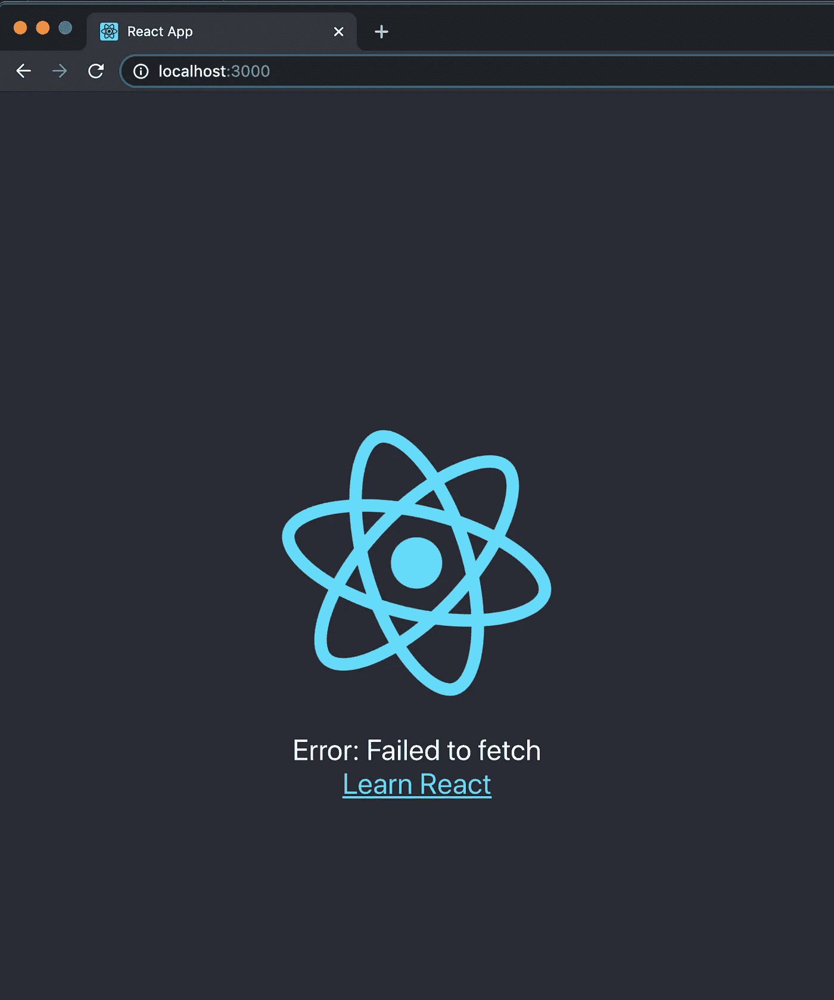
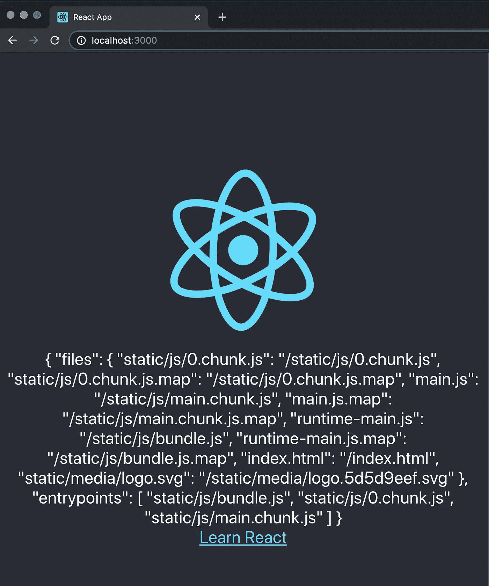
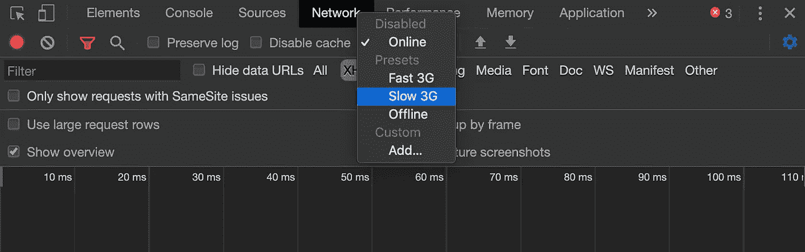
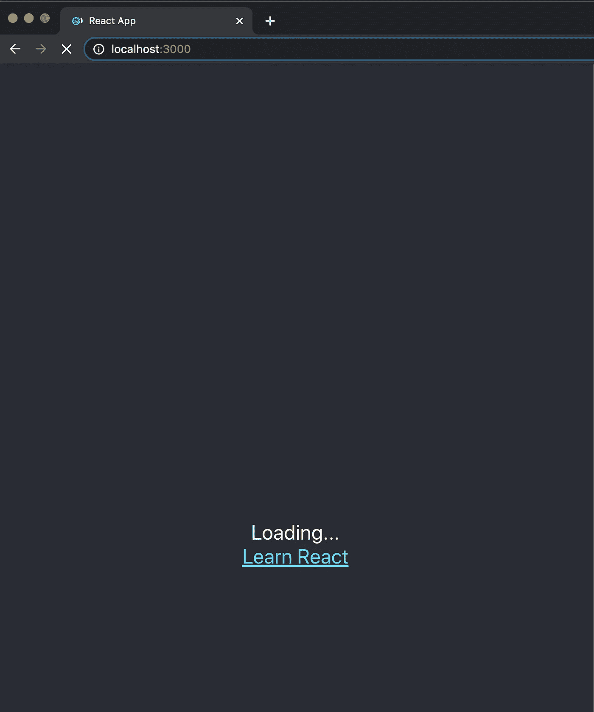
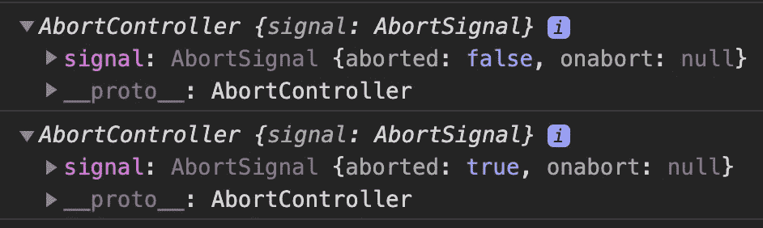
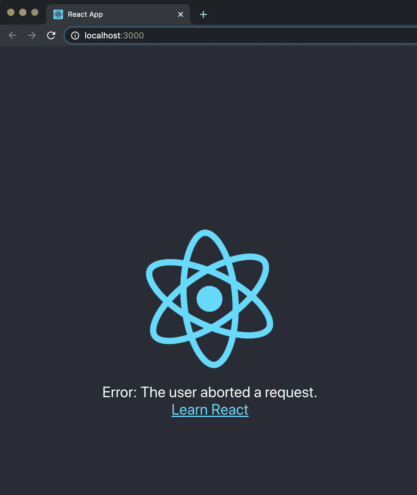

# 使用的强大和便利同步

> 原文：<https://betterprogramming.pub/the-power-and-convenience-of-useasync-e4a3e4934143>

## react-async 简介，这是一个用于声明性承诺解析和数据获取的实用工具带


迪伦·吉利斯在 [Unsplash](https://unsplash.com/s/photos/data?utm_source=unsplash&utm_medium=referral&utm_content=creditCopyText) 上的照片

如何在 React 中进行异步调用？你用`axios`、`fetch`，甚至 [GraphQL](https://graphql.org/) 吗？

在这种情况下，您应该熟悉如何获取成功调用的数据，以及如何接收失败调用的错误。很可能，您还需要跟踪加载状态以显示挂起状态。

你有没有考虑过用定制的挂钩把它们包起来？

所有这些都是由 react-async ( `[react-async](https://github.com/async-library/react-async))`)完成的，这是一个用于声明性承诺解析和数据获取的实用工具带。我们将向您展示使用这个强大的 react-async 是多么容易。

# 使用 Create React 应用程序进行演示

一如既往，魔法始于[创建 React 应用](https://medium.com/better-programming/10-fun-facts-about-create-react-app-eb7124aa3785)。用命令`npm i react-async`安装 react-async。然后修改`src/App.js`如下:

第 6 到 10 行是一个获取函数。它由第 13 到 16 行的`useAsync`调用。

这个`useAsync`用三个项目来构造:`data`、`error`和`isPending`。第 21 到 25 行使用这些项目来显示正确的 UI。

根据此调用是否处于挂起状态，此调用会导致错误或返回数据。很简单，不需要用`useEffect`包裹副作用。

运行`npm start`，你会看到如下界面:



这是第 23 行的结果，因为提取`http://localhost:4000/asset-manifest.json`失败。

您可以尝试任何带有数据的 URL，或者按照以下步骤在`localhost:4000`上启动应用程序:

```
git clone --single-branch --branch chunkOptimization [https://github.com/JenniferFuBook/micro-frontend.git](https://github.com/JenniferFuBook/micro-frontend.git)
npm i
npm start
```

现在，您将看到第 24 行的结果:



22 号线待定状态怎么样？

这有点棘手。既然是过境国，你可能看到也可能看不到。

将您的网络设置为`Slow 3G`:



现在你一定会看到的。当然，旋转的标志也加载得很慢。



# 使用同步挂钩

先来了解一下`useAsync`:它是一个钩子，可以被`fetch`、`axios`或者其他数据取数库使用。它接受`options`并返回一个`state`。

```
const state = useAsync(options)
```

`options`在文件中定义[。我们用了其中的两个:](https://docs.react-async.com/api/options)

*   `promiseFn`:返回承诺的函数，自动调用。
*   `onResolve`:承诺解决时调用回调。

`state`属性在文档中定义[。第 14 行解构了其中的三个:](https://docs.react-async.com/api/state)

*   `data`:上一次解决的承诺值，当新的错误到来时维护。
*   `error`:拒绝承诺原因，新数据到达时清除。
*   `isPending` / `isLoading`:当承诺当前正在等待结算时为真。

我们在第 15 行放了一个`console.log`语句。承诺兑现时显示`‘Resolved’`。

# 中止 useAsync 调用

`useAsync`可接受。除了`onResolve`之外，还有一个`onCancel`选项:

*   `onCancel`:取消承诺时调用回调。

还有一个`cancel`功能作为状态道具之一:

*   `cancel`:通过忽略其结果来取消当前待定的承诺，并在`AbortController`上调用`abort()`。

`[AbortController](https://developer.mozilla.org/en-US/docs/Web/API/AbortController)`是一个 JavaScript 对象，允许您在需要时中止一个或多个 web 请求。

在上面的代码中，第 18 到 20 行取消了 fetch 调用。因此，第 16 行打印出`‘Canceled’`。

这是`useAsync`内建的中止承诺的方式。中止也可以通过下面的 promise 函数实现:`fetchManifest`。

第 6 行的第二个参数是`AbortController`的一个实例。`abortController.signal`是作为信号传入`fetch`呼叫的。

我们有两个`console.log`呼叫。第 7 行，承诺没有流产。在第 11 行，承诺被第 10 行的调用中止。有趣的是，这种中止方式不会触发第 20 行的`onCancel`打印出`‘Canceled’`。



我们在第 9 行添加了一个`debugger`语句。如果没有暂停，两个`AbortController`都显示 abort 为`true`，因为从`false`到`true`的转换太快，以至于`console.log`无法捕捉。

下面的屏幕截图显示了第 29 行的中止错误。



更多的时候，我们会看到 promise 函数是这样写的:

不需要显式调用`abort`。当再次调用 promise 函数时，或者当我们离开一个页面时，已有的 promise 会自动中止。

# 使用提取挂钩

如果使用`fetch`获取数据，`useFetch`钩子可以节省几行代码。

第 7 行到第 10 行调用`useFecth`，用三个条目来解构状态:`data`、`error`和`isPending`。

第 15 到 19 行使用这些项目来显示正确的 UI。根据此调用是否处于挂起状态，此调用会导致错误，或者此调用会返回数据。

# IfPending、IfRejected 和 IfFulfilled

React-async 提供了几个助手组件，使 JSX 更具声明性，更简洁。

*   `IfPending`:仅在承诺待定时呈现。
*   `IfRejected`:仅在承诺被拒绝时呈现。
*   `IfFulfilled`:仅在承诺兑现时才呈现。

以下是这些组件助手的一个示例:

看看第 20 行到第 28 行，对你来说看起来更清楚吗？

# 异步组件

组件和它的状态助手可以完成同样的事情。

*   `Async.Pending`:仅在承诺待定时渲染。
*   `Async.Rejected`:仅在承诺被拒绝时呈现。
*   `Async.Fulfilled`:仅在承诺兑现时渲染。

请看第 17 到 25 行。你更喜欢`<Async>`组件吗？这完全取决于你。

# 结论

React-async 即使在具有多个或嵌套数据依赖的大型应用程序中也能很好地工作。它鼓励在组件级按需并行加载数据，而不是在路由或页面级批量加载。

因为它与路由完全分离，所以它在具有动态路由模型或根本不使用路由的复杂应用程序中工作得很好。

感谢阅读。我希望这有所帮助。你可以在这里看到我的其他媒体出版物。