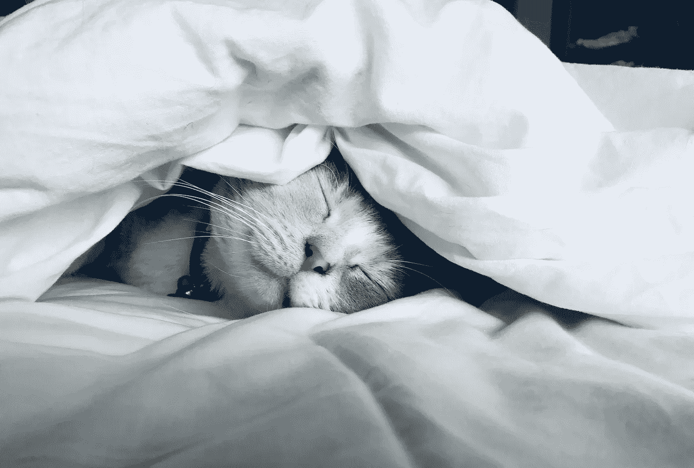

# 15 分钟午睡的力量

> 原文：<https://betterprogramming.pub/the-power-of-a-15-minute-nap-at-midday-2305e77b00f7>

## 你不懒惰，不无聊，也不缺乏动力。你只是人类。

凯特·斯通·马西森在 [Unsplash](https://unsplash.com/s/photos/sleep?utm_source=unsplash&utm_medium=referral&utm_content=creditCopyText) 上的照片

最常见的习惯看起来如此荒谬可笑，是不是很有趣:散步，开始写日记，每天锻炼，或者小睡 15 分钟。

它们似乎太基础了，没有效果。那是因为我们忽略了显而易见的东西，而去寻找简单问题的复杂需求。

今天，我醒来开始写作。我一点感觉都没有，甚至在喝完咖啡之后。于是我把电脑调成了睡眠模式，中午过后几分钟，我小睡了 15 分钟。

不久后，我醒来精神焕发，准备再次工作。这是我过去三个月一直在尝试的一个习惯。

如果释放更多能量和延长工作时间的关键是在中午小睡一会儿呢？在你评判我之前，请记住:

你不会因为需要小睡而懒惰、无聊或没有动力。你是人类。

# 有益的午睡小贴士

原来我没那么聪明。博士候选人 Caroline Wazer 在《大西洋月刊》上发表了一篇研究支持的文章，她在文章中称，古罗马医生已经开了几个世纪的午睡处方。

午睡是解决许多健康问题的灵丹妙药。它让你重新调整心态，抽出时间，放松，然后回来准备工作。我说过只需要 15 分钟吗？

不过，我不是每天都午睡。一周有两天，我会全职写作，在这两天，总会安排 15 分钟的小睡。没有它，我会在下午 5 点前失去能量，筋疲力尽。午睡帮助我提高了工作质量，写了更多的字。

> “我不觉得自己老了。直到中午我都没什么感觉。那是我午睡的时间。”
> —鲍勃·霍普

这里有一些在中午小睡 15 分钟的有用建议。

## 使用计时器

在你的手机上设置一个 15 分钟的定时器。当 15 分钟到了，轻轻地坐起来，走出卧室。

(**旁注:**我现在的闹钟声音很可怕，让我从午睡中醒来感觉像是心脏病发作。我还在寻找温柔的唤醒音调。)

## 去一个黑暗的房间

打盹的最佳地点是在你的卧室，关掉灯，放下窗帘。黑暗有助于你休息，关门有助于阻挡噪音。

## 外出午睡

如果你在工作或者不在家，你仍然可以小睡一会儿。我曾经和一个家伙一起工作过，他会在午休时恬不知耻地在大厅的沙发上打个盹。

如果你没有那么勇敢，不喜欢同事拍你睡觉的照片说你懒，你可以去一个安静的地方。

最简单的方法是去别人的大厅，或者去当地的公园，那里有一个很好的长椅，你可以在上面放松，听听当地野生动物的声音。

## 闭上眼睛——即使你没有睡觉

在一些小睡中，你根本不会睡觉。有时候，你可能最终会评判自己，称小睡是一次失败——有点像我们在冥想和判断结果时所做的那样。

午睡的首要结果是放松，而不是睡觉。

如果你休息了 15 分钟，但脑子里仍然充满了忙碌的想法，那也没关系。提升你午睡游戏的一个方法是试着关注当下。深呼吸，尽你所能放松。

尽量不要去想午睡后发生的事情，你的休息会更好。否则，你会把午睡时间花在思维导图和计划上。

## 不要睡过头了

在这个为期三个月的实验中，我睡过头了。我的大脑赢了，用了这个借口，“你累了…多睡一会儿。”

我午睡超过 15 分钟的次数让我感觉比午睡前更累。有时它也会打断我晚上真正的睡眠。

## 使用刷新的感觉

一旦你完成了小睡，回来时精神焕发，把多余的精力用在有成效的事情上。对我来说，那就是写作。

注意小睡一会儿后你感觉有多好，观察它对你喜欢做的事情和你的业余时间做的事情有什么影响。

当你累死的时候，你的工作很难激励任何人。中午再打 15 分钟的盹，看看这是否会对你的能量水平和精神状态产生影响。