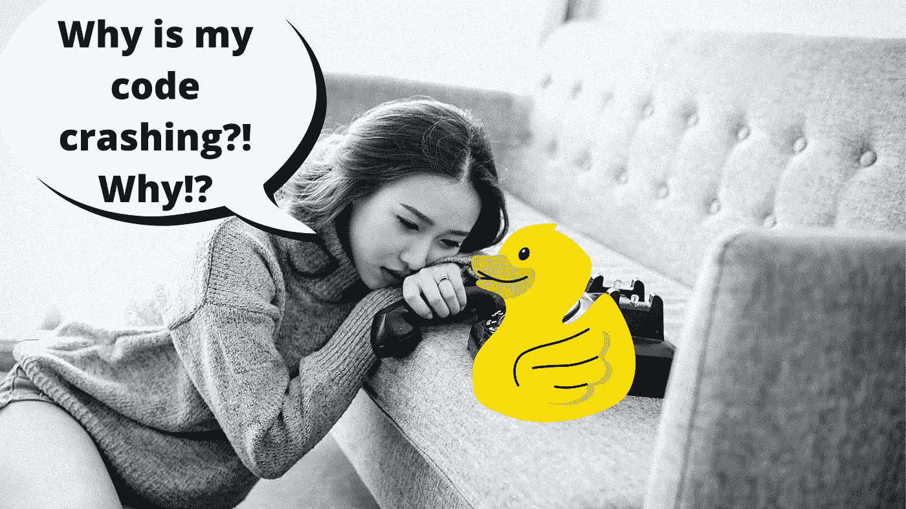

# 橡皮鸭对开发者的力量

> 原文：<https://betterprogramming.pub/the-power-of-a-rubber-duck-for-developers-949862e0b03>

## 知道如何使用这种心理伎俩

由 [Anthony Tran](https://unsplash.com/@anthonytran?utm_source=unsplash&utm_medium=referral&utm_content=creditCopyText) 在 [Unsplash](https://unsplash.com/s/photos/crying?utm_source=unsplash&utm_medium=referral&utm_content=creditCopyText) 上拍摄的原始照片，由作者编辑

听说过*橡皮鸭调试*这个名词吗？没有吗？嗯，这实际上是我们这个行业中一个非常有趣的小过程，我们对一个无生命的物体(通常是一只橡皮鸭)说话，通过奥术的手段，我们找到了当前难题的解决方案。

实际上并不是那样，但那样想很有趣。

说实话，橡皮鸭只不过是我们使用的一种心理把戏——不管我们是否意识到这一点，那都是完全不同的事情。但是它确实有效，科学家和研究人员已经研究了一段时间。所以，让我们粉碎这种幻觉，尽我所能掩盖橡皮鸭效应背后的魔力。

# 这和鸭子无关

面对现实吧，鸭子什么都没做。事实上，这只鸭子只是一个轶事，来自《实用程序员》一书中的一个故事。在这个故事中，开发人员会带着一只橡皮鸭到处跑，他们会强迫自己通过一行一行地向鸭子解释来调试代码。

这很有趣，也有点疯狂，但鸭子只不过是一个让我们能够体现这种效果的好处的物体。或者换句话说，它有助于我们在自言自语时不感到疯狂。

# 那么，它为什么会起作用呢？

事实证明，当我们提出想法时，我们倾向于对其周围的环境做出固有的假设。

你有没有大声说出一些在你脑海中听起来很棒的话，只是在听到自己的声音后才意识到这是一个非常愚蠢的想法？

我经历过，我想我们都经历过。那只是我们的大脑在捉弄我们。

事实上，还有更多。Tania Lombrozo 博士的这篇冗长的文章涵盖了其他人和她的团队的许多研究，他们分析了向自己解释你行为背后的原因的效果。

事实证明，听自己解释自己行为背后的逻辑对学习有积极作用。在非常不同的情况下对孩子和成人进行了测试，结果相似。它帮助你发现推理中的问题，并及时纠正，而如果你什么都做，什么都不说，你最终会成为自己内心假设的牺牲品。

# 我们如何利用这种效应呢？

明白能力不在鸭子身上——我们都知道，不是吗？* *开始拆开橡皮鸭神龛**——然后我们可以公式化这个问题:那么，我应该向自己解释我所做的一切吗？

好吧，如果你独自在家工作，为什么不呢？没人会真的在乎。

然而，如果你在办公室工作，作为团队的一员，其他开发人员不会喜欢。事实上，让多个开发人员不断地描述他们在做什么以及为什么要这样做，就好像他们在描述一场足球比赛一样，这是一种无法忍受的情况。

那么我们能做些什么呢？

答案并不复杂:创造一个空间，让你可以描述你做过(或正在做)的事情和你遇到的问题。你曾经参与过代码评审吗？

我见过两种代码评审:

1.  在那里，评审员离线查看你的代码，然后和你见面，解释他们发现了什么，以及为什么他们认为你的代码很糟糕。或者换句话说，他们说话，你听。句号。
2.  当你检查你的代码，解释你做了什么和为什么做的时候，评审员就坐在你旁边。

注意到我要去哪里了吗？第一种类型的代码审查并不真正有效。该选项仅帮助纠正审查者发现的问题。如果代码足够大，他们可能会浏览并寻找明显的问题。

然而，在第二种方法中，您知道关于代码的一切，并且您确切地知道它需要遵循的逻辑。所以你可以解释它的一切，同时，你可以倾听自己，找到别人看不到的漏洞。本质上，把评论者当成半有知觉的橡皮鸭。

见鬼，如果你幸运的话，他们甚至会问“为什么？”当你描述你的代码时，这将迫使你更深入地去做一个详细的解释。找到这样的错误比让不知道逻辑或代码的人仔细检查并希望他们找到问题要有效和实用得多。

橡皮鸭效应只不过是我们聪明地在自己身上玩的一个心理把戏。

但是现在你知道了它的工作原理，你也许可以找到其他可以使用它的地方，而不仅仅是当你有一个你不知道如何修复的 bug 的时候。养成一个习惯，尽可能大声地解释你的理由。你很快就会看到好处。

你见过橡皮鸭效应在其他情况下也起作用吗？留下评论，分享你的经历吧！