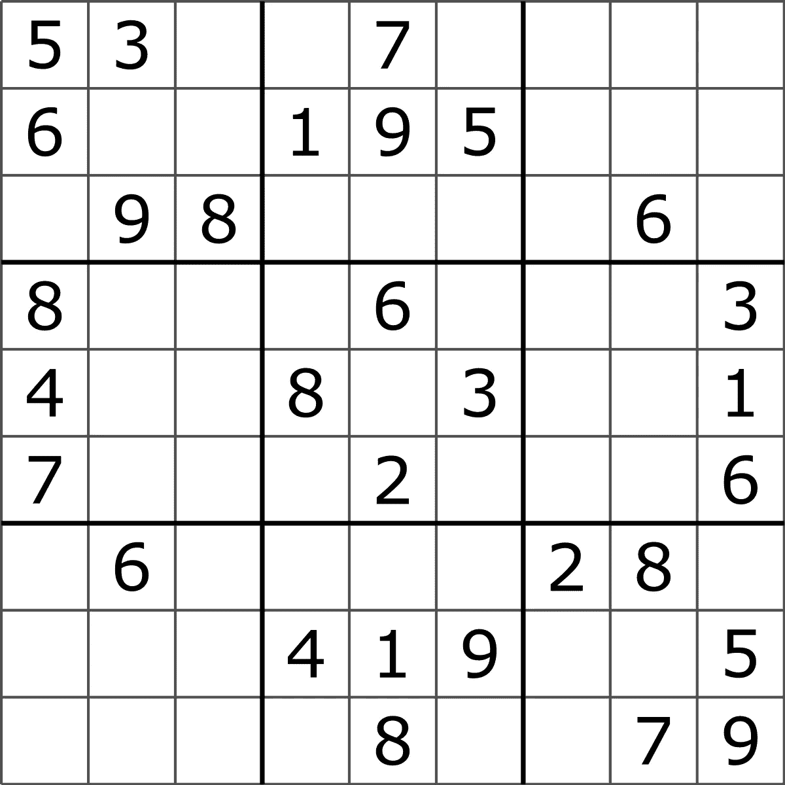

# Swift 中位运算的威力

> 原文：<https://betterprogramming.pub/the-power-of-bitwise-operations-in-swift-ba7724d88648>

## 降低空间复杂性

图片来自 [Unsplash](https://unsplash.com/photos/YYUM2sNvnvU)

任何解过数独的人都知道，答案来自于你所拥有的信息，对每一个后续决策都应用三条规则:

1.  一个数字在每个 3x3 的方块中只能出现一次
2.  一个数字不能在同一行出现两次
3.  一个数字不能在同一列出现两次

遵循这些规则，我们可以断言，在示例数独的第一个方块中，第二行不可能有 1，但第二行肯定会包含 7。通过排除法，你应该能够找到一个解，其中每个 1x1 正方形包含 1 到 9 之间的数字，每个 3x3 正方形、每行和每列包含 1 到 9 之间的所有数字。

假设我们想写一个程序来测试数独的当前状态，并断言它是否是一个有效的棋盘，或者是否违反了一些规则。

要编写一个数独检查器，我们所要做的就是为行填充一个真值表，为列填充一个真值表，为正方形填充一个真值表。这个真值表将告诉我们第 I 行/列/正方形是否已经包含一个数字。如果是这样，数独就不是处于有效状态。

以下是使用 Swift 编程语言的解决方案:

作为输入，我们有一个 9x9 的字符矩阵。每个字符可以是 1 到 9 之间的一个数字，也可以是一个点，表示该位置仍然空闲。

首先，我们为规则构建真值表，然后我们逐行迭代，每列遍历整个棋盘。如果我们找到一个数字，我们会检查我们是否在同一行、同一列或同一方块中见过它。如果有，那么我们返回 false。如果没有，我们更新我们的真值表，指出我们已经在当前访问的`row`、`col`和`square`看到了这个数字。

如果我们设法运行到最后，所以程序在循环期间没有返回，那么没有违反规则，数独处于有效状态。因此，我们可以返回 true。

这个解决方案非常有效。一个数独游戏有九行九列，算法在固定时间内运行。就空间而言，我们分配了三个大小为 81 的矩阵。我们也可以有把握地说，空间复杂度是常数。

如果我告诉你，你可以通过简单的三个大小为 9 的数组来节省更多的内存，那会怎么样？

# 二进制数

众所周知，每个数都可以用一个二进制数来表示，也称为以二为基数的数制。

这个数字系统的每个数字被称为一个`bit`。一个位可以是 0 或 1。1 和 0 的位置很重要，因为在这个数字系统中，位置表示第 I 位代表的 2 的幂。最右边的位代表幂 0。这个想法是，任何数字都可以表示为 2 的幂的和。

`0` = 0

`1` = 2 ^ 0 = 1

`10` = 2 ^ 1 = 2

`11` = 2 ^ 1 + 2 ^ 0 = 2 + 1 = 3

`100` = 2 ^ 2 = 4

等等。

# 移位操作

一位移位将一个数的二进制表示中的每一位向左或向右移动。

`00000010 << 1` = `00000100`(左移 1 位)

`00000010 << 2` = `00001000`(左移 2 位)

通过`n`左移一个数将返回一个十进制数，例如原始十进制数乘以 2 ^ `n`。

反之亦然—向右移位将导致原始数除以 2 ^ `n`。

# 按位运算(&和|)

在本文中，为了解决有效数独问题，我们将重点讨论 AND 和 or 布尔运算。

AND:给定两位`x`和`y`，`x&y` = 1 当且仅当它们都为 1

或者:给定两位`x`和`y`，如果 x 或 y 为 1，则`x|y` = 1

请注意，这些是按位操作，这意味着它们在单个位的级别上操作位模式。

`101 & 001` = `1&0 0&0 1&1` = `001`

`101 | 001` = `1|0 0|0 1|1` = `101`

请注意，`&`对于了解位模式中的某个位置是否已经填充了 1 特别有用，因为如果没有，结果将是 0

`11011 & 00100` = `1&0 1&0 0&1 1&0 1&0` = `00000` = 0

而`|`对于用 1 填充 0 位特别有用。

`11011 | 00100` = `1|0 1|0 0|1 1|0 1|0` = `11111`

明白我要去哪里了吗？

# 新的解决方案

我们可以不使用布尔数组的数组，而是使用一个`UInt16`作为布尔数组，并使用&操作来检查我们是否已经看到了一个数字，同时使用|操作来更新我们的真值表。

算法是一样的，除了我们使用了一个`UInt16`，就像它是一个 bool 数组一样。变量`value`基本上代表我们想要测试的位模式中的“槽”。一个`UInt16`将有 16 个可用位，我们将使用最右边的 9 个。

让我们假设在我们的例子中，同一行上有两个 5:一个在[0][0]处，一个在[0][2]处(所以我们试图在本文开头的例子的第一个空格中插入 5。

**第一次迭代** : *行* = 0，*列* = 0。

棋盘上的位置[0][0]的数字是 5，值将是`1 << (5-1)` = `1 << 4` = `10000`

`rows[0]`当前为 0，因此检查`value & rows[0]` = `10000 & 00000` = 0，因此检查成功。对于`cols[0]`和`squares[0]`也是如此。

我们以前从未见过 5，所以我们更新了我们的真值表。

`rows[0] |= value` = `00000 | 10000` = `10000`

`cols[0] |= value` = `00000 | 10000` = `10000`

`squares[0] |= value` = `00000 | 10000` = `10000`

**第二次迭代** : *行* = 0，*列* = 1

[0][1]处的数字是 3，因此`value`将是`1 << (3-1)` = `1 << 2` = `100`

`rows[0]`现在是`10000`所以这次也是`rows[0] & 100` = `10000 & 100` = 0。

对于`squares[0]`和`cols[1]`也是如此(仍然是 0，因为这是我们第一次访问第 1 列)。

我们以前从未见过 3，所以我们更新了我们的真值表。

`rows[0] |= value` = `10000 | 00100` = `10100`

`cols[1] |= value` = `000 | 100` = `100`

`squares[0] |= value` = `10000 | 00100` = `10100`

**第三次迭代** : *行* = 0，*列* = 2

我们试图在棋盘上先前空着的这个位置插入 5，所以[0][3]我们假设是 5。值将再次变为`1 << (5-1)` = `1 << 4` = `10000`

`rows[0]`现在是`10100`和`rows[0] & 10000` = `10100 & 10000` = `10000`不等于 0。这足以说明这个板子是无效的，返回 false，但是即使我们继续我们的程序，5 也会违反`squares[0]`但不会违反`cols[2]`，因为这是我们第一次访问这个专栏，而 5 以前在这个专栏上出现过。

5 违反了行规则和平方规则。

# **结论**

显然，在这个特定的问题中，增益很小。我们从 3 个各有 81 个布尔值的数组传递到 3 个 9 - 16 位无符号整数的数组，但是这种技术可以转移到其他问题，在这些问题中，真值表的大小可能不再可以忽略。

下一次我们将会看到如何使用更多的位操作符找到任何数独的解。