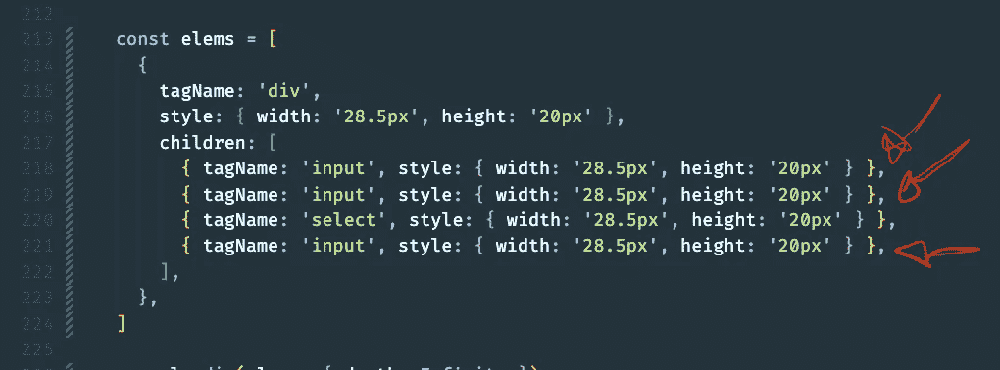
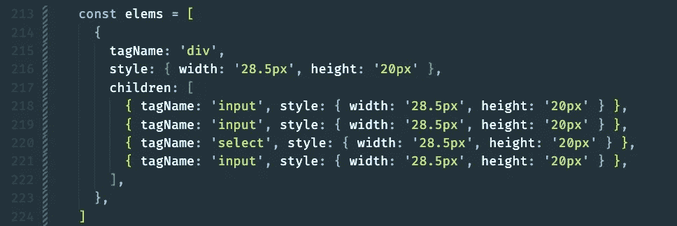
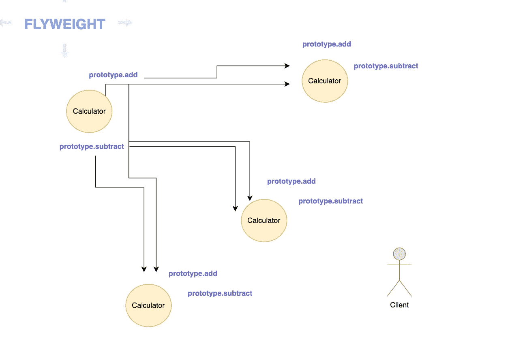

# JavaScript 中 Flyweight 设计模式的威力

> 原文：<https://betterprogramming.pub/the-power-of-flyweight-design-pattern-in-javascript-5593ae9fa858>

## 在 JavaScript 中，分享也是关心

*Lukas 拍摄的照片:*[*https://www . pexels . com/Photo/laptop-computer-showing-c-application-574069/*](https://www.pexels.com/photo/laptop-computer-showing-c-application-574069/)

在 JavaScript 中，我们很幸运在语言中内置了自动垃圾收集机制。在某些情况下，我们自己管理内存是非常必要的。这就是 Flyweight 设计模式可以派上用场的地方，因为它旨在将共性分享给客户可以从中受益的对象。这是一种编写可伸缩应用程序的有效方式，因为它有利于我们允许用户消耗尽可能少的内存。

在本文中，我们将介绍 JavaScript 中 Flyweight 设计模式的强大功能，并利用它来创建更节省内存的应用程序。我们将回顾出现的问题，并展示 flyweight 模式是如何将这些问题全部解决的。

如果您以前使用过 JavaScript 库，那么无论是通过 JavaScript 库、框架，甚至是 DOM，您都很有可能直接处理过提供给您的某种 flyweight 模式的变体。

让我们来看看这个将对象表示为 DOM 元素的对象数组:

如果您查看`children`数组，请注意有三个结构相同的对象:

这已经是一个问题，因为如果我们继续这种做法，我们的项目变得更大，我们的程序将在性能上受到很大的影响，因为它将在内存中创建三个独立的对象，尽管它们在结构上是等效的。想象一下如果有 1000 个呢？

当我们回顾 flyweight 设计模式的真实例子时，这基本上是 flyweight 打算在幕后做的事情:

注意`inputElement`是如何被多次提及的。

我们将回顾不同对象结构中的例子(例如类)，但最终这个概念总是适用的。

思考 flyweight 模式的一个好方法是“共享事物”在前面的例子中，我们共享了三次`inputElement`对象。我们至少在三种情况下最小化了内存的使用。

您可能经常遇到的一个常见实现是实现某种 get 方法来检索内存中某个缓存中的对象:

这是一个很好的技术，可以重用和共享以前创建的、不需要重新创建的对象，因为它保留了用户的记忆。

它被用在许多库中，比如 [ts-morph](https://github.com/dsherret/ts-morph/blob/latest/packages/common/src/collections/KeyValueCache.ts#L29) ，它们通常在这些方法前面加上类似`"getOrCreate<the rest of the variable's name>"`的前缀

# 内在状态

当我们向 Flyweight 中添加一些内在状态时，我们可以利用它来做出节省内存的决策，这时 flyweight 实现通常会变得很有用。

在我们之前的例子中，如果我们看一下我们的`CoinCollege`类，我们可以在这里发现我们的内在状态:

我们首先尝试用请求的`value`获取先前创建的`Coin`实例。如果我们的应用程序先前创建了它，我们可以避免不必要的重新创建，只返回我们存储的先前的`Coin`。

这是库作者最常寻求的好处。

# 外在状态

轻量级模式中的另一个重要角色是外在状态。这些状态存在于 flyweight 实现之外，但是希望使用 flyweight。一个常见的用例是回调函数观察到的状态:

有了这个功能，如果我们的业务逻辑只适用于前五个硬币，我们就可以停止进一步创建`Coin`。这是我们内在状态的伟大伴侣！

# 原型遗传

在我 JavaScript 开发生涯的早期阶段，我很难理解在原型继承和工厂函数之间做出决策。困扰我太久的一个谜是弄清楚为什么我经常看到函数是这样创建的:

与以这种方式创建对象相反:

在第一个例子中，我们的`Calculator`类的新实例化将继承和重用在其原型上定义的相同属性/方法。这意味着这些将会发生:

在第二个例子中，我们的`makeCalculator`工厂的新实例化将不会继承和重用`add`和`subtract`，而是接收一个全新的`add`和`subtract`函数，即使它们在形状和代码大小上是相同的。

总的来说，它们各有利弊。但是在 flyweight 的上下文中，推荐原型继承。然而，对于所有其他的，我总是使用工厂函数，但是这超出了这篇文章的范围。

# 真实世界的代码示例

[superagent](https://github.com/visionmedia/superagent) 库展示了在实践中使用 [Request](https://github.com/visionmedia/superagent/blob/master/src/client.js) 类中的原型继承的 flyweight 设计模式。现代程序会频繁地请求执行像数据获取这样的任务。问题是，这些请求不能在后续请求中重用。

他们需要实例化某个`Request`对象的新实例。当程序处理`Request`对象时，没有必要复制不依赖于当前状态的方法和属性。

一个例子是对`Request`对象的[查询方法](https://github.com/visionmedia/superagent/blob/master/src/client.js#L580)。实现细节几乎不会改变，所以没有必要创建副本并把副本带到新对象中。

# 结论

我希望你发现这是有价值的。以后多多关照！