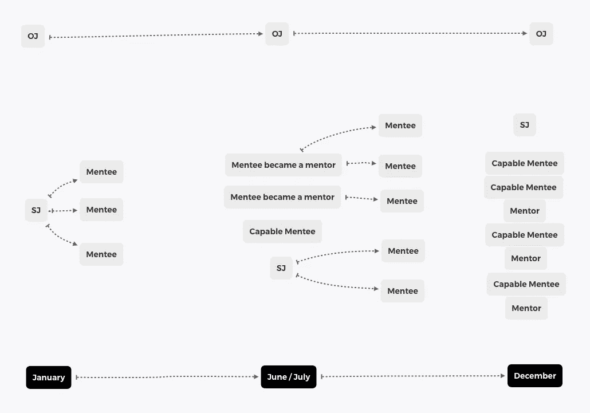

# 知识共享和协作链的力量

> 原文：<https://betterprogramming.pub/the-power-of-knowledge-sharing-803a3d3a405e>

## 是时候跳出框框思考了


由 [Unsplash](https://unsplash.com?utm_source=medium&utm_medium=referral) 上的 [krakenimages](https://unsplash.com/@krakenimages?utm_source=medium&utm_medium=referral) 拍摄的照片

作为一名软件工程师，我对生产力、协作和知识共享的看法一次又一次地改变。这三个概念看起来很容易定义(事实上，的确如此)，但它们隐藏了不同的观点。

在 2013 年至 2015 年期间，当我开始我的职业生涯时，我对生产力的理解非常简单:“编写更多的解决方案，并按时交付更多”。协作？简单！“如果某位同事需要帮助，他可以问我，我会很乐意提供支持”。知识分享呢？“如果有人不明白某件事，那么我可以抽出一些时间来解释”。

> 我的时间完全用于实现目标:按时交付，学习按时交付更多任务，如果我有时间，帮助有需要的朋友。

请不要误会我！上面提到的定义就可以了。那么问题出在哪里？我当时的行为对项目/公司的影响太低了。当然可以接受。毕竟，我在送东西。但这是否会让我和/或公司更上一层楼？

> 【https://en.wikipedia.org/wiki/Pareto_principle 

随着时间的流逝，上市快 10 年了，我对这个话题的看法发生了很大的变化。我决定每天花 20%的时间做以下一项或多项活动:

> 管理、指导、辅导、分享和激励

我们试着通过几个例子来分析一下。

想象一个开发者，我们姑且称他为“痴迷的乔”(或者只是 OJ)。OJ 不相信分享，他很害羞，所以他对指导和训练不感兴趣，更不喜欢通过演讲来分享知识。但是他是一个好的开发者。他能够在每次冲刺时传递 10 个故事点。假设他在每个 sprint 中交付一个复杂的任务和一个简单的任务。

> [https://www . scrum . org/resources/blog/why-do-we-use-story-points-estimating](https://www.scrum.org/resources/blog/why-do-we-use-story-points-estimating)

一年后，他将交付 260 个故事点(我们不会考虑明显的交付失败、低估的任务等)。这对他来说是个好数目。

另一方面，我们有一个叫“聪明约翰”(或者就叫 SJ)的家伙。SJ 和 OJ 的技术完全一样。他能够在每次冲刺时交付相同数量的故事点，但他决定妥协，交付 8 个故事点，并花一些时间进行非项目活动，如指导、辅导和分享。

一年后，他将发表 208 个故事点。哦等等！比 OJ 的还少。

> 为什么是 260 和 208？举个例子，我正在考虑每年 26 次为期两周的冲刺，每次冲刺交付的故事点数量。我将对 OJ 和 SJ 使用相同的计算方法。

208 怎么比 260 好？很简单！纯数学！让我试着向你展示在 SJ 分娩后的一年里发生了什么。

一月份，SJ 开始了一个有 3 名学生的指导项目。作为一名导师，他支持了其他 3 名开发人员的学习之旅，到 3 月底，他们能够在每个 sprint 中交付 8 个故事点。在 SJ 指导他的学生之前，他们只能提供 4 个。

SJ 传播并提高了他的同事解决任务的能力。让我们在年底之前计算这些数字。

使用公式`SJD+N*(New-Old)*W`其中:

*   SJD = SJ 一年的交付故事点
*   n = SJ 帮助的学员人数
*   New = sprint 故事点的新容量
*   旧= sprint 故事点的旧容量
*   W =离年底还有几周

```
208 + 3*(8–4)*19 = 436 story points.
```

将 SJ 的交付与他的学生在指导计划后提高的能力之差相加，结果是 436。哇，太令人兴奋了！假设指导计划刚刚在六月结束。结果将是 364。仍远高于 OJ 的 260 个故事点。

现在你可能想知道如果一两个 SJ 的学生决定开始指导新学生会发生什么。我想我不需要进一步解释了。

观察下面的方案。它显示了一段时间内受能力限制的开发人员的数量，考虑了他们所属的影响链。



随着时间的推移，有能力的工程师不断进步

那么第二年会发生什么呢？OJ 的能力保持不变…不。让我们说他进步了，他变得能够每场冲刺拿下 12 分。现在 OJ 每年可以提供 312 个积分。

明年年初，在 SJ 的链上，将有 9 个有能力的开发者，到年底将提供大量的故事点。我应该前进吗？我觉得不需要。

当然，在做计算时，我需要非常简单。我们知道人不是机器人，他们有时不能达到预期的数量，或者有时他们在坚定的冲刺中同意较少的故事点，但即使我们试图想象最现实的情况，如:“只有一个学员成为导师”或“然后他的学员都没有成为导师”。没关系！无论如何，这些数字都会显示出巨大的差异。

你是否已经发现自己在想“为什么其他人的贡献比我少却在公司内部成长？”或者“为什么这个在我之后加入公司的人得到了提升？”。当然，这可能有很多原因，但是试着问问你自己:“这个人比我产生了更积极的影响吗？”答案很可能是“是”。

> 是时候跳出框框思考了，是时候做出改变，与你的同事进行一些真正的合作，并注意你的行为对你的项目/公司的影响。

我保证花些时间建立知识链只会对你的职业产生积极的影响。你工作的公司，你参与的项目…他们会从不同的角度看你。即使他们没有，你也会有很多东西要带着，呈现给你的下一个雇主/项目。

如果我改变了你的心态，或者至少让你思考“我是如何管理我的职业生涯的”或者类似的问题，那么我的使命就完成了！

干杯！