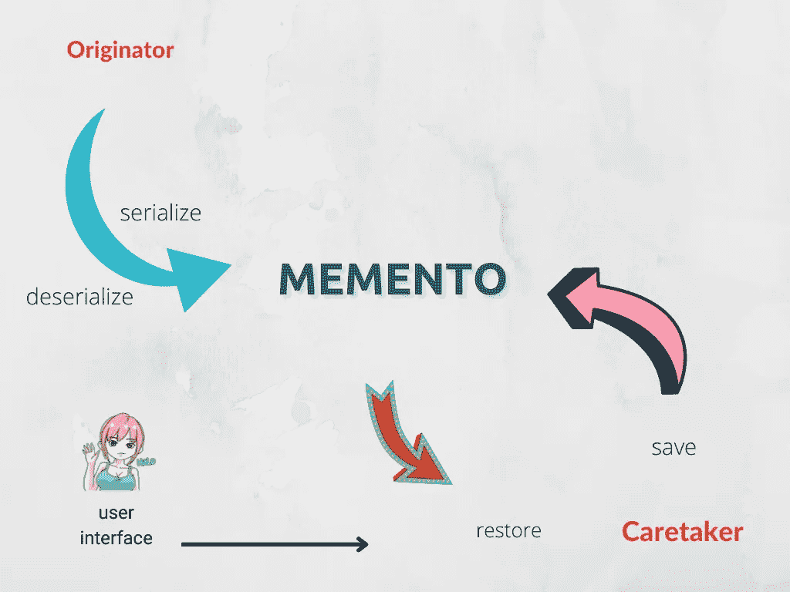
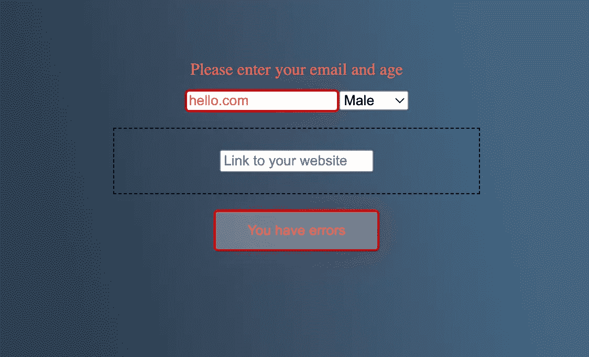

# JavaScript 中 Memento 设计模式的力量

> 原文：<https://betterprogramming.pub/the-power-of-memento-design-pattern-in-javascript-309f8bb4d9f2>

## 记住你的纪念品

由 [jsmanifest](https://jsmanifest.com) 拍摄

编程中的 Memento 模式在我们需要一种方法来恢复对象状态的情况下非常有用。

作为一名 JavaScript 开发人员，我们在许多情况下都会用到这个概念，尤其是在现代 web 应用程序中。

如果你已经在网络上发展了一段时间，那么你可能听说过术语[水合作用](https://en.wikipedia.org/wiki/Hydration_(web_development)#:~:text=In%20web%20development%2C%20hydration%20or,handlers%20to%20the%20HTML%20elements.)。

如果你不知道什么是水合作用，这是 web 开发中的一种技术，其中客户端获取以任何编程语言(如 JSON、JavaScript、HTML 等)存储的静态内容。，并将其转换为浏览器能够在运行时运行的代码。在这个阶段，JavaScript 运行，并且能够在 DOM 开始在页面上运行时附加事件侦听器。

纪念品的图案是相似的。在这篇文章中，我们将为运行时实现 Memento 模式，不会静态存储任何东西。

如果你和`JSON.parse`和`JSON.stringify`一起工作，你可能会意外地实现一个纪念品。

通常，有三个对象实现了 Memento 模式的完整流程:

1.  **发起人**
2.  **纪念品**
3.  **看管人**

*发起者*定义了触发其自身作为纪念品的创建和存储的接口。

*备忘录*是发起者的内部状态表示，它被传递并从看护者处检索。

*看管人*只有一个工作:保管或*保存*纪念品以备后用。它可以取回自己储存的记忆，但不会改变任何东西。

# 实现 Memento 设计模式

既然我们已经描述了模式，我们就要实现它，以便在代码中掌握这种实践。

我们将创建一个交互式电子邮件输入字段作为 DOM 元素。我们将添加一个智能行为到我们的输入字段，这样我们的用户将立即意识到他们需要在提交前添加`@`符号。

当他们的输入字段处于如下所示的错误状态时，他们会知道这一点:

这是我们将要在其上工作的 html 标记:

这将使我们从这个界面开始:

现在，我们要做的第一件事是为*错误*状态定义两个常量变量，我们将在整个代码中使用它们为错误类型赋值。这是为了确保我们在编写代码时不会出现任何打字错误，因为我们将多次重复使用它们:

这与模式无关，但我认为我随机加入一些最佳实践是一个好习惯，这样你就可以从这篇文章中获得额外的技巧，为什么不呢？；)

现在我们将创建一个助手函数，它在*错误状态*和*正常状态*之间切换，因为我们也将多次使用它:

当我们在两种风格预设之间切换时，我也可以插入一个助手来切换边框半径。这是为了让我们的代码感觉更“自然”，就像它是一个真正的应用程序一样，所以我们在这篇文章中不只是直接关注颜色和纪念品之间的关系。有时我认为，当我们看到随机代码与实际代码的对比时，我们会学得更好:

接下来我们要做的是编写*发起者*。

记住，发起者定义了接口，该接口触发其自身作为纪念品的创建和存储。

事实上，我们只是创建了一个简单的工厂，为我们生产的创始人。

这是真正的创始人:

在发起者中，`serialize`方法接收一个 DOM 节点，并返回该 DOM 节点的状态表示，这样我们就可以将它作为一个字符串存储在本地存储中。这是必需的，因为本地存储只接受字符串。

现在，我们是 JavaScript 中这种模式的顶峰。序列化是这种模式对我们很重要的唯一原因，否则我们就可以直接将 DOM 节点存储到本地存储中，然后就结束了。

在我们的`serialize`方法中，我们隐式地定义了几个规则来帮助我们确定表示。

以下是我所指的台词:

当存储输入元素的纪念品时，我们可以选择是这样实现还是那样实现:

接受我的建议:一个好的实践是从你的代码中创造出有用的意义*，尤其是在你的设计模式实现中*。当你在代码中赋予含义时，它会帮助你思考更高层次的抽象，这些抽象可能在代码的其他方面有用。

使用`item.isError`来表示预设的错误风格为制作有趣的可重用纪念品打开了更广阔的机会，当我们的项目随着时间变得越来越复杂时，我们可以重用这些纪念品，而不是直接指定任意的风格。

例如，当一个关键字段未被隐藏时，表单无法提交是很常见的。表单必须转换到某种状态，在这种状态下它需要阻止自己提交。

如果我们要保存一个表单的纪念品，我们需要确保当我们恢复这个状态时，用户被恢复到“禁用”状态:

我们没有直接返回元素，而是确保返回的是呈现纪念品的*当前状态*。

从更高层次的角度来看，我们利用了这样一个事实，即`isError`可以表示和概述类似表单的东西。如果缺少一个小的必填字段或输入的值不正确，则不应提交表单。

在这种情况下，我们通过在向用户显示表单之前禁用*提交按钮*来确保表单*不应该是交互式的*:

如果你还没有注意到，我们的`restore`从我们的*发起者*那里包装了我们最初的`deserialize`方法。

我们现在拥有的是一个更高层次的抽象纪念品，它支持我们整个纪念品的深层子*和*呈现状态* ( `isError`)。*

本帖到此结束！我希望你发现这是有价值的，并期待在未来更多！