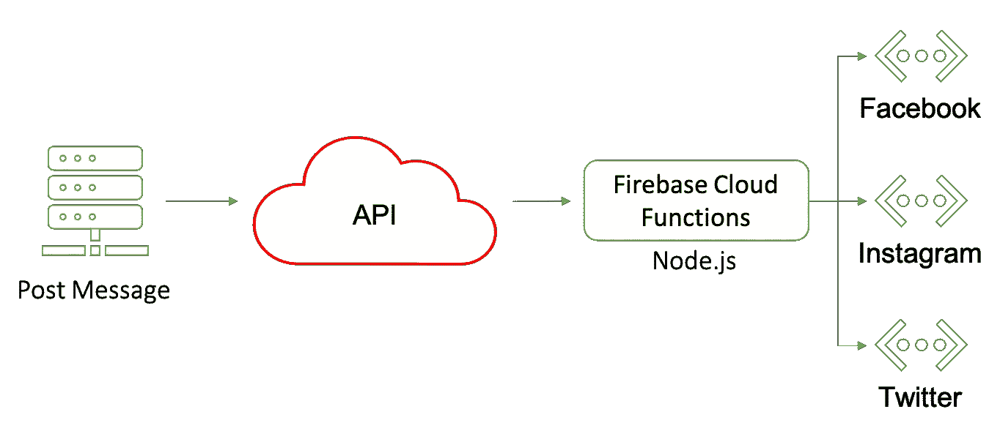

# JavaScript 中 Promise.all()的力量

> 原文：<https://betterprogramming.pub/the-power-of-promise-all-in-javascript-84a4da1751f0>

## 通过激动人心的使用案例了解有前途的功能


[Artem Beliaikin](https://unsplash.com/@belart84?utm_source=unsplash&utm_medium=referral&utm_content=creditCopyText) 在 [Unsplash](https://unsplash.com/s/photos/lock-bridge?utm_source=unsplash&utm_medium=referral&utm_content=creditCopyText) 上拍照。

本文不是关于承诺、`async/await`或者 Javascript 的单线程特性。这是关于`[Promise.all()](https://developer.mozilla.org/en-US/docs/Web/JavaScript/Reference/Global_Objects/Promise/all)`功能，以及如何将你独立运行的功能或任务组合在一起，形成一个美丽的结果。

通常情况下，一个例子或用例将被证明是有用的。

# 用例:发布到多个社交媒体网络

我们的应用程序 [Ayrshare](https://www.ayrshare.com) 的主要目的是提供一个跨多个社交媒体网络发布的 API，如 Twitter、Instagram、脸书和 LinkedIn。

用户将使用文章文本、图像和发送文章的网络列表进行 API 调用(RESTful 或通过客户端包)。API 以结果数组的形式返回每个网络的成功或错误结果。

然而，这背后是复杂的。

每个网络都有自己的授权、工作流程和安全要求。例如，如果您在帖子上附加了一张图片，Twitter 会要求您首先上传图片，等待图片处理完成，然后在新的更新状态调用中将返回的媒体 ID 发送给 Twitter。时间各不相同，有些网络可能会出错，有些则不会，而且新的网络一直在增加。但从最终用户的角度来看，他们发送了帖子，结果会立即返回。

这是一个视觉( [Firebase 技术堆栈概述](https://www.ayrshare.com/our-firebase-tech-stack/)):



我们希望并行运行所有网络帖子，并收集结果返回给调用者。随着网络数量的增加，我们最好不要超过最长的网络。

我们面临的问题是，如果每个网络函数调用都是异步的，那么每个函数将在不同的时间完成，我们将无法在一个响应中返回结果。

# Promise.all()来救援

如果你有类似的问题，`Promise.all()`就是你的解决方案。

> Promise.all()方法将承诺的 iterable 作为输入，并返回一个解析为输入承诺结果数组的 single— [MDN 网络文档](https://developer.mozilla.org/en-US/docs/Web/JavaScript/Reference/Global_Objects/Promise/all)

换句话说，如果您调用几个异步函数，您可以等到它们都解析并在数组中捕获它们的输出。

让我们看一个简单的例子:

`printSquare`迭代整数和平方的数组。调用`getSquare`返回一个承诺，因为我们通过添加关键字`async`使它成为一个异步函数。从技术上讲，我们不需要异步，因为`Math.pow`函数是同步的。

`promiseArray`是一系列等待解决的承诺。当我们打印出`promiseArray`时:

```
[ 
  Promise { 1 }, 
  Promise { 4 }, 
  Promise { 9 }, 
  Promise { 16 }, 
  Promise { 25 } 
]
```

很接近，但是那些“承诺”是什么？如上所述，数组是由等待解决的承诺组成的。使用`Promise.all()`可以轻松解决这些问题:

结果是:

```
[ 1, 4, 9, 16, 25 ]
```

完美！此外，结果的顺序保持不变。

注意，我们需要对`Promise.all()`执行`await`，因为它返回了一个需要解决的承诺。

对于那些好奇的人来说，这里有一个真实的例子，艾尔莎的代码发布到所有的网络:

# 最后的想法

通常，`Promise.all()`被认为是并行运行的，但事实并非如此。

“并行”意味着你在多个线程上同时做许多事情。然而，JavaScript 是单线程的，只有一个调用堆栈和一个内存堆。它是一种[异步](https://theflyingmantis.medium.com/javascript-single-threaded-non-blocking-asynchronous-concurrent-language-ffae97c57bef)，非阻塞语言。这意味着 JavaScript 不是并行运行的，而是一次只运行一个函数/承诺。如果单个线程必须等待某个东西，比如 HTTP 调用的返回，它将继续执行另一个函数，直到返回完成。

在我们的承诺数组中，每个承诺将一次处理一个，但是如果处理需要等待，JavaScript 将在每个承诺之间切换。虽然`Promise.all()`中的承诺解析顺序会因阻塞而异，但最终结果将是一个有序结果数组。