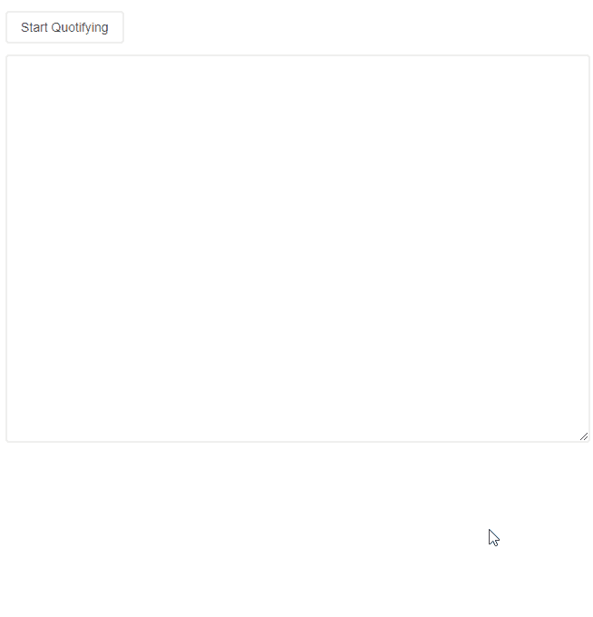
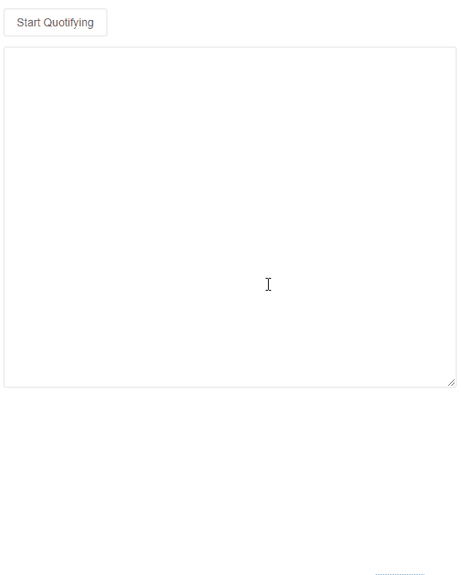

# 反应钩子的力量

> 原文：<https://betterprogramming.pub/the-power-of-react-hooks-7584df3af9fe>

## 仅使用 React 的这一新功能创建应用程序


*Blake Connally 在 Unsplash 上拍摄的照片*

[*React*](https://reactjs.org/)*[*Hooks*](https://reactjs.org/docs/hooks-intro.html)是 React 库的新成员，已经席卷了 React 开发者。钩子允许你编写状态逻辑和使用其他 React 特性，而不必编写一个[类组件](https://reactjs.org/docs/components-and-props.html#function-and-class-components)。你可以单独使用钩子来开发自己的应用程序，这对于 React 团队中的任何人来说都是一个巨大的转变。*

*在本文中，我们将构建一个应用程序，我称之为“Slotify”，只使用 React 钩子。*

# *Slotify 是做什么的，怎么做的？*

*Slotify 将提供一个用户界面，该界面提供一个`[textarea](https://developer.mozilla.org/en-US/docs/Web/HTML/Element/textarea)`来将引用插入到任何博客文章中。换行符(`\n`)和字数会在数量上起作用。一个“槽化”的帖子最少一个，最多三个引号。*

*只要有*槽*可用，就可以插入报价。用户将能够与插槽和类型或粘贴在报价和他们选择的作者属性互动。当他们完成后，他们可以点击保存按钮，博客文章将重新加载，现在包括他们的报价。*

*这些是我们将使用的 Hooks APIs 基本上，它们都是:*

*   *`[React.useState](https://reactjs.org/docs/hooks-reference.html#usestate)`*
*   *`[React.useEffect](https://reactjs.org/docs/hooks-reference.html#useeffect)`*
*   *`[React.useRef](https://reactjs.org/docs/hooks-reference.html#usecontext)`*
*   *`[React.useReducer](https://reactjs.org/docs/hooks-reference.html#usereducer)`*
*   *`[React.useCallback](https://reactjs.org/docs/hooks-reference.html#usecallback)`*
*   *`[React.useMemo](https://reactjs.org/docs/hooks-reference.html#usememo)`*
*   *`[React.useImperativeHandle](https://reactjs.org/docs/hooks-reference.html#useimperativehandle)`*
*   *`[React.useLayoutEffect](https://reactjs.org/docs/hooks-reference.html#uselayouteffect)`*
*   *`useSlotify`(风俗)*

*这就是我们将要构建的:(将一篇博文转换成带有样式化引用的博文，并返回包含样式的博文的 HTML 源代码)*

**

# *我们开始吧*

*在本教程中，我们将使用`create-react-app`快速生成一个 React 项目；GitHub 库[这里](https://github.com/jsmanifest/build-with-hooks)。*

*继续使用下面的命令创建一个项目。对于本教程，我们称我们的项目为`build-with-hooks`。*

```
*npx create-react-app build-with-hooks*
```

*完成后，现在进入目录:*

```
*cd build-with-hooks*
```

*我们将稍微清理一下主条目`src/index.js`，这样我们就可以专注于`App`组件:`src/index.js`。*

*转到`src/App.js`让我们从什么都不渲染开始:*

*首先，我们将制作一个开始按钮。然后，我们将为用户创建`textarea`元素来插入内容:`src/Button.js`。*

*在`index.css`内部，我们将应用一些样式，以便每个`button`都有相同的样式:`src/index.css`。*

*让我们继续创建`textarea`组件。我们就叫它`PasteBin` ( `src/PasteBin.js`):*

*我们使用内联样式，因为我们希望在生成最终内容时包含这些样式。如果我们使用纯 CSS，只会生成类名字符串，所以组件会变得没有风格。*

*我们将创建一个 React [上下文](https://reactjs.org/docs/context.html)来从顶部包装整个事情，以便我们强制所有子组件与其余组件保持同步。我们将通过使用`[React.useContext](https://reactjs.org/docs/hooks-reference.html#usecontext)`来做到这一点。*

*创建一个`Context.js`文件(`src/Context.js`):*

```
*import React from 'react'const Context = React.createContext()export default Context*
```

*现在，我们将创建`Provider.js`，它将导入`Context.js`，并将所有逻辑保持在管理状态(`src/Provider.js`):*

*这最后一段代码非常重要。我们本来可以使用`React.useState`来管理我们的状态，但是当你考虑我们的应用程序将要做什么时，你可能会意识到它不仅仅是一个单一的状态。这是因为需要考虑双方的情况:*

1.  *用户什么时候想把他们的博客文章分槽？*
2.  *我们应该何时向他们展示最终的翻新内容？*
3.  *我们应该在博文中插入几个槽？*
4.  *我们应该何时显示或隐藏插槽？*

*知道了这一点，我们应该使用`React.useReducer`来设计我们的状态，以便将状态更新逻辑封装到一个单独的位置。我们的第一个动作是通过添加第一个可通过调度类型为`'set-slotified-content'`的动作访问的开关用例来声明的。*

*我们将在博客文章中插入槽的方法是获取一个字符串，并将其转换为一个数组，用换行符`'\n'`对其进行分隔。这就是为什么初始状态声明`slotifiedContent`为数组；因为那是我们存放工作数据的地方。*

*我们还看到声明了一个`textareaRef`,因为我们需要使用它来获取对我们之前创建的`PasteBin`组件的引用。我们本可以让`textarea`完全由[控制](https://reactjs.org/docs/forms.html#controlled-components)，但是与它沟通的最简单和最有效的方式是获取对根`textarea`元素的引用。我们真正需要做的是获取它的值，而不是设置状态。这将在稍后使用`textarea`上的`ref`支柱来抓取。*

*我们的`slotify`函数在用户按下开始引用按钮来将他们的博客文章归档时被调用。目的是弹出一个模式，并向他们显示可以输入报价的位置。我们使用对`PasteBin`组件的引用来获取`textarea`的当前值，并将内容迁移到模态。*

*然后，我们使用两个实用函数，`attachSlots`和`split`来对博客文章进行开槽，并使用它们来设置`state.slotifiedContent`，以便我们的 UI 可以拾取它。*

*我们将`attachSlots`和`split`放入一个`utils.js`文件(`src/utils.js`)如下:*

*为了将`textareaRef`应用到`PasteBin`，我们必须使用`React.useContext`来获得我们之前在`useSlotify` ( `src/PasteBin.js`)中声明的`React.useRef`钩子:*

*我们缺少的最后一样东西是`<Slot />`组件，因为我们在上下文中使用了它。这个`slot`组件接受来自用户的报价。用户不会马上看到它，因为我们将把它放在模态组件中，只有当用户单击开始报价按钮时，它才会打开。*

*这个`slot`组件可能有点难，但是我会在后面解释发生了什么:*

*这个文件最重要的部分是`state.drafting`。我们还没有在上下文中声明这一点，但它的目的是给我们一种方法来知道何时向用户显示插槽，以及何时向他们显示最终输出。当`state.drafting`为`true`(这将是默认值)时，我们将向他们展示可以插入报价的插槽。当他们点击保存按钮时，`state.drafting`将切换到`false`，我们将使用它来确定他们想要查看他们的最终输出。*

*我们声明了一个默认值为`'textfield'`的`input`参数，因为将来我们可能想要使用除了输入之外的其他输入类型(例如:文件输入，我们可以让他们上传图片作为引用，等等。).对于本教程，我们将只支持`'textfield'`。*

*所以当`state.drafting`为`true`时，`<SlotDrafting />`被`Slot`使用，当`false`时，`<SlotStatic />`被使用。最好将这种区别分成组件，这样我们就不会用一堆`if/else`条件来膨胀组件。*

*此外，尽管我们为报价输入字段声明了一些内联样式，但是我们仍然应用了`className={styles.slotQuoteInput}`以便我们可以样式化占位符，因为我们不能使用内联样式来这样做。(这对于最终的翻新内容来说是可以的，因为甚至不会生成输入。)*

*下面是`src/styles.module.css`的 CSS:*

```
*.slotQuoteInput::placeholder {
  color: #fff;
  font-size: 0.9rem;
}*
```

*让我们回过头来向上下文`src/Provider.js`声明`drafting`状态:*

*最后，让我们把它放到`App.js`组件中，这样我们就可以看到目前为止它是什么样子了。*

*(注意:在这个例子中，我使用了来自`semantic-ui-react`的模态组件，它不是模态所必需的。您可以使用任何模型，或者使用 React [门户](https://reactjs.org/docs/portals.html) API 创建自己的普通模型。下面是`src/App.js`:*

*在启动我们的服务器之前，我们需要声明模态状态(`open/closed`):*

***src/Provider.js***

*这是我们目前应该有的:*

**

*(注意:保存按钮关闭了图像中的模态，但这是一个小错误。它不应该关闭模态。)*

*现在我们将对`PasteBin`做一点修改，为`textarea`声明一个使用`React.useImperativeHandle`的新 API，这样我们就可以在`useSlotify`中使用它。我们不会用一堆函数来膨胀钩子；相反，我们将提供一个封装的 API ( `src/PasteBin.js`):*

*`textareaUtils`也将是一个`React.useRef`，它将紧挨着`textareaRef`放置在`useSlotify`钩中；*

*我们将在`slotify`函数(`src/Provider.js` ) **:** 中使用这个新的 API*

*当用户正在查看这些位置时，我们发现他们还没有插入作者属性，我们希望闪现该元素以引起他们的注意。*

*为此，我们将在`SlotDrafting`组件中使用`React.useLayoutEffect`，因为`SlotDrafting`包含作者输入(`src/Slot.js`):*

*我们这里大概不需要`useLayoutEffect`，只是为了演示。众所周知，这是样式更新的一个好选择，因为钩子是在安装了`dom`并更新了它的变体之后调用的。它对样式有好处的原因是因为它在下一次浏览器重画之前被调用，而`useEffect`钩子是在之后被调用的——这可能会在 UI 中造成迟钝、浮华的效果。风格。现在，`src/styles.module.css`:*

*在模态的底部，我们放了一个`SAVE`按钮，它将从`useSlotify`调用`onSave`。当用户点击时，插槽将转换为最终插槽(当`drafting === false`时)。我们还将在附近呈现一个按钮，将 HTML 中的源代码复制到用户的剪贴板，以便他们可以将内容粘贴到他们的博客帖子中。*

*一切都将保持不变，除了现在我们将使用 CSS 类名。新的 CSS 类名以`Static`为后缀，表示它们在`drafting === false`时使用。这里对`Slot`组件做了一点小小的改动，以适应 CSS 的变化(`src/Slot.js` ) **:***

*以下是新添加的 CSS 样式:*

*这是我们的应用程序现在的样子:*

**

*我们需要做的最后一件事是添加一个关闭按钮来关闭 modal，并添加一个复制按钮来复制最终博客文章的源代码。*

*添加关闭按钮很容易。只需在保存按钮旁边添加这个按钮。复制按钮将放在关闭按钮旁边。这些按钮将被赋予一些`onClick`处理程序(`src/App.js`):*

*看起来我们应该在实现`onCopyFinalContent`函数的时候就完成了——但是我们没有。我们遗漏了最后一步。当我们复制最终确定的内容时，我们复制的是 UI 的哪一部分？我们不能复制整个模态，因为我们不想在我们的博客文章中使用保存、关闭和复制按钮；看起来会非常尴尬。我们必须制作另一个`React.useRef`并使用它来附加到一个只包含我们想要的内容的特定元素。*

*这就是为什么我们使用内联样式，而不完全是 CSS 类；因为我们希望翻新版包含这些款式。*

*在`useSlotify`中声明`modalRef`:*

*将其附加到只包含内容的元素(`src/App.js`):*

*注意:我们用一个`React.useCallback` 包装了`ModalContent`，因为我们希望引用保持不变。如果我们不这样做，那么组件将被重新呈现，所有的引用/作者值将被重置，因为`onSave`函数更新了状态。当状态更新时，`ModalContent`会重新创建自己，产生一个新的空状态，这是我们**不想要的。***

*最后，`onCopyFinalDraft`将被放置在`useSlotify`钩子内，钩子将使用`modalRef` ref ( `src/Provider.js` ) **:***

*我们结束了！*

*这是我们的应用程序:*

**

# *结论*

*我希望这篇文章对你有用，并期待将来有更多的发现！*