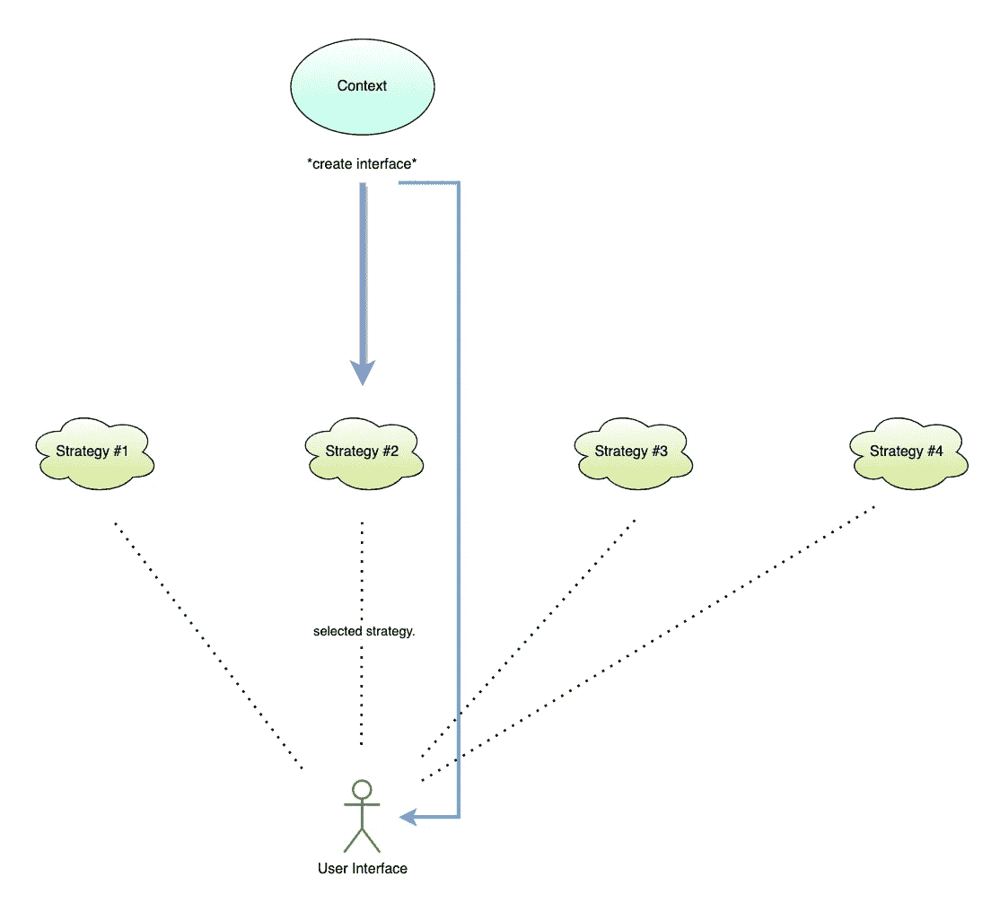
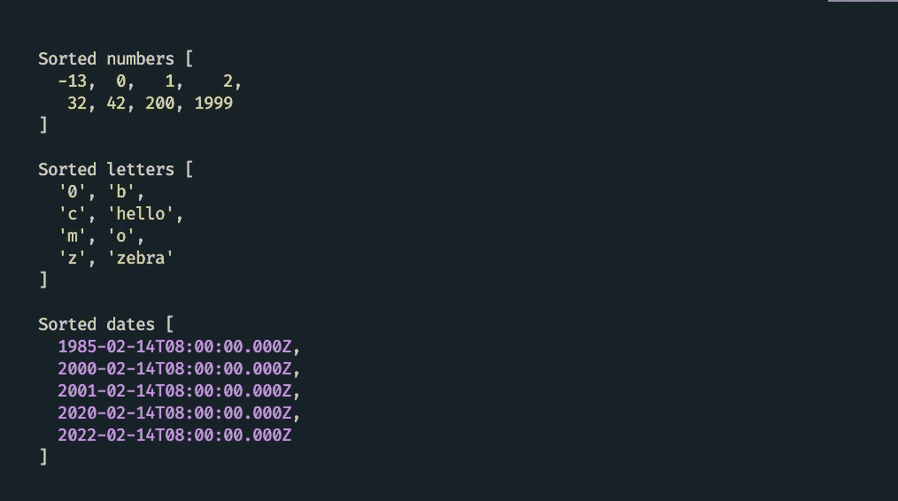

# JavaScript 中策略设计模式的力量

> 原文：<https://betterprogramming.pub/the-power-of-strategy-design-pattern-in-javascript-df1a17bc2c72>

## 创建你的下一个策略

图片来源: [jsmanifest](https://jsmanifest.com)

JavaScript 是一种以灵活性著称的语言。你可能听说过有人说这是 JavaScript 的弱点之一，甚至有人说完全相反。我更倾向于后者，因为我们倾向于利用这一点来做一些在很多年前几乎不可能的事情。

React 已经是一个事实证明，支持这一点，因为此后发明了惊人的工具。还有为今天蓬勃发展的技术提供动力的[电子](https://www.electronjs.org/)，比如 [Visual Studio Code](https://code.visualstudio.com/) 和 [Figma](https://www.figma.com/) 。

如今，每个 JavaScript 库都使用某种形式的设计模式，这也是现代 JavaScript 生态系统中的一个热门话题。在这篇文章中，我们将关注的一个设计模式是策略设计模式。因为 JavaScript 非常灵活，它使得像 Strategy 这样的设计模式变得健壮，正如我们将在本文中看到的。

在这篇文章中，我们将回顾战略设计模式。这是一个众所周知的模式，它封装了一个或多个*策略*(或*算法*)来完成任务。这些封装的策略都具有相同的签名，因此上下文(提供*接口*的那个)永远不知道它们何时处理相同或不同的对象(或*策略*)。这意味着每种策略都可以被交换多次，而我们的程序在应用程序的生命周期内不会意识到这一点。

# 涉及什么样的对象？

在策略模式中，总是涉及到这两个对象:

1.  **上下文**
2.  **策略**

*上下文*必须始终有一个引用或指针指向正在使用的*当前策略*。这意味着如果我们有 200 个策略，那么其他 199 个策略是可选的。你可以认为他们是“不活跃的”。

*上下文*也为调用者提供接口*。*呼叫者*就是*客户*。*呼叫者*可以使用任何策略来执行他们的工作，并且他们还可以根据需要随时将当前策略切换为另一个策略。*

实际的*策略*为自己实现执行时将使用的执行逻辑。

# 强项

在正常的函数实现中，函数通常会做一些事情并返回一个值。在策略设计模式中，当有一个基类( *Context* )和一个策略时，它就像是一个调用策略并返回结果的函数(换句话说就是相同的东西)。

但是当有*两个*或者更多的策略时，重点是这个策略可以是呼叫者控制的众多策略中的一个。

这里的主要好处是，我们可以定义*尽可能多的策略*，并根据需要在每一个策略之间进行交换，而不会对代码的行为造成任何改变，只要模式是按照它应该的方式编写的。

策略的实现可以改变，但是只要它们保持与上下文所期望的相同的签名，就没有必要对代码进行不必要的修改。

下面是描述这一流程的图表:

图片来源: [jsmanifest](https://jsmanifest.com)

# 履行

我们的第一个实现将集中在获取上。我们将定义一个返回*接口*的`createFetcher`函数来创建获取器。这些获取器可以由客户端产生，并且可以按照它们想要的方式实现*，只要它们接受一个 URL，检索并返回它的响应*。

我们将使用 [axios](https://github.com/axios/axios) 请求库、节点的本机 [https](https://nodejs.org/dist/latest-v16.x/docs/api/https.html) 模块和[节点获取](https://github.com/node-fetch/node-fetch)库来分别实现一个策略。

我们总共有 3 个策略:

在我们的`createFetcher`函数中，我们创建了这样一行:`const _identifer = Symbol('_createFetcher_')`

这一行很重要，因为我们希望确保创建的每个策略*实际上都是策略*，否则我们的程序会将任何传入的对象视为策略。把任何事情都当作一种策略听起来可能是一种积极的好处，但是我们会失去有效性，这使得我们的代码更容易出错，如果我们出错，这很容易阻碍我们的调试体验。

`Symbol`通过[定义](https://developer.mozilla.org/en-US/docs/Web/JavaScript/Reference/Global_Objects/Symbol)返回给我们一个唯一变量。它也隐藏在上下文的实现中，所以在我们的`create`函数之外创建的对象不可能被视为策略。他们必须使用由*上下文*提供的*接口*公开的方法。

当客户端调用`use`时，它提交`axiosFetcher`作为当前策略，然后被绑定为参考，直到客户端通过`use`换入另一个策略。

现在我们有三种检索数据的策略:

万岁！我们现在已经看到了如何在代码中实现它。但是我们能想到在现实世界中我们需要这个的情况吗？实际上你可以想到很多！然而，如果这是你第一次读到这种模式，那么我理解，除非我们先在实践中看到一个场景，否则很难事先想到一个场景。

本文中的例子展示了模式的实现，但是任何阅读本文的人都会问“既然可以直接使用像 axios 这样的策略来获得响应并结束工作，为什么还要费心实现三个 fetcher 策略呢？”

在接下来的例子中，我们将讨论一个场景，其中战略设计模式是绝对需要的。

# 处理不同的数据类型

策略模式最出彩的地方是当我们需要处理不同的数据类型时，比如进行排序。

在前面的例子中，我们*并不真正关心*任何数据类型，因为我们只是想要一些响应。但是，当我们收到一些东西，需要做一些狭窄的任务，如分类，会发生什么呢？如果它们需要被正确分类怎么办？

当我们需要对几个集合进行排序时，其中每个集合都是另一种数据类型的集合，我们不能只对所有的集合使用原生的`.sort`方法，因为每个值都可以根据“更小”和“更大”进行不同的处理。

我们可以使用策略模式，定义运行时可用的不同排序算法集，这样我们就可以根据需要互换使用它们。

考虑这些集合:

我们可以创建一个`Sort`策略类和一个`Sorter`上下文类。

注意，它们不需要成为类。我们现在只是选择使用类来使实现稍微多样化:

这很简单。`Sorter`保持对当前正在被*使用的`Sort`的引用*。这是调用`sort`时将被选中的排序功能。每个`Sort`实例都是一个策略，并被传递给`use`。

`Sorter`对策略一无所知。它不知道有日期分类器、数字分类器等。它*只是调用排序的执行方法*。

然而，客户端*知道*所有的`Sort`实例，并控制策略以及`Sorter`:

也就是说，完全由我们(客户)来相应地处理这个问题:

我们现在有了一个健壮的 *15 行函数*，可以对集合的 *4 种不同变体*进行排序！

图片来源: [jsmanifest](https://jsmanifest.com)

这就是 JavaScript 中策略设计模式的强大之处。

由于 JavaScript 将函数视为值的特性，这个代码示例将这种能力与其优势结合在一起，并与策略模式无缝协作。

本帖到此结束！我希望您发现这是有用的，并在未来继续关注更多有用的提示！！