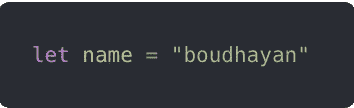
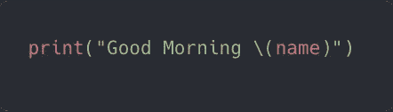
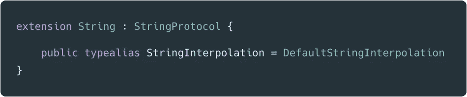

# Swift 中字符串插值的强大功能

> 原文：<https://betterprogramming.pub/the-power-of-string-interpolation-in-swift-6fe392ebde6c>

## 探索 Swift 中的字符串插值新超能力

照片由[帕特里克·托马索](https://unsplash.com/@impatrickt?utm_source=unsplash&utm_medium=referral&utm_content=creditCopyText)在 [Unsplash](https://unsplash.com/search/photos/string?utm_source=unsplash&utm_medium=referral&utm_content=creditCopyText) 上拍摄

# **我们说字符串，我们写字符串**

弦在我们的世界里无处不在。我们开发人员以字符串开始我们的一天，在我们最喜欢的 IDE 中编写代码，以字符串结束，编写我们的状态电子邮件。

不管我们愿不愿意，我们每天都在写大量的字符串插值。我们没有其他选择。

也许你现在在想，我什么时候使用了字符串插值？我觉得我没用过！

嗯，也许你没有发现它，但是相信我——你每天都在使用它！

*如果我每天都在使用它，为什么我现在需要学习它？*

世界上很多编程语言都支持字符串插值。Swift 从一开始就支持字符串插值。但是在 Swift 5.0 中，它获得了超能力，这就是为什么我写这篇文章并探索字符串插值的一些新特性。我们开始吧！

# 什么是字符串插值？

字符串插值是在字符串中包含一个变量或常量。这是一种通过在字符串文字中混合常量、变量和文字及其值来构建新字符串的方法。

假设我想说“*早上好”*到“*boudhayan”*，我该怎么做？

我们都知道——我们每天都在使用这种代码。很简单。

## 字符串插值只是一个众所周知的功能的花哨名称

*现在让我们检查 Swift 代码，看看它在 Swift 标准库中是如何定义的。*

这只是一个简单的类型别名:

## **那么 Swift 5 中的字符串插值有什么新功能呢？**

现在，我们可以扩展字符串插值，以包括我们自己的自定义插值。我们现在可以随心所欲地使用字符串插值—没有任何限制！

但这实际上意味着什么呢？让我们创建两个简单的自定义插值，看看我们能做些什么。

这里我们创建了两个`String.StringInterpolation`的扩展。

创建自定义插值时，需要遵循两个步骤:

1.  创建一个扩展的`String.StringInterpolation`
2.  为`mutating func appnedInterpolation()`编写自定义实现

让我们实现实际的方法。我们必须给`appendInterpolation`方法一个定制的实现。这个方法为我们带来了所有的魔力，所以请确定我们想要达到的目标，并据此给出实现方案。

在第一个扩展中，我们希望字符串插值为我们拼写所有的整数值，这样我们就不需要编写更多的代码。在第二个扩展中，它做的和第一个完全一样，只是用了`date`。

这是我们自定义的字符串插值。如你所见，它正在拼读终端中的`age`和`date`。

没错，这就是我们说的字符串插值的超能力！

我们可以用字符串插值实现很多其他的东西。

例如，我们可以将闭包作为一个参数。在下面的代码片段中，我们实现了一个定制的字符串插值函数，它将一个`autoclosure`闭包和一个字符串文字作为参数。`condition`闭包返回`Bool`，如果闭包返回`true`，那么只有它在字符串后面追加字符串，否则不进行插值。

如果`age`大于`18`，则仅打印`literal`消息。

我们再举一个例子。在下面的代码片段中，`appendInterpolation`函数从`String`中取一个`array`，如果`array`为`empty`，则打印`default`消息；否则，它将`array`元素与`->`元素连接并打印。

假设我们有一个想要在控制台中打印的`optional`字符串。但是每当我们在`print`函数中写它时，我们都会得到一个著名的编译器警告:它说我们不能简单地打印可选的。如果我们像这样打印，那么它打印的是一个`optional`中的值。我们不想要这个——我们想打印那个`String`的精确值。

我们有两种选择。一种是强制展开`string`可选。另一种是通过使用`??`操作符给它一个`default`值。我们可以做同样的事情，但是要用更详细的方式。

让我们通过使用字符串插值来简化它。我们可以实现如下所示的字符串插值函数，它采用一个`one`可选字符串和一个`default`值。如果`optional`字符串包含`nil`值，则打印`default`值，否则展开`value`可选字符串并打印包装后的值。

到目前为止，我们已经看到了实现自定义字符串插值方法的范围。我们可以做无限的事情——我们可以玩这个。我们可以创建自己的使用字符串插值的自定义类型，这从字面上显示了字符串插值的超级能力。我们将创建一个可以使用插值初始化的`ConsoleMessage`类型，并为不同类型的`Message`以预定义的插值格式打印不同的消息。

实现如下:

在本文中，我们实现了许多自定义的字符串插值函数。令人惊讶的事实是，这不是极限——我们可以用它做许多其他有趣的事情，也可以用它做严肃的用例。

为什么要等？现在就去做吧！

感谢您的阅读！