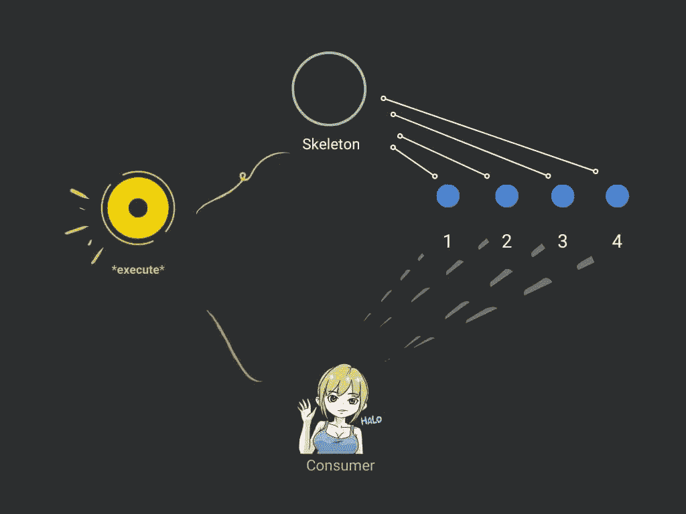
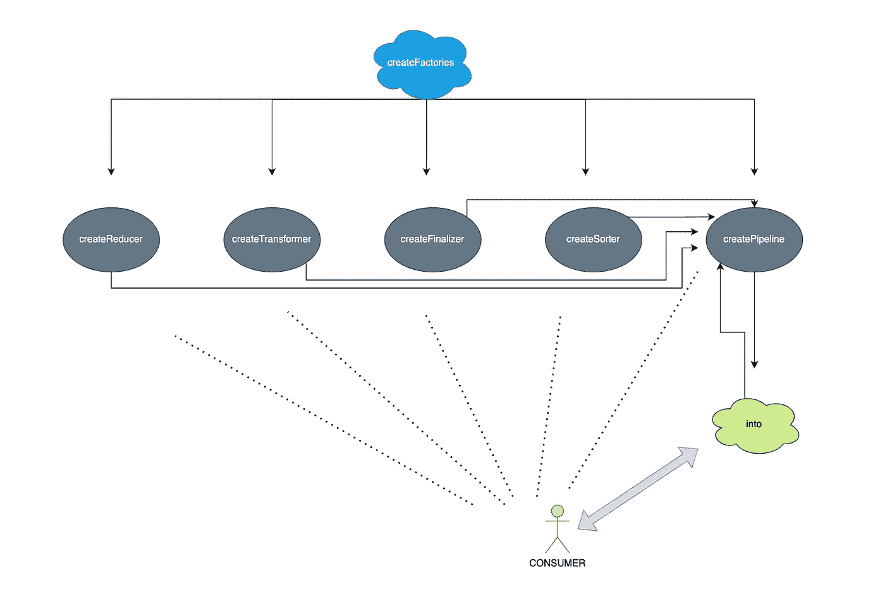

# JavaScript 中模板设计模式的威力

> 原文：<https://betterprogramming.pub/the-power-of-template-design-pattern-in-javascript-973a57d03dac>

## 模板有多种形式

作者图片

如果您以前使用过 nodejs，那么您会知道包是这个平台的核心。每天每秒都有新的更新或新的软件包发布到 npm 注册表。这些包中的大多数都是可重用和可扩展的。他们这样做的方式可以是许多方式中的一种，但有一个共同的特点:他们可以被看作是等待你执行的模板。

这篇文章将介绍 JavaScript 中的模板设计模式。我们将深入探讨这种模式的方法，并讨论我们应该使用它的一个场景。我们还将看到一个“盒子外面”的结构图

最后，我们将在代码中实现该模式，这样到本文结束时，您就能熟练使用 JavaScript 模板了。

# 模板模式是如何工作的？

当我们实现这个模式时，一个有用的方法是考虑事情的开始阶段和结束阶段。

有时候，当我们编写函数时，我们首先考虑的是它们的参数和变量将如何初始化。最终，我们决定如何结束这个函数。

中间发生什么，要看实现。

这类似于模板的工作流程。

用更官方的术语来说，它本质上是一个提供给消费者的裸接口，这样他们就可以实现算法的一个或多个步骤，而无需改变结构。

在他们定义了这些步骤并遵循执行之后，就像一个基本功能一样到达了“结束”阶段。

# 什么时候需要模板模式？

当两个函数在实现或接口上有重要的相似之处，但由于不能重用这些相似之处而面临相同的问题时，这是最需要的。这意味着当一个函数的实现更新时，另一个函数也需要更新它的实现。这是一种不好的做法，如果不处理，最终会变得不可维护。

这就是模板模式的用武之地。它将这些相似之处封装在自身中，并将其他部分的职责委托给那些自己派生和实现它们的人。

这样，如果封装部分的实现发生了变化，所有的派生类都不必参与其中。

# 模板模式在代码中是什么样子的？

在本节中，我们将自己实现模板模式。

正如我之前提到的，这可以通过很多方式实现，因为其实现中的模式与它所解决的问题密切相关。然而，当我们从更大的角度来看时，它们都有相同的目标。

假设我们正在构建一个函数，它对任意日期格式的日期集合运行一系列“转换”函数。这些可能看起来像这样:

我们的功能将实现模板模式，我们的任务是定义包含这些“空”占位符的基础框架:

1.  `reducer`
2.  `transformer`
3.  `finalizer`
4.  `sorter`

当对象被创建并从其中一个派生时，它们可以提供自己的算法，当我们的函数执行时，这些算法将会运行。

消费者必须将`reducer`实现为一个函数，它接受一个累加器和一个值，并返回一些累加的结果。

`transformer`是一个转换并返回任意数据类型值的函数。

`finalizer`接受一个值并返回任意数据类型的值。但是这一次，这个值将用于执行最后一步。

`sorter`是一个函数，它在第一个参数中接受一个项目，在第二个参数中接受另一个项目。该函数与您在本机`.Array.sort`方法中实现该函数的方式相同。

我们使用模板实现的函数将被命名为`createPipeline`，如果调用者提供了这些函数，它将接受这些函数。如果调用者没有提供其中的一个或多个，我们必须用默认的实现来替换它们，这样我们的算法仍然可以运行:

这个简单的函数是一个模板，调用者可以将它传递给自己的算法。它允许它们选择不传递任何实现，或者允许它们传递管道中涉及的四个函数中的一个或全部。

当它们用一个项目集合调用`into`函数时，下一步是立即通过管道运行所有这些项目，并最终累积到一个新的集合中。

我们经常从向消费者提供某种形式的模板接口的库中看到的是，他们试图使它尽可能容易使用。

例如，redux 库中的`createStore`提供了几个重载，开发人员可以使用它们进行实例化。这是一件非常有用的事情，它提高了它们的可重用性，也展示了模板在实践中的本质。

当一个算法需要一个模板模式实现中的严格流程时，它通常隐藏在实现中，就像 redux 中的`createStore`。

当我们回到上一个例子时，我们注意到这几行中的一些东西:

这不是必需的，也与我们的管道无关，但是因为我们创建了一个助手来区分它们，所以我们允许调用者以任何顺序传入任何`transformer`、 `reducer`、`finalizer`和`sorter`函数，即使它们在运行函数时需要按顺序。

因此，所有这些调用都返回完全相同的结果，即使它们的排序不同:

在内部实现中，如果它们以不同的顺序被调用，它不会像预期的那样工作，因为排序器需要是最后的操作。终结器需要在最终(排序器)操作之前运行，转换器需要在终结器之前运行。

这是更高级别的实现:

内部实现的几个关键部分之一是这几行:

这使得我们的模板是“正式的”，因为它隐藏了标识符，从外面看不到，只向消费者公开了`createTransformer`、`createReducer`、`createFinalizer`、`createSorter`和`createPipeline`。

帮助模板的另一部分是它上面的对象:

这有助于构建一个流畅的 API，读起来像英语:

让我们假设我们是消费者，我们想在这个日期集合上使用这个模板，就像我们前面看到的那样:

我们有一些问题:

1.  它们属于不同的数据类型。我们希望它们都是 ISO 日期格式。
2.  它们没有被分类。我们希望它们都按升序排序。

我们可以使用实现模板设计模式的代码来解决这些问题，这样我们就可以获得 ISO 格式的有序日期集合:

它不需要太多代码，我们所有的执行都返回相同的结果，如下所示:

下面是描述我们模板的图表:

图片来源于 [jsmanifest](https://jsmanifest.com)

这就对了。

# 另一个例子

我喜欢在我的几篇文章中使用 [snabbdom](https://github.com/snabbdom/snabbdom) 来演示概念，因为它简短、简单、强大，并且使用了一些与我过去所写主题相关的技术。Snabbdom 是一个前端 JavaScript 库，允许您使用虚拟 dom 创建健壮的 web 应用程序。他们关注简单性、模块化和性能。

它们提供了一个模块 API，开发者可以在其中创建自己的模块。他们通过向消费者提供一个模板来做到这一点，该模板提供了挂钩，这些挂钩与“修补”阶段的生命周期挂钩，在这个阶段，DOM 元素被传递给生命周期。这是使用虚拟 DOM 的一种简单而强大的方法。这是模板模式变化的一个很好的例子。

这是他们的模板:

这篇文章到此结束！我希望你从中有所收获。以后请留意我的更多帖子！