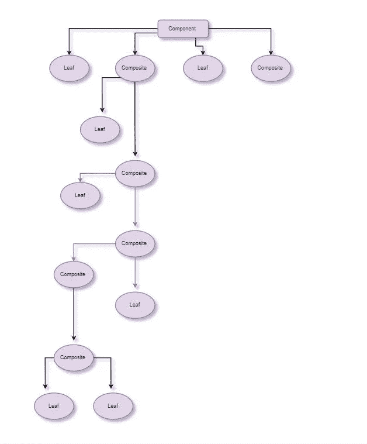
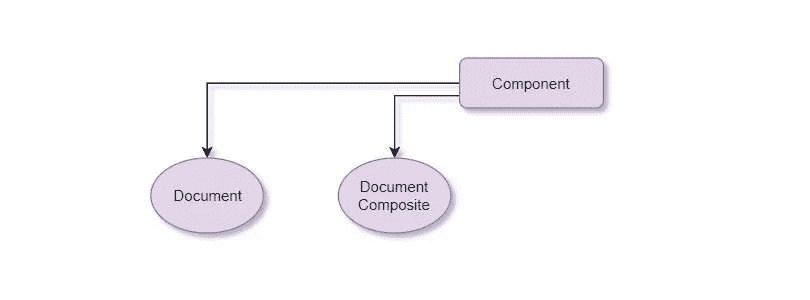
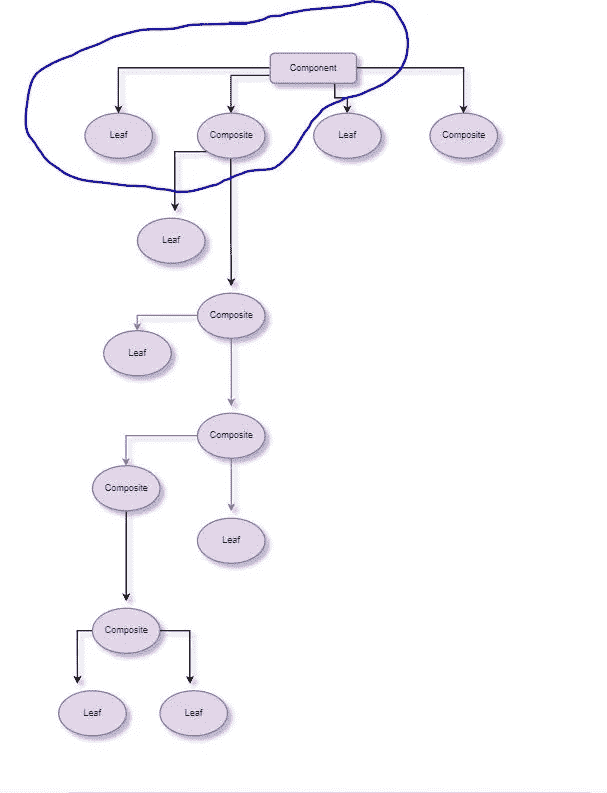
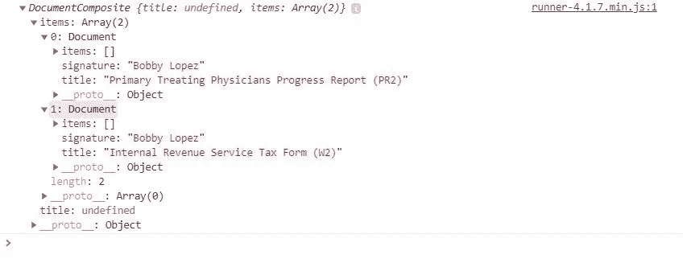
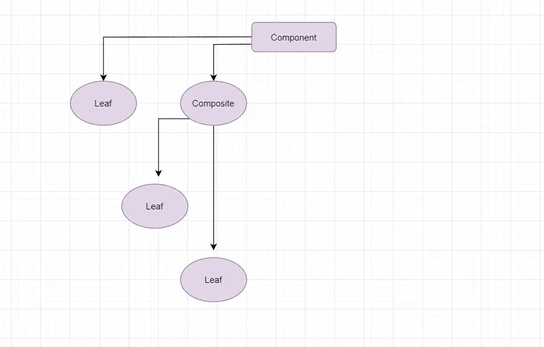
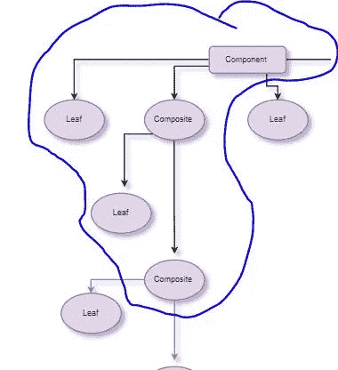
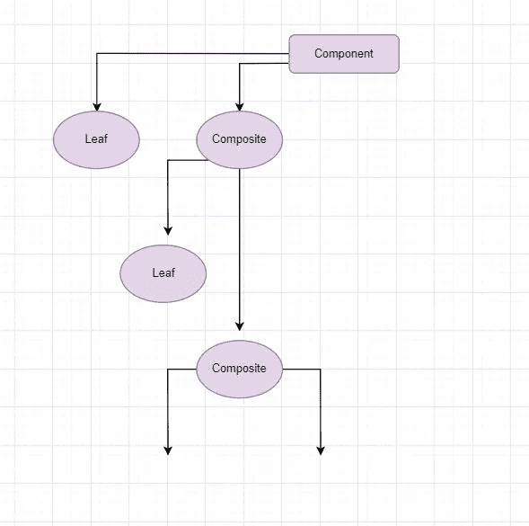
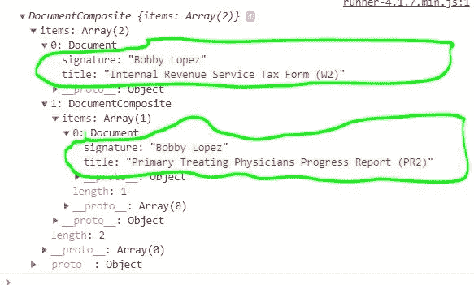

# JavaScript 中复合设计模式的威力

> 原文：<https://betterprogramming.pub/the-power-of-the-composite-design-pattern-in-javascript-51eef5eaaa05>

## 用复合模式编写代码


阿尔瓦罗·雷耶斯在 [Unsplash](https://unsplash.com/s/photos/design?utm_source=unsplash&utm_medium=referral&utm_content=creditCopyText) 上拍摄的照片

在这篇文章中，我们将讨论 JavaScript 中的*复合设计模式*。

在软件工程中，复合模式是这样一种模式，在这种模式中，一组对象将被当作单个对象的单个实例来对待，从而导致这些对象和组合的一致性。

复合的目的是*将*多个对象组合成某个[树形结构](https://en.wikipedia.org/wiki/Tree_structure)。这个树形结构代表一个*部分-整体层次*。

为了更详细地理解复合图案，我们必须理解什么是部分-整体，以及从视觉角度看它是什么样子。

用术语来说，部分-整体关系基本上是集合中的每个对象是*整体*组合的*部分*。这个*整体*组成是*部分*的集合。

现在，当我们想到部分-整体*层次*时，它是一个树形结构，其中每个*个体的*叶子或“节点”被视为与树中的其他叶子或节点相同。这意味着一组或一组对象(叶子/节点的子树)也是一个叶子或节点。

从视觉的角度来看，这样的一个例子可能看起来像这样:



现在我们对部分-整体的概念有了更清晰的理解，让我们回到术语*复合*。我们说过复合的目的是将这些对象(叶子/节点)组合成一棵树，代表这个概念。

因此，复合设计模式是集合*中的每一项都可以容纳其他集合*本身，使它们能够创建深度嵌套的结构。

# 解剖学

树结构中的每个节点共享一组公共的属性和方法，这使它们能够支持单个对象，并将它们视为对象集合。

该接口促进了递归算法的构造和设计，并迭代复合集合中的每个对象。

# 谁使用该模式？

操作系统使用这种模式，这反过来又导致了一些有用的特性，比如允许我们在其他目录中创建目录。

文件(此时我们可以将目录中的任何东西称为“项目”，这更有意义)是整个组合(目录)的叶/节点(部分)。

在这个目录中创建一个子目录也是一个叶子/节点，包括其他项目，如视频、图像等。然而，目录或子目录也是一个组合，因为它也是部分(对象/文件/等)的集合。).

像 React 和 [Vue](https://vuejs.org/) 这样的流行库广泛使用复合模式来构建健壮的、可重用的接口。你在网页上看到的一切都被表示为一个*组件*。

网页的每个组件都是树的一片叶子，并且可以将多个组件组合在一起以创建新的叶子。(当这种情况发生时，它是一个*复合*，但它仍然是树的一片叶子)。

这是一个强大的概念，因为它有助于使库的消费者更容易开发，此外还使构建利用许多对象的可伸缩应用程序变得非常方便。

# 我们为什么要关心这种模式？

最简单的说法:*因为强大。*

复合设计模式之所以如此强大，是因为它能够将一个对象视为复合对象。这是可能的，因为它们都共享一个公共接口。

这意味着您可以重用对象，而不用担心与其他对象不兼容。

当你开发一个应用程序时，你会遇到这样的情况:你处理的对象是一个树形结构，在你的代码中采用这种模式是一个非常好的决定。

# 例子

假设我们正在为一项新业务构建一个应用程序，其主要目的是帮助医生获得远程医疗平台的资格。他们通过为法律要求的强制性文件收集签名来做到这一点。

我们将有一个`Document`类，它将有一个默认值为`false`的`signature`属性。如果医生签署了文档，`signature`应该将其值翻转到他们的签名。

我们还定义了一个`sign`方法来帮助实现这个功能。

这是`Document`的外观:

现在，当我们实现复合模式时，我们将支持类似于 a `Document`定义的方法。

现在，这种模式的美妙之处来了。请注意我们最近的两个代码片段。让我们从视觉角度来看这个问题:



太好了！看起来我们走在正确的道路上。我们之所以知道这一点，是因为我们所拥有的与之前的图表相似:



因此，我们的树结构包含两个叶子/节点，即`Document`和`DocumentComposite`。它们共享相同的接口，因此它们都充当整个复合树的“部分”。

这里的事情是树的一个叶子/节点不是*复合的(T2)是*而不是*一个对象的集合或组，所以它将在那里停止。*

然而，*是*组合的叶子/节点持有一组部分(在我们的例子中是`items`)。记住，`Document`和`DocumentComposite`共享一个接口，共享`sign`方法。

那么，这其中的力量在哪里呢？

嗯，尽管`DocumentComposite`共享相同的接口，因为它有一个`sign`方法，就像`Document`一样，但它实际上实现了一个更健壮的方法，同时仍然保持了最终目标。

所以，不要这样:

我们可以改变我们的代码，使之更健壮，利用复合的优势:

在复合方法中，在我们添加了我们需要的文档后，我们只需要`sign`一次，它就会签署所有的文档。

我们可以通过查看`console.log(forms)`的结果来确认这一点:



在之前的例子中，我们必须手动将项目添加到一个数组中，自己循环遍历每个文档，然后`sign`它们。

让我们也不要忘记我们的`DocumentComposite`可以保存一系列物品的事实。

所以，当我们这样做的时候:

```
forms.add(pr2Form) *// Document*
forms.add(w2Form) *// Document*
```

我们的图表变成了这样:



这与我们添加两个表单时的原始图表非常相似:



然而，我们的树停止了，因为树的最后一片叶子只渲染了两片叶子，这与最后一张截图并不完全相同。如果我们将`w2form`合成，就像这样:

然后我们的树会继续生长:



最后，我们仍然实现了同样的目标，即我们需要签署强制性文件:



这就是复合模式的力量。

# 结论

这篇文章到此结束！我希望你发现这是有价值的，并期待在未来更多！