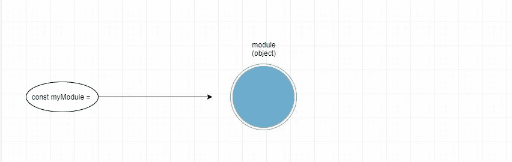
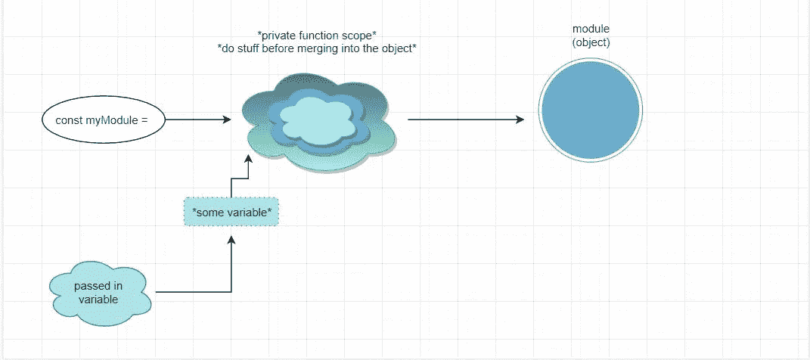

# JavaScript 中模块模式的威力

> 原文：<https://betterprogramming.pub/the-power-of-the-module-pattern-in-javascript-3c73f7cd10e8>

## 用模块模式美化你的应用程序


*照片由* [*约翰·施诺布里*](https://unsplash.com/@johnschno) *上* [*下*](https://unsplash.com/)

在 JavaScript 中，一个广泛使用且强大的模式是[模块模式](https://en.wikipedia.org/wiki/Module_pattern)。它实现起来非常简单，但是它允许开发人员封装他们的代码，这使得它成为构建健壮代码最通用的模式之一。当您查看 JavaScript 库的源代码时，您最有可能看到的是这种模式的实现——它们最有可能是一个[单例对象](https://en.wikipedia.org/wiki/Singleton_pattern)，这意味着在一个应用程序的整个生命周期中只存在一个实例。

JavaScript 新手可能很难理解模块模式，因为存在多种变体。然而，所有的时间和麻烦都是值得的，因为您将经常使用这种模式来使您的应用程序更加健壮。

# 模块

正如您可能已经猜到的，模块模式允许您创建模块。最终，模块基本上只是对象。但是有几种方法可以创建它们。

创建模块最基本的方法是将一个对象分配给一个变量，如下所示:

```
const myModule = {
  drive() {
    console.log('*drives*')
  },
}
```

一个简单的图像表示:



当我们利用 JavaScript 的一些独特特性来创建一个模块时，事情开始变得更加有趣，我们将在接下来讨论这个模块。

# 立即调用函数表达式

可以说模块模式最流行的变体是[life](https://developer.mozilla.org/en-US/docs/Glossary/IIFE)(立即调用函数表达式)。这些函数本质上是立即调用并返回一个对象(或者说是一个接口)，然后这个对象就变成了模块。

这些函数内部是可以被*私有*的代码，其方式是只有可以在该函数的作用域*内*被访问，除非*返回的对象提供了可以以某种方式访问它们的方法。这个返回的对象是公共的，对外界是可用的。*

对于那些更擅长从视觉角度理解事物的人来说，这里有一个图像表示:


我们将使用一个生命来实现我们自己的模块。这允许我们将一个生命的返回值直接赋给一个变量，这样我们就可以像使用 JavaScript 模块一样使用它。

例如，假设我们正在创建一个 RPG 游戏，我们决定做的第一件事是创建一个*女巫*类。在一般的角色扮演游戏中，女巫是非常强大的生物，拥有强大的魔法能力，如火、风、电等。他们通常拥有用意念拿起和移动东西的心灵遥控能力。几乎在每一个 RPG 游戏中，女巫都会施展法术或魔法，所以当我们为女巫定义界面时，我们会在上下文中保留这个概念。

在这个例子中，我们的女巫类有四个方法可供外界使用:`sorceress.fireBolt`、`sorceress.thunderBolt`、`sorceress.blizzard`和`sorceress.castAll`。

在这个模块中，我们声明了三个*私有*函数和四个*公共*函数。我们可以明显看出，以下划线`_`为前缀的函数是私有函数，而后者是公共函数。我们知道这一点是因为带下划线的那些没有被返回——相反，它们中的一些只是被公共方法*使用。这种能够通过[词法范围](https://stackoverflow.com/questions/1047454/what-is-lexical-scope)引用局部变量的概念被称为*闭包*。因为我们没有返回以下划线为前缀的变量，所以它们在模块外不可用——但是如果返回的方法选择这样做，它们*可以是*。*

以这种方式声明私有和公共变量的能力使得模块模式成为 JavaScript 应用程序中最强大的设计模式。当我们从 node.js 模块中使用`import`或`require`时，以及包含指向像`jQuery`这样的库的`<script>`标签时，基本上使用的是相同的模式。

# 全球进口

JavaScript 中模块模式的使用不限于我们前面的代码示例。由于 JavaScript 的灵活性，JavaScript 中的模块模式非常强大。例如，JavaScript 有一个特性叫做[隐含全局变量](http://geniuscarrier.com/implied-globals/)。如果在赋值中使用，如果全局变量不存在，则创建全局变量。因此，当我们在匿名闭包中使用或创建全局变量时，事情在某种程度上实际上会变得更容易。

然而不幸的是，随之而来的问题是，随着时间的推移，我们的代码变得越来越难以管理，因为我们不清楚在给定的文件中哪些变量是全局变量。

幸运的是，匿名函数提供了一个简单的选择。通过将全局变量作为参数传递给我们的匿名函数，它们被导入到我们的代码中，这比隐式全局变量更快、更清晰。

下面是一个说明这一概念的代码示例:

```
const myModue = (function(_) {
  *// do stuff*
})(lodash)
```

如您所见，我们现在可以将 lodash 作为全局变量的一部分进行访问。这里有一张图片展示了现在的情况:



# 为什么是一般的模块？

一般来说，使用模块有很多好处。以下是最重要的:

## 它帮助你更好地维护你的代码

根据定义，一个模块是[自包含的](https://stackoverflow.com/questions/39133044/what-does-self-contained-mean)，不应该依赖外部世界生存。更新一个单独的模块应该尽可能的简单，并且在改变时不应该破坏应用程序的其他部分。一个制作良好的模块应该是结构良好的，并尽可能减少对代码部分的依赖，以便它们与代码的其他部分解耦。

如果我们看一下前面代码示例中的女巫类，我们已经可以假设，如果我们试图更改其中定义的一个方法，如果它继续破坏代码库的其他部分，调试将会变成一个紧张的过程。如果这造成了多米诺骨牌效应，那就更是如此。模块应该以这样一种方式仔细设计，将来对它们的任何改变都不会影响代码的其他部分。

## 它帮助我们避免污染全局名称空间

在 JavaScript 语言中，位于顶级函数范围之外的所有变量都是全局变量。这意味着其他代码可以访问它们。这是有问题的，因为它造成了一种叫做 [*名称空间污染*](https://stackoverflow.com/questions/22903542/what-is-namespace-pollution) 的情况，其中任何完全不相关的代码在全局范围内共享变量。这是你在任何时候都想避免的事情。

## 它帮助我们重用代码

如果您已经使用 JavaScript 开发了一段时间，您可能会发现自己将代码复制并粘贴到多个项目中。这很好，直到你开始意识到你用糟糕的实践编写了代码片段，并决定用更好的实践重写它。如果您已经将代码复制并粘贴到多个项目中，那么您将面临一项枯燥、重复的任务，即必须更改代码的每个副本。拥有一个可以反复重用的模块肯定会容易得多，这样您只需要在一个位置更新模块。然后，消费者会自动看到你每次做的改动。

# 结论

这篇文章到此结束！我希望你发现这是有价值的，并期待在未来更多！

想保持联系吗？订阅我的[简讯](https://app.getresponse.com/site2/javascript-newsletter?u=zpBtw&webforms_id=SM2hz)。