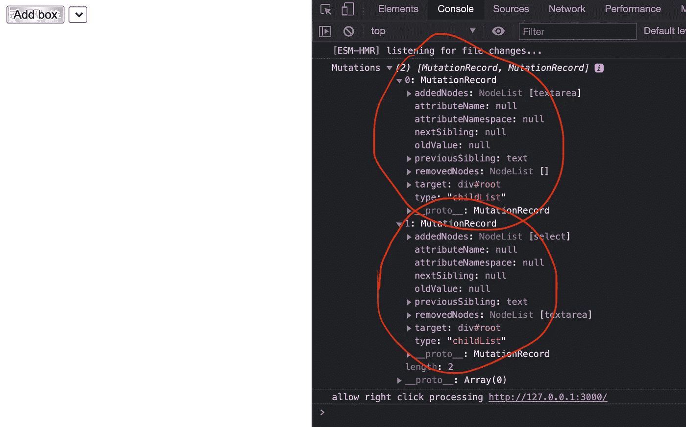
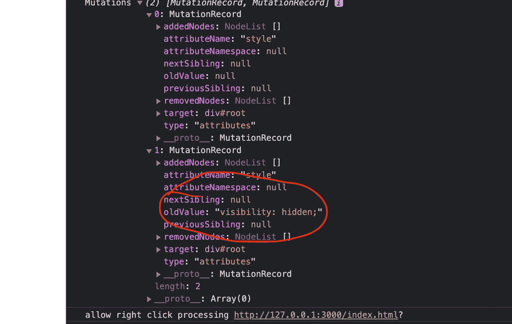
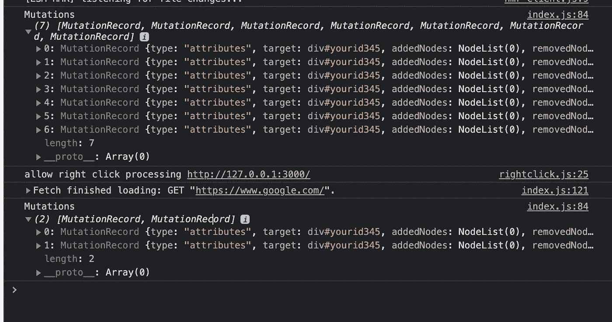
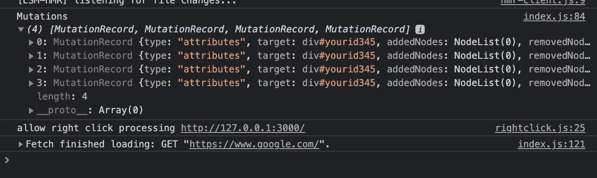
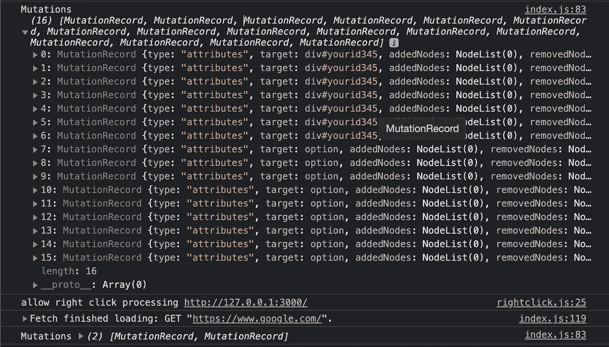
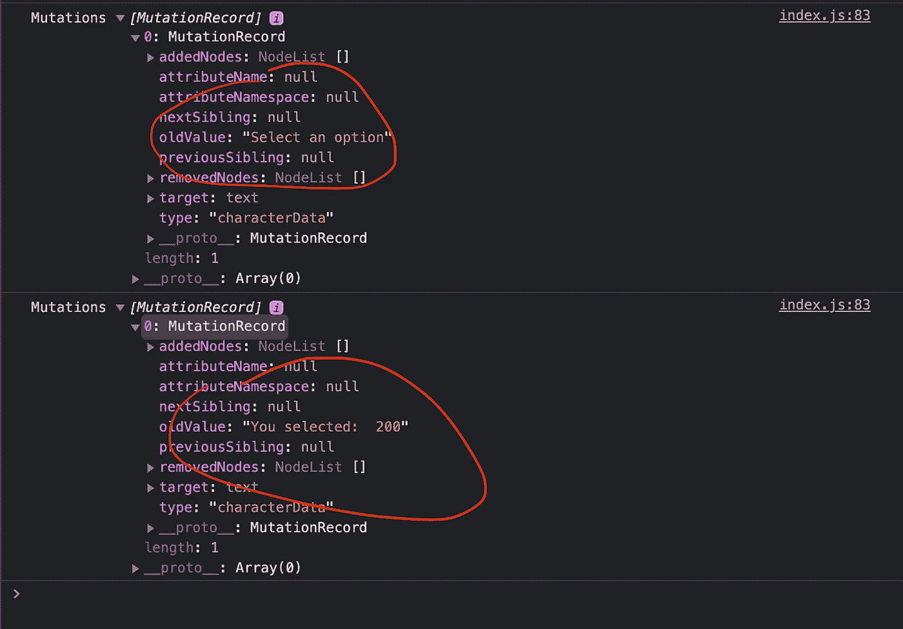
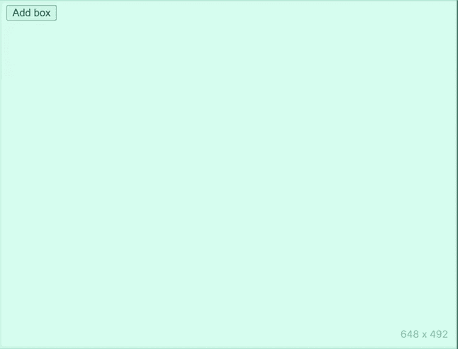
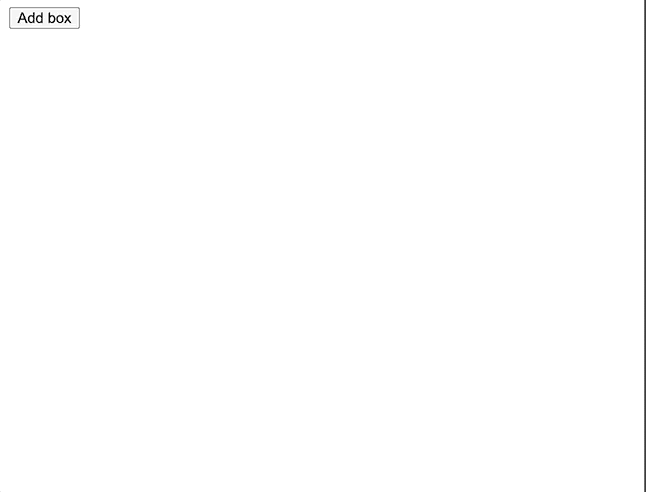

# JavaScript 中变异观测器的威力

> 原文：<https://betterprogramming.pub/the-power-of-the-mutationobserver-in-javascript-930450a92e48>

## 使用变异观察器来观察你的用户

[Kelly Sikkema](https://unsplash.com/@kellysikkema?utm_source=unsplash&utm_medium=referral&utm_content=creditCopyText) 在 [Unsplash](https://unsplash.com/s/photos/programming?utm_source=unsplash&utm_medium=referral&utm_content=creditCopyText) 上拍摄的照片。

在现代编程中，有很多关于所谓的*状态*的讨论，这通常围绕着用户交互性。[变异观察器](https://developer.mozilla.org/en-US/docs/Web/API/MutationObserver)是一个强大的 API，可以帮助我们做到这一点，因为我们可以用它来对用户交互做出反应。它取代了 DOM3 事件规范中遗留的[突变事件](https://developer.mozilla.org/en-US/docs/Web/API/MutationEvent) API。

要创建一个`MutationObserver`，我们需要用关键字`new`和回调来实例化它，如下所示:

`onMutation`回调接收两个参数(按顺序):

1.  `Mutations`—`[MutationRecord](https://developer.mozilla.org/en-US/docs/Web/API/MutationRecord)`对象列表。
2.  `Observer` —建造的`MutationObserver`。在我们最近的例子中，它是`observer`变量。

每次使用`observe`方法注册的 DOM 节点发生变化或突变时，都会调用`onMutation`回调。

`observe`方法接受一个 DOM 元素作为它的第一个参数，接受一个 options 对象作为它的第二个参数:

每当 DOM 节点有任何变化时，回调就会被调用，并接收一个`MutationRecord`对象的列表作为它的第一个参数，其中包含发生的突变的*类型*以及关于发生了什么的附加信息。通过这些记录对象，我们可以对用户体验进行巧妙的改进。

例如，我们可以开始观察一个元素，并在我们添加、删除甚至用其他子元素替换子元素时得到通知，但是我们必须通过在*选项*参数中传递`childList: true`来请求该信息:

我们也可以询问其他信息。下面是我们可以传入的选项的完整列表:

当我们请求`attributes`并且一个属性的值被改变时，我们能够通过像这样传入`attributeOldValue: true`来观察它被改变之前的值:

`attributeFilter`选项用于过滤掉我们不关心的突变。从逻辑上讲，应用程序越大，就越有必要这样做。否则，我们会很快结束一堆调用，这些调用是我们很可能永远不会在那个观察者中关联的:

如果我们只关心在`hidden`和`title`改变时接收通知，我们可以把它放在过滤器选项中:

这减少了结果，我们不必在回调实现中过滤它(这会膨胀功能块，使我们的代码将来更难维护):

当我们在选项中设置`subtree: true`时，我们将会得到被观察元素的所有后代发生变化的通知:

如果我们将`characterData`设置为`true`，我们可以得到元素内文本内容变化的通知，如下所示:

现在，选择选项将调用我们在观察器上的回调:

注意:`characterData`选项只会在`[Text](https://developer.mozilla.org/en-US/docs/Web/API/Document/createTextNode)`节点上的文本内容发生变化时通知我们。

所以代替这个的是:

我们必须创建一个`Text`节点，并在它的`data`上设置它的文本，这将触发回调:

现在你已经对`MutationObserver`的工作原理有了基本的了解，让我们快速构建一些使用它来增强用户体验的东西吧！

假设我们正在构建一个页面，让用户自定义他们的个人资料页面。我们给他们一个选项，让他们添加框来决定视觉结构，这就是它的样子:

我将展示样式表、DOM 结构和 JavaScript(代码中还没有`MutationObserver`):

样式表:

HTML:

JavaScript:

现在，当我们点击按钮，出现方框时，我们会感到有点困惑，不知道从哪里开始，或者甚至不知道应该关注哪个方框。我们可以通过在最近的框中添加一个高亮来解决这个问题，以提醒用户应该查看他们刚刚添加的框。稍后，我们可以添加输入、选择等控件。就像普通的应用程序一样。

突出显示最近的框意味着向用户发出信号，表明最近的框是活动的，引导用户找到它，而不是他们看着每个框，不知道从哪里开始:

我们可以很容易地使用一个`MutationObserver`来动态突出显示(甚至取消突出显示)添加到页面中的框。

因此，我们可以在前面的例子上再加一步，通过`MutationObserver` API 来改善用户体验。

首先，让我们为活动框添加类名样式:

接下来，我们可以创建一些帮助器函数，以便在添加盒子时添加/删除它们的类名:

现在`MutationObserver`来救援了！

在回调中，它采用发生的最后一个突变，这样我们就可以访问最近的元素。这就是我们从`MutationRecord`中所需要的，因为它包含了一个`target`属性，将我们直接带到 DOM 元素。这个 DOM 元素包含了`previousSibling`，我们需要访问它以便从中移除焦点样式。

现在让我们回顾一下返回的 API，它是对`new MutationObserver`的调用在`observer`变量中返回给我们的:

`MutationObserver`返回了`observer`可以使用的三个方法。我们已经讨论了`observe`方法:

1.  `disconnect()`
2.  `observe()`
3.  `takeRecords()`

`disconnect`方法阻止`observer`接收来自突变的进一步通知。这意味着它将在应用程序的剩余生命周期中保持沉默，直到在另一个 DOM 元素上调用`observe`来再次接收通知。

`takeRecords`方法获取所有剩余的突变(一个`MutationRecord`实例列表)并将它们作为数组返回。

# 结论

`MutationObserver`是一个强大的 API，它封装了现在已经废弃的*`MutationEvent`API。*

*`MutationObserver`使得使用 DOM 和对按需发生的变化做出反应变得更加容易。这使得它成为为像 Google Chrome 这样的浏览器开发 web 扩展的好伙伴。*

*今天的文章到此结束！我希望你觉得它有价值。以后多多关照！*