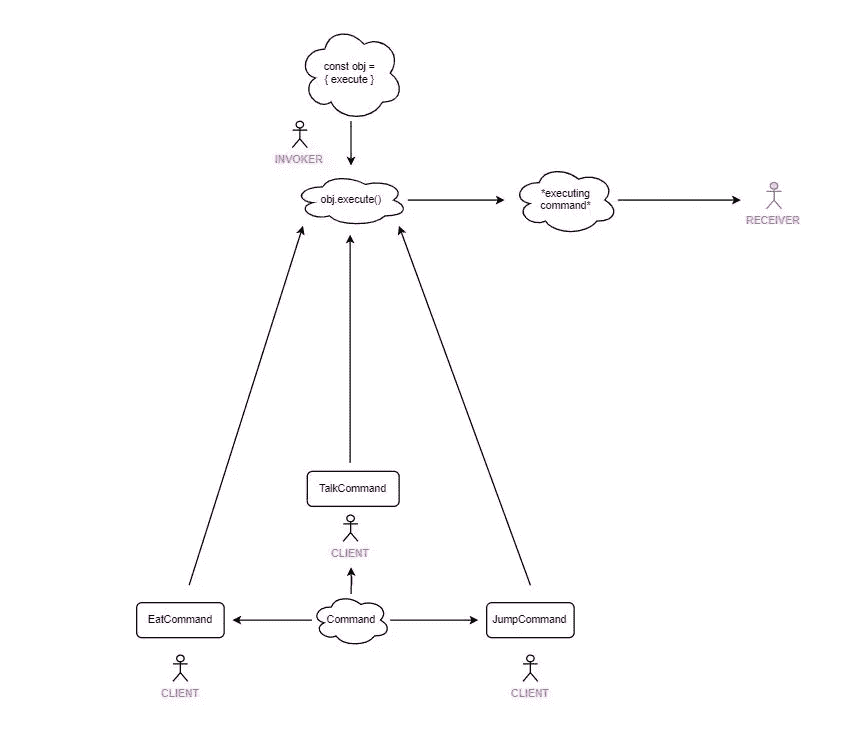

# JavaScript 中访问者设计模式的威力

> 原文：<https://betterprogramming.pub/the-power-of-the-visitor-design-pattern-in-javascript-ca68a654a5df>

## 让 JavaScript 访问者有宾至如归的感觉

*照片由帕拉丝·卡特瓦尔拍摄:*[*https://www.pexels.com/photo/computer-with-code-4218883/*](https://www.pexels.com/photo/computer-with-code-4218883/)

在开发 web 应用程序时，一个非常有价值的强大策略是访问者设计模式。这篇文章将回顾 JavaScript 中的访问者模式，并删除一些重要的概念和技术，这些是每个 JavaScript 开发人员在使用`Visitor`时必须知道的。

根据我的经验，`Visitor`是最难理解的模式之一，无论是从代码角度还是从视觉角度来看都是如此，但是一旦你掌握了其中的窍门，它实际上并不是那么糟糕。

我们大多发现访问者是在库或框架中实现的，所以如果你没有使用过很多库或框架，你可能还没有使用过访问者。当库作者寻求可扩展性时，它们最有用。

完成访问者模式需要两个主要参与者(不包括客户机代码):

1.  具有`accept`方法的元素(按照惯例，我们将该方法命名为`"accept"`
2.  定义`visit`方法的访问者。这是他们在感兴趣的元素上运行逻辑的地方。

实现`visit`方法的对象将正在讨论的`element`(或者更正式的说法是节点)作为参数。正是在这个时候，访问者可以对他们感兴趣的对象执行他们想要的逻辑。

如果我们正在创作一个库，并且我们提供了一个在遍历(或一些循环操作)过程中调用其方法的`Visitor`，那么我们可以通过这个调用轻松地为客户端实现某种形式的可扩展性。

例如，假设我们有这样一个元素集合(表示 [DOM](https://developer.mozilla.org/en-US/docs/Web/API/Document_Object_Model/Introduction) 节点，但不是实际的 DOM 节点):

假设我们正在构建一个小而简单的 JavaScript 库，它允许代码的消费者提供任何元素集合，并让他们能够轻松地提供自己的函数，这些函数可以根据他们的意愿转换他们的键/值。

我们可以提供一个 API 来遍历 DOM 树中的每个元素，并允许它们将自己的函数作为转换器来传递，以操作它们感兴趣的节点。

首先，我们将定义我们的基类`Node`，它接收`element`并将其存储在内部:

我们的`Node`类定义了通过访问者的`visit`方法调用访问者的`accept`方法。此外，它通过`this`将自己作为参数传递，因此访问者能够自由地操纵原始元素。

接下来，我们将有一个基础`Visitor`类，所有未来的访问者都将从该类派生:

有了这些，我们现在就可以开始创建访问者了。

先说一个`SelectOptionsVisitor`访客。这个`visitor`将对选择元素感兴趣，并让客户设置自定义选项:

让我们作为客户端，创建它的一个实例。我们将使我们的`visitor`将所有选择选项设置为`"Monday"`、`"Tuesday"`、`"Wednesday"`、`"Thursday"`、`"Friday"`、`"Saturday"`和`"Sunday"`:

现在我们需要一些方法让回调在循环操作中到达每个元素。像 [babel](https://babeljs.io/) 这样的库提供了一个名为 [traverse](https://babeljs.io/docs/en/babel-traverse) 的工具来做这件事。

让我们用我们自己的简单遍历器来演示，它将迭代每个节点并调用它们的`accept`方法:

现在，让我们使用新的`traverse`函数，并将我们在第一个代码片段中的元素列表传递给它:

现在，如果我们查看我们的 select 元素，我们会注意到它被转换为包含一周的七天，如`options`:

如果你像我一样，你可能会有一个奇怪的习惯，将不同的图案与不同的水果联系起来。是的，像苹果和香蕉这样的水果。我将`Visitor`模式与苹果联系在一起，因为就像苹果一样，它们提供许多好处，例如:

1.  [开/闭原则](https://stackify.com/solid-design-open-closed-principle/)——罗伯特·马丁认为，这个原则是“面向对象设计最重要的原则”访问者允许开发人员引入新的行为，他们可以在不改变实现的情况下处理不同类的不同对象。
2.  [单一责任](https://en.wikipedia.org/wiki/Single-responsibility_principle) —您可以将同一行为的多个版本移动到同一类中。由于访问者在一个不能从外部直接访问的块中实现他们的逻辑，很容易让他们专注于一个目标。
3.  当处理各种对象时，访问者可以收集非常有用的信息，这在处理复杂的树结构时会变得非常方便。 [YAML](https://eemeli.org/yaml/#modifying-nodes) JavaScript 库通过异步支持更进一步。

## 需要注意的事项

*   每当访问者删除或添加新的节点到树中，他们必须更新所有的访问者，否则他们将导致错误。
*   如果处理树的类没有实现`accept`操作，那么访问者将不再为它们工作。
*   大多数库没有将这些节点实现为不可变的对象，所以要注意会产生任何副作用！
*   访问者不应该知道节点的树结构。应该允许元素在它的任何底层元素(例如子元素)上调用访问者。

# 与其他模式的比较

## 命令设计模式

由于访问者可以在他们感兴趣的某些对象上运行操作，因此可以将它们视为根据对象或类触发的调度“命令”。

## 复合设计模式

当使用树结构时(例如像[抽象语法树](https://babeljs.io/docs/en/babel-parser)),它们通常被实现为复合结构，这样客户端代码可以使用所有对象。访问者模式有着相似的目标，所以将访问者和复合模式结合在一起是一个强大的实践。

## 迭代器设计模式

另一个强大的组合是迭代器和访问者模式。使用迭代器模式，通常有一个接口暴露给客户机，以注入它们自己的算法来迭代每个对象。这种方法有一些限制，比如能够深度访问任何子树的子树。

`visitor`模式可以帮助用递归来填补这个空白，所以它非常强大。点击[此处](https://medium.com/better-programming/the-power-of-iterator-design-pattern-in-javascript-e8a9ec703fb5)查看示例。

# 结论

我希望你发现这是有价值的。以后多多关照！