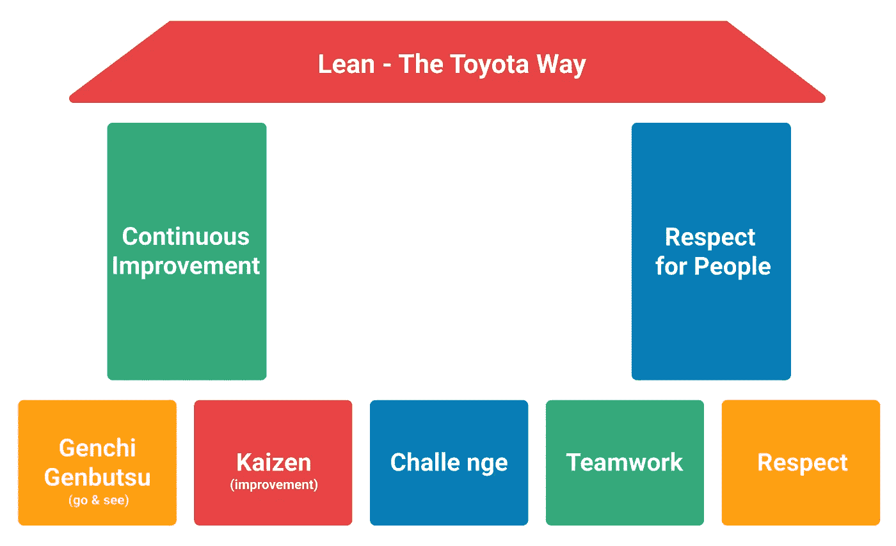

# 举行精益每日站立会议的实用指南

> 原文：<https://betterprogramming.pub/the-practical-guide-to-holding-a-lean-daily-stand-up-meeting-e08a97bd8dd6>

## 让你的会议精简有效的 3 个技巧

Unsplash 上天线拍摄的照片

伟大的会议可以创造竞争优势，但大多数仍然是许多人的痛处。可能有解决的办法。

我们都陷入了一场糟糕的会议。你准时到达，结果会议却迟到了 15 分钟。决策所需的关键人物之一不在场。讨论轨道与设定的议程不一致。你陷入了一个冗长的讨论，关于如何、何时、谁、为什么、哪个，以及我们应该做这个还是那个？很快你就会意识到这完全是浪费时间。

这些只是一个开始。从法庭的角度看一下你的上一次会议，问问你自己你是否也经历过这些情景。如果答案是肯定的，那就揭示了一个事实——是时候精简你的会议了。

好消息是，我已经学会了有效开会的规则。这些建议和策略适用于任何人，不管你的工作角色和你所在的组织。我发现改变你的团队开会的方式是可能的。在本文的其余部分，我将描述三个最大的问题，并就如何用精益解决方案策略解决它们提供实用的指导。你将学到一些开始下一次会议的最佳实践。

# 引入精益理念

精益管理是一个源自大约 70 年前建立的丰田生产系统的概念。这是一个被各行各业广泛采用的概念，你可以把它应用到你的会议中。

变得精益的目标是通过消除一切没有价值的东西来增加价值。工作场所标准和团队绩效的提高是日常活动，应该由最接近工作的团队来完成。

如果管理得当，每天的 scrum 或 stands-ups 有助于创造一个积极的反馈循环。该团队将制定日常惯例，以促进工作的检查、适应和透明度，最大限度地减少不可预见事件对日常活动的影响。

## **精益方法依赖于 3p**

1.  **目的。**精益管理的目的是满足顾客的需求并为顾客创造价值。
2.  **流程。每个过程都应该是有价值的、有目的的、有意图的。它应该消除浪费或减少消耗资源的非增值行为的发生。**
3.  **人。**每个人都应该积极参与并思考持续改进计划。

这就是为什么精益方法的两个主要支柱是:

*   对人的尊重。
*   持续改进。

坎巴尼泽的丰田之路

那么，如何召开精益会议呢？要做到精益，会议必须有最少的、最好没有非增值工作。

# **问题和精益解决方案**

在我工作的这些年里，我证明了如果管理不当，会议可能是对时间的极大浪费。这导致生产力、协作和团队士气的损失。正如所注意到的，会议无效有三个主要的促成因素:频率、时间长度和缺乏生产力。

## **频率**

大多数会议都没有预定。因此，它们经常太频繁或太不频繁。有些人可能会在一天中开几次短会，耗尽个人的工作时间。其他人只在事情已经堆积如山时才召集会议。

会议中的每一分钟都会消耗个人和团队的工作时间。这两者对于影响团队和项目速度的创造力和效率都是必不可少的。

为您和您的团队找到合适的频率是保持信任和参与的关键。这增加了透明度，给了你检查和适应的空间。

***精益解决方案:*** *将站立会议安排在每天重复的时间和地点。*

> 重要的是将所有元素作为一个系统整合在一起。它必须每天以非常一致的方式进行练习，而不是突然进行。
> 
> ***——丰田总裁赵先生，引自*** [***丰田之道***](http://books.google.co.uk/books/about/The_Toyota_Way_Fieldbook.html?id=0R0fAQAAIAAJ&redir_esc=y)

精益需要持续的关注和每天改进的承诺——每个人都是改进的一部分，并且每天、每周、每月、每年都在实践。这是永无止境的努力。

最好有一个定期安排的会议时间和一个已经设置好的专用房间，这样无论什么时候你要开会，你的团队都能够围绕它进行计划。这使得它更容易成为日常生活的一部分，也不太可能被遗忘或推迟。

需要注意的是，会议的频率和数量不应打断工作流程。会议不应该占用工作人员的时间来完成他们的重要任务。

## **长度**

大多数会议都没有把握好时间。有些太短，很少讨论，而另一些太长，占用了个人工作的时间。通常，这迫使人们从自己的私人时间中偷出时间来完成工作。但这种做法可能会导致倦怠和高流动率。

结果，无论是团体还是个人，生产力都被削弱了，因为会议效率低下。

***精益方案:*** *保持在 15 分钟内限时完成。*

精益运营的一个重要方面是确保在制品不会堆积。理想的情况是以高频率、及时的方式处理小批量产品，通常是单件产品。限制正在进行的工作减少了多任务和分心，使团队一次专注于一件事，并提高整体生产力。

好消息是，每天投入一点时间，你就能显著提高会议的结果。站立会议不应超过 15 分钟。

正如《Scrum 指南》中所描述的，每日 Scrum 是一个 15 分钟的限时事件，用于同步活动并为未来 24 小时制定计划。开发团队检查朝着 sprint 目标的进展——他们离完成 sprint backlog 中的工作还有多远？每天的 scrum 会议不是一个解决问题的会议。提出的问题会离线处理，并立即交由相关小组处理。

召开有效会议的一个重要方面是尊重每个人的时间。准时开会，准时结束——尊重个人和团队的工作时间至关重要。

你可以用同样的策略来坚持你的日常 scrum。保持你的会议简短，但是更高的频率——小的，频繁的，每天的改进。

## **生产力不足**

大多数会议都开得很糟糕。有些组织会议相对较少，但却漫无目的地东拉西扯。当提出新问题时，接下来的步骤往往不明确，导致更多的边栏对话。人们跑题了，你似乎永远也不会抓住重点。你离开的时候会想为什么你会在这里。

***精益解决方案:*** *创造然后坚持一个议程。*

正如 Scrum 指南中所述，如果会议的焦点是朝着 sprint 目标的进展，那么会议的结构可以用不同的方式进行。一些开发团队将使用问题，一些将基于讨论。大多数单口相声由每个分享三条关键信息的团队成员组成:

*   我昨天*做了什么*帮助开发团队实现了 sprint 目标？
*   我今天*将做什么*来帮助开发团队实现冲刺目标？
*   有什么阻碍我或开发团队实现 sprint 目标吗？

如果有必要进行详细的讨论，团队成员通常会在每日的混战之后立即开会。这次会议的目的是保持项目顺利进行！

拥有清晰有效的议程有助于精益文化的发展。它尊重参与者的时间和他们给主题增加的价值。通过将参与者与客观结果联系起来，它有助于推进工作。

# 摘要

精益转型可以帮助您改善会议的运行方式。精益日常 scrum 是一种心态和实践，而不仅仅是一个事件。对于整个团队来说，这是一个与每个人相对于 sprint 目标的个人进展同步的机会。

保持这些会议的有效性并不总是一件容易的事情，但最终，更好的会议和更好的工作生活是结果。