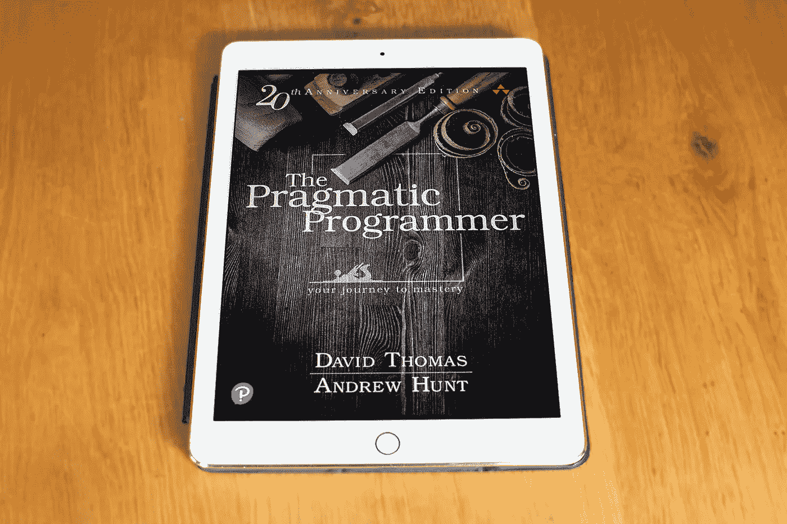

# 实用程序员，20 周年纪念版

> 原文：<https://betterprogramming.pub/the-pragmatic-programmer-20th-anniversary-edition-15e19ca76e40>

## 每个开发人员都应该阅读这本书

实用程序员，20 周年纪念版，作者照片

有时你会在一个全新的层面上遇到一些让你产生共鸣的东西。对我来说，早在 2000 年，这就是迪夫·托马斯和安迪·亨特的书《实用程序员》。

这本书对我的软件开发生涯产生了重大影响。当 2019 年 5 月，Addison Wesley 出版了新版《实用主义程序员，20 周年纪念版》时，我决定重读它。

# 关于这本书

迪夫·托马斯和安迪·亨特在 1999 年写了第一本实用程序员的书。他们最初的想法是写一份简短的白皮书，包含他们在与客户打交道时学到的所有经验。

这份白皮书成长为“务实的程序员”

二十年过去了，这个新版本重新审视了 2020 年对现代开发者意味着什么。他们更新了所有的技术示例，并增加了 30%的新内容。

这本书是为那些想成为更有效率和生产力的程序员而写的。安迪和戴夫把这本书分成了 10 章，53 个主题，100 个提示和 33 个练习。

这本书要解决的两个主要问题是:

*   什么是务实的程序员？
*   怎样才能成为一个务实的程序员？

Dave 和 Andy 将务实的程序员描述为:

> 思考超越眼前的问题，把它放在更大的背景下，寻求更大的图景。毕竟没有这个更大的语境，怎么可能务实？你如何做出明智的妥协和明智的决定？

书中的 53 个主题解释了你可以做些什么来变得更有效。让我们看看书中的两个例子:“软件熵”和“优秀设计的本质”

# 软件熵

Dave 和 Andy 描述说，一旦你允许软件熵或技术债务进入你的系统，它就会不受控制地扩散。他们继续研究为什么特定的项目会失败，而更复杂的项目却能顺利完成。

他们解释说[破窗理论](https://en.wikipedia.org/wiki/Broken_windows_theory)适用于软件，并提到以下技巧:

> 不要让“坏掉的窗户”(糟糕的设计、错误的决策或糟糕的代码)得不到修复。发现一个就解决一个。

# 优秀设计的精髓

当我设计一个解决方案时，我总是质疑它有多好。根据戴夫和安迪的说法，很简单:*“好的设计比坏的设计更容易改变。”*

他们描述了更容易改变(ETC)原则，并指出所有其他原则都是 ETC 的特例。分离、单一责任原则和命名都是 ETC 的特例。

我在工作中经常使用 ETC 原则。如果我必须在两个选项中做出选择，我会选择更容易改变解决方案的选项。

# 这本书的其余部分

这本书的其余部分充满了其他 51 个主题。有趣的是，一旦你开始读这本书，我保证你会认出你同事的短语。很多开发人员都读过这本书！

# 告诉我们关于你自己的情况

当我在 2000 年读这本书的时候，我很喜欢它。书中所有的提示和例子都是我在日常工作中遇到的。

## 不重复自己(干)的原则

虽然我已经读过前一版，但新版本包含了许多新的和令人兴奋的话题。值得注意的是，著名的不重复自己(干)原则。

我一直以为我懂干原理。您不应该复制和粘贴源代码，而是应该创建可重用的函数、类或组件。这防止了维护的噩梦。

新版仍然包含干原理，但现在的重点是防止知识重复。不复制粘贴代码是其中的一部分，但不止于此。

> 干是关于知识和意图的复制。而是在两个不同的地方，可能用两种完全不同的方式表达同一件事。
> 
> 这是一个严峻的考验:当代码的某个方面必须改变时，您是否发现自己在多个地方以多种不同的格式进行了改变？您是否必须更改代码和文档，或者数据库模式和保存它的结构，或者…？如果是这样的话，你的代码还没干。

我做了 20 多年的职业程序员。我参与过不同规模和类型的项目。

如果我必须为新的或有经验的开发人员推荐一本书，这将是它。最初的版本在很多层面上引起了我的共鸣。

# 为什么要读？

每个开发人员都应该阅读这本书。其中的智慧将帮助你的整个发展生涯。

上一版经受住了时间的考验，并保持了 20 年的相关性——这一版也是如此。

对于开发者来说，这是一份极好的礼物——我已经送出了许多拷贝。你可以在[实用书架](https://pragprog.com/book/tpp20/the-pragmatic-programmer-20th-anniversary-edition)找到。

感谢阅读。