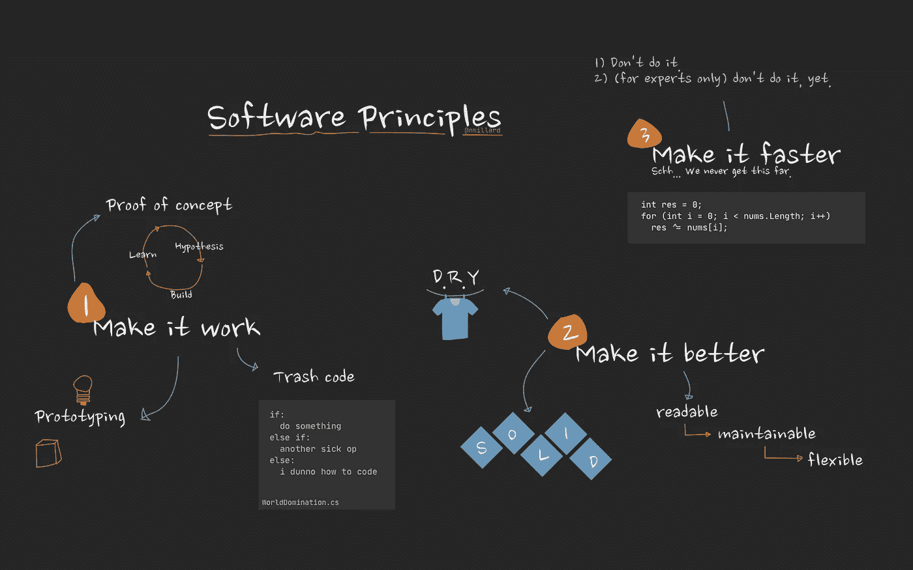

# 交付更好软件的最佳建议(来自我的导师)

> 原文：<https://betterprogramming.pub/the-principles-of-software-development-7415e7c5a156>

## 制作优秀的软件是关于在正确的时间把你的注意力集中在重要的事情上

作者照片。

当我们试图同时做所有的事情时，垃圾软件就产生了。

原则、指导方针、最佳实践和经验法则——它们都让你的生活更轻松。没有它们，十分钟的任务会变成十小时的任务。

在我职业生涯的早期，我从我的导师那里得到的最好的建议之一就是这个简单的俏皮话:

> “让它工作，让它更好，让它更快。”

这是对肯特·贝克的名言的一个小小的改动，它的简单让人着迷也让人困惑。

“让它工作”很容易理解。您有一套需求，并且您正在编写代码来满足它们——小孩子的东西。

“让它变得更好”是最重要的。“更好”是你将花费一天大部分时间去实现的有趣的部分。更好的代码，更好的设计，更好的方法。但是“更好”是什么意思呢？我们稍后会谈到那件事。

好吧，让我们实话实说:你经常没有时间去考虑你的代码的“让它更快”方面——至少不是对软件的每个部分。你想让你的热门路径快速有效，但你可能身材很好，留下的路径很少有人走。不值得努力。就这么简单。

可笑的是，每当开发人员阅读别人的代码时，他们都倾向于关注“让它更快”。常见的评论是“这种低效的代码太可怕了！”这完全忽略了代码是否按时解决了问题。

# 写垃圾代码没什么丢人的

第一步是让它发挥作用。简单明了。

以一种快速、粗暴的方式违反好的设计原则来让事情运转起来是完全没问题的。

不成熟的、精心的预先设计是完全没有用的。探索最好使用一些久经考验的技术，如原型、概念验证、简单无用的代码和一次性代码。

一切都摆在你面前。没有抽象，没有魔法，没有“我想知道这是如何工作的。”

然而，重要的是认识到这是第一步。留下垃圾是积累技术债务的必然方式，这些债务会回来困扰你。像一个疯狂的小伙子一样尝试，但在推代码之前要清理干净。

[你可能也想看看我关于垃圾代码的文章。](https://levelup.gitconnected.com/write-shameless-garbage-code-ba6f79d46ed9)

# 让我们做得更好

现实的时间到了:没有一个最终用户会像“伙计，谷歌的代码结构如此整齐。这就是我用谷歌搜索的原因！”用户根本不关心你的代码与你之前的混乱相比有多好。用户关心的是好的体验和你的软件使用起来有多容易——而不是修改起来有多容易。

然而，改进代码是产品整体质量的一个重要方面。内部软件质量影响你的能力，发现和纠正缺陷，以及发布的时间。

在继续改进你的软件之前，一定要确认你的软件在修改后仍能正常运行。进行某种回归测试。单元测试是有用的，但是代码检查同样重要。

让你的软件变得更好不仅仅是重构。重构本质上是[保留对代码库](https://medium.com/@nmillard/refactoring-rules-of-thumb-for-beginners-to-become-experts-70161c3c4f20)的更改的行为。但是让你的软件变得更好是另一回事，重构只是其中的一部分。

这是重新架构。在适用的地方应用设计模式。评估你的代码是否可靠。修复代码气味并处理边缘情况。

更好的代码是:

1.  [可读](https://medium.com/swlh/5-ways-to-replace-if-else-statements-857c0ff19357)
2.  [可维护的](https://medium.com/swlh/refactoring-from-trash-to-solid-74b10005ccd3)
3.  [灵活](https://medium.com/swlh/creating-configurable-classes-that-are-easy-to-use-69d78d6881a2)

通过应用现代实践以及著名的固体和干燥原理，努力实现这些特征。我不会在这里鼓吹理论，因为已经有大量关于这些主题的文章。谷歌一下缩略语就知道了。

# 如果我们有时间的话，那就快点

并非应用程序或库的每个方面都是平等的。并非每一行代码都以相同的频率执行。不要急于对每一行进行代码调优。

您经常会发现，只有一小部分应用程序使用了不成比例的运行时份额。搞清楚是什么部分，衡量其性能，设定性能目标，优化，再衡量。

没有目标性能的优化不会有好结果。你可能做了一些可靠的性能优化，但是如果你花了一整天的时间在这上面，可能就不值得了。

当性能达到某一点后，用户对每减少一毫秒的赞赏就会减少。在这一点上，你只能从其他开发者那里获得街头信誉，这是完全没有意义的。

一些开发者鼓吹你必须不断优化。过早的优化和过早地应用设计模式一样糟糕。

相反，从编写尽可能简单的代码开始。然后重构，重新设计等。只有遇到瓶颈时才进行优化。

# 资源

*   *代码完成 2* ，第 20 章&第 25 章由麦康奈尔
*   什么是一次性代码？按工艺编码
*   *软件测试的艺术*，第二章第三章，作者迈尔斯
*   [让它工作，让它正确，让它快速](https://wiki.c2.com/?MakeItWorkMakeItRightMakeItFast)作者沃德·坎宁安
*   软件工程的七个基本原则。
*   《精益六适马指南:少花钱多办事:削减成本、减少浪费和降低管理费用》

**Nicklas Millard** 是一名软件开发工程师，供职于一家发展最快的银行，负责构建任务关键型金融服务基础设施。

此前，他是 Big4 的高级技术顾问，为商业客户和政府机构开发软件。

> [新的 YouTube 频道(@Nicklas Millard)](https://www.youtube.com/channel/UCaUy83EAkVdXsZjF3xGSvMw)
> 
> *连接上*[*LinkedIn*](https://www.linkedin.com/in/nicklasmillard/)