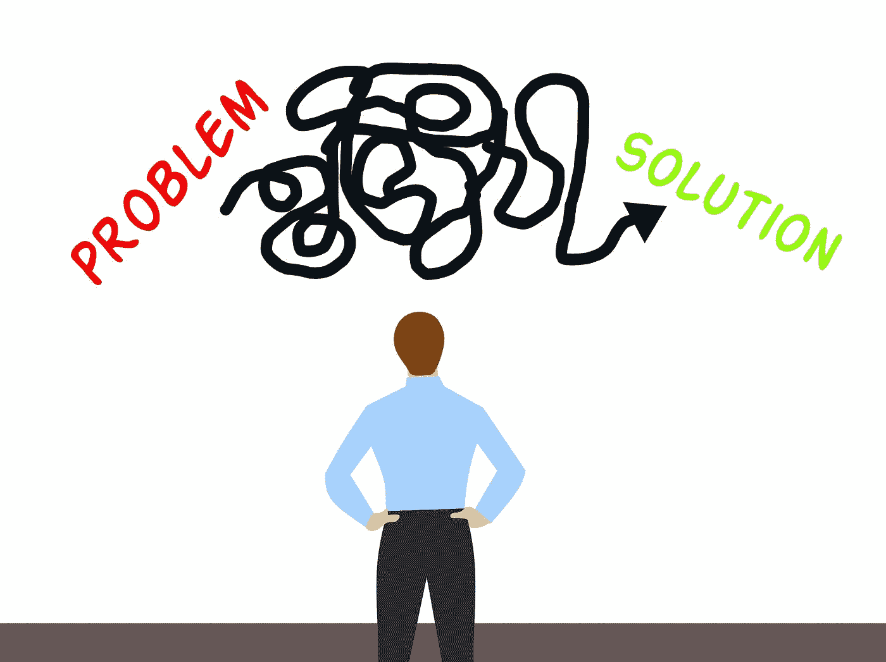
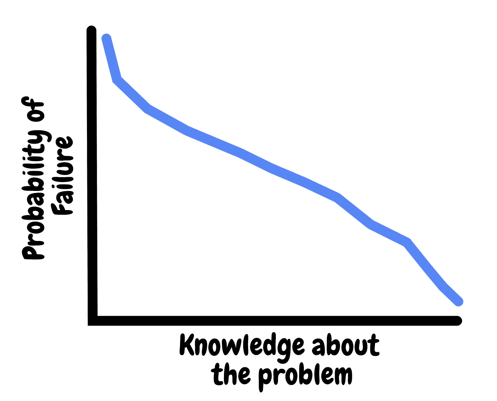
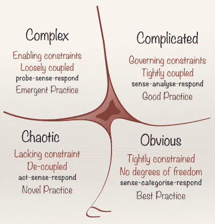
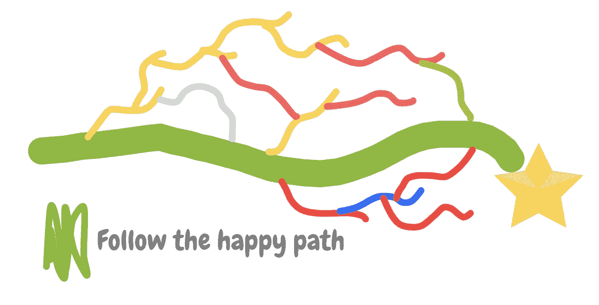
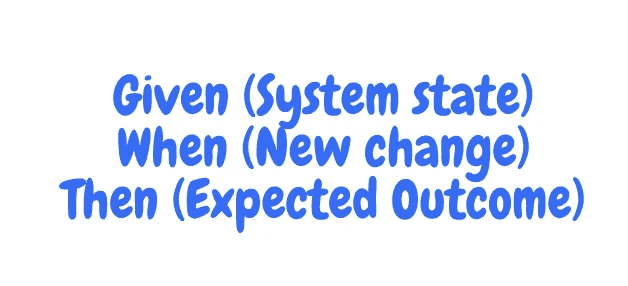
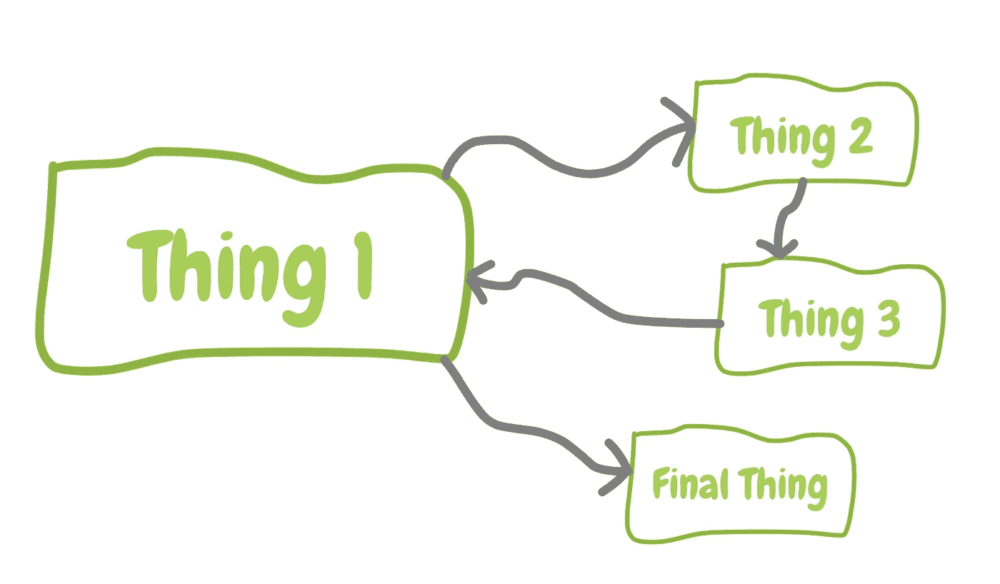

# 解决问题的生存工具包

> 原文：<https://betterprogramming.pub/the-problem-solving-survival-kit-ed9c4fb33746>

## 解决任何问题所需的基本技能

在我的软件工程师生涯中，经常有人问我:“克里斯，你认为你来这里是做什么的？”

这让我开始思考。我仅仅是一个削减代码的人吗？我不这样认为，这似乎是一个可怜的定义。编写代码是一个更长、更丰富的过程的结果，而不仅仅是在我的电脑上乱搞。不，我不只是削减代码。

那么，我在做什么？经过一番思考，我决定我是一群人中的一个子类，这些人被一个单一的使命所束缚。

# 他们是问题解决者

很模糊。问题以各种形式和规模出现，但当我们真正触及许多职业需求的核心时，那就是我们正在做的。存在着一个挑战，一个目标，但却没有一条通向目标的道路。

绘制地形图和为你的目的地绘制路线的任务，至少部分地落在了你的身上。这就是你在这里要做的。

这些年来，我学到了一些技巧，这些技巧在面对复杂问题时是绝对不可或缺的。

我相信，认真应用这些技术将帮助任何人分解各种形状和大小的问题，无论是复杂的算法还是高级设计会议。这些工具将帮助你拨开迷雾。

# 面对现实吧。你会把事情搞砸的

你要做的第一件事就是失败。这与你或问题无关。这就是概率的本质。你对面前的问题了解得越少，你就越有可能犯错。

没关系，你和其他人一样受概率法则的约束。不要自责，把失败当成进步就好。每次失败都会带来知识。随着知识的每一次增长，你的失败也会减少。

# Cynefin 框架

不，我没有用盖尔语骂你。这是一个威尔士词，意思是“栖息地”。Cynefin 框架是由 Dave Snowden 于 1999 年首次提出的。最恰当的描述是“感觉制造装置”。

让我们来看看它最常见的图。

现在还不清楚如何解释这个图表，但是让我们来看看它的组成部分。

它分为四个部分，每个部分都有一个标题。从右下开始，逆时针方向工作，我们可以看到事情变得越来越严峻。从“明显”到“混乱”。

显而易见被定义为“紧密约束”“没有自由度”。这仅仅意味着你理解了整个问题。这是一个“已知的已知”。它的行为是可预测的，你可以完全理解它。

Cynefin 是一个很好的工具，因为它可以让你了解问题的性质和规模。然后，它给你一些建议。

例如，如果你确定一个问题是“混乱的”，它建议你首先行动，感知，最后回应。熟悉这张图表。它提供了一个看待问题的奇妙视角。

# 快乐之路

通常，我们面临的问题有很多“如果”。这些情况会令人窒息。进展缓慢，令人疲惫不堪。每向前一步，一千个新的机会分支就会出现在你面前，要求你去研究。

虽然你知道你想去哪里，但你被迫沿着每一条路走，就像水流过小溪一样。很快，你就会变得太分散，没有力量继续前进。

通过只考虑“快乐路径”来第一次解决问题。想象一个美丽的世界，在这个世界里，错误永远不会发生。

没有人会输入错误的密码，我们第一次使用 u 盘的方式是正确的，而且我们总是能收到快递。抛开现实的严峻裂缝，只处理眼前的事情。

沿着那条简单快乐的路一直走到终点，并专注于它。慢慢来。不要担心其他线程，在地平线上的混乱。

你以后会找到他们的，但是现在，乐观一点。在解决问题的早期阶段，找到幸福的道路是至关重要的。它为您的解决方案奠定了基础。

# 用例子来推动对话

我们用来表达问题的语言至关重要。我们可以用欠考虑的措辞和隐藏的假设来迷惑自己和他人。我们的谈话需要严谨一些。

使用“例子”是一种添加这种结构而不限制你的自然思维过程的聪明方法。行为驱动开发(BDD)的发明者 Dan North 为这些例子想出了一个很好的格式。

任何有软件工程背景的人都会熟悉这种语言，但是 BDD 背后的意图从来不是测试软件。

这是为了鼓励一个协作的、示例驱动的对话，其输出是系统应该如何运行的描述。这些例子将驱动系统的设计。

我喜欢用 BDD 作为另一个“意义制造工具”，就像 Cynefin 一样。通常，对于复杂的问题，人们会互相误解。

使用这种类型的语言将有助于消除假设，建立共同的理解。对话变得有节奏。思路变得清晰，相声消失。

无论你是否正在处理一个软件问题，用场景的方式描述你的愿望将会把你的想法提炼成它们的基本组成部分，并且突出任何潜伏在那里的矛盾。

# 变得艺术化

画东西不仅仅是一种储物行为。它降低了认知负荷，让你专注于问题的特定子集。

通过引出我们的想法，我们可以立即意识到逻辑问题。我们正在以一种强大而深刻的方式验证我们的推理。

它不需要很漂亮，只需要有帮助

大多数人发现自己很自然地这样做，但我遇到过那些坐着试图把一切都记在脑子里的人。有些人可以，但即便如此，这也是对你心智能力的低效利用。你需要一个清晰的头脑来做好你的工作。

记住，干净的头脑，凌乱的白板。