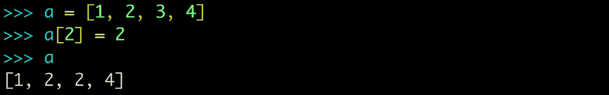
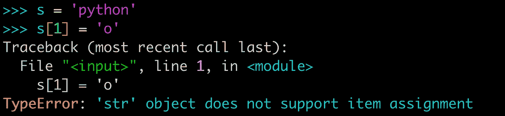
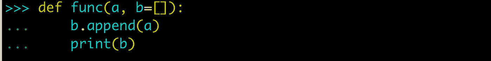
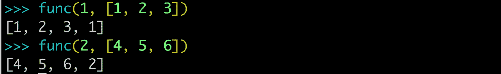
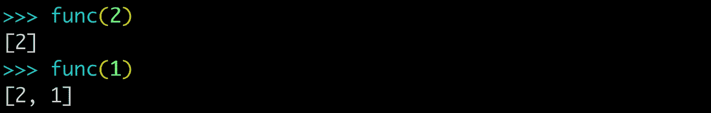
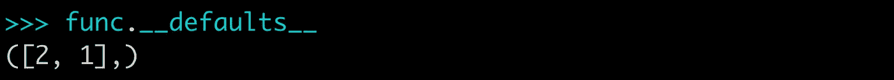
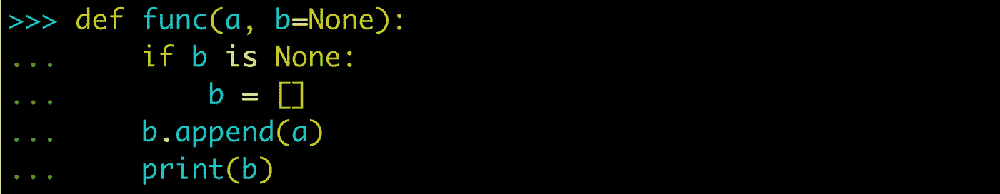
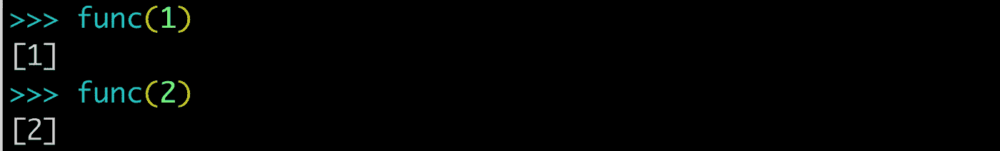

# Python 中可变类型作为函数默认值的问题

> 原文：<https://betterprogramming.pub/the-problem-with-mutable-types-as-default-values-in-functions-in-python-81ca88ff4d91>

## 用简单的例子

伊利亚·巴甫洛夫在 [Unsplash](https://unsplash.com?utm_source=medium&utm_medium=referral) 上拍摄的照片。

根据不同的需求，我们经常需要函数有默认值。用默认值定义一个函数很容易——只需在定义中赋值，并确保默认参数出现在最后。

对于这一块，我将编写一个非常简单的函数，只将两个数相加。

您也可以通过打开 Python shell 来跟进。

现在，我们可以通过提供参数值来调用该函数。

我们可以看到该功能工作正常。现在，我们将只为参数`a`提供值。

该函数仍在工作，它使用默认值`3`作为参数`b`。

# 可变和不可变对象

对于那些不知道的人，我将尝试用非常简单的术语解释可变和不可变对象的概念。

可变对象是那些在创建后可以改变的对象。在 Python 中，字典是可变对象的例子。

在上面的代码片段中，我们创建了一个列表，并更改了索引`2`处的项目。它运行起来没有任何问题，因为列表在 Python 中是可变的。

不可变对象是那些在创建后不能改变的对象。在 Python 中，元组是不可变类型的例子。

在上面的代码片段中，我们创建了一个字符串，并试图改变索引`1`处的项目。我们得到了一个错误，因为字符串是不可变的。

既然我们已经理解了如何用默认值和可变对象的概念来编写函数，我们将尝试理解不可变类型作为默认值的问题。

对于这个演示，我将编写一个简单的函数，它接受两个参数，将第一个参数附加到第二个参数上，并打印第二个参数。

现在我们将测试这个函数。

从上面的代码片段中我们可以看到，当我们为参数`b`提供值时，该函数工作正常。当我们不为参数`b`提供值时，我们开始发现问题，因为在后面的函数调用中，默认值不再是空列表。

问题在于，每个默认值都是在定义函数时计算的——通常是在加载模块时——默认值变成了函数对象的属性。因此，如果一个默认值是一个可变的对象，而你改变了它，这个改变将会影响函数的每一次调用。

我们可以通过检查函数的`__defaults__`属性来查看默认值。

那么，如何才能避免这个问题呢？

对此有一个非常简单的解决方法。每当需要使用可变类型作为参数的默认值时，就使用`None`作为默认值。

现在，我们可以看到我们的功能工作正常。

我希望这篇文章能提高你对函数的理解。