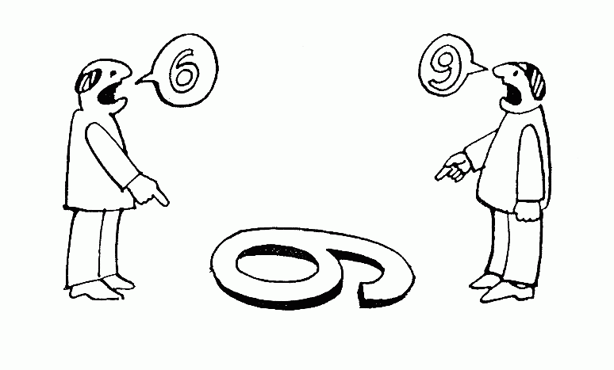

# “敏捷”这个词的问题在于

> 原文：<https://betterprogramming.pub/the-problem-with-the-word-agile-1682868e757c>

## 哲学如何帮助我们进行更好的对话

我在 2016 年参加了我的第一个 Scrum Master 认证课程。一位名叫大卫·希克斯的出色的演讲者将我们引入了黑魔法领域。那几乎是四年前的事了，从那以后，我看到“敏捷”这个词在公司集会上被广泛使用。有时赛车领先，其他的留给废铁，像 66 号公路边上风化生锈的汽车。

我和我的同事会在凌晨时分讨论敏捷性。我们一起工作了很多年，就像团队经常做的那样，我们决定了一些指导我们工作的关键原则。我们从来没有谈论过这些，它们似乎是显而易见的——相反，我们讨论了敏捷。

# 我们没有意识到我们在做什么，但是别人意识到了

老疯子的眼睛发现了什么

[路德维希·维特斯坦根](https://en.wikipedia.org/wiki/Ludwig_Wittgenstein)是一位哲学家，1889 年出生于奥地利。他的作品仍然引发争议。我们谁也不知道他是完全理解了还是完全没有抓住要点。他最著名的著作是关于语言哲学的。

我不会假装是维特根斯坦的专家，但我已经从他的作品中吸取了一个关键的教训。我发现自己每天都在使用的一个非常突出和强大的工具。

## 维特根斯坦提出了一个相当大胆的主张

维特根斯坦认真审视了哲学，并有了惊人的发现。他意识到，大多数时候，我们所做的一切都是在误解我们的词汇定义。

> 项目经理:“需求已经改变，这就是敏捷。”
> 
> 工程师:“那和敏捷没关系，你不能就这么说。”
> 
> Scrum Master:“哇，好吧，我们把这个留到回顾会上说吧。”

现在问问你自己，这种对话多长时间一次就解决了？他们多久会同意和分道扬镳一次？不经常，对吧？维特根斯坦称之为“语言混乱”您并没有真正讨论“敏捷性”的相对优点，您只是将您不同的定义拼凑在一起。

争论不在于一些共享概念“敏捷”的逻辑属性之间相反，我们有三幅完全独立的“敏捷”图片项目经理在敏捷中挑选“变更”的部分，工程师试图被授权，scrum 大师试图遵循 Scrum 指南。

# 这就是“敏捷”这个词的问题所在

人们不会就“敏捷转型”的相对优点展开富有成效的对话他们像动物园里的猴子一样，把以前的经验推出来，扔出去，直到所有的东西都变成了粪便，没有人再想做任何事情。项目经理看到的是速度，工程师看到的是精度，Scrum Master 看到的是纪律——他们都用“敏捷”这个词来描述这些品质。这是无用对话的滋生地。

# 那么我们能做些什么呢？

在过去的几个月里，我和自己达成了一个内部协议:我再也不说“敏捷”了。我特别禁止这些短语出现在我的字典里。

*   “但这不是敏捷”
*   “哇，那不是 scrum”

除了你的教练团队，没有人会在乎某件事是否“敏捷”。他们最关心的是这是不是一个好主意。这就是我所做的。我抛弃了委婉的说法，讨论了能力。

*   “当然，我们可以制定一个广泛的需求文档，但是这些需求在接下来的几个月中有多大可能会发生变化？”
*   “我们可以在 sprint 中增加一个额外的会议，但是你不担心会占用开发人员更多的时间吗？"

结果如何？我的语言更包容。那些不太愿意讨论“敏捷”这个山寨产业的人不再被我阻挡了。他们没有费力地使用行话，也没有反对我的定义。他们谈论的是实际能力。

# 具体点

维特根斯坦一生中的大部分时间都在恳求人们处理细节。不要考虑含糊和混乱，不要互相强加定义。将你们的谈话带回到细节、行动、日常活动上。不要提抽象，它只会引起诡辩家的沉思和模糊的思考。

维特根斯坦给我们留下了一段精彩的引言来总结这一点。它经常被误解，但作为一个咒语，它给你一个尖锐的刺激。每当你看到“敏捷”这个词被抛来抛去，像风中的旗帜一样飘动，记住…

> 到底能说什么，能说清楚；对于无法言说的，必须保持沉默。

我在 twitter 上谈论各种各样的技术、DevOps、软件工程、Kubernetes 等等。