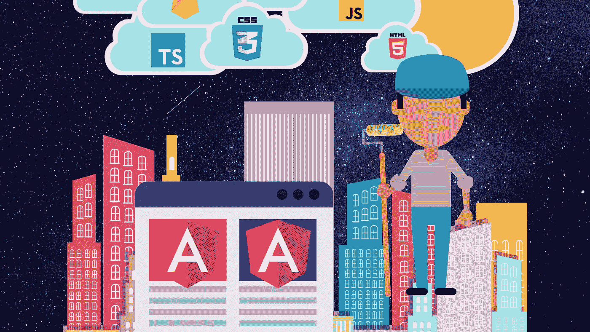
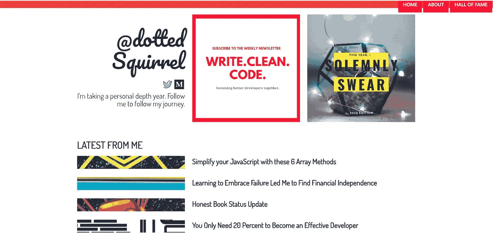
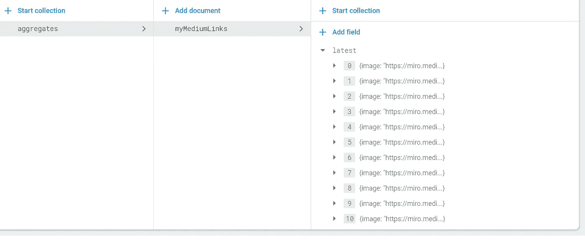
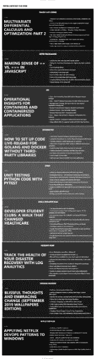

# 从头开始重新编码我的网站的过程

> 原文：<https://betterprogramming.pub/the-process-of-re-coding-my-website-from-scratch-a90cfbdc8e81>

## 我脑海中出现的想法的案例研究

图片由 Aphinya Dechalert 创作。

今年早些时候，我暗暗挑战自己，要尽快创建一个网站。在某种程度上，这是为了测试我的知识，并帮助我确定我个人的效率低下。

当你拥有世界上所有的时间时，你倾向于闲逛，永远也不会完成任何事情。

但这是技术项目的特点——随着时间的推移，新的想法、需求、漏洞发现和堆栈更新不断出现，项目永远不会圆满完成。这是这门学科的本质。

所以，我决定极端 MVP 它。编码、附加图形和部署发生在我蹒跚学步的孩子午睡的时候，[斑点松鼠](http://dottedsquirrel.com) v1.0 向全世界发布。

圆点松鼠版本 1

# 1.0 背后的想法

## 案情摘要

对于 Dotted Squirrel 的第一次迭代，我想创建一些快速而有用的东西。我还希望它尽可能地低维护，因为我专注于[我的个人深度年](https://medium.com/better-programming/why-i-decided-to-take-a-depth-year-e78f9ffd025d)，并想出我作为一名开发人员的职业生涯中的下一个目标。

但是，我也不想成为那些个人广告牌组合网站之一。所以，我决定为自己做一个个性化的新闻聚合器，其他人可能会觉得有用。

## 时间限制

在蹒跚学步、写作和学习之间，我真的没有太多时间做其他事情。我挑战自己在一个蹒跚学步的下午午睡时段内完成所有事情。

那时候，她常常会小睡两个小时，然后和她的跟班兔子一起再次暴跳如雷。

因此，我决定使用 Angular 创建一个单页面应用程序，其中包含到“关于我”页面的路由，以及一个获取我需要的提要的服务。

## XML 数据

提要的问题在于它们是 XML 格式的。虽然在 90 年代 JSON 还不存在的时候，XML 可能是有意义的，但现在，XML 更像是拨号电话的遗物，而不是现代技术堆栈中常用的东西。

基于我的时间限制，我最终使用了 [rss2json](https://rss2json.com/#rss_url=https%3A%2F%2Fwww.reddit.com%2Fr%2Fgifs.rss) 。虽然 Angular 的第三方解析库确实存在，但它不能像 rss2json 那样保证可靠的数据解析和持续的兼容性。

这项服务使得处理提要变得更加容易，也更加可预测。

## 图形、字体和 CSS

我的机器上有 Photoshop，但是从过去的经验来看，Photoshop 需要时间来创建视觉上令人愉悦的图形。

我最终使用了 Canva，因为它提供了一个精选的工具集，可以保证在很短的时间内达到 Instagram 的美学水平。

谷歌字体进口被用来使网站看起来不那么普通，并通过排版赋予个性。

对于 CSS，我使用了 [Twitter Bootstrap](https://getbootstrap.com/) ，主要用于网格系统，其他的就不多了。

## 最终产品

对于第一次迭代，在纸上有一个我希望它看起来像什么的粗略草图。最终的产品没有偏离太多，视觉决定是当场做出的。

Twitter Bootstrap 处理了大部分的移动兼容性，而 fluid grids 大部分时间都保持了视觉上可接受的布局。除了网站的标题，我没有添加任何额外的样式。

在第一个小时结束时，我有了一个功能正常、视觉上可接受的网站，它从五个不同的来源以及我在 Medium 上创作的任何已发表的故事中获取信息。

# v2.0 背后的想法

## 我想要的

虽然 Dotted Squirrel 的 v1 达到了它最初的目的，但我很快发现了使用提要的一个缺陷。

在 Medium 上以我的故事为特色的部分，我很快发现，如果不隐藏我实际发表的故事，我就无法回复评论。

这是因为提要将所有内容都视为一个故事，包括评论。数据中的内容类型没有区别。结果，我对我的媒介故事和其他故事的反应大大减少了。

我遇到的另一个问题是 v1 的设计仅限于五个提要。如果我再添加更多，所涉及的滚动会增加到对用户来说效率低下的程度。

随着 Dotted Squirrel 的有机流量在几个月内不断增长，除了回头客，我还想升级用户体验，对展示的故事有更多的控制，并根据我 2020 年的职业生涯目标重新调整 Dotted Squirrel。

这一次，我有整整一个周六的时间来重新设计、编码和部署 Dotted Squirrel，而这个蹒跚学步的孩子却去和我母亲一起放松了。

## 使用 Firebase

自从我发现了 [Firebase](https://firebase.google.com/) ，我就一直是它的粉丝。

然而，在经历了 [$30k Firebase 法案的惨败](https://medium.com/@PurpleGreenLemon/how-not-to-get-a-30k-bill-from-firebase-37a6cb3abaca)之后，我开始非常清楚我的数据是如何构建和使用的。这是因为 Firebase 根据文档的消耗量收费，而不是固定的小时费率。

对于我的 Medium stories 部分，我决定用一个对象数组创建一个文档来保存我的标题、图像源和链接。这个数组中有十个元素。

这使我的文档阅读量从每页十次减少到一次。

我的 Firebase 数据当前的样子

在免费层下，Firebase 每天有 50，000 次免费文档阅读。

如果我使用一个文档以传统的 SQL 方式保存我的数据，在法案开始生效之前，我将被限制在 5000 次页面浏览。

在[聚合数据方法](https://medium.com/better-programming/thinking-in-nosql-with-firebase-25cdff43e73a)下，我需要达到每天 50，000 的页面浏览量——在长期可扩展性和未来潜在的计费方面存在巨大差异。

## 与物化 CSS 的移动兼容性

我在 Twitter Bootstrap 上遇到的问题是 CSS 类名和 HTML 结构要求可能非常冗长。

这些年来，我发现，虽然 Bootstrap 继续为其目的服务，但在应用 CSS 时，有许多代码需要阅读和过滤。

Materialize CSS 是一个替代框架，减少了 Bootstrap 附带的许多未使用的特性。Materialize CSS 的网格系统更容易编码，类名更短，完全兼容移动设备。

## 玩得开心:第 n 个孩子

对于 feeds 部分，我想创建不同的部分，逐渐通过色阶移动。

在角度代码中，我使用`*ngFor`遍历数组。这意味着我不能轻易地附加一个 CSS 类来为每个提要部分应用不同的背景。

手动附加 CSS 类来可视地修改元素是一种传统的途径。为了解决我的问题，我通过伪选择器`:nth-child`使用了条件 CSS

为了创建颜色模式，我根据选择器相对于其兄弟的存在应用了背景色。

在下面的代码片段中，该条件应用于第二个和第八个`.feedSection`。其他`:nth-child`重复此模式。

理论上，这可以以自动应用于从特定兄弟开始的每第五个元素的方式进行重构，但是我没有时间了，所以这可能会在下一次迭代中发生。

这使我能够创建如下所示的视觉模式。

渐变颜色效果

## 创造性地使用地图()

我需要一种方法来遍历每个 feed，检索数据，并将其存储在一个可访问的变量中，以便我的角度分量进行访问。

最初，我以一个`forEach`循环开始，但它很快变得不必要的复杂。当异步调用花费的时间比预期的长一些时，它有时也会中断或停止。

对我来说，`http`请求的顺序并不重要，重要的是它被发送了。

JavaScript array `map()`的特点是，在根据保存地图结果的变量返回要存储的值之前，可以应用额外的逻辑。

在这种情况下，我没有返回任何东西，只是执行了`getNewsFeed()`，然后将结果推送到`fetchNews()`之外的一个组件可访问的变量中

它产生了比我最初开始的`forEach`循环更干净的代码。

## 最终产品

在这次迭代中，我花了更多的时间来浏览这个版本的 Dotted Squirrel 的 Google 字体排版。我在 Canva 上有一个布局和配色方案的草图，但这是我的线框所能做到的。

午饭前网站就完成了，剩下的时间用来弄清楚我想在 2020 年做些什么。虽然明年似乎还很遥远，但我们只能说圣诞节的广告已经开始了。

我把我的代码备份到 GitHub 上的一个私人存储库中，在那天晚上晚些时候部署，发了我的 tweet，然后上床睡觉。

# 最后的想法和未来的计划

过去的八个月对职业和个人发展来说是一段有趣的经历。

我所经历的深度年让我对自己有了很好的了解，发展了我的写作能力，并且喜欢认为我通过教导他人提高了自己作为开发人员的技能，当我不太正确时，互联网会纠正我。

我不是一个完美的开发人员，但我喜欢学习和教授他人的过程。对我来说，现在的问题变成了:“我如何在 2020 年让这在经济上成为可能？”中等和选择性客户工作目前正在资助 2019 年的生活费用。

但是，我想扩展到教学代码的视频格式，这将占用客户工作的时间。所以，我决定和[帕特里翁](https://www.patreon.com/)一起出去。是否有人接受我的社区贡献提议是另一回事。

目前，我正在整理我的社区回馈 CSS 书的内容。

对于 2020 年，我计划:

*   制作更多电子书形式的免费学习材料。未来计划的主题是 JavaScript 和 Angular。
*   视频形式的学习材料。
*   AMA 和问答代码帮助天[不和](https://discordapp.com/)。
*   为 Dotted Squirrel 添加一个链接提交部分，以便内容由社区驱动。

所有这一切都将进入一个由点点松鼠、媒体、YouTube、电子书和时事通讯组成的生态系统。

祝我好运，希望我未来的计划一切顺利。

感谢您的阅读。❤

Aphinya