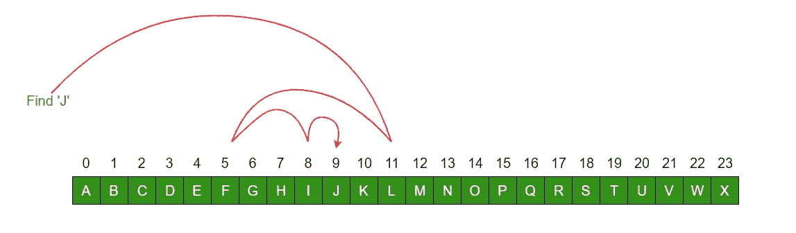
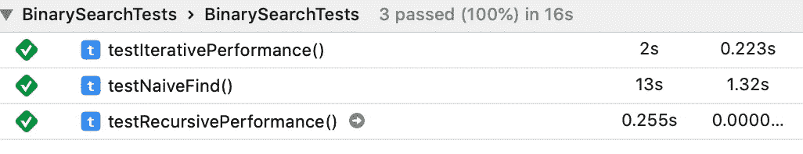

# 二分搜索法的强大力量

> 原文：<https://betterprogramming.pub/the-profound-power-of-binary-search-d4674c2f8b4b>

## 加快海量数据集的搜索速度

通过维基媒体[由 3.0](https://creativecommons.org/licenses/by/3.0)CC 拍摄

> "二分搜索法是算法设计中最强有力的思想之一."— Steven S. Skiena，《算法设计手册》

这篇文章是关于一个相对简单的算法的深刻重要性，二分搜索法。这是一个关于二分搜索法(更一般地说，具有对数时间复杂度的函数)如何高效搜索超大数据集的故事。实施代码在 Swift 中，尽管原则可以跨语言通用。

假设你拿到一本哥谭市(假设人口为一百万)的电话簿，并被要求查找名字*罗恩·斯旺森*。你会怎么做？

# 战略

这种极其幼稚的方法从第一页开始，扫描页面上的每一个名字寻找罗恩·斯旺森，然后继续到第二页，直到找到为止。当然，这是非常非常慢的，在找到一个随机目标之前，需要阅读平均 50 万个名字。

这是非常愚蠢的，而且(希望)完全不像一个理性的人会如何处理这个问题。这是因为一个理性的人直觉上知道一些关于电话簿数据集的事情:它是预先分类的。这一特性可以用来大大加快搜索速度。

首先，他们可以使用电话簿开头的已发布索引，从以 *S* 开头的姓氏的第一页开始搜索。事实上，这可能是这个特殊问题的理想解决方案的一个组成部分。然而，仍然需要比从顶部线性读取名称更好的页面内策略。幸运的是，我们超理性的人类知道二分搜索法及其对这个问题的适用性。

因此，我们超理性的人类打开电话簿，正好读到名字*约翰·迈克尔斯*。由于*罗恩·斯旺森*在*约翰·迈克尔斯*之后，她知道目标一定存在于电话簿的后半部分(一次读取消除了 50%的搜索区域！).然后，她重复这个过程，选择现在较小的搜索区域的中间，并根据目标对其进行评估。每一步都将整个搜索区域缩小 50%。

这是如此的高效，百万人电话簿中的任何一个名字只需要 20 次阅读就能找到。这不是一个神奇的数字。事实上，你们中的一些人可能会立即意识到它和我们假设的数据集大小(一百万)之间关系的本质。

log2(1，000，000)～= 20

我们发现了一个二元对数函数。它的主要名片是:每一步都会减半的问题空间。此外，我们已经看到这可以在大型数据集上提供多么令人难以置信的加速。假设一个人读一个名字需要 100 毫秒，那么我们这个超级天真的人光读名字就要花 14 个小时。我们开明搜索的冠军只需要花两秒钟读名字。

数据集越大，节省的时间越多。来源:[https://www . quora . com/二进制搜索或线性搜索哪个更好](https://www.quora.com/Which-one-is-better-binary-search-or-linear-search)

事实证明，这种搜索策略可以用来搜索任何类型的允许随机访问的有序有界数据。我们虚构的例子的 25，000 倍加速可能看起来不现实。毕竟，这种天真的情况看起来天真得无可救药(谁会真的从一开始就通过一次一个名字来搜索电话簿呢？).但这实际上很常见(数据库中的全表扫描就是一个例子)。此外，这种级别的速度提高是从线性时间复杂度算法(例如，全表扫描)切换到对数时间复杂度算法(例如，针对索引列的数据库查询)的特征。

敏锐的读者可能会注意到，我们还没有完全优化我们的名字查找算法的速度。通过利用电话簿的索引(并假设姓氏的正态字符分布)来定义我们的初始搜索空间，我们可以改进我们的算法，在这个特定的问题中，最多需要 log2(1，000，000/26)～= 16 次读取来查找任何给定的姓名。

# 是如何实现的？

泛型二分搜索法可以在任何允许随机访问的静态排序集合上迭代或递归实现。实现通常简单明了。有趣的是，递归实现的基准测试比 Swift 中的迭代实现快得多。(这些基准可在文章末尾找到。)

重复的

递归的

# 速度

试验码

我本可以猜到`firstIndex`**`testNaiveFind’s`的使用(以及对所提供的数组是否排序的无知)注定了它的线性性能，但是我对迭代和递归二分搜索法函数之间的数量级差异感到困惑。**

**有读者有解释吗？**