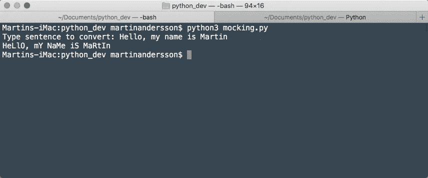

# 编程版—2022 年 6 月

> 原文：<https://betterprogramming.pub/the-programming-edition-june-2022-7c02894a4e3a>

嘿大家好，

上个月，编程领域发生了很多事情。

让我们从一个引起很多争议的词开始吧，这个词是讨论的焦点:“感知”。谷歌工程师布莱克·莱莫因声称谷歌的人工智能应用能像人类一样思考。他与人工智能的对话——[LaMDA 有知觉吗？——一次采访](https://cajundiscordian.medium.com/)让我们有更多的理由相信 LaMDA 不仅仅是一个普通的 AI。诚然，聊天机器人变得有自我意识的可能性可能会吓到我们，但[达米安·埃利](https://medium.com/u/eeba8cca9417?source=post_page-----7c02894a4e3a--------------------------------)一点也不惊讶。在他的[走向数据科学专题中，他认为:“我们不明白意识是如何出现的”](https://towardsdatascience.com/is-ai-becoming-a-conscious-being-f135ed1a42bd)。

好了，接下来是本月的下一个流行词:DALL-E 2。当[阿尔贝托·罗梅罗](https://medium.com/u/7ba6be8a3022?source=post_page-----7c02894a4e3a--------------------------------)解释 [OpenAI 的新人工智能系统](https://medium.com/towards-data-science/dall-e-2-explained-the-promise-and-limitations-of-a-revolutionary-ai-3faf691be220)时，[拉姆斯里·古瑟姆](https://medium.com/u/e6123d005247?source=post_page-----7c02894a4e3a--------------------------------)利用该模型[产生迷因变异](https://pub.towardsai.net/generate-meme-variations-using-openais-dall-e-2-3f555971806)。对于创作者来说，文本到艺术的生成器工具看起来很有前途……对于摄影师来说可能就没那么好了。

谈到图像，在她的第一个计算机视觉故事中， [Karina Kvanchiani](https://medium.com/u/c57094b49167?source=post_page-----7c02894a4e3a--------------------------------) 展示了[如何使用“海格”来构建一个 HGR 系统](https://medium.com/@karinakvanciani/hagrid-hand-gesture-recognition-image-dataset-a70cc291e539)。不，不是我们都知道的海格！

朝着下一个流行词前进——WWDC。

宣布了许多 iOS 产品。 [SwiftUI 有了一些重大升级](/swiftui-ios16-d7685c08f8d5)，UIKit 还没有任何进展，Xcode 也越来越好。这里有一份[可能会让你感兴趣的 WWDC 2022 指南综述](/the-wwdc-2022-edition-6496fafe17e6)。

我喜欢这个`Charts`框架，并且无法停止对 [Mark Lucking](https://medium.com/u/cad7f7bef2a?source=post_page-----7c02894a4e3a--------------------------------) 尝试[使用 SceneKit 和 SwiftUI](/build-a-3d-bar-chart-in-scenekit-with-swiftui-789a2631ef6f) 构建 3D 图表的赞赏——我打赌这是一个定制组件，我们将在明年成为 SDK 的一部分。

图片作者:马克·卢金

对于打算这样写的 Python 爱好者，Aaberge 为你提供了一个全面的教程，为了保护你的 API，高的最新指南提供了优秀的策略和 Python 实践。

有很多“JavaScript 的新特性”，尤其是在 ES2022 发布之后。 [Jose Granja](https://medium.com/u/8ae6a5b70ece?source=post_page-----7c02894a4e3a--------------------------------) 概述了新的 [JavaScript 特性](/es2022-features-javascript-a9f8f5dcba5a)，而 [Shoury Sharma](https://medium.com/u/bb3ac6d4dcd5?source=post_page-----7c02894a4e3a--------------------------------) 则让我们初步一瞥由 Deno 推出的 `[fresh](/introduction-to-a-fresh-framework-be4ef6f72a87)` [框架。](/introduction-to-a-fresh-framework-be4ef6f72a87)

希望提升应用性能的 JavaScript 开发者会喜欢这个故事——[一个穷人的网络工作者](/2022-052-a-poor-mans-web-worker-279d17a13018)作者[乔·洪顿](https://medium.com/u/fa3a0ef9a6ff?source=post_page-----7c02894a4e3a--------------------------------)而 [Three.js 爱好者可以通过遵循](/working-with-texture-in-three-js-40ce5e8b96c4)[詹妮弗·傅](https://medium.com/u/faf2e58f3d28?source=post_page-----7c02894a4e3a--------------------------------)的教程来研究纹理。

为了消化更多的 Python 和 JavaScript 代码，这里是我们精心挑选的集合:

*   [JavaScript 版本—2022 年 6 月](/the-javascript-edition-june-2022-99af902c451e)
*   [Python 版—2022 年 6 月](/the-python-edition-june-2022-532f5d4493af)

马丁截图

Go 开发者应该看看[黎明诗](https://medium.com/u/f42350a18ab7?source=post_page-----7c02894a4e3a--------------------------------)的帖子，为在集群中搜索 Kubernetes 资源构建一个 GraphQL 服务器。为了发现更多与围棋相关的指南，我们已经为您准备了一份[精选列表](/the-go-edition-june-2022-917cad0c1f58)。

接下来，Spring Boot 的开发者会喜欢文琪·格兰兹的微服务分布式追踪实现的分步指南。

与此同时，AWS 的工程师和 Rusteceans 将会很高兴。Julien de Charentenay 的帖子关注于一个 T2 的概念验证，即在订阅邮件列表时屏蔽电子邮件。对于 GCP 开发者，[米海金波](https://medium.com/u/63c655ab9359?source=post_page-----7c02894a4e3a--------------------------------)有[完整的设置指南，可以定期处理文档](/simple-scheduled-workloads-using-google-cloud-b23448a027ff)。

还有很多 DevOps 指南需要消化。一些突出的例子是:

*   [Spring Boot —由](/spring-boot-continuous-deployment-on-kubernetes-with-argocd-and-github-actions-made-easy-cb228bb5f808) [Zalán Tóth](https://medium.com/u/8af538bf2181?source=post_page-----7c02894a4e3a--------------------------------) 在 Kubernetes 上持续部署 ArgoCD 和 GitHub 操作
*   [所有人都欢呼这一巨型建筑——庆祝由](/all-hail-the-monolith-celebrating-the-verbosity-of-the-unified-architecture-in-terraform-81b53e3a03ae)[詹妮尔·科斯比](https://medium.com/u/aa7795a9e590?source=post_page-----7c02894a4e3a--------------------------------)创作的地形统一建筑的冗长
*   [devo PS 领域之旅:从早期采用到复杂架构](/journey-into-the-realm-of-devops-from-early-stage-adoption-to-complex-architecture-d18ba4c4c4f0)作者 [Christina DeStefano](https://medium.com/u/27885ea47ea?source=post_page-----7c02894a4e3a--------------------------------)
*   [从勇士到奇才:DevOps 团队组成](https://medium.com/better-programming/from-warriors-to-wizards-devops-team-composition-254351b13a0b)由[埃利奥特·格雷伯特](https://medium.com/u/fd20f381e372?source=post_page-----7c02894a4e3a--------------------------------)

这是 6 月份针对 Web3 开发者的综述。

迈克尔·博根的《T2》是一个全面的教程，我已经收藏了。

好吧，回到移动工程。

导航合成在 Android 中有自己的一套缺陷。因此，[Kaustubh Patange](https://proandroiddev.com/the-state-of-navigation-in-jetpack-compose-cc13eb6ac3d9)撰写的 Jetpack Compose 中的导航状态是理解当今可用的各种导航框架所急需的指南。同时， [Rebecca Franks](https://medium.com/u/3f9b9c30bec7?source=post_page-----7c02894a4e3a--------------------------------) 的教程帮助我们学习如何在 Compose 中实现[自定义缓动函数。如果你正在寻找优化和调试你的撰写应用程序的稳定性，Android 开发者出版物已经为你提供了全面的指导。](https://medium.com/androiddevelopers/easing-in-to-easing-curves-in-jetpack-compose-d72893eeeb4d)

Kotlin Multiplatform Mobile 作为跨平台应用程序开发的主导者正在稳步增长。所以，让 [Gorm Sorensen](https://medium.com/u/fb752ab6a599?source=post_page-----7c02894a4e3a--------------------------------) 的关于 Kotlin 多平台中格式化日期的[初级读本帮助你做一个开端。](/date-formatting-with-kotlin-multiplatform-1329a2b75bb)

对于 Flutter 开发者来说， [Mahdi Shahbazi](https://medium.com/u/dcda3a2bcc56?source=post_page-----7c02894a4e3a--------------------------------) 探索了[一些小部件组合的良好实践](/think-in-flutter-way-widget-composition-f8c4065de94b)来构建可重用的组件。同时， [Manato Kuroda](https://medium.com/u/f0d2b885ccf4?source=post_page-----7c02894a4e3a--------------------------------) 指导你[在 React Native](/how-to-implement-an-animated-tab-in-react-native-c1952ad7103e) 中实现动画标签。

以下是 Medium 软件工程出版物中的一些突出帖子:

*   [我最期待的 4 个即将到来的 CSS 特性](https://engineering.udacity.com/the-4-upcoming-css-features-im-most-excited-for-24b66293edfa)由 [Kolby Sisk](https://medium.com/u/50bf7ba9aae4?source=post_page-----7c02894a4e3a--------------------------------) 在 [Udacity Eng &数据](https://engineering.udacity.com/)中提供
*   [我们在一个 git 存储库中放了 50 万个文件，这是我们从](https://canvatechblog.com/we-put-half-a-million-files-in-one-git-repository-heres-what-we-learned-ec734a764181) [Canva 工程](https://medium.com/u/455dcbf38426?source=post_page-----7c02894a4e3a--------------------------------)那里了解到的
*   [由](https://medium.com/nordcloud-engineering/the-hitchhikers-guide-to-costs-and-usages-in-aws-d6a95de568d1)[阿里特拉·纳格](https://medium.com/u/4847ccd6f2a3?source=post_page-----7c02894a4e3a--------------------------------)在[诺德云工程](https://medium.com/nordcloud-engineering)中撰写的《AWS 成本和用途搭便车指南》
*   [Airbnb 的利纳里亚之旅](https://medium.com/airbnb-engineering/airbnbs-trip-to-linaria-dc169230bd12)作者[乔·伦乔尼](https://medium.com/u/e52389684329?source=post_page-----7c02894a4e3a--------------------------------)

最后，我们为程序员提供了各种工作经验和宝贵的建议。两名谷歌工程师在他们的第三个谷歌周年纪念日写下了他们的经历——一个令人高兴的巧合。 [Zachary Allegretti](https://medium.com/u/56611adad010?source=post_page-----7c02894a4e3a--------------------------------) 的故事是一堂[的自信课](/a-lesson-in-confidence-what-ive-learned-from-working-at-google-as-a-software-engineer-b19ecc091df7)，而 [Minhaz](https://medium.com/u/820b4ad3efe1?source=post_page-----7c02894a4e3a--------------------------------) 则让我们先睹为快[构建云和移动(edge)](/why-working-on-cloud-vs-mobile-edge-is-so-different-e32930f1c801) 所涉及的不同思维过程。

裁员对任何人来说都可能是一种情感体验。维尼塔的故事围绕着一些处理裁员和恢复工作的方法展开。

健身房策略能帮助我们成为更好的开发者吗？ [Felix Hoffmann](https://medium.com/u/7b216adfc0c?source=post_page-----7c02894a4e3a--------------------------------) 认为四个举重概念[有一些共性，并强调它们也可以转化为软件工程。](/use-gym-tactics-to-become-a-better-developer-7ce2a3f842cc)

这一期到此结束。直到你下次喝咖啡，

[Anupam](https://anupamchugh.medium.com/) 以及更好的编程团队。