# 您一直在寻找的渐进式网络应用指南

> 原文：<https://betterprogramming.pub/the-progressive-web-apps-guide-youve-been-looking-for-5ae3fa2cea83>

## 将你的旧无聊网站转换成 PWAs

在 [Unsplash](https://unsplash.com?utm_source=medium&utm_medium=referral) 上由 [Kévin et Laurianne Langlais](https://unsplash.com/@laukev?utm_source=medium&utm_medium=referral) 拍摄的照片

PWA，即渐进式 web 应用程序，是目前 Web 开发中最热门的话题之一。它向用户承诺了类似于原生应用的体验和功能，但仍然是用普通的 HTML、CSS 和 JavaScript 构建的(或者你可以使用任何 JavaScript 框架更进一步)，这多酷啊！

*本教程假设读者具备 HTML、CSS 和 JavaScript 的中级知识。如果你完全是前端开发的新手，第一步直接进入渐进式 web 应用程序可能不是最好的主意——掌握基础知识，然后再回来！*

# **简介**

在本教程中，你将学习如何将一个传统的网站转换成一个具有很多酷功能的渐进式网络应用程序。

但首先，让我们来看一些理论。根据[developer.mozilla.org](https://developer.mozilla.org/en-US/docs/Web/Progressive_web_apps)的说法，渐进式网络应用是使用新兴网络浏览器 API 和功能以及传统渐进式增强策略的网络应用，为跨平台网络应用带来类似本地应用的用户体验。

简而言之，渐进式网络应用是典型的网络应用，使用相同的旧 HTML、CSS 和 JavaScript 构建，但具有额外的功能，如离线模式、A2HC(添加到主屏幕)、后台同步、推送通知等。它们看起来和感觉上都像是本地应用，但它们不是！

*我想你可以说渐进式网络应用程序是类固醇上的网络应用程序。*

# 编码

现在我们已经知道 PWA 实际上是什么，我们可以马上开始创建一个渐进式 web 应用程序！

*为了简单起见，我将只介绍一些 PWA 功能，如离线模式和 A2HC。(记住除了上面提到的，还有很多 PWA 能力)。*

我已经为本教程准备了一个基础项目，但如果你有任何网站，你想转换成一个进步的网络应用程序，请随意这样做。

 [## aryasurya21/pwastarter

### 我关于媒体的 PWA 文章的开始项目。通过创建帐户，为 aryasurya21/pwastarter 的发展做出贡献…

github.com](https://github.com/aryasurya21/pwastarter/) 

*在克隆基础项目之后，不要忘记运行 npm install。*

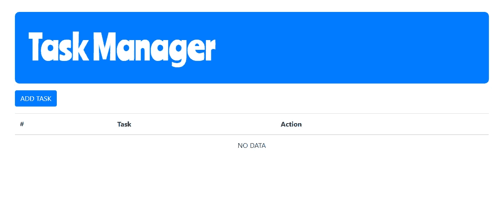

基地项目的主屏幕，原谅华丽的字体。

基础项目本身是一个简单的网站，用户可以在那里对任务执行 CRUD 操作，它是使用我们都非常喜欢的 HTML、CSS 和 Vanilla JS 构建的。

我强烈建议使用 Chrome 进行 PWA 开发，因为很多浏览器还不支持 PWA。

为了将任何 web 应用程序转换成渐进式应用程序，我们必须满足三个主要要求。

## 1.HTTPS

我们的 web 应该运行在 HTTPS 连接上，这意味着我们的浏览器从 web 服务器发送和接收的所有内容都经过了严格的加密，因此第三方无法轻易窃听我们和/或执行恶意活动。

> 你们中的一些人可能会问自己，“我们正在 localhost 上开发基于 HTTP 协议的应用程序，我们如何在本地将其转换为 PWA，因为它需要 HTTPS？”嗯，这是个好问题。答案很简单，即使 localhost 运行在 HTTP 上，它的行为实际上像 HTTPS——这就是为什么有些 API 不能在已部署的 HTTP 站点上工作，但可以在 http://localhost 上工作。

## 2.拥有应用清单

App Manifest 是一个 JSON 文件，它告诉浏览器我们的渐进式 web 应用程序，以及当它安装在移动或桌面上时应该如何表现。典型的应用程序清单包含我们的应用程序的信息，如名称、描述、图标和 baseURL。

## 3.有服务人员

服务人员是所有 PWA 功能的核心。它是一个 JavaScript 文件，我们的浏览器在后台运行，并保持运行，即使浏览器本身是关闭的。

关于服务人员，有几点需要注意:

*   它是一个 [JavaScript Worker](https://www.html5rocks.com/en/tutorials/workers/basics/) ，所以它不能直接访问 DOM。相反，服务工作者可以通过响应通过`[postMessage](https://html.spec.whatwg.org/multipage/workers.html#dom-worker-postmessage)`接口发送的消息来与它控制的页面进行通信，如果需要，这些页面可以操作 DOM。
*   Service worker 使用了很多承诺，因为它是一个在后台运行的脚本。它主要做的是监听浏览器上发生的事件，然后为我们感兴趣的每个事件提供一个回调。

# 应用清单

让我们通过在我们的应用程序上添加一个清单来开始我们的 PWA 之旅，在名为`manifest.json` **，**的公共目录上添加一个新文件，然后编写这些 JSON 并根据您自己的网站属性对它们进行调整(如果您没有使用基础项目)。

以下是关于这些属性的一些解释:

*   `start_url` 是网站启动时我们想要显示的第一页的 URL。在这个项目中，我使用了`“/”`，它可以自动找到一个`index.html`。
*   `scope` 是您要包含在 progressive web 应用程序中的项目文件。例如，如果你只想包含项目中一个`src`文件夹中的文件，你可以把它改成类似`“scope”: “/src”`的形式
*   `display` 是您希望应用程序使用的 UI 类型，您可以在其中自定义应用程序启动时显示的浏览器 UI。例如，您可以隐藏地址栏
*   我使用`standalone` 来使 web 应用程序看起来和感觉起来像一个独立的应用程序。如果你在桌面上安装应用程序，它会在自己的窗口中运行，独立于浏览器，并隐藏标准的浏览器 UI 元素，如地址栏。
*   `orientation` 定义了 web app 的方向。
*   `dir` 定义显示清单中支持方向的成员的基本方向。与`lang`一起，它有助于正确显示从右向左的语言。
*   `lang`成员是包含单个[语言标签](https://developer.mozilla.org/en-US/docs/Web/HTML/Global_attributes/lang)的字符串。它为清单的具有方向性的成员的值指定主要语言，并与`dir` 一起确定它们的方向性。

在我们添加了我们自己的应用程序清单之后，我们接下来要做的是在我们的 HTML 文件中注册它，因此在 index.html 的标签中添加这一行。

那么我们的 index.html 会是这样的:

在我们注册清单之后，通过在项目终端上运行 npm start 来启动项目。然后打开开发人员控制台，转到 application 选项卡，您将看到我们在清单中定义的属性现在也显示在浏览器上了！

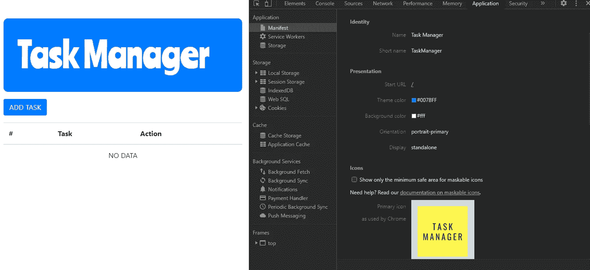

清单属性

恭喜您，您离将您的应用程序转换为渐进式 web 应用程序又近了一步！

# 服务行业人员

接下来是渐进式网络应用最重要的部分:服务工作者。

在 public 文件夹中，创建一个名为 serviceWorker.js 的新文件，然后导航到 index.js。要添加一个函数将 serviceWorker.js 注册为 web 的服务工作器，请添加以下代码:

不要忘记调用`init()`上的函数，那么我们的 index.js 将如下所示:

在我们开始为服务工作者本身编码之前，我们必须首先了解它的生命周期，具体如下

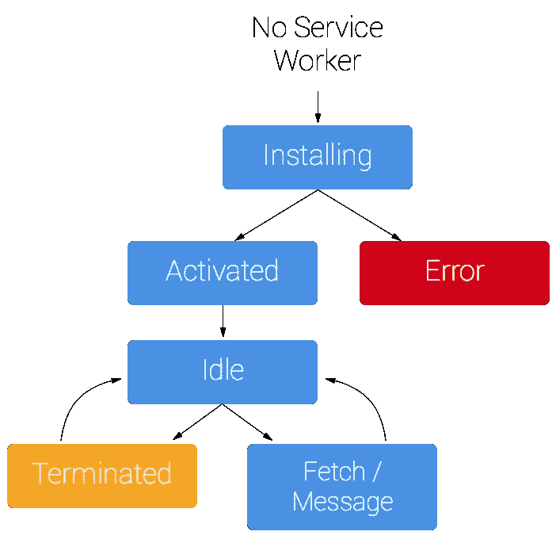

来源:[https://developers . Google . com/web/fundamentals/primers/service-workers](https://developers.google.com/web/fundamentals/primers/service-workers)

解释:

*   安装是服务人员注册后得到的第一个事件，并且只发生一次。这是缓存一切以准备脱机模式的最佳位置。
*   一旦我们的服务人员准备好控制客户端并处理 push 和 sync 等功能事件，我们将获得一个激活的事件。这是清理旧服务人员的缓存的最佳位置，以防止新服务人员准备好时发生奇怪的事情。
*   空闲意味着服务工作者现在准备好接收功能事件，例如推送、同步或获取。或者，如果我们不再需要服务人员，或者因为我们要安装一个新的服务人员，我们可以终止服务人员。

基于以上解释，可能会想到一个问题:

> 我如何知道何时给我的服务人员更新一个新的？

答案是，当您的服务工作者代码发生变化时，我们必须用反映新添加代码的新代码替换现有代码。

接下来，转到 serviceWorker.js。请记住，由于 serviceWorker 是一个在后台运行的脚本，不能访问 DOM，所以我们在那里所要做的就是“监听”上述事件。

在 serviceWorker.js 里面，我们来听听`install`和`activate`事件:

然后，导航到 Chrome，打开应用程序选项卡，选择“存储”，然后选择“清除站点数据”，按 CTRL + SHIFT + R 以硬重新加载，并强制浏览器安装我们服务人员的新版本。

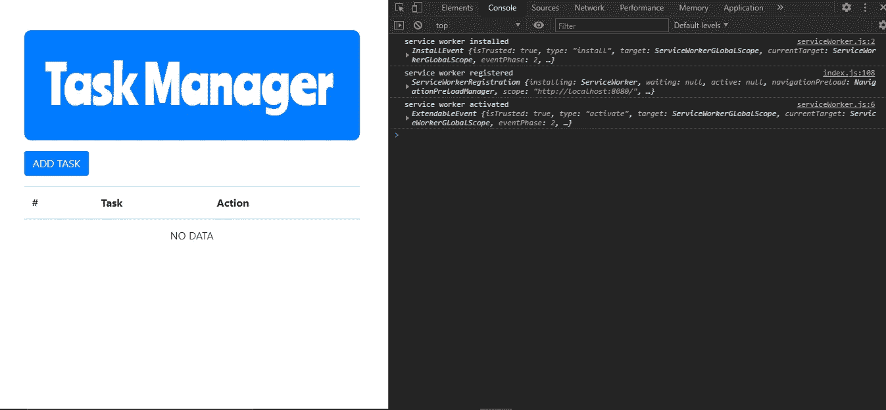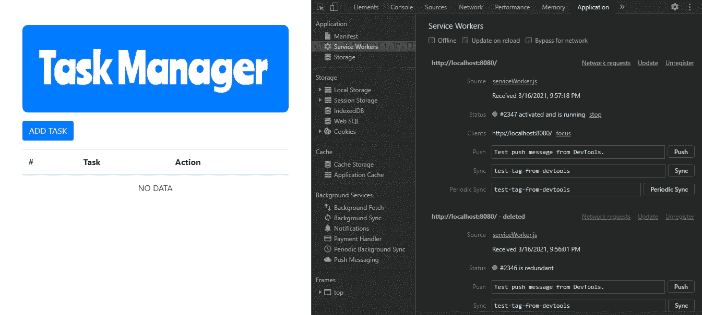

正如我们在“console”选项卡上看到的，我们的服务人员已经启动并运行浏览器。

我们还可以在应用程序选项卡上看到我们的服务人员。

恭喜你！我们已经实现了我们的服务人员和应用清单——我们的应用已经满足了渐进式 web 应用的要求！

现在，让我们让我们的应用程序在用户离线时可用。

# 离线模式

当用户离线时，传统的 web 应用程序无法访问，它们只会在我们试图这样做时显示这只恐龙。

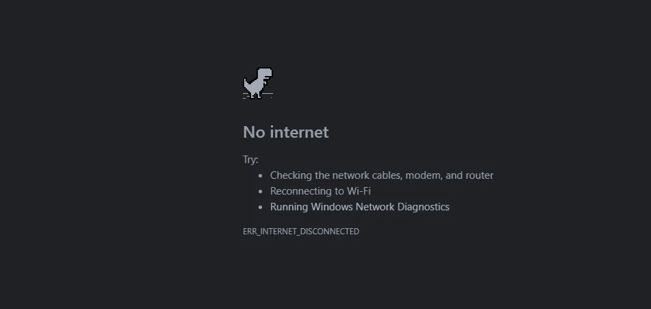

由于渐进式网络应用程序可以安装在桌面或移动设备上，每当用户离线时试图使用我们的应用程序，他们都不会获得良好的用户体验。这只恐龙出现了，因此我们必须借助我们每天都听说的 API:缓存，让我们的应用程序在离线模式下可用。

正如我们之前所了解的，在服务人员生命周期中，在网站上缓存我们需要的所有内容的最佳时间是在“安装”阶段。

因此，在 serviceWorker.js 文件中添加以下代码:

以下是解释:

*   我创建了一个`STATIC_CACHE_CONTAINER`变量，它将作为缓存的名称。
*   然后，我创建了一个`STATIC_FILES`数组，其中包含了我想要存储在缓存中的文件。
*   在安装回调时，我用 event.waitUntil 包装了缓存过程，告诉浏览器在传递给`waitUntil`的承诺被解决或拒绝之前不要终止服务工作器。
*   在`waitUntil`中，我打开了一个名为`STATIC_CACHE_CONTAINER`的缓存(如果它不存在，就创建它)。然后，我将所有想要缓存的文件路径添加到缓存存储中。

现在，回到 Chrome，导航到应用程序选项卡，选择“存储”和“清除站点数据”，然后按 CTRL + SHIFT + R 强制浏览器安装我们的新服务人员。然后，当我们转到缓存部分时，我们可以看到之前添加到缓存存储中的文件。

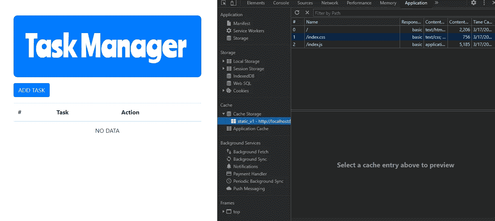

但这就够了吗？答案仍然是否定的。我们已经缓存了我们的文件，但我们在离线时没有使用缓存的版本。接下来我们将监听`fetch`事件来帮助我们处理请求。

将以下代码添加到 serviceWorker.js 中:

解释:

*   我在服务工作者内部添加了一个获取事件监听器。
*   在事件处理中，我用`respondWith()`包装了我们的承诺，这防止了浏览器的默认获取处理，并允许我们为响应提供承诺。
*   对于承诺本身，我们试图找到`event.request`是否存在于我们的缓存中。如果它存在，我们只返回存储中缓存的那个。

在浏览器中重新安装服务人员，瞧，我们的页面可以脱机使用了！

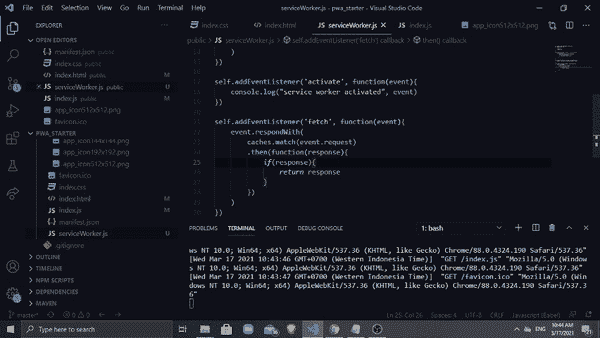

但是你注意到什么了吗？我们华丽的字体和所有的造型都不见了！这怎么可能呢？

这是因为我们没有缓存——记住在 serviceWorker.js 上，我们只缓存了三个文件，index.html、index.css 和 index.js。但是字体来自 Google Font CDN，按钮和表格样式来自 Bootstrap CDN。解决这个问题的方法很简单:当服务人员处于“安装”阶段时缓存它们。

> 我见过一些做法，人们把缓存容器分成两个键，一个用于静态文件，一个用于动态文件。由于在本教程中，网站充满了静态页面，我不会去动态缓存，但我会在本教程的结尾添加关于它们的进一步参考。
> 
> 动态缓存的思想是缓存用户已经访问过的每一个页面，而不是像`STATIC_FILES`那样一个个硬编码。
> 
> 但是，最佳实践是缓存项目的核心资产，如字体、样式、助手库、静态页面和网站上不会改变的任何内容，并将剩余的页面存储在动态缓存中。

将这些样式和字体 CDN 添加到我们的 STATIC_FILES 中，因此我们的 serviceWorker.js 将是:

如果我们尝试重新安装新的服务人员并离线，我们的应用程序看起来就像它在线时一样！

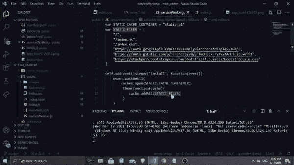

恭喜你！您已使您的 web 应用程序脱机可用！

现在，我们唯一要做的就是让它可以安装，我们的应用程序最终会感觉像一个原生应用程序。

# A2HC(添加到主屏幕)

要让我们的应用程序既可以安装在桌面上，也可以安装在移动设备上，有一些要求:

*   在中填写了[正确字段的 web 清单。](https://developer.mozilla.org/en-US/docs/Web/Progressive_web_apps/Add_to_home_screen#manifest)
*   从安全(HTTPS)域提供服务的网站。
*   表示设备上应用程序的图标。
*   一名[服务人员](https://developer.mozilla.org/en-US/docs/Web/API/Service_Worker_API)注册，允许应用程序离线工作(目前只有 Android 版 Chrome 需要这一功能)。

惊喜，惊喜，我们已经全部实现了！这意味着我们的应用程序是可安装的！

导航到 Chrome，在搜索栏的末尾找到这个图标:

下载图标

单击图标，它会提示我们安装 web 应用程序:

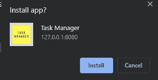

安装提示

点击安装，瞧！我们的应用有自己的窗口，与浏览器分离:

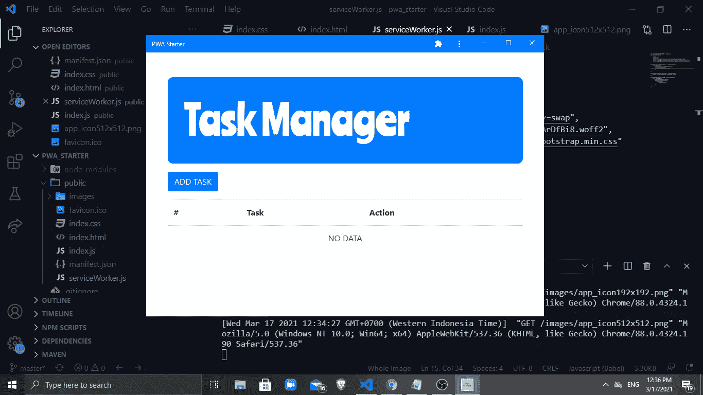

我们还在桌面主屏幕上找到了应用程序的快捷方式:

最后，我们在我们的 web 应用程序上实现了 A2HC 特性，使它看起来更像一个本地应用程序。您也可以通过首先将网站部署到托管服务(如 Netlify、Heroku 或 Github pages)来将网站安装到您的移动设备上——这是您的选择！

# 结论

我们已经了解了什么是渐进式 web 应用程序，以及如何将传统的 web 应用程序转换为具有一些很酷的功能的渐进式应用程序，如离线模式和 A2HC。

点击此处了解有关 PWA 功能的更多信息:

*   [https://developer . Mozilla . org/en-US/docs/Web/Progressive _ Web _ apps](https://developer.mozilla.org/en-US/docs/Web/Progressive_web_apps)
*   [https://developers . Google . com/web/updates/2015/12/getting-started-pwa](https://developers.google.com/web/updates/2015/12/getting-started-pwa)
*   [https://developers . Google . com/web/fundamentals/primers/service-workers](https://developers.google.com/web/fundamentals/primers/service-workers)
*   [https://blog . galaxy web links . com/how-do-big-companies-build-their-pwas](https://blog.galaxyweblinks.com/how-do-big-companies-build-their-pwas)//

如果你对这个教程有任何想法，请在下面留下你的回复。如果你想让我写其他话题，也请留言。

## 编码快乐！