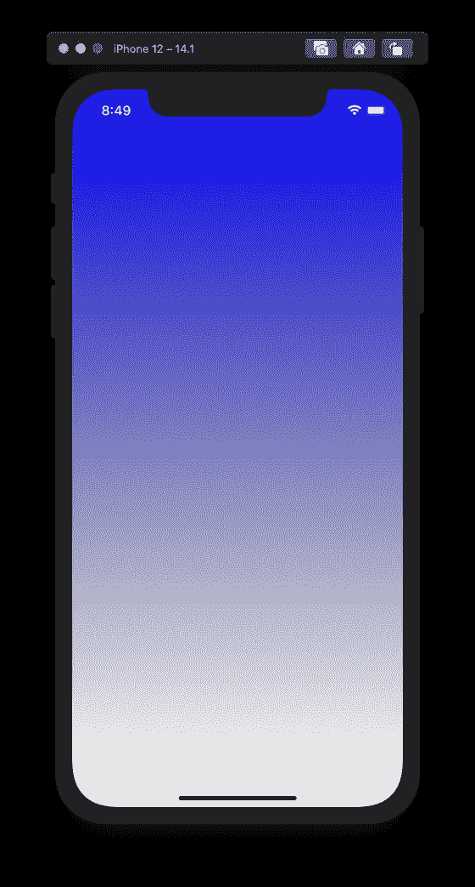
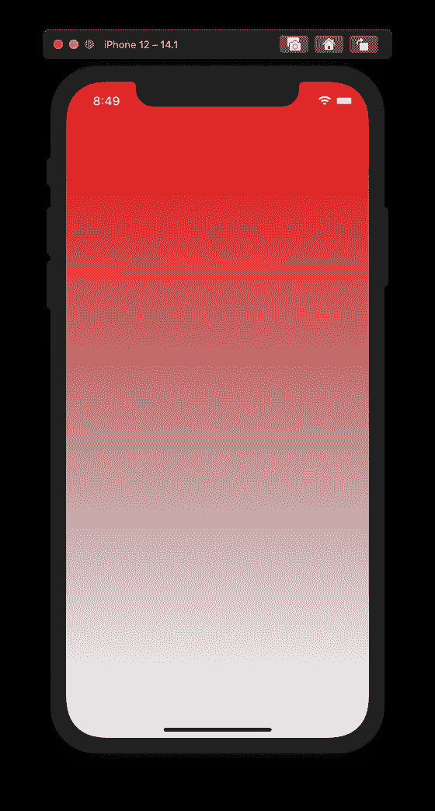
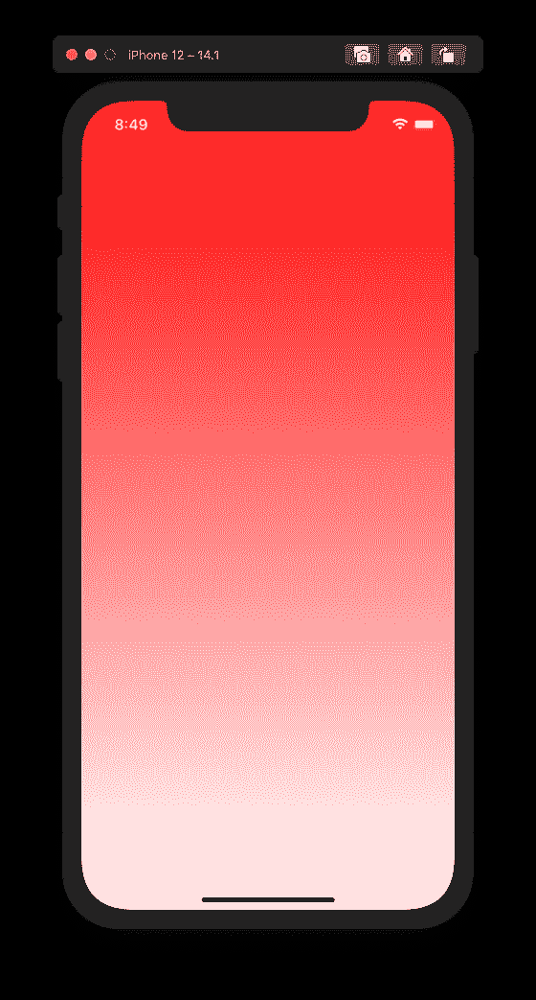

# 在 iOS 中创建透明渐变图层的正确方法

> 原文：<https://betterprogramming.pub/the-proper-way-of-creating-a-transparent-gradient-layer-in-ios-b082daa866b1>

## 如何避免我们一直在犯的一个非常常见的错误

图片来源:[维克多·哈纳切克](https://picjumbo.com/author/viktorhanacek/)在 [picjumbo](https://picjumbo.com/cruise-ship-in-the-middle-of-the-sea/)

我们都喜欢应用程序中的一些渐变，不是吗？尤其是透明渐变，从特定颜色到透明。它给了我们元素下的阴影的美好感觉，或者它提高了我们放在图像和照片上的文本的可读性。或者有时候，当我们有一长串的文本和内容流到屏幕的末端时，我们用它以一种简单和非侵入性的方式给我们的用户一种连续性的感觉，我们希望他们知道如果他们继续滚动，还有更多东西可以看。哦，是的，透明渐变是一个很好的方式去实现所有这些甚至更多。

但是有一个条件！我会告诉你那是什么。

为了更好地解释事情，而不仅仅是文字，我喜欢用一些例子。所以我写了一个非常简单的程序，在屏幕上创建一个小的颜色渐变，从任何给定的颜色(这里是蓝色)到一个基本的透明颜色。代码就像这样简单:

这是视觉效果:

从蓝色变得清晰…但有些东西感觉有点模糊...

看起来还行吧？它确实从蓝色变得透明了，但是感觉不太对劲。如果我把这种深蓝色换成一种更亮的颜色，事情看起来就有点不对劲了。看一下相同代码示例，但是使用了红色:

这是一个相当奇怪的渐变过渡

是啊，那绝对感觉不太对！看起来它几乎变成了某种暗红色，然后变得透明。原因是我们的渐变不是从红色到透明。一点也不！事实上，它是从完全阿尔法的红色到零阿尔法的黑色！这有什么关系呢？让我展示同一个屏幕，颜色渐变从白色到透明:

对于在白色背景上从白色变得透明，然后变成灰色来说就这么多了

看到上面的灰色污迹了吗？这是因为当我们的 alpha 通道从 1.0 到 0.0 来实现透明效果时，我们的 R、G 和 B 值也从 1.0 到 0.0，因为`UIColor.clear`的主色是黑色，正如你在`UIKit.UIColor`类中的透明色定义中看到的:

要解决这个问题并使事情看起来更好，总是使用您自己的自定义颜色的透明度效果，而不是使用默认的透明色。在下面的代码中，我用 alpha 为 0.0 的`initialColor`版本替换了`finalColor`上的透明颜色:

这是最后的结果，和原来的并排:

左边是从红色到透明的原始过渡，右边是从红色到透明红色的过渡。你能看出区别吗？

看它多暖和多光滑！它让颜色更鲜艳，让它在屏幕上更醒目。这是一个很小的差别，但是如果我们想要实现一个更好的 UI 呈现，我认为我们可以做得更多。这并不难。

好了，今天就到这里。只是一个快速提示，帮助你使你漂亮的用户界面更加漂亮(也许还可以修复一些渐变从白色消失的错误)。你可以抓取要点代码，在你的 Mac 上亲自查看。如果你有任何问题或意见，请不要犹豫，写在下面。

干杯，祝大家这周愉快！